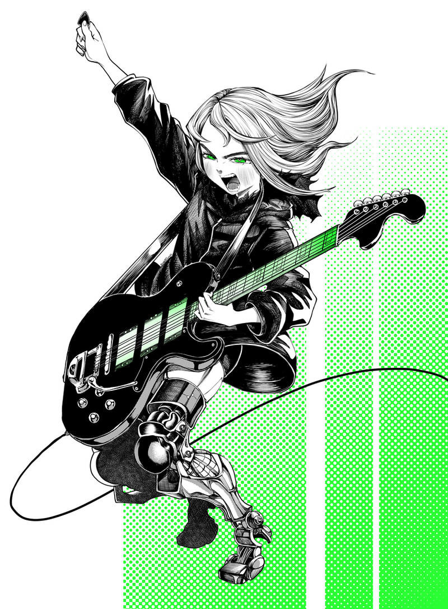
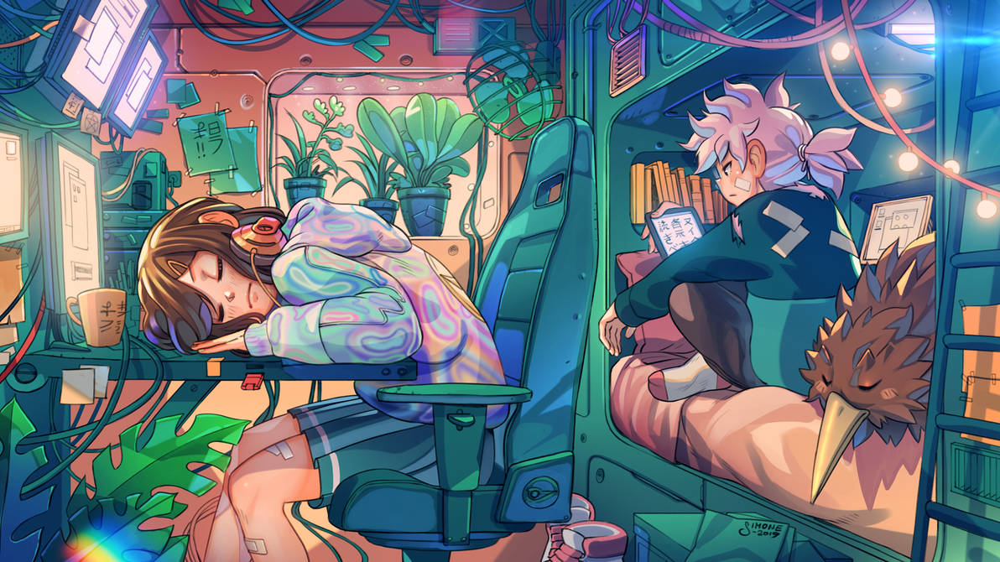
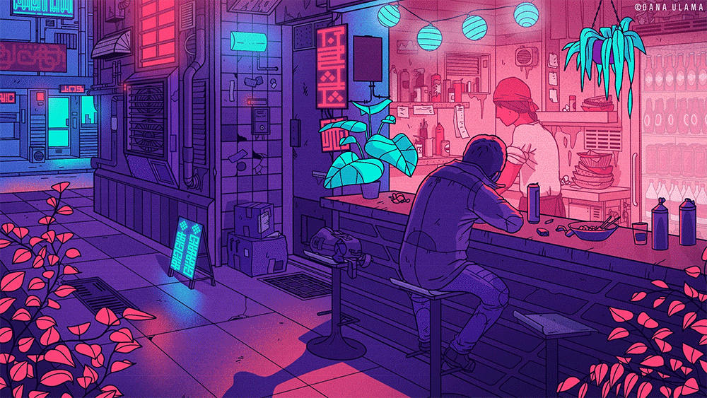
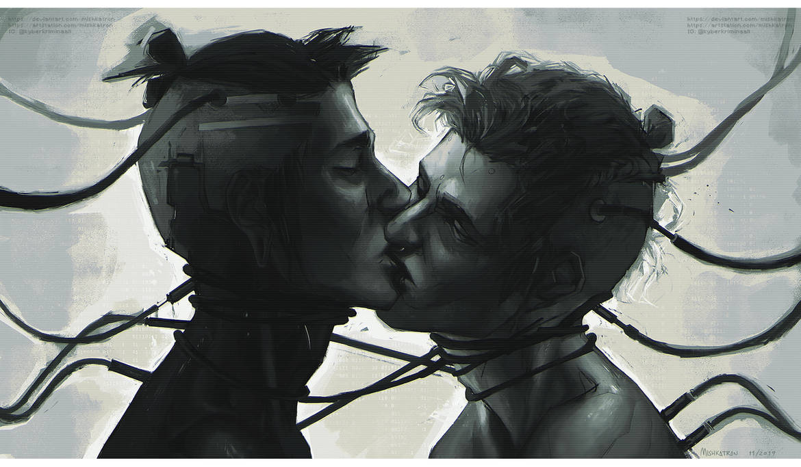
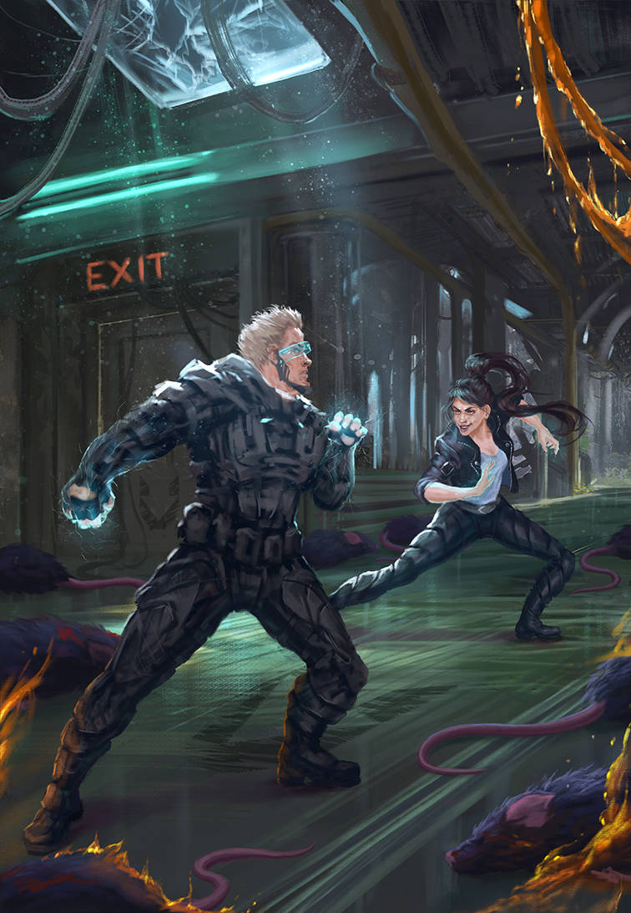
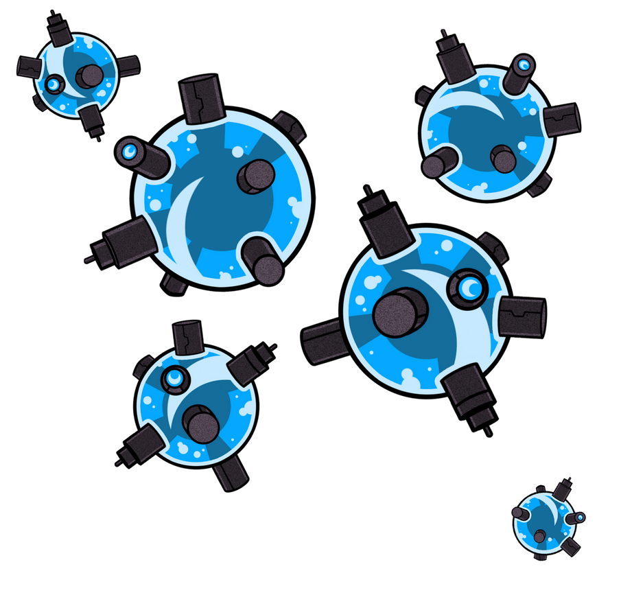
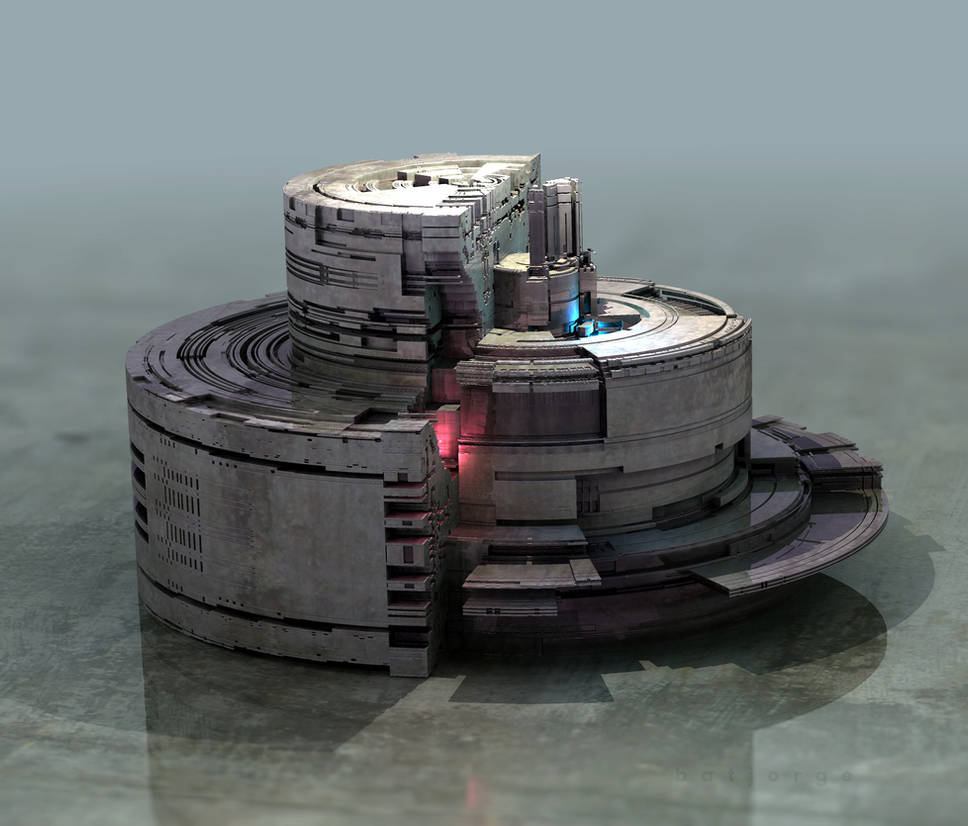

# 4rc0l061a de Nottingham **La arcología de Nottingham**

\sinc

Bosque Sh3rW00d es una ambientación Ciberpunk para Savage Worlds en un mundo extrañamente parecido a las historias de Robin Hood.

Formarás parte de un grupo de descastades que sobreviven ocultos en el megacomplejo Nottingham. Lucharás por tu supervivencia y tu libertad contra la directora J0hn, una malvada IA que está a cargo del complejo.

J0hn rige Nottingham siguiendo unos protocolos que buscan maximizar los beneficios para la compañía sin importar lo que les pase a los habitantes del complejo. Todos recuerdan a la antigua, legítima y benevolente directora R1c4rd y esperan su regreso del proyecto del departamento de armamentística a la que fue asignada por la compañía. 

Arrambla con equipo y materiales, libera a cautives, haz pintadas contra la directora J0hn, haz duelos sobre el Trent, escapa de los sheriffs de Nottingham, bátete en duelo contra pintoresques personajes, … 

Pero recuerda, lo más importante es **robar a les riques para repartirlo entre les más pobres**.

## El mundo actual

\conc

```
Bosque Sh3rW00d te ofrece una ambientación ciberpunk, ultima tecnología en un mundo roto donde unes poques explotan a muches, mezclada con muchos elementos genéricos de la Edad Media.
```

En estas aventuras **tu mesa tomará el papel de proscrites y bandides de buen corazón** y que creen más en la justicia que la ley. Y es por eso roban a les riques para dárselos a les pobres.

### Nottingham

Nottingham es una gigantesca arcología donde viven cientos de miles de personas, creada hace más de 2 siglos por la compañía para sus empleades. Aunque, a priori pueda parecer un lugar donde vivir y trabajar, es más bien una inmensa máquina donde la compañía exprime todo lo que puede a sus habitantes.

Nottingham está en decadencia, tanto estructural, como económica y social. Estructuralmente, porque lleva siglos sin un mantenimiento adecuado, además de no haber sido rematado adecuadamente. Económicamente, porque ha perdido capacidad de producción, principalmente de comida en las piscifactorías del Trent. Por último, socialmente, ya que está al borde de la rebelión.

### El bosque de Sh3rW00d

El bosque, cuyo primer sector tiene el código Sh3rW00d, es la parte de la arcología que no se llegó a terminar. Se le llama el bosque porque la zona está compuesta con salas y salas llenas de miles y miles de columnas sin nada más. También dejaron vigas, las tuberías de agua, luz y datos, pero sin estar rematados.

\sp

[](https://www.freepik.com/free-photo/pulsating-neon-lines-darkness-abstract-purple-light_423230986.htm "Pulsating neon lines in darkness abstract purple light by pvproductions")


Las columnas de color marrón parecen los troncos de árboles y nanitos de construcción han ido creando sobre ellos y resto de elementos extrañas estructuras de material orgánico que le dan aún más aspecto vegetal. 

XXX

### Las directoras

Las directoras son potentes IA que controlan Nottingham y tratan de que todo sea lo más beneficioso económicamente hablando para la compañía. Las diferencias claras entre ellas es como consideran cuál es la forma más óptima de maximizar los beneficio para la empresa.

Nottingham ha tenido dos IA directoras desde su creación, R1c4rd y J0hn, y sus «reinados» han sido totalmente diferentes.

XXX

Hay una tercera IA que no es directora, pero casi, que es Al1enOR. Al1enOR fue la IA más potente en los primeros días de Nottingham cuando todavía no había habitantes en Nottingham. Durante unos años mientras les instaladores montaban todas las estructuras básicas, era la IA que controlaba uno de los pocos sistemas que funciona y el más importante de la arcología, el sistema de transporte (escaleras, puertas, ascensores, montacargas, etc.). 

#### Directora J0hn y sus sheriffs

XXX

#### Directora R1c4rd

La directora R1c4rd es la anterior IA de Nottingham que fue trasladada al departamento de armamentística de la compañía. Se dice que era, a diferencia de la directora J0hn, justa y magnánima con les _notis_. Se recuerda con cariño los años de dirección de R1c4rd y se sueña con su regreso cuando ya no sea necesaria en el departamento bélico de la compañía.

XXX

\sp

\sinc

## Orden social

\conc

```
Las gentes que viven en Nottingham son conocidas como _notis_ (un gentilicio abreviado usado por las clases bajas). El complejo de Nottingham se rige por un sistema neofeudal, una versión ciberpunk del sistema feudal del siglo XII.
```

La sociedad de la arcología de Nottingham **está dividida en 3 clases sociales estancas**; Blus, que vendrían a ser la Nobleza del viejo sistema, Influencers, como Iglesia, y Curris, como el campesinado. Por encima de todos elles, está la compañía que rige los destino de todes, el presunto de Dios, y la IA directora que rige el complejo por designio de la compañía como si de una reina se tratara.  

[](https://www.deviantart.com/monkeymu/art/Wesker-300376367 "Wesker By MonkeyMu")

### Blus (Nobleza)

El término _blus_ viene de «blue», azul. Los _blus_ eran trabajadores de alto nivel de la compañía que solían llevar el azul corporativo de la compañía frente a los marrones de los trabajadores de bajo nivel. Hoy en día se distinguen por sus trajes caros con tejidos ablativos que sobresalen sobre los viejos y remendados trapos que llevan muchos de les currelas.

Los blus son principalmente personal directivo de la compañía que se encarga de dar forma y ejecutar las órdenes de las directoras a través de sus puestos directivos en las diferentes industrias del complejo. Cobran mucho y viven en la zona alta en grandes espacios. No suelen mezclarse con el resto de _notis_, de hecho sus relaciones suelen ser muy endogámicas.

Desde pequeño se les educa para ser blus. De hecho, normalmente heredan el puesto de sus progenitores, ya que J0hn considera que en cierta medida algo genético y educativo en ello. Un blus debe salir de familias de blus y ser educado desde la cuna como blus por otros blus.

Su principal problema es que la mayoría nunca han pisado la zona de baja de la ciudad, solo conocen la vida en las zonas altas, viven en su torre de marfil. Solo algunos se atreven a pisar los sucios callejones de las zonas más pobres del complejo como Lady Marian.

Hay una especie de _blus_ menores, más cercanos a los _curris_, pero muchas veces igual de clasistas o más. 

\sp

Son personas que ocupan cargos intermedios en la compañía o tienen negocios florecientes que la compañía todavía no ha absorbido. Muchos de ellos son trepas esperando a su oportunidad para convertirse en grandes _blus_ y, por supuesto, harán lo que sea por ascender socialmente. Cuando decimos lo que sea, es lo que sea, engañar, intimidar, amenazar, falsificar pruebas, falso testimonio, etc.

[](https://www.deviantart.com/gigiedt/art/Guitable-856195073 "Guitable By gigiEDT")

### Influencers (Iglesia)

Dentro del sistema neofeudal que rige la arcología, hay un grupo de Influencers adictos a la directora J0hn que marcan la vida de los _notis_. 

Ellos establecen las modas, lo que es _cool_ y lo que no, lo que se debe hacer y lo que no y, al final, lo que está bien y lo que está mal.

Además, señalan a los disidentes y los excluyen socialmente, de manera que sus acciones y proclamas contra el sistema son muchas veces rechazadas, desacreditadas y olvidadas.

También son usados como una forma de ocultar los fallos y errores de la compañía, desviando la opinión pública hacia temas intrascendentes y vacuos.

Aunque muchos de les _influencers_ se nombran a sí mismos como creadores de muchas de las modas del complejo, lo normal es que en realidad copien esos movimientos estéticos y ridiculicen a aquellos que tratan de demostrar el origen real de esas modas.

### Curris (Campesinado)

Les _curris_, casi lo más bajo de la pirámide social de Nottingham, son explotades por la compañía, la directora J0hn y sus _blus_ y ridiculizades y manipulades por _influencers_ para que sigan con sus denigrantes y anodinas vidas día tras día. 

[](https://www.deviantart.com/igor-esaulov/art/Maintenance-EotV-Art-677171384 "Maintenance EotV Art By Igor-Esaulov")

Si solo se dedican a trabajar sin levantar la cabeza, solo les espera miseria y desesperación. 

\sp

Si intentan luchar por sus derechos y por mejoras sociales, son apaleados sin piedad por los sheriffs y encerrados. Al final mucho terminan cayendo al otro lado de la ley y buscando una nueva oportunidad en el bosque como proscrites.

### Boskis (Fuera de la ley)

Siempre que hay un sistema hay gente que se queda fuera o prefiere salirse. Estos son les _boskis_, les proscrites fuera de la ley que viven en el Bosque de Sh3rW00d.

Aunque la inmensa mayoría de los _boskis_ son de origen humilde y de bajos estratos sociales, principalmente _curris_, también puedes _blus_ e _influencers_ caídes en desgracia.

Podemos tener boskis de primera generación, es decir que nacieron en el complejo (y tienen un insertado en su cuerpo un HUB de conexión) o de segunda generación, conocidos como nacides libres, porque nacieron en el bosque no tienen el HUB de conexión.

Los _boskis_ tienen un dicho que explica su forma de pensar _En el bosque tienes tu propio nombre, pero no es solo tuyo._

### La compañía y la IA directora (Monarquía)

Como ya hemos dicho, por encima de todos los grupos anteriores, incluso los _boskis_, está la compañía que rige los destino de todes elles y la IA directora que rige el complejo por designio de la compañía como si de una reina se tratara. 

\sc

La compañía es un ente abstracto en esta ambientación que no tiene ni nombre, pero que puedes llamarla como quieras. Todo es de la compañía, todo lo decide la compañía y todo está pensado para conseguir beneficio para la compañía. 

La mano ejecutora de la compañía es la IA directora. J0hn, la actual IA directora, toma todas sus decisiones teniendo en mente esta simple regla «No importa la gente, solo los beneficios de la compañía».

\sp

\sinc

## Comercio e industria

\conc

```
Aunque Nottingham se considera una arcología donde viven cientos de miles de personas, en realidad es una megafactoria en la que trabajan cientos de miles de personas.
```

Todo en el complejo está pensado para producir beneficios para la compañía y mientras que las decisiones de la directora R1c4rd tenían una visión social, J0hn ha abandonado esa línea de acción y solo piensa en la producción y los beneficios.

### Formas de pago

La moneda oficial es el crédito de la compañía, aunque no existe moneda física de ella. Todo son transacciones electrónicas a través del sistema monetario de la empresa. Así que se ha impuesto el trueque tanto de productos como de servicios cuando se quieren hacer actividades por debajo del radar de la Directora J0hn.

#### Trueque

El hecho de que la directora R1c4rd controle toda la economía de Nottingham ha hecho que florezca una economía sumergida y circular basada en el trueque de productos y el intercambio de trabajo.

Los truques van desde cosas muy simples y del día a día como «tú arreglas el grifo de mi cubículo, yo te doy dos botes de mi salsa barbacoa casera» a trueques más complejos que incluso incluyen pagarés en papel (para no quedar registrados electrónicamente). Es curioso porque esos pagarés se han convertido en una especie de papel moneda que no se cobran, sino que se intercambian una y otra vez y varían de valor según las circunstancias y lo que ofrezca el pagaré.

### Minifábricas y algafactorías

La industria se basa en dos elementos claves, minifábricas y algafactorías. Existen en el complejo miles de minifábricas donde se transforma materia prima en piezas o piezas en piezas más complejas o finalmente productos completos. Estas minifábricas son talleres de 5/6 trabajadores propiedad de algune _curri_ con más dinero o de _blus_ que tienen negocios paralelos a su trabajo para la compañía.

La compañía trae materia prima que va vendiendo a las minifábricas que a su vez venden a otras minifábricas y estas otras a otras más hasta tener todo tipo de productos. En ese momento, la compañía vuelve a comprar los productos finales para exportarlos fuera de la arcología, menos la parte que se consigue vender a los propios _notis_. 

> La compañía controla el mercado controlando el precio de venta de las materias primas y el precio de compra del producto final. La directora J0hn, siguiendo las órdenes de la compañía, puede manejar el mercado a su gusto y repartir riqueza entre los _notis_ o hacer que caigan en la miseria. 

\sp

La otra base de la industria es la megafactoría del Trent (propiedad de la compañía), que convierte las algas en todo tipo de alimentos procesados para consumo de los _notis_ y para exportar. La factoría del Trent con toda su industria asociada genera la mitad de la riqueza del complejo.

Dos tercios de la población de _curris_ trabaja en las algafactorías o en los talleres de las minifábricas. El resto trabajan en hostelería y servicios, casi siempre al servicio de otros. Hay casos de _curris_ con su propio negocio, pero son les minimes y normalmente en graves problemas económicos. Eso supone que acaban currando para la compañía, en la cárcel o huyendo al bosque.

\sinc

[](https://www.deviantart.com/simoneferriero/art/Sleepy-Time-800832062 "Sleepy Time By simoneferriero")

\conc

### Teletrabajo

Todo trabajo sin componente físico o manual o que exija equipo especial (como equipo de laboratorio) se realiza por teletrabajo. Los sistemas de vigilancia y control de los trabajadores que la compañía y sus subcontratas pueden aplicar son tan precisas e intrusivas que prefieren que sus trabajadores lo hagan desde casa.

En vez de oficinas físicas, existen oficinas virtuales que simulan el ambiente de una oficina, aunque no sean reproducciones virtuales de mucha calidad para abaratar costes. Desde casa te colocas en tu unidad de trabajo con tus gafas de realidad virtual entras en la oficina virtual de la empresa donde realizas tus tareas.

A todos estos teletrabajadores se les llama en argot pijameres, por la broma de que están todo el día en pijama, aunque en sus versiones virtuales salgan con el apropiado uniforme de la empresa.

\sp

En el ciberpunk clásico era muy común las escenas de alienantes oficinas en las que miles de personas trabajaban en cubículos frente a ordenadores. En esta ambientación hemos introducido el concepto de teletrabajo de forma que ya no existen megaedificios en los que entran y salen miles de personas al día para trabajar en la megacorporación. Aquí cada trabajadore está en su casa aislado físicamente, pero hiperconectade y sobre todo hipervigilade vía redes.

Pueden trabajar para algunas de entre los miles de minifábricas o directamente para la compañía o, incluso, ser algún tipo de profesional liberal como contable que trabaja para varias empresas.

Muchos de estes teletrabajadores desarrollan fobias sociales y problemas de intimidad al solo conocer lo que es contacto virtual con otros seres humanos.

### Publicidad y cartelería

A diferencia de otras ambientaciones ciberpunk, en Bosque Sh3rW00d no existe casi publicidad. No hay grandes pantallas mostrando anuncios 24 horas y neones parpadeantes en las entradas de los locales.

Para empezar la compañía vende casi el 90% de los bienes de consumo y no tiene competencia, por lo que la directora R1c4rd, decidió quitar ese gasto e invertirlo en guarderías gratuitas.

Por otro lado, no hay grandes espacios abiertos con miles de personas de paso donde colocar esas macro pantallas publicitarias.

\sc

De hecho, solo existe una pantalla gigante en la plaza mayor donde se publican los edictos de la compañía y donde la directora J0hn hace sus apariciones públicas.

Los pequeños negocios funcionan con el boca a boca y se suelen identificar con complejos emojis hechos con algas bioluminescences en sus entradas.

Es normal ver soportes publicitarios humanos o robots portando carteles digitales por las inmediaciones del local del anunciante. Esto es debido a que la directora J0hn prohibió el uso de las paredes y otros elementos de la arcología como soporte artístico y publicitario en su lucha contra les grafiteres que ponían consignas contra ella y la compañía.

\sp

\sinc

## Vida diaria

\conc

```
La vida diaria del complejo no dista mucho de lo que pudieras pensar de una ambientación ciberpunk, pero hay ciertas diferencias.
```

Bosque Sh3rW00d es una mezcla de ciberpunk con las historias medievales de Robin Hood todo dentro de una gran arcología. Esto hace que el día a día en el complejo Nottingham sea un poco diferente al ciberpunk clásico.

### Vida de interior y clima

El clima, si se le puede llamar así, es siempre igual durante todo el año. La temperatura de la arcología es de entre 23 y 25 grados con una humedad relativa de entre 45% y 60%. La nieve, la lluvia o el viento son conceptos que conocen, pero que muy pocos han experimentado y normalmente de forma muy tangencial. Alguno sabrá como puede ser la lluvia, por ejemplo, al saltar los aspersores antiincendios, o la nieve y el frío al estropearse los sistemas de climatización y generar demasiado frío e incluso hielo.

#### Sin cielo y sin horizonte

Les habitantes de Nottingham no conocen lo que son los espacios abiertos, no saben lo que es mirar al cielo o ver el horizonte. Solo están acostumbrados a espacios cerrados de no más de 30 o 40 m². El mayor espacio abierto de Nottingham es la plaza Mayor, tan abierto que hay _notis_ que tienen agorafobia.

Claramente, no hay ni puesta ni salida de sol. Muchos sistemas simplemente pasan de modo diurno a modo nocturno para seguir los ciclos de sueños de les residentes del complejo. Para paliar esa falta de luz solar, la compañía instala focos ultravioletas que se encienden en modo diurno. Esto junto a buenos suplementos de vitamina D en todos los alimentos evitan el raquitismo y otras enfermedades óseas.

#### Incendios

Los incendios son lo más peligroso que pudiera pasar en Nottingham y es por ello que hay sistemas antiincendios en todas partes. La directora J0hn es muy escrupulosa en el cumplimiento de la normativa antiincendios y tiene a gente testando los sistemas anti-incendio en todas partes.

Hace décadas que un incendio no ha afectado a más de un espacio. Y eso deja claro la efectividad de los sistemas y sus encargades de mantenimiento.

Por desgracia, puede tocarte un simulacro de incendios en cualquier parte y acabar mojado por la fétida agua de los aspersores. En realidad sería como esos días que sales a la calle y te pilla un chaparrón.

### Cultura y contracultura

Si hablamos de temas culturales tenemos que considerar que una cultura oficial protegida y promovida por la directora J0hn con respaldo de la compañía y diferentes corrientes contraculturales y disidentes que parten de diferentes grupos oprimidos y/o aislados.

\sp

[](https://www.deviantart.com/gigiedt/art/Marnie-Bass-Guitar-956776087 "Marnie Bass Guitar By gigiEDT")

XXX

\sc

### Ocio y entretenimiento

[](https://www.deviantart.com/sapphire4723/art/DJ-172952849 "DJ By Sapphire4723")

XXX

### Gastronomía

La base de la gastronomía se basa en las algas producidas y procesadas en la algafactoria del Trent. A partir de estas algas se crean todo tipo de productos alimenticios como formas y sabores muy variados.

\sp

\sinc

[](https://www.deviantart.com/liea/art/Studio-2042-453321074 "Studio 2042 By liea")

\conc

El precio de estos productos de alga es relativamente bajo y accesible a todos los bolsillos. En teoría tienen todo lo necesario para una dieta saludable, pero hay estudios que dicen lo contrario.

Mientras que la gente mayor prefiere la comida con forma y sabor a carnes y verduras de toda la vida, para cocinarlas según las recetas de toda la vida, las nuevas generaciones están adoptando una cocina basada en las algas sin procesar o simplemente triturarlas y convertirlas en batidos de proteínas. Esta moda es uno de los planes de la directora J0hn para mejorar los beneficios de la compañía; menos procesamiento, que convirtieron en casi dogma de fe para muchos _notis_.

En respuesta a todo esto, bastantes grupos alternativos han empezado a dar gran importancia a los cultivos hidropónicos para cultivar tu propia comida en casa y se ha hecho muy popular, tener varias plantas de frutas y hortalizas. Todos estos productos frescos se han convertido en parte de la economía de trueque y las semillas se han convertido en objetos muy valiosos.

Cómo ya hemos dicho otras veces, en el bosque es todo al revés, los productos frescos hidropónicos son la base de la alimentación al no tener un acceso directo a las algas. De hecho los sheriffs vigilan muy mucho los almacenes y las fábricas de productos y suministros hidropónicos porque saben que los _boskis_ suelen atacarlos.

\sp

[](https://www.deviantart.com/dana-ulama/art/D-hinghara-Diner-895072505 "D'hinghara DinerBy Dana-Ulama")

Los restaurantes en la zona baja y media en su mayoría son como _ramen shops_, una barra sobre la que comen 3 o 4 personas y detrás de la barra un cocinero y su cocina. Los restaurantes de la zona alta son ya mucho más grandes y lujosos, aunque siguen teniendo pocas mesas y tratan de trabajar mucho con productos hidropónicos comprados a los _notis_.

La comida callejera, como el espacio es un lujo, se ha convertido en gente con armazones metálicos en los que tienen fuegos y donde te preparan la comida. Estos cocineros ambulantes llenan de olores todo el complejo, sobre todo los barrios más pobres y las zonas industriales y de talleres.

Quizás lo más interesante gastronómicamente hablando de toda la arcología es la llamada **Olla de Gumbo de la Mamá Claire en la zona Baja**. Es una olla de comida comunal gestiona por Mamá Claire. Lleva sin apagarse y dando de comer a les hambrientes desde hace 15 años, cuando una hambruna hizo que Mamá Claire sacara una olla de gumbo a la calle y empezará a cocinar para sus vecines. La gente traía los pocos alimentos que tenían para echarlo a la olla y así Claire seguía cocinando. Y así ya lleva 15 años removiendo su gumbo, que es considerado una auténtica exquisitez de la comida popular.
 
### Religiones y sectas

Al obtener la concesión de Nottingham, la compañía firmo muchos temas legales y uno de ellos fue respetar la libertad de credo y religión de los _notis_. En la teoría no puede discriminar por temas religiosos, pero en la práctica hay ciertas creencias religiosas que le resultan peligrosas como el culto a les instaladores que persigue (de forma oculta) y trata de hacerlo desaparecer. 

#### El culto a les instaladores 

Les seguidores de esta fe consideran a les instaladores como unos seres superiores y casi mágicos que desaparecieron por culpa de los pecados de los _notis_ y que ahora están expiándolos con todo el dolor y sufrimiento que sufren los habitantes del complejo. Según su credo, cuando se hayan pagado todos los pecados les instaladores volverán para arreglar todo lo que está mal en el complejo y poder vivir un paraíso en la tierra.

Ser parte del culto no es un delito, pero si J0hn descubre que lo eres, tratará de acabar contigo, bien metiéndote en la cárcel de alguna manera, incluso poco legal, o haciéndote que acabes en el bosque como une proscrite. Es por esto que gran parte de la población del bosque creen en les instaladores.

La **vertiente más radical y fanática del culto a les instaladores son les buscadores de la contraseña de SU** que creen que les instaladores dejaron en alguna parte una contraseña de superusuarie o _password de root_ que al usarla convertirá a les buscadores en instaladores y activará en la arcología una serie de sistemas escondidos que acabarán con el mal y las injusticias del mundo actual.

\sp

Para entender mejor esta religión debes pensar en ella siguiendo las estás ideas.

1. Les **instaladores son una especie de druidas**. Misteriosos, enigmáticos, mágicos y sabios. Mientras elles estuvieron trabajando en el complejo fue una época de bien y progreso.
2. Les **buscadores son una especie de buscadores del grial** que creen que cuando lo encuentren el bien y la paz reinará en el congreso.
3. La **directora J0hn y la compañía serían los cristianos** tratando de acabar con las viejas creencias. 

### Fiestas, celebraciones y otros eventos

El complejo de Nottingham es un lugar feo y alienante para sus habitantes la mayoría de los días, pero hay unos pocos días al año en que estoy no es así. 

#### El día de la primera piedra

Todos los años, en el día en que se puso la primera piedra del complejo

Hay diferentes festejos en la Plaza Mayor que empiezan con un discurso de la directora J0hn. Hay música, bailes y comida hasta bien entrada la noche.

De hecho hay tradición de besarte con tu pareja cuando se va a producir el Glitch de la noche.

Los locales de comida de todo el complejo ponen puestos de comida para disfrute de los paladares de les _notis_. Curiosamente, mientras que los locales más humildes suelen poner precios populares para sus clientes, los de alta gama suelen cobrar más de lo normal.

> La realidad de este festival es tapar el auténtico festival de la primera piedra que celebran los _boskis_ en conmemoración de la creación del primer asentamiento _boski_ en el Gran Roble. El ruido que montaban era tal que se colaba por todo el complejo amplificado por los conductos y tubos que hay por todas partes.

El punto fuerte del festival es un concurso de disparo con tirachinas con un suculento premio 5.000 $ y el título de Cazadore. Les participantes compiten entre sí hasta un encuentro final entre les supervivientes de las rondas anteriores. La directora J0hn siempre presenta une participante que va con los colores de la compañía y que normalmente suele ganar, pero no siempre.

Pero la actividad preferida de les niñes del complejo es la de atrapar el robot comadreja. Se celebra cerca de los dólmenes donde se cerca una zona para que la comadreja no se escape. Se la envuelve en papel de burbuja y se le unta en grasa. Les niñes deben atraparlo y le niñe que lo retenga 5 segundos gana y recibe el título de _Cazadore junior_ hasta el próximo año.

> El juego está trucado y cuando lo atrapa une hije de _blus_ o _influencers_, desconectan el robot para que sea fácil ganar. Hace años que no gana ningune niñe _curri_.

\sp

#### Fét Gede

La comunidad haitiana en Nottingham no es especialmente importante, pero una de sus tradiciones, el Fét Gede, ha calado muy profundamente en la cultura del complejo. El Fét Gede es el Día de los muertos para los practicantes de la religión vudú. A primeros de noviembre los creyentes salen a la calle vestidos de blanco, negro y morado y con las caras pintadas con polvo blanco. Fuman, comen y beben en los cementerios y algunos supuestamente son poseídos por los gede, los espíritus de los ancestros muertos.

Esta fiesta caló poco a poco entre los _curris_ que la esperan con ansia todo el año. Sin embargo, las clases altas la encuentran deleznable y no participan de ella y si lo hacen es disfrazades.

Es una época de excesos que la directora J0hn trato en su momento de abolir, pero estudios de mercado le dijeron que en realidad daba dinero a la compañía y reducía los delitos relacionados con protestas callejeras, huelgas y manifestaciones, etc.

### Deporte

El deporte se ha adaptado a la vida en la arcología gracias a las últimas tecnologías, hablamos de bicicletas estáticas o cintas de correr con realidad virtual o el hockey de pasillo, una versión mini del hockey sobre hierba. También son famosos los concursos de baile acrobáticos y las competiciones de tiro con tirachinas. 

#### Hockey de pasillo

El hockey de pasillo es el rey de los deportes en Nottingham. Es un hockey sobre hierba adaptado a 3 jugadores al interior del complejo.

Se juega en recintos cerrados como pasillos y galerías en equipos de 4 (parabol, pasabol, lanzabol y un suplente). Cada encuentro dura 5 rondas de 7 minutos.

Gana el equipo que más goles meta o el que consigue marcar en 3 rondas seguidas sin que su oponente le marque (llamado en el argot deportivo «baño»).

Uno de los elementos más interesantes del hockey de pasillo es el campo de juego. Según el reglamento oficial puede ser cualquier pasillo de la arcología que tenga un mínimo de 40 m² usando dos puertas del pasillo como porterías. 

Las puertas que no tienen que ser del mismo tamaño ni tener unos mínimos o máximos, así que es importante ganar el sorteo inicial para elegir la portería más ventajosa. Aunque se cambie cada ronda, al ser 5 estarías 3 en la buena y 2 en la mala.

En los partidos oficiales de liga se elige al azar el campo de entre todos los corredores, galerías, pasillos y pasajes que cumplan las indicaciones. 5 minutos antes de empezar se desaloja el pasillo y entran les jugadores a calentar.

Los partidos son retransmitidos a través de las cámaras de vigilancia del pasillo. Se cierran todos los accesos al pasillo, excepto para personal sanitario y los suplentes.

Debido al poco espacio del campo, los partidos son arbitrados desde fuera usando las imágenes de las cámaras de seguridad y hablando por los altavoces. Por la misma razón, los entrenadores, si se tienen, siguen el partido por las cámaras de seguridad y dan las órdenes también por la megafonía.

\sp

El juego es más de habilidad para moverse entre espacios pequeños, de saber mover la bola y aprovechar los rebotes que de fuerza física, ya que no hay espacio para golpear a tu contrincante con el stick o para coger carrerilla.

Reglamento general:

* Solo se puede tocar la pelota con el stick.
* No se puede golpear a otro jugador con el stick.
* La pelota puede rebotar contra cualquier cosa del terreno de juego.
* Si cometes una falta, debes soltar tu stick y no moverte los segundos de castigo. Tus compañeres y tus adversaries puede usarte como protección, obstáculo, etc. mientras estás en la falta.

Hay gran cantidad de equipos amateurs en la arcología, pero solos 12 profesionales en la Liga de Hockey de pasillo. Estos equipos tienen patrocinadores, remuneraciones, buen equipamiento, entrenadores, gimnasios, etc. Los más famosos suelen acabar de influencers de la directora J0hn, haciendo reels y directos para les fans de este deporte.

El hockey de pasillo atrae muchas apuestas ilegales controladas por las mafias y la sombra de los amaños siempre ha sobrevolado el hockey de pasillo profesional.

**Semilla de aventura:** Un pequeño equipo de hockey de pasillo ha dado el campanazo este año, pueden hasta ganar la liga. Pero necesitan guardaespaldas que les protejan, ya que hay gente que quiere impedir que lleguen a la final.

### Títulos nobiliarios

Los títulos nobiliarios, principalmente **_lord_, _lady_ y _liege_**, son algo que impuso en su tiempo la directora R1c4rd como una forma de destacar a la gente que había hecho grandes cosas por la comunidad de Nottingham o había destacado en algún ámbito de la cultura, la sociedad y/o la ciencia.

R1c4rd tuvo que modificar elementos del sistema de Nottingham. Entre muchas cosas, el sistema censal del complejo y todo el sistema de realidad virtual y aumentada fue reprogramado para poder registrar los títulos y que cuando se viese su nombre siempre se viera acompañado de su título.

Cuando J0hn accedió al poder trato de quitar esta costumbre, pero le resultó muy complicado erradicarlo del sistema del complejo porque R1c4rd lo hay metido a fuego en el código de funcionamiento del sistema.

Así que tomó el camino fácil, no otorgar ningún título a nadie más, esperando que así se dejara de usar y terminara desapareciendo. El problema es que R1c4rd lo dejo como algo hereditario y cuando murió la primera persona con título nobiliario, un proceso del sistema censal le **otorgo el título a su primogenite automáticamente**.

> En partida la forma de tener título nobiliario sería escogiendo la ventaja Alcurnia. Pero recuerda que puedes perderlo si te conviertes es une forajide. 

\sp

Como curiosidad, los sistemas de puertas automáticas fueron modificados por la directora R1c4rd para decir tu título al entrar y salir. Esto, a lo largo de los años, ha generalizado el uso de los títulos nobiliarios entre los habitantes de la arcología.

**Semilla de aventura:** Al revisar tu identificación personal, para tu sorpresa, el sistema te ha otorgado un título nobiliario. ¿Es un error del sistema o puede que seas el hije de alguien importante? 

[](https://www.deviantart.com/mishkatron/art/Lovers-819090781 "Lovers By Mishkatron")

### Sexo y género

Dentro del complejo de Nottingham son aceptadas todo tipo de opciones sexuales y de género. El colectivo LGTBIQ+ no es discriminado por su orientación sexual ni su definición de sexo. 

Las operaciones de cambio sexo son tan comunes y normales como muchas operaciones de instalación de ciberimplantes. De hecho, se mira con reticencia a les individues sobreimplantades, mientras que se **acepta con total normalidad a las personas transexuales*.

**Intentar cambiar esto es ir en contra del espíritu de la ambientación.**

Para la directora J0hn, como némesis principal de tu banda de proscrites, todos estos temas de género y sexualidad no son relevantes, digamos que solo se interesa por los habitantes como unidades productivas y fiscales y, por tanto, las casillas de preferencias sexuales y género son más una curiosidad más que algo que usar para discriminar. 

La directora J0hn ya tiene una minoría, les _boskis_, sobre la volcar todas las culpas y encauzar el odio de los _notis_ y no necesita ninguna otra minoría para sus planes de control de la arcología.

> Las vidas sentimentales y sexuales de la mayoría de les personajes de esta ambientación han sido dejadas a propósito sin definir para que las adaptes como más te interese. Así, cualquier persona de tu mesa podrá romancear con cualquier PNJ que encuentres aquí. Algunes PNJ han sido definidos abiertamente no binaries y queer para que estos colectivos estén representados. Por favor, respeta esta decisión. 

### Duelos

De siempre, los duelos, sobre todo a muerte, han estado prohibidos en Nottingham, pero eso nunca ha parado a los _notis_ de alto nivel de batirse en alguno de los pasajes del huerto urbano. La política de la compañía es no dañar mortalmente su fuerza de trabajo, aunque sí los ha permitido cuando le han servido para acabar con disidentes.

\sp

[](https://www.deviantart.com/cyberaeon/art/Derivates-949272458 "Derivates By cyberaeon")

Para empezar, debemos decir que los duelos es algo de _blus_ e _influencers_, no se da entre _curris_. Cuando une de estos dos grupos se siente ofendido puede pedir un duelo para resarcir su honor mancillado.

Normalmente, los desafíos se suelen lanzar a _curris_ por tonterías, como una forma de humillación, sabiendo que no los aceptarán y tendrán que retractarse de la supuesta ofensa que han hecho y humillarse públicamente como cobardes devolviendo el guante. Les _blus_ e _influencers_ juegan con la ventaja de que los _curris_ no tienen ni el tiempo ni el dinero para afrontar un duelo y mucho menos permitirse semanas o meses de curas y medicinas en caso de que no sean mortales. 

Otro elemento importante es que puedes tener un campeón que se bata en duelo en tu nombre, lo cual hace que los _curris_ no tengan ninguna oportunidad de ganar ante estos profesionales de los duelos y prefieran la humillación a las consecuencias de perder casi seguro el duelo.

Aun así ha habido casos de _curris_ que han aceptado duelos, pese a saberse que tenían muy pocas posibilidades de salir victoriosos. Incluso ha habido varios que han conseguido que un campeón encapuchado luchara en su nombre y venciera, obligando al _blus_ e _influencer_ a rogar por su vida.

Normalmente, los duelos que terminan haciendo son entre _blus_ e _influencers_ por estúpidas rencillas que pueden ir desde temas románticos a vejaciones en reels peleas por ascensos o simples trucos para conseguir más fama y seguidores.

Les _influencers_ suelen convertir los duelos en espectáculos, mientras que los _blus_ suelen ser más discretos y menos dados a enseñar sus cartas a futuros adversarios.

#### Normas

Las normas son las siguientes. 

* El **ofendido puede exigir el duelo o una satisfacción**, normalmente humillante.
* El **ofensor puede aceptar** el duelo o escoger **cumplir la satisfacción**.
* Si acepta el duelo puede **elegir el tipo (primera sangre, incapacidad o muerte) o el arma**, normalmente armas de filo, pero ha habido duelos con arcos o con sticks de hockey de pasillo.
* El ofendido elegirá lo que no haya elegido ofensor.

\sp

* El **duelo será al glitch de la mañana dentro de 3 días**, tiempo suficiente para dejar tus asuntos cerrados. Deberán presentarse con une madrine y su campeone en caso de tenerlo.
* Se suele llegar a un acuerdo sobre quien será el juez y normalmente se elige una IA con las capacidades mínimas para que sea jurado en un juicio.

\sc

\sp

\sinc

## Leyes y justicia

\conc

```
La compañía tiene el control de la justicia y del sistema penal de Nottingham, pero tuvo que firmar ciertos contratos con garantías de que será justa e imparcial. 
```

La compañía tuvo que establecer una serie de leyes que regirían el funcionamiento de Nottingham cuando adquirió la concesión de construcción y explotación de esta arcología. En general las leyes son bastante normales y parecidas a las actuales, pero con cierta tendencia liberal de proteger al capital y la propiedad privada.

Pero claro, este es un juego de gente fuera de la ley, así que tiene que haber algo que te ponga al otro lado. Y esto es la destrucción por parte de la directora J0hn del escudo social que protegía a los más desvalidos y la aplicación de forma muy dura de la ley. Mientras que R1c4rd protegía a todos los _notis_, cuando esta se fue y John la sustituyo, esto cambió radicalmente.

Veamos un ejemplo, la ley dice que tienes que pagar tu alquiler y si no los pagas te vas a la calle y puede que incluso acabes en la cárcel. Como no hay es un escudo social que te pague una ayuda si te quedas sin trabajo o estás enfermo y no puedes trabajar, en el momento en que no puedes pagar tus deudas los sheriffs te buscarán y te llevarán a juicio, donde claramente serás encontrado culpable por no poder pagarte una buena defensa y acabarás en prisión.

Además, el sistema penal es francamente punitivista. Si eres encontrado culpable, pagarás tu deuda con la sociedad con trabajo forzado. La reinserción no está dentro de los objetivos del sistema penal.

### Fuera de la ley

Una gran cantidad de les _notis_ que comenten delitos relacionados deudas e impagos suelen huir al bosque como una forma de escapar de terminar en la cárcel. Por ejemplo, si pierdes tu trabajo, es fácil que acabes viviendo en la calle lo cual te llevará a cometer más delitos y dar con tus huesos en la cárcel.

En vez de eso, la gente desahuciada o que no puede pagar sus deudas con la compañía cogen sus cosas y parten al bosque donde suelen acabar integrándose en comunidades de _boskis_.

De hecho, les primeres _boskis_ fueron una mezcla de personas que no encajaban o estaban en contra del sistema que trataba de imponer la directora J0hn y las clases más bajas que no podían pagar rentas, impuestos e iban a acabar en la indigencia y más tarde en la calle.

### Los juicios

Las directoras tienen el privilegio de juzgar a todos los habitantes de Nottingham y su decisión no es recurrible. Pero eso genera mucho consumo de ciclos y solo juzgan casos importantes. El resto de crímenes son juzgadas por «las 3 sabIAs».

\sp

Las 3 sabIAs son 3 IA de cualquier tipo (siempre que cumplan unos mínimos de inteligencia y razonamiento) que son seleccionadas una por la defensa, otra por la acusación y una tercera al azar entre todas las IA de Nottingham.

Las IA escuchan a las partes, estudian las pruebas y dan un veredicto. El veredicto debe ser unánime. Los 3 votos deben ser iguales, lo cual es curioso, ya que una de las IA es de la defensa y otra de la acusación y no deberían coincidir nunca, pero discuten a miles de megaherzios y terminan llegando a un acuerdo. Como no tienen muchos de los sesgos humanos suelen llegar a veredictos bastante justos y equitativos.

Les mejores abogades van detectando las IA que más posibilidades tienen de llevarse al resto a su campo.

Durante el juicio que dura entre 12 y 24 horas las IA solo pueden trabajar en el juicio. No es la primera vez que los ascensores de una sección dejan de funcionar porque su IA tiene un juicio.

**Semilla de aventura:** Tu banda recibe el soplo que la IA de seguridad de un importante centro de datos tiene que participar en un juicio. Puede ser una oportunidad buena para conseguir nuevos códigos de acceso, mapas de instalaciones, etc. un buen botín de datos.

### Penas

Una vez eres encontrade culpable, está vez sí, la directora J0hn decide tu pena, que suele tratarse de una indemnización económica.

Esa indemnización se traduce en días de trabajo que debes cumplir en el correccional de Nottingham.

Esos días, meses o años de trabajos forzados son innegociables. Por mucho dinero que tengas, no puedes usarlo para pagar la indemnización. De hecho la compañía la suele adelantar y luego la recupera según vas trabajando 

La indemnización puede ser tan grande que se convierta prácticamente en una cadena perpetua.

En los delitos más graves como los asesinatos, pueden tener inmensas indemnizaciones, pero normalmente la directora J0hn tiene la prerrogativa de poner la pena capital.

La sentencia de muerte se ejecuta por la horca en un cadalso construido ex profeso en la Plaza Mayor para que sea visto por todo el mundo.

#### Trabajos forzados

Los trabajos forzados pueden ser muy variados desde trabajo manual de mantenimiento en cuadrillas vigiladas, trabajo en una cadena de montaje o incluso trabajos más intelectuales como programación delante de un ordenador.

No se explota a los reclusos con jornadas interminables y duros trabajos, pero como lo más bajo de la sociedad no tienen ningún tipo de privilegio y sus instalaciones, su alimentación y sus cuidados son lo más barato posible. 

\sp

\sinc

## Bajos fondos y crimen organizado

\conc

```
Como toda comunidad humana, hay individues indeseables que se de dican al crimen en todos sus aspectos.
```

[](https://www.deviantart.com/fernand0fc/art/Pandillero-743621901 "Pandillero By Fernand0FC")

La tasa de criminalidad es bastante baja para la tremenda densidad de población del complejo de Nottingham, aun así es un problema que la directora J0hn y sus sheriffs buscan atajar de forma expeditiva.

En los bajos fondos que coinciden con la Zona Baja del complejo hay varios grupos de criminales, mafia y pandillas, que controlan los 4 clásicos del delito, atracos y robos, drogas, juego y prostitución.

Los robos y atracos son también realizados por _boskis_, pero estos tratan de centrarlos en conseguir materiales y equipo que no pueden conseguir de normal. Los criminales del complejo buscan objetos de valor de los que sacar beneficios y tratan siempre de achacar estos delitos a los _boskis_ para no ser perseguidos por ellos. 

### Mafias y crimen organizado

XXX

### Pandillas y sus territorios

En los últimos años, ha habido un auge de las pandillas para ocupar el agujero de poder que han supuesto la desaparición de las organizaciones mafiosas.

Podrías pensar que las mafias han sido sustituidas por la misma mierda con otro nombre, pero hay una importante diferencia. Mientras que las guerras entre mafiosos tenían un objetivo económico (te mato y me quedo tu territorio para ganar más dinero) y eran actos quirúrgicos, las peleas entre bandas son enfrentamientos violentos y sangrientos por controlar un territorio sin un objetivo claro. Eres mi enemigo y debo acabar contigo y luego si eso venderé mis drogas en tus calles. 

XXX

\sp

\sinc

## Les instaladores

\conc

```
Les instaladores son el elemento místico que hay toda historía medieval. Les druides de las antiguas leyendas que viven en lo profundo de los bosque ofreciendo su poder y sabiduría a les heroines.
```

Les instaladores son les constructores primigenies de Nottingham que abandonaron la arcología antes de terminarla, como demuestra la existencia del bosque. La compañía se los llevó de Nottingham hace ya 180 años y no se sabe por qué, pero no es raro encontrar su tecnología, que, aun teniendo muchos años de antigüedad, es todavía muy superior y es muy apreciada y codiciada.

[](https://www.deviantart.com/kcajd/art/Nanites-862216953 "Nanitesn By kcajd")

### Tecnología de les instaladores

La tecnología de les instaladores se basa principalmente en los nanobots. Miles de microrobots conectados que construyen los diseños de les instaladores. No solo construyen nuevos pisos de la arcología, sino que también reparan, restauran y mantienen los pisos viejos.

XXX

### Los nanitos después de la marcha de les instaladores

Cuando les instaladores se fueron por orden de la compañía, se llevaron los nanobots, pero no todos. Muchos de los nanitos de zonas en construcción quedaron huérfanos y sus firmwares desactualizado empezaron a fallar o a funcionar por su cuenta y siguieron construyendo ahora con materiales reciclados de origen biológico. Así es como el bosque obtuvo su nombre, al crearse estructuras orgánicas a las columnas techos, suelos y paredes del bosque.

XXX

### La búsqueda de la contraseña de SU

Les buscadores de la contraseña de SU, abreviando les buscadores, son un grupo de personas que creen que les instaladores dejaron en alguna parte un password de «superuser» que al usarlo activará en la arcología una serie de sistemas escondidos que acabarán con el mal y las injusticias del mundo actual.

XXX

\sp

\sinc

## La vida en el Bosque

\conc

```
La vida para les habitantes del bosque es un tanto diferente al del resto de los notis. Con los años han desarrollado una cultura, unas creencias y una forma de vida diferentes a las de sus vecines del lado legal de la vida.
```

Las dos palabras que mejor definen la vida en el bosque son libertad y bien común. Eres libre de hacer lo que quieras y trabajas por el bien común. Casi todos les habitantes del bosque saben como es vivir en el complejo bajo el yugo de la directora J0hn y la compañía y saben que no quieren eso.

XXX

Deportivamente hablando, el deporte que más practican son el tiro con arco o tirachinas. Siendo las competiciones populares de disparo eventos muy importantes en la actividad social del Bosque. De hecho, no hay evento en que antes o después les _boskis_ no acaben demostrando su buena puntería en algún tipo de concurso cuyo premio puede ser desde pedir el mejor plato del banquete preparado a ganar el beso de algune moze que lo ha ofrecido como premio del concurso.

### Educación

La educación en el bosque es bastante práctica y se aprenden cosas tremendamente prácticas y centrada en profesiones, desde programación a albañilería o trabajo en invernaderos hidropónicos.

\sc

Tras unos estudios básicos de lectura, escritura, manejo de aparatos informáticos y nociones de historia y ciudadanía, se pasa a aprender habilidades útiles en el día a día como cultivar, reparar una casa o arreglar un dispositivo electrónico estropeado.

Les profesores suelen ser profesionales que trabajan de ello. Imparten clases a les alumnos como parte de su contribución al bienestar social y suelen coger como aprendices a los que ven las capaces.

\sp

\sinc

## El mundo exterior

\conc

```
Un principio fundamental de esta ambientación es que es imposible salir al exterior de la arcología. El exterior es algo de lo que se habla, pero que la gente no ha visto nunca.
```

El mundo exterior es algo de lo que todes hablan, pero muy pocos conocen. Les _notis_ pueden tener noticias y ver imágenes del mundo exterior y saber lo que pasa en otras arcologías, pero como en tiempos medievales, otra cosa es salir de tu condado y visitar otros lugares. Les _notis_ nunca salen de la arcología, esa opción es tan tremendamente cara que solo les más riques y famoses puede permitírselo. Otra opción es que la directora J0hn te envíe fuera de Nottingham para que realices algún trabajo.

La idea es que si tienes que huir, no sea a la arcología de Manchester, sino al bosque.

> La regla fundamental es que **las únicas personas que conocen el exterior sean PNJ**, como Lady Myrna, que entran y salen del complejo constantemente o que cuentan cosas de los tiempos en que vivían en otras arcologías.

No debería influir en las aventuras lo que haya fuera, pero tenerlo decidido puede ayudar a montar futuras partidas. Quizás cuando la directora R1c4rd vuelva y todo sea como en antaño sea el momento de ir a Oxford y ayudarles a librarse de la tiranía de la compañía. Tal vez la arcología expanda una plaga mortal en Nottingham y los pocos _boskis_ deban encontrar un nuevo hogar.

\sc

[](https://www.deviantart.com/batjorge/art/Aion-761082118 "Aion By batjorge")

Sea como sea, aquí tienes **algunas ideas** que puedes usar.

* No existen ciudades, solo arcologías donde viven todos los humanos. El mundo fuera de las arcologías es un páramo apocalíptico muy peligroso y solo quedan unas zonas con fauna y flora donde viven los superricos.
* El mundo está en guerra y las arcologías son mega factorías que producen para poder continuar la guerra, como Nottingham y sus algas.
* Para poder sobrevivir a un cataclismo ecológico, los humanos se vieron obligados a recluirse en las arcologías y permanecer en ellas mientras la tierra se cura.
* La tierra es una megaciudad y las arcologías son solo barrios de esa megaciudad. Cómo pertenecen a la compañía, está no deja entrar o salir a nadie.
* Puedes incluso convertir Nottingham es una especie de base lunar o marciana. Salir del complejo significa la muerte.