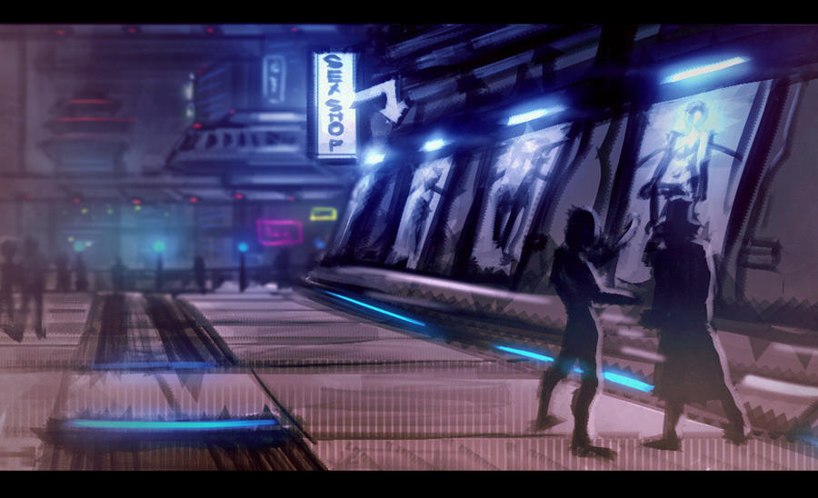
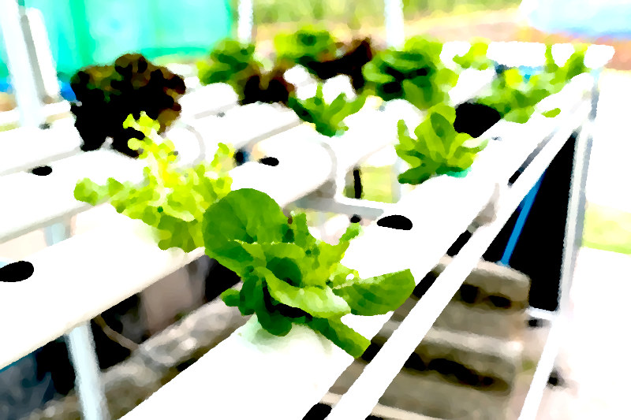

# IϽiЯeͼtori0 de Nottingham **Directorio de Nottingham**

\sinc

La arcología de Nottingham están llenas de lugares interesantes donde tu banda pueden correr grandes aventuras. 

La mayoría de las veces serán lugares normales donde ambientar tus aventuras, pero algunas veces son sitios increíbles llenos de tesoros y recompensas, y también trampas mortales de las que solo les más avispades y valientes pueden escapar.

La arcología se divide en 4 zonas, la zona baja, la zona medía, la zona alta y el bosque. El bosque rodea las otras 3 zonas y son la parte del complejo que se dejó a medio construir debido a la marcha de les instaladores.

## Zona baja

[](https://www.deviantart.com/geokorf/art/Best-buy-193206307 "Best buy By GeoKorf")

\conc

```
Es la parte más antigua de la arcología y también la mas abandonada y con más problemas de mantenimiento. Es por ello que está habitada por las clases más bajas.
```

\sc

**Nivel de seguridad:** En la zona baja más que nivel de seguridad debemos hablar de nivel de represión institucional. Y en ese caso podemos decir que es excesivamente alta. Eso supone que hay patrullas de sheriffs las 24 horas, haciendo controles aleatorios, detenciones arbitrarias y dando palizas sin razón. Sea como sea si hace algo indebido puedes acabar en el calabozo o algo peor.

\sp

Basura, humedad, desconchones, grietas, iluminación pobres y parpadeante y aguas residuales son el día a día de la zona baja. Si a eso se le suma masificación, delincuencia y miseria, tienes la zona baja de Nottingham. Las calles de la zona baja están controladas por pandillas y bandas criminales y sobrevivir en ellas sin servir a ninguno de esos grupos es una auténtica proeza.

Lo que has de tener en cuenta en la zona baja es que nadie quiere estar allí, todos quieren escapar a otras zonas o quizás algunos al bosque.

### El río Trent

El río Trent es como se conoce **una inmensa algafactoría donde se produce la gran mayoría de comida de la arcología**. Es una de las industrias más importantes de la arcología y es muy importante para la compañía no solo porque su buen funcionamiento supone el buen funcionamiento del complejo, sino porque también da tremendos beneficios a la empresa.

Con sus cientos de piscinas de agua dulce llenas de algas, es para muches _notis_ lo más parecido a un río o un mar que hayan visto en su vida. Es tan grande que han tenido que aprovechar habitáculos alrededor del Trent para expandir las piscinas de crecimiento de algas de manera que les peatones pueden pasear entre sus piscinas mientras se mueven por la zona.

> La mayoría de la comida del complejo sale del Trent, con lo que **si algo le pasa a la algafactoria puede suponer una gran hambruna** sobre todo entre los _curris_.

\sc

### The premise

Robert Guthrie es un buhonero/empeñista que se conoce por **tener tratos con delincuentes y _boskis_ y comprar todo el material que le traigan sin hacer preguntas**. Cosas que han rechazado en otras tiendas de empeño por ser muy peligrosos Guthrie los compra llevándose una buena comisión del 60% (20% o 30% es lo normal) pero nunca hace preguntas. 

Aunque tiene una tienda fija, esta abre y cierra cuando le da la gana. Además, puede aparecer comprando o vendiendo sus cosas en cualquier sitio del complejo a cualquier hora.

También es un buen **lugar donde buscar materiales y productos peligrosos e ilegales**. En su almacén (o en su mochila si está fuera de la tienda) tiene de todo lo que han vendido y Guthrie puede vendértelo por un buen precio. Como siempre si es ilegal compra y paga con trueques.

> Guthrie es uno de los mayores clientes de la Harriette, la tecnobruja. Toda la basura rota que compra suele pedirle a Harriette que se la arregle. Le hace todo tipo de ofrendas y suele tener siempre suerte. Si tu banda de forajides, necesita una reparación imposible de algún equipo o recuperar info borrada de una unidad de almacenamiento (y no conoce a Harriette), Guthrie puede llevárselo y traértelo arreglado en unos días.

\sp

### El pozo

[ 3 - James St. JohnSeguir")](https://www.flickr.com/photos/jsjgeology/32454817667 "Vertical shaft (Bottomless Pit, Black Snake Avenue, Mammoth Cave, Kentucky, USA) 3 - James St. JohnSeguir")

Este gigantesco agujero sin fondo en la base del complejo es la primera estructura de Nottingham. Este pozo lo excavó la compañía en las tierras de Nottingham y lo lleno de miles y miles de toneladas de nanitos. Les instaladores usaron esos nanitos para construir los cimientos y luego la estructura del complejo. Según crecía el complejo, el pozo se iba secando hasta quedar vacío. 

Se dice que todavía quedan nanitos en su fondo esperando órdenes de trabajo de sus dueños, les instaladores. Sin embargo, nadie ha intentado bajar e investigar lo que haya en el fondo, de hecho se considera un lugar maldito que todo el mundo trata de evitar.

El pozo mide unos 20 m de diámetro y se desconoce su profundidad, pero todo lo que se lanza dentro desaparece. No sería de extrañar que alguien se deshiciera de cadáveres y/o productos peligrosos en su oscuridad.

\sc

**Semilla de aventura:** Les buscadores buscan a un grupo de osades que bajen al pozo y consigan muestras de los nanitos que se creen que hay allí abajo. Estudiar esos nanitos sería como conocer a les propies instaladores y quizás puedan obtener pistas para su búsqueda. El problema es que 150 años son muchos años y lo que hayan hecho los nanitos del fondo del pozo con los restos que se lanzan desde arriba puede ser muy peligroso. Siéntete libre de sacar, zombis tecnificados, aberraciones mutantes o hasta horrores cósmicos. El pozo es la entrada a tus aventuras de todo tipo de seres.

### Campo de tiro de Gus

En este taller desocupado puedes encontrar todo tipo de dianas y obstáculos y variopintes personajes muy centrados intentando tiros y rebotes imposibles. 

Para algunas de las personas que asisten a este pequeño campo de tiro el tirachinas (y algunos el arco) es casi una filosofía de vida y como si de monjes shaolin se tratará entrenan día y noche para hacer los más increíbles tiros. El tiro con tiragomas es, además, para muches de elles un método de meditación e iluminación.

Gus, el primer tirador de la escuela, es un maestro _zen_ del disparo de tirachinas. Con los años ha desarrollado un código ético y moral que ha fusionado con la destreza con el tirachinas y no enseñará su estilo de combate a personajes de dudosa reputación.

\sp

> Por unos **500 dólares en alijos** (que serán usados en mejorar el campo de tiro) y dos semanas de entrenamiento intensivo, mejorarás el valor de Disparar de le PJ en **un nivel de dado cuando combatas con tirachinas o arco** (puedes entrenar varias veces, pero con diferente arma). Tu valor de habilidad no sufre cambios, por ejemplo, al gastar avance.

### La Taberna de Albión

La Taberna de Albión es uno de los locales mejores y con más ambiente de Nottingham y el mejor de la Zona Baja. Bebida y comida abundante a precios asequibles. De hecho sus cócteles de vodka casero tienen mucha fama por ser muy fuertes y es que son puro alcohol.

> Si haces un **cóctel molotov con el vodka del Albión** descubrirás que es realmente efectivo, haciendo **1d12 de daño** en vez de un 1d10. Pero el **coste se eleva de 1 a 5** dólares por cóctel.

Cada viernes hay timbas de cartas sin límite que empiezan con el glitch de noche y acaban con el glitch del día. Se mueve mucho dinero (sobre todo en alijos) y vienen jugadores de todo el complejo.

La clientela es muy variada, desde trabajadores de la algafactoría, hasta influencers atraídos por las emociones de participar en timbas de póker ilegales y de quizás ver algún criminal e incluso hacerse un reel con alguno de ellos. 

Estas historias son difundidas por Esther, dueña del bar. Es cierto que alguna ocasión algún forajide famoso ha pasado la mona en el suelo del bar, pero no es algo muy común.

Las visitas de los sheriffs son frecuentes con lo que es un lugar a evitar, si eres un profugue de la ley.

> Las partidas son legales dentro de la ilegalidad del juego, así que en principio une jugadore no tendrá positivos ni negativos por jugar en el Albión.

### El gumbo eterno

Hace 15 años, durante una gran escasez de algas, Mamá Claire, de ascendencia jamaicana, sacó su olla de gumbo a una plazoleta cerca de su casa y empezó a repartir platos de comida a sus vecinos. Cada uno trajo lo que pudo y Mamá siguió cocinando gumbo. El fuego de su cocina lleva sin apagarse desde entonces y nunca le ha negado un plato de comida a nadie. La gente trae lo poco que les sobra para echarlo en la olla de Mamá Claire y ella lo reparte entre los más desfavorecidos del complejo.

Muches cocineres e influencers gastronómiques ha intentado conseguir la receta del gumbo, pero Mamá se ha negado a darla. También le han hecho ofertas de trabajo como cocinera en casas de la zona alta y las ha declinado todas. Ella es feliz con su gente en los bajos de Nottingham.

\sp

El **secreto del gumbo** de Claire son los **productos frescos ecológicos que los _boskis_** suelen proporcionarle en sus incursiones al complejo.

**Semilla de aventura:** Une sibarite _blus_ quiere descubrir la receta del gumbo de Mamá Claire, pero no consigue que nadie le traiga un plato y se niega a ir hasta la Zona Baja. Tu banda puede cobrarle una buena pasta por el trabajo o hacer que el _blus_ les deba un favor. Sea lo que sea, no debería ser muy complicado conseguir un cuenco de gumbo, mamá Claire lo regala.

Si necesitas contactar con la gente del bosque Mamá Claire puede ser una buena vía sobre todo si echas buen material en su olla.

> Recompensa con un par de benis a cualquiera que deje comestibles o done sus alijos para el gumbo eterno.

### La rayuela fantasma

Un día vas a tu trabajo y de repente a la entrada de tu turboascensor hay grabada en el suelo una rayuela con motivos de peces payasos, estrellas de mar y corales.

Durante una semana está en ese sitio y de vez en cuando algún niñe se pone a jugar hasta que un día desaparece tal como apareció. Al cabo de unas semanas encuentras otra rayuela de unicornios en un pasillo de servicio que vuelve a desaparecer al de unos días, así en un ciclo infinito.

Esta rayuela es conocida por les pillueles de la calle como la rayuela fantasma y corren todo tipo de leyendas. Sin embargo, ninguna acierta con la realidad, **la rayuela la crea y la destruye un grupo de nanitos.** Lo lleva haciendo así desde la desaparición de les instaladores. Su última tarea era crear una rayuela en un parque infantil y no le dieron la orden de parar, con lo que lleva siglo y medio creando rayuelas con motivos infantiles y borrándolas al no recibir el «ok» de sus amos. Con el tiempo su programación les ha dicho que se movieran por todo el complejo, que igual no conseguían el visto bueno porque se habían equivocado de lugar.

La zona de trabajo de este grupo de nanitos es la Zona Baja, pero han empezado a aparecer en la Zona Media y a empezar a llamar la atención. Como son cosas de niñes a nadie le preocupan, por ahora.

> Este grupo de nanitos está activo y plenamente funcional. Alguien suficientemente **hábil en Electrónica y Ordenadores podría reprogramar a los nanitos** y ponerlos a su servicio. El principal escollo será convencerles de que han terminado la tarea, por ejemplo, haciendo que algunes niñes de la zona jueguen y se diviertan en la rayuela.

### Mercadillo nocturno

El mercadillo nocturno, también conocido como mercadillo de Halloween, se celebra cada 5 días durante el modo nocturno del complejo. Es un mercadillo en el que la gente coloca en las puertas de sus habitáculos, pantallas con fotos y vídeos de las cosas que vende y también de las cosas que necesita. 

\sp

Si ves algo que necesitas y quieres deshacerte de algo, llamas a la puerta y negocias un trato.

**Son muy raras las transacciones en dinero**, todo el mundo prefiere que la compañía no meta mano en estas actividades de subsistencia. Son muy pocos los que venden productos ilegales y normalmente son ilegales por temas de seguridad alimentaria o porque son productos sobre los que la compañía tiene la venta en exclusiva.

Según se cuenta, está tradición viene de otra más antigua llamada Halloween (de ahí su nombre) donde les niñes iban de noche de puerta en puerta de sus vecines haciendo tratos para conseguir dulces.

Con los años ha habido gente que ha pasado de montar el mercadillo para deshacerse del excedente de lo que producía en casa, a montar auténticas tiendas abiertas todos los días.

Como en casi todos estos eventos de carácter social **han empezado a venir _influencers_** a hacer reels de esta costumbre de la gente humilde de la Zona Baja. El problema es que están afectando al orden natural del mercado al pagar mucho dinero por cosas que no lo valen o acaparando toda la producción de un producto, **subiendo su precio y haciendo que no sean accesibles a los bolsillos más pobres**.

Hace años las _fantarinas_ se compraban por otras frutas pieza por pieza. Desde que se pusieron de moda en cócteles de lujo, su precio ronda 1 a 7. Y como las _fantarinas_ hay cada vez más productos de primera necesidad cuyo precio está ahora desorbitado por la acción de las clases altas.

> Durante las noches de mercadillo se puede tirar Pasillear para encontrar cualquier tipo de producto a un 40/50% de su precio real. Como DJ puedes añadir negativos a la tirada para encontrar artículos más difíciles de localizar o escasos.

**Semilla de aventura:** Une estúpide influencer ha montado un concurso en el mercadillo. Ganará aquella persona que consiga, intercambiando cosas en el mercadillo, el objeto más valioso y raro. Tienen que grabar todas las transacciones y entregárselas al influencer. El premio son 10.000 $ y esto ha hecho que la Zona Baja esté llena de gente participando y armando jaleo. Quizás una banda de tunantes podría escarmentar al influencer. Lo que nadie sabe es que todos los videos irán a manos de la directora J0hn que quiere escanear los interiores de las casas de la gente de la Zona Baja. Usando esas grabaciones, podría detectar pisos francos de rebeldes, simpatizantes y otros delincuentes.

### Salón de juegos y pachinko «La olla de oro»

La olla empezó como pequeño espacio debajo de unas escaleras donde su dueña original, conocida en la zona como Doña Marina, puso unas máquinas vending, gachaballs y una tragaperras.

\sp

Las tragaperras y las máquinas de gachaballs pronto se convirtieron en una interesante fuente de ingresos y empezaron a ocupar todo el espacio.

Rápidamente, Pedro Gonzalves, el hijo de Marina, al heredar el local, empezó a comprar habitáculos de alrededor para meter más máquinas. Con el tiempo quitó los gachaballs y empezó a meter máquinas de pachinko. 

Hoy en día es un laberinto de unas 20 salas interconectadas entre sí con unas 120 máquinas con gente jugando las 24 horas.

> Es tal el ruido que hay en el local que todas las tiradas de **Notar que impliquen el oído tienen un -2**. La iluminación está atenuada y hay muchas luces brillantes así que **Disparar se ve afectado con un -2** a la tirada por malas condiciones de visibilidad.

El logo del local es una olla de cocción lenta dorada. Pedro quería la típica olla llena de monedas al final del arco iris, pero la IA generativa fue muy literal al crear la imagen y dibujó una olla de cocción lenta hecha de oro. El equívoco hizo gracia a Marina que tenía una olla parecida y obligó a Pedro a quedarse con el logo.

Pedro tiene una cuadrilla de anuncios humanos que se mueven por el complejo anunciando la sala de juegos con vistosos carteles con pantallas LCD mostrando las mejores opciones de apuestas. 

El juego es legal en Nottingham, pero está muy controlado, o debería estarlo. La mayoría de las máquinas de la Olla de Oro están trucadas y la directora J0hn y lo sabe, pero lo permite porque saca réditos de la actividad.

[](https://es.wikipedia.org/wiki/Olla_de_cocci%C3%B3n_lenta#/media/Archivo:Crock_pot_of_chili.jpg "Olla de cocción lenta")

Primero, podemos hablar en general, los locales como la Olla de Oro crean una masa empobrecida de ludópatas que trabajarán por una miseria. Eso claramente beneficia a la compañía.

Además, es una gran fuente de información. Sus anuncios humanos vigilan toda la ciudad grabando ilegalmente con cámaras ocultas en sus carteles todo lo que pasa a su alrededor sin levantar sospechas. Toda esa info es pasada a los sheriffs para su uso en la detección de disidentes y enemigos de J0hn.

Pedro también suministra info, cuando alguno de les jugadores mueve grandes sumas de dinero en su casino. También sonsaca información interesante a cambio de reducir las deudas de les perdedores.

Pedro se está enriqueciendo a gran velocidad y ha empezado a formar un pequeño grupo mafioso que está empezando a tontear con otras formas de crimen organizado. Por ahora con el beneplácito de la directora J0hn.

\sp

> Las **bolas de pachinko pueden ser usadas como abrojos**. Tirando un puñado de bolas al suelo, conviertes una casilla en terreno difícil y es imposible correr por esa casilla. Si se tira un cubo lleno de bolas (de los que usan les jugadores para recoger sus premios gordos), se pueden cubrir hasta 5 casillas. También pueden usarse como proyectiles de tirachinas sin ningún tipo de penalización a Disparar o al daño.

### El cementerio haitiano

Aunque los enterramientos están prohibidos en la arcología y solo se permite la incineración, las familias haitianas tienden a crear espacios comunes donde dejan las cápsulas contenedoras de cenizas. Decoran estas zonas siguiendo las tradiciones con **velas, guirnaldas y flores y dejan ofrendas** en ellas a los ancestros. Pero las nuevas generaciones traen también sus **cápsulas personalizadas impresas en 3D** (forma de gato, de micrófono, de pikachumon, etc.), **tiras LED, mini reproductores de música, imágenes holográficas**, etc. Estos cementerios improvisados son muy importantes para les vecines y suelen ser vigilados por gente de la comunidad.

Con los años una de estas zonas comunales ha tomado más importancia que el resto y se le conoce como el cementerio haitiano. Todo empezó cuando una anciana dejo en su testamento que sus cenizas quedarán donde murió su esposa años antes en un accidente de trabajo. En esa zona, aprovechando un hueco para unos extintores (hace años robados), su hijo dejó la biocápsula de las cenizas.

A esa primera urna, le fueron siguiendo más y se fue creando una especie fondo común de donaciones (dinero que dejaban los difuntos para su funeral) con el que la comunidad haitiana fue comprando habitáculos anexos donde meter más cápsulas.

Alrededor del cementerio haitiano, han empezado a aparecer zonas donde personas no descendientes de haitianos han empezado a dejar las cenizas de sus muertes. Cada una de ellas decoradas en la tradición de los muertos _almacenados_ allí. Se empiezan a ver zonas parecidas a santuarios _sinto_ y minicapillas a dioses hindúes.

Ante esta situación la directora J0hn ha empezado a exigir la identificación de todos las cenizas almacenadas en el cementerio. De hecho, tiene a un **equipo de robots comadrejas tomando pruebas de ADN a los restos** para identificarlos y luego etiquetarlos y localizarlos con chips GPS adheridos a las cápsulas de cenizas.

> A pesar de todas las ideas conspiranoicas que corren sobren la identificación de las cenizas, en este caso **las acciones de la directora J0hn no tienen ningún tipo de plan oculto**. Digámoslo así, la directora J0hn tiene cierto TOC con el censo de la arcología y quiere estar seguro de que tiene los datos más precisos y actualizados sobre la población actual. Eso no quiere decir que no puedas hacer correr como DJ cualquier tipo de bulo sobre los estudios de ADN y usarlo como parte de una aventura.

\sp

Este cementerio es el sitio más importante en el que se celebra el _fét gede_, **el Día de los muertos en Haití**. En noviembre el lugar se convierte una extraña fiesta que rinde culto a los espíritus de los muertos.

### Taller de e-bikes de Noc

Noc lleva años reparando las bicicletas eléctricas desde que tiene recuerdo. Siempre ha estado rodeado de herramientas y ebikes.

El taller de Noc es un pequeño habitáculo lleno hasta arriba por todas partes de ebikes y skates viejos, piezas de repuesto y todo tipo de trastos electrónicos obsoletos y rotos.

Noc puede arreglar cualquier vehículo personal, pero por lo que es más conocido es por tunearlos. Quieres más velocidad, él puede hacerlo. Necesitas saltar más él puede conseguirlo. No hay ninguna modificación que no pueda conseguir.

Piénsalo, si vas a dar un golpe no es mala idea que Noc revise y ponga a punto los rollers que vas a usar en la huida.

De hecho, Noc es un acumulador que pasa la mayoría de su tiempo libre **recogiendo equipo mecánico y electrónico desechado y almacenándolo en su taller**. Lleva muchos años haciéndolo y tiene mucho material viejo y obsoleto del que se resiste a deshacerse «por si alguna vez sirviera para algo».

> Si tu banda en algún momento busca equipo retro, Noc es la persona con la que debes hablar. Otra cosa es que consiga que te lo venda o te lo preste.

Hay varios objetos que no saben para qué son realmente y que guarda como un gran tesoro. Si alguien los llevará a la bruja del bosque, esta **los identificaría como tecnología de les instaladores**. 

Puedes usar estos aparatos como pistas iniciales de una aventura que busque encontrar a les instaladores o como parte de la trama de les buscadores del clave de superusuarie.

Cómo muchos artesanos de Nottingham busca une aprendice al que transmitir sus conocimientos. Mientras no te preocupe morir bajo una avalancha de cables y piezas de repuesto y te gusten las ebikes, puede ser una buena salida profesional.

> Cualquiera de tu banda con Electrónica d6 y Reparar d6 puede presentarse como ayudante. Obtiene la desventaja Obligaciones (menor, trabaja unas 4 horas al día en el taller) pero tienes acceso a un taller completísimo (+2 a Reparar) y recibes unos 150 $ a la semana como sueldo.

### El correccional

El correccional de Nottingham es una **mezcla de institución penitenciaria y fabrica** donde los presos pagan sus deudas con la sociedad trabajando.

El correccional consta de **4 plantas** que fueron aisladas del exterior de forma que no hay salidas al exterior más que la entrada peatonal y la carga y descarga.

Sus conductos de aireación, desagüe y demás son independientes y en circuito cerrado para evitar las fugas.

\sp

Dos plantas de celdas, para 400 presos (2 preses por celdas), media de esparcimiento, la otra media de comedor y pequeño hospital y la última planta es un taller industrial donde trabajan 8 horas diarias cumpliendo sus penas.

Todo el correccional está recubierto de gruesas paredes blindadas con sensores que detectan vibraciones y agujeros y robots comadrejas programados para revisar lo que los sensores detectan.

No se conocen fugas exitosas, aunque intentos ha habido varios. La idea principal de les preses es que sin ayuda exterior es imposible salir del correccional y más escapar del complejo.

La seguridad es excesiva con 1 sheriff por cada 10 preses, que cumplen con el reglamento a rajatabla y sin miramiento. Las sediciones y las revueltas son rápida y drásticamente reprimidas.

A esto se le une sistemas de seguridad, videovigilancia, sensores de calor y movimiento y apertura y cierre de todas las puertas controlada por la IA alcaide.

La vida es simple y rutinaria, **8 horas de trabajo, 8 horas de sueño y 8 horas para comer, estudiar, jugar, etc.** Así todos los días, excepto el día de la primera piedra en que no se trabaja, se da una comida especial donada por los locales de la zona y se retransmite el discurso de la directora J0hn y el concurso de tiro.

Las visitas son telemáticas, pero aun así restringidas y el contrabando es casi imposible. Pero les preses siempre consiguen hacer algo de alcohol o armas muy sencillas.

\sc

La fábrica funciona 24 horas en turnos de 8 horas y la IA alcaide suele evitar que los miembros de bandas u otras organizaciones sindicales estén juntos lo mínimo posible con rotaciones de los turnos de trabajo.

> El rumor que corre entre les preses es que **los sheriffs más violentos son enviados al correccional** y es totalmente cierto. Si un sheriff resulta muy violento para el trabajo de calle, sele envía al correccional o al bosque, donde sus actos no son vistos por los notis.

### Máquinas de vending

Siempre ha habido máquinas de vending en la zona baja de la arcología, pero fue la directora J0hn quien lleno todos los rincones de la zona baja de máquinas de vending de cualquier cosa en un esfuerzo de acabar con los pequeños negocios.

Sin embargo, no llegaron nunca triunfar, por la sencilla razón de que las transacciones tenían que ser en créditos de la compañía y la gente trabaja más con trueque. A pesar de ello la directora J0hn sigue manteniéndolas y reponiéndolas en un claro esfuerzo por no reconocer su error.

> Cuando crees un espacio en la zona baja donde se vaya a combatir o interactuar **es muy posible que haya por lo menos una máquina de vending**. De café en una sala de espera, de productos de higiene y farmacéuticos en una zona hospital, productos de ocio en zonas de diversión, etc. 

\sp

[](https://www.deviantart.com/burningmonk/art/Vending-Machine-666604846 "Vending Machine By burningmonk")

Las máquinas de vending son pequeñas bolsas de dinero para gente que vive en el otro lado de la ley. Pueden tener productos por unos 1d10x10 $ en alijos. El cristal, a pesar de ser blindado, tiene una **consistencia de 12** (18 si los usas como parapeto).

Como se ha dicho, las maquinas casi ni se usan, pero hay que reponerlas, limpiarlas y arreglarlas, así que Lady Marian, con apoyo popular y tras varias manifestaciones y bastantes actos de vandalismo contra las máquinas de vending, consiguió que les preses no violentes pudieran elegir pagar sus deudas trabajando como reponedores de las máquinas.

\sc

En teoría, esto permitía una reinserción social más rápida, ya que durante los meses de trabajo reponiendo productos volvían a vivir en sociedad, a establecer nuevas relaciones sociales y a acostumbrarse a vivir entre sus iguales.

Lady Marian en persona dirige muchas de las audiencias de los presos donde se decide o no darles estás ventajas penitenciarias.

Si bien, la mayoría de estes trabajadores se reinserta adecuadamente, el número de fugas al bosque ha aumentado drásticamente, sobre todo les preses que salieron con la firma de Lady Marian. 

> Si alguien hiciera cuentas, vería que casi todos les preses que salen para reponer con la firma de Lady Marian terminan fugándose. Esto podría poner en serios aprietos esta buena samaritana.

\sp

\sinc

## Zona media

\conc

```
La zona media es la zona industrial y comercial del complejo. Aquí están las fabricas, los talleres y también las tiendas y los restaurantes. En ella viven las clases medias que buscan ascender a la zona alta y es el punto en que las personas de la zonas altas y bajas se juntan, pero no se mezclan.
```

**Nivel de seguridad:** el nivel de seguridad de esta zona es la más baja de toda la arcología, principalmente porque es no son los bajos fondos que hay que controlar, ni la zona alta que debe ser protegida. Además, la propia idiosincrasia no quiere que haya mucha policía, la gente viene a gastar y a divertirse y gasta menos si está vigilada.

La zona media es la zona económica del complejo. Cómo ya hemos dicho están las fábricas, los talleres, las tiendas y las tabernas y restaurantes. Si vienes aquí es para trabajar o para gastar dinero. Es por ello que muchos, esta zona es perfecta para una banda proscrites que empiezan den sus primeros golpes. La zona medía supone mucho dinero, mucha gente y menos vigilancia y seguridad de lo normal.

También es el lugar de disfrutar de tus golpes bebiendo, comiendo, cantando y bailando mientras tu cara no salga en las pantallas LCD en un anuncio de se busca. Cuando eso ocurra la zona media se convertirá en un lugar peligroso para tu banda.

\sc

### Plaza Mayor

La Plaza Mayor es **la estancia abierta más grande de la arcología** aun así no será mayor que un **campo de fútbol** actual. Es el centro de la vida en la arcología de Nottingham y en general todos los eventos importantes toman lugar aquí.

Tiene una simulación de cielo que muestra un día soleado y totalmente despejado y una noche demasiado estrellada. No hay ni puesta ni salida de sol. Simplemente glitchea unos segundos y pasa de noche a día o viceversa. 

De hecho, les notis, tienen dos expresiones «glitch de la mañana» y «glitch de la noche» para hablar del alba o del ocaso.

Hay _notis_, sobre todo de la parte baja del complejo donde los espacios son más pequeños, que sufren agorafobia y son incapaces de atravesarla.

La Plaza Mayor es el km cero de la mayoría de las rutas de turbo ascensores que permiten llegar a todas las esquinas del complejo. Eso hace que tenga siempre un montón de tráfico de peatones.

Alrededor de la plaza hay todo tipo de tiendas, puestos de comida, tabernas, etc. en general de nivel medio/alto. Suelen estar bastante abarrotadas, ya que siempre hay algún tipo de oferta o rebajas activas.

Como siempre fuera de las tiendas hay portacarteles publicitando los productos de determinadas tiendas haciendo todo tipo de malabares, acrobacias, canciones, repartiendo muestras gratuitas, etc.

\sp

\sinc

[](https://www.deviantart.com/mackingster/art/Mike-Grauer-1980s-shopping-mall-water-fountain-p-924653019 "Mike Grauer 1980s shopping mall, water fountain, p By Mackingster")

\conc

#### El espacio de descanso

En el centro hay una especie de espacio de descanso y relax con bancos de cementos y unos canales de agua y de fuentes que discurren entre los bancos. En tiempos de la directora R1c4rd podías encontrar grupos de gente haciendo un pícnic o parejas haciendo manitas.

Hoy en día están siempre vacías, ya que en cuanto alguien se sienta aparece algún sheriff de los que patrullan la plaza para echarte de allí.

> Debajo del parque hay un búnker con un centro de datos que la directora R1c4rd usaba para dejar copias de seguridad de todos sus datos (que no su programación). Cuanto esta se fue, dejo su última copia en este lugar. J0hn no se atreve a borrar esa copia, digámoslo por una mezcla de respeto y superstición, y tampoco quiere usarla por si al abrirla activa algo que haga volver a R1c4rd. Tampoco quiere que la gente la encuentre así que hace que los sheriffs no permitan a nadie colocarse allí.

#### Los dólmenes

En un lateral de la plaza puedes encontrar una zona empedrada con 2 dólmenes de tiempos prehistóricos que se descubrieron durante la construcción de la arcología y que la directora R1c4rd decidió restaurar y proteger.

Los dólmenes hoy en día están totalmente vandalizados con grafitis, textos grabados, trozos de piedra arrancados, etc. y los equipos de mantenimiento hace años que dejaron de preocuparse de limpiarlos y restaurarlos.

> Los **dólmenes son una protección perfecta** en caso de combate en la Plaza Mayor, ya que **las piedras son resistentes (Consistencia 20)** y tienen paredes y una pequeña entrada.

#### La gran pantalla

En un uno de los laterales de la plaza hay una gran pantalla de unos 30x10m donde la directora J0hn hace sus apariciones y publica sus edictos.

\sp

Esta pantalla es vandalizada continuamente con pintadas, pegatinas, globos de pintura. De hecho, hay varias bandas cuyo rito de entrada es estropear alguna manera esa gran pantalla.

La directora J0hn, cuando hace sus apariciones públicas en esta pantalla, lo hace como una especie de ser de energía de silueta femenina sobre un fondo negro con patrones geométricos luminosos.

Esto contrapone con la directora R1c4rd que solía salir como una mujer mayor, elegante y profesional en el vestir y normalmente en algún tipo de despacho corporativo.

El resto del tiempo hay diferentes marquesinas deslizantes que muestran titulares de diferentes edictos del complejo, avisos de cortes de agua o luz, cambios en leyes. Si pagas a la compañía, previa censura, puedes poner tu propio mensaje, que va desde felicitaciones de cumpleaños a proposiciones de boda. Solo se permiten cosas personales. Los anuncios y promociones están prohibidos y no suelen pasar la censura.

### El terreno

El terreno es un estadio deportivo donde se celebran los más importantes eventos deportivos de Nottingham. Hablamos de las finales del campeonato de hockey de pasillo profesional u otros eventos deportivos de la misma talla. 

Este espacio no es mucho más de una cancha de tenis con unos vestuarios y una sala para ruedas de prensa. No hay espacio para el público, que solo asiste de forma virtual. De hecho, alguna vez se ha intentado mover el concurso de tiro del día de la primera piedra (que se celebra de normal en la Plaza Mayor) y no ha tenido ningún éxito, ya que el público quería estar presente y vibrar con la competición.

El estadio cumple la función de circo en la famosa locución latina «Pan y circo». Entretiene a los _curris_ y evita que se subleven contra la compañía.

Como ya hemos dicho, no hay ni gradas ni asientos, sino miles de cámaras que retransmiten los eventos deportivos a su propietario/socio. De manera que lo ves en tu dispositivo de realidad aumentada como si estuvieras allí. El sistema simula a tus compañeres de grada y puedes hablar con elles o cantar los himnos de tu equipo, incluso abrazarte a elles y celebrar las victorias y llorar las derrotas.

Claramente, hay cámaras en mejores puestos que otros y, por tanto, son más caras y normalmente están destinadas a _blus_ e _influencers_.

Puedes comprar entradas para eventos específicos a la compañía o pagar un abono de temporada. También puedes alquilar de forma alegal la cámara a una persona con un abono de temporada.

> La IA que controla todo el sistema de cámara ha desarrollado con los años ciertos gustos deportivos y tiende a tratar mejor a sus compañeros hinchas que al resto. Si vas con los colores de su equipo, al interactuar con ella recibes un +2 a todas las tiradas en las que interactúes con ella.

\sp

### Escuela de danza de Lady Myrna

Lady Myrna es una de las mejores bailarinas de Nottingham y ha bailado para las clases más altas del complejo y de todo el mundo. En la cima de su carrera decidió montar una escuela donde enseñar su arte a las personas que lo aman tanto como ella.

**Lady Myrna es una de las pocas personas que ha salido del complejo** y puede hablarte del mundo fuera del complejo, aunque hay muchas cosas que se inventa. También miente mucho sobre como su familia consiguió su título nobiliario.

Su escuela, a pesar de lo que podría creerse, está en un **gimnasio de la Zona Media, que es también su casa**. La realidad es que, aunque cobra bien por sus clases, no puede permitirse un local en la Zona Alta con lo que gana como profesora.

En la sala de baile tiene todo tipo de ropajes de sus tiempos como bailarina que sus alumnes usan en sus prácticas. Si rebuscas entre sus prendas, puedes encontrar desde clásicos trajes de ballet con tutú a vestidos de tuberías de plásticos o de látex y parches reflectantes. Si tienes confianza con ella puede que te deje llevarte alguno de sus trajes. También ha montado un equipo de escenografía (sonido y luces) de gran calidad para las clases.

Myrna es muy selectiva, por no decir elitista, sobre a quien enseña todo su arte. Normalmente, no acepta a cualquiera, solo enseña su arte a quien ella cree que lo merece y que tenga según ella «verdadero talento».

A pesar de los avances, la robótica no ha sido capaz de igualar la maestría de las personas que han dedicado su vida a la danza. Es por ello que hay padres y madres con el deseo y el dinero de pagar los precios de Lady Myrna para que sus hijes aprendan danza clásica. 

> **Clases de danza:** Por unos **2500 dólares y dos semanas de entrenamiento intensivo**, mejorará tu valor de Interpretación en un nivel de dado cuando bailes. Su valor de habilidad no sufre cambios, por ejemplo, al gastar avances. Para que te acepte en su escuela deberás demostrar que o tienes mucho dinero o eres muy famose o un mínimo de d6 en Interpretación.

### El huerto urbano

La directora J0hn, además del zoo, mandó construir un huerto urbano de 20x20m, donde hay plantadas hortalizas y frutas y algunas plantas exóticas. Una vez a la semana la producción es sorteada entre los habitantes del complejo.

Pero el huerto no solo sirve para limpiar la imagen de la directora, también sirve como laboratorio final de diferentes departamentos científicos de la compañía. De hecho, no es llevado por personal normal de mantenimiento del complejo, sino por botánicos especializados en hidropónica.

> Por unos 200 $ (como soborno) puedes conseguir que alguien del personal del huerto te consiga de extranjis cualquier ingrediente de tipo vegetal por extraño que sea (a discreción de DJ). También puedes por 100 $ conseguir frutas u hortalizas por raras que sean y estén o no de temporada.

\sp

Los pasillos con vegetación alta de este jardín se ha convertido en el sitio preferido para llevar a cabo duelos entre _notis_. Es un buen sitio. Fácil de encontrar, oculto a simple vista y la vegetación le da un toque clásico y romántico que no se puede conseguir en otras partes del complejo.

**Semilla de aventura:** La última persona que gano las verduras del huerto ha estado unos días comportándose muy raro, con fallos de memoria y ahora presenta ronchas y prurito por todo el cuerpo. Quizás habría que investigar el huerto y ver que trama la directora.

### Pastelería Badreddin

En un anexo de la Plaza Mayor tiene Hassan Badreddin su pastelería, **la mejor pastelería del complejo.** Los Badreddin llevan haciendo las mismas recetas familiares para preparar sus dulces y pasteles desde la creación de Nottingham. Pese a su fama y a la cola que hay todos los días frente a su puerta y que llega hasta la Plaza Mayor son muy asequibles y hasta les más pobres pueden disfrutar de sus muffins.

Hassan y sus empleades dejan los pasteles enfriar en el alfeizar de una de las ventanas del local, como han hecho sus antepasados desde hace siglos, no solo para atraer a la clientela con el buen olor, sino también para que la gente sin dinero y con hambre pueda «robarlos».

Los pasteles de Hassan pueden ser un regalo perfecto para congraciarte con las madres de tu futura pareja o para conseguir el favor de une _blus_ con el que vas a firmar un contrato. Quizás no sea tan mala idea echar un par de horas en la cola para comprar unos pasteles a Hassan y regalárselos a tu _amore_.

> Regalar a una persona una caja de dulces de Hassan y conseguir que los pruebe hará que automáticamente **la reacción de le agasajade sea un nivel menos hostil**. En caso de tirarse en la tabla de Reacciones, podrá pedir tirar de nuevo y quedarse con la que más le interese.

### LEDland

LEDland es uno de los pasillos de acceso a la Plaza Mayor. Recibe el nombre de los miles de leds que cubren sus paredes y techos. Despide tanta luz que tienes que usar gafas con cristales tintados para pasar (-2 a Disparar y Notar si no llevas gafas de sol).

Antiguamente, este acceso estaba cubierto por una sustancia gomosa creada por les instaladores, de la que se desconocía su utilidad. Un día una mujer llamada Anette, del equipo de mantenimiento, mientras cambiaba las luces del pasillo, clavó unos leds en la goma para tenerlos más a mano y se encendieron. Según se cuenta, en cuanto se encendió el primer led recibió un aviso de que iba a ser ascendida.

Esta historia corrió como la pólvora y LEDland se convirtió en un pozo de los deseos. La gente va allí con miniLEDs, busca un espacio libre donde clavar su lucecita y pide un deseo. Si se enciende se cumplirá y si falla (cosas que ocurre muy pocas veces) no se hará realidad.

\sp

Corre otra historia, en la que Anette murió en accidente de trabajo a los pocos días de empezar en su nuevo puesto. Hay gente que cree que los deseos de LEDland son peligrosos y pueden volverse contra ti.

> Lo interesante es que LEDland fascina a la directora J0hn. El tema de los deseos intriga a la mente de esta IA y pierde muchos ciclos de proceso y memoria estudiando a la gente que pide deseos y si se cumplen o no. Podemos decir que J0hn cree en cierta medida en lo sobrenatural y la magia, lo cual es raro para su mente analítica y científica. Si lo de su extraña afición se llegara a conocer, un estafador hábil podría montar un buen golpe contra la directora J0hn usando ese conocimiento.

### Bolrum


La premisa es que en un lugar como Nottingham donde el espacio vacío es un desperdicio, la soledad una utopía y el silencio algo imposible, Bolrum es el lujo absoluto.

El Bolrum es donde debes ir, si eres alguien en Nottingham. **Es el mayor espacio de ocio del complejo** y el segundo espacio de mayor tamaño después de la Plaza Mayor.

Lo interesante es que no hay nada, absolutamente nada, en sus 60x60x4 m. Sus paredes de un blanco inmaculado se funden mediante un efecto óptico con los también inmaculadamente blancos techos y suelo, de manera que no sabes dónde empieza o acaba la sala.

A esto se le une que no entra ni sale de esta gran sala ni sonido ni señales electromagnéticas y cuando cierran su puerta está desaparece completamente. Tampoco hay ningún tipo de cámara que registre que pasa dentro. Además, el aire es ionizado, de forma que se eliminan todos los olores.

Su suelo inteligente se mueve ligeramente cuando caminas, de manera que te hace ir en círculos y por más que andes no llegas nunca a encontrarte con la pared.

**Se alquila por horas con un máximo de 4 personas por 1.000 $ la hora.** Además, ofrece extras como catering, DJ profesional, etc. 

Cuenta también con un modo oscuridad que elimina toda luz, consiguiendo una privación sensorial total.

La sala se contrata en un cajero que hay al lado de su entrada en la Plaza Mayor. Al pagar se abre la puerta y puedes entrar. No se reserva con lo que hay que hacer cola fuera y cuando se acaba el tiempo, se abre la puerta para que salgas. Si permaneces dentro generas una deuda de 50 $ el minuto hasta que desalojas el lugar.

**Semilla de aventura:** Al abrirse la puerta para entrar al Bolrum, se puede ver perfectamente un cadáver ensangrentado. Tiene la garganta cortada y no se ve ninguna hoja.

\sp

[ By soren15")](https://www.deviantart.com/soren15/art/bento-box-digital-790944299 "bento box (digital) By soren15")

### ᶜUᶜHI BAR

El ᶜUᶜHI BAR es el mejor lugar de sushi y sake de algas de Nottingham. Recibe su nombre de su neón estropeado. Las dos eses mayúsculas perdieron su parte inferior en unos disturbios y se quedaron como dos ces minúsculas.

A Dupont, su dueño y cocinero, le resultó gracioso y no reparó el neón. De hecho, la gente distingue entre el sushi y el _cuchi_, usando este segundo para el referirse al sushi del ᶜUᶜHI BAR.

El establecimiento está decorado como un izakaya japonés y siempre está lleno debido a sus buenos precios, excelente calidad e increíble ambiente.
Es el lugar preferido para las celebraciones de todo tipo, deportivas, comerciales, exámenes aprobados, ascensos, etc. Las 5 mesas del local siempre están llenas de gente de toda condición celebrando, riendo, cantando y brindando con sake.

Los platos son servidos por un antiquísimo robot camarero que se equivoca la mitad de las veces al entregar los platos, pero es parte del encanto del local y la gente se come lo que le pone. Al final todo está buenísimo y no te importa.

El pescado está hecho a base de algas, como toda la comida en la arcología, pero Dupont sabe marinarla de tal manera que pierde su sabor artificial y parece más natural.

> Dupont no solo es un experto en preparar sushi, es un maestro en el afilado de cuchillos. Si consigues que afiles tus armas de filo, el afilado es tan fino que otorga un +1 al daño hasta que en una tirada de daño con esa arma saques un 1.

### Cr4c|&lt; Café

Todo el mundo sabe que el mejor café se sirve en Café Corta en la Zona Alta. Pues **Crack Café tiene el peor con mucha diferencia**. Pero es que en realidad la clientela de Cr4c|&lt; Café no está allí por su café. 

Cr4c|&lt; Café es un **café de virus informáticos, troyanos y _glitchs_** que se viven en la red privada del café. La red está desconectada del exterior y solo se puede acceder conectando por cable. 

Todos esos programas se mueven por la red y puedes interactuar con ellos mediante unos terminales que te dan con cada consumición. Desde las terminales y por línea de comando puedes interactuar con todos esos _bichitos_ binarios que les clientes consideran _cuquis_ y _achuchables_.

Pueden lanzarles paquetes de datos para que los borren o hacerles moverse por todas la red persiguiendo un programa que no para de moverse de disco de almacenamiento en disco de almacenamiento.

\sp

Es divertido ver como los _glitchs_ hacen fallar durante segundos las pantallas y luces del local según se mueven por la red y hay gente que puede pasarse horas chequeando las posiciones de memoria en la que está su troyano favorito para que esté cómodo.

La idea del café se le ocurrió a Pad, su dueño, hace años cuando todo el equipo de la cafetería Pad’s Café fue infectado por un malware. Ofreció un bono vitalicio de café a quien le librará del malware. Enseguida se le llenó el local de hackers y expertes en ciberseguridad buscando café gratis.

[](https://www.deviantart.com/phracker/art/Command-Line-Jerkoff-725763327 "Command Line Jerkoff By Phracker")

En unos días el virus estaba desactivado y todo el sistema limpio, pero la nueva cliente seguía viniendo y jugando con el malware, probando scripts y trayendo su propio código. Y así, con el tiempo, cambio de nombre a Cr4c|&lt; Café y se convirtió en el extraño local que es hoy.

Desde fuera para los profanos, Cr4c|&lt; Café es un sitio pésimamente decorado con un café de algas pésimo y gente con pintas extrañas mirando pantallas y de vez en cuando riéndose sin ninguna razón aparente.

Como es de esperar, **la clientela es principalmente programadores y hackers que vienen aquí a desahogarse de sus estresantes trabajos**. Aunque parezca un sinsentido desestresarse de tu trabajo de programación programando, pero es una actividad totalmente improductiva donde se programa por el placer de programar.

> Si necesitas une **genie de la informática Cr4c|&lt; Café es el sitio donde buscarlo**. Pad puede presentarte a alguno de los clientes y claro se lleva una buena propina por ello.

Como no podría ser de otra manera **todos los menús, los avisos y demás textos del café están en Leet** y la verdad que bastante rebuscado. De hecho, la gente nueva que entra por primera vez en el café termina pidiendo algo que no quería, simplemente porque no entienden el menú. La verdad es que en otros locales de hostelería, todo esto sería un problema, pero en el Cr4c|&lt; Café es algo muy normal.

> Todo sheriffs (y otros robots de nivel parecido) deben hacer una **tirada de Espíritu al entrar** en el Cr4c|&lt; Café o se quedarán en **estado de Conmoción** hasta que sean sacados fuera. La saturación de mensajes en Leet es tan grande que su sistema puede llegar a bloquearse.

> Basado en una idea de [Cogito ergo mecagoendios](https://mastodon.gal/@elrohir)

\sp

\sinc

## Zona alta

\conc

```
La zona alta es de acceso exclusivo de los clases altas, les _blus_ y _les influencers_. Los _curris- solo entran aquí para trabajar en las casas de les riques.
```

**Nivel de seguridad:** La zona alta tiene la seguridad más alta y también la menos detectable. Hay sistemas de seguridad en todas las calles, escaleras, habitáculos, etc. Es casi imposible moverse sin ser detectado e identificado y en caso de ser peligrose, detenido y encarcelado. Los sheriffs aquí solo se ven cuando van a actuar, mientras que en otras zonas patrullan de manera disuasoria.

La zona más exclusiva es claramente la más deseada, a la que aspiran llegar a todes, pero está vetada solo para aquelles que la directora J0hn decide que se lo merecen.

Los pasillos están impolutos y huelen a limpio y el equipamiento está nuevo y no da fallos. Los habitáculos son más grandes que en resto de los complejos y todo da sensación de amplitud. Si has vivido en la zona baja esto es el cielo, es todo lo que soñabas de niñe.

### El zoo de la directora J0hn

Como parte de una campaña de mejora de la opinión pública, la directora J0hn creó este zoo de animales animatrónicos. El zoo es de acceso gratuito y está abierto 24 horas al día.

El zoo es un pasillo largo que va dando a diferentes salas. Cada sala tiene un ambiente (selva, sabana, etc.) y uno o más animales animatrónicos en caso de animales gregarios.

Los **animales son sobre todo terrestres, carnívoros** como grandes felinos y **herbívoros muy agresivos** como jabalíes. Cada cierto tiempo se cambian los modelos o se vuelven a traer antiguos remozados. 

> Puedes meter cualquier tipo de animal y sus estadísticas. Usa, si quieres, las del manual básico y **añádele Impávido y Constructo**.

Les visitantes van pasando por el pasillo y viendo los ambientes. Pueden entrar y moverse por el ambiente. De normal, los animatrónicos son bastante tranquilos, incluso se les puede acariciar. Pero de vez en cuando se vuelven extremadamente violentos, nunca hacen contacto físico, pero dan buenos sustos.

Las animatrónicas son muy realistas (pelaje, garras, colmillos, respiran, etc.), pero una tirada de **Ciencias podría detectar que tienen ciertos rasgos un poco exagerados** como un excesivo tamaño y brillo de los dientes o posturas más agresivas, como si siempre fueran a saltarte encima.

Cómo muchas cosas que la directora J0hn organiza en Nottingham tiene una cara oculta. La directora usa estos robots en un estudio psicológico y sociológico. Está aprendiendo a crear robots increíblemente reales, tratando de superar el «valle inquietante» y a la vez estudiar como hacerlos más terribles e intimidantes.

\sp

Todo el zoo está lleno de sensores médicos, que miden muchos indicadores biológicos como temperatura corporal, sudoración, pulso, etc. Programan diferentes rutinas en los animales y **estudian cuáles provocan más miedo en los visitantes**.

Todo este estudio plantea **implementarlo en sus sheriffs robóticos** para usarlo en funciones como interrogatorio o control de masas.

Nunca se han registrado ataques o fugas, pero según se van implementando nuevas rutinas los fallos aumentan y puede que en un futuro próximo ocurran.

> Si lo deseas, tus animales animatrónicos **pueden tener la capacidad de provocar miedo** siguiendo las reglas del manual básico.

### El balneario de Bath

El balneario de Bath es el centro de ocio y entretenimiento más importante de toda la arcología.

Empezó siendo un pequeño balneario donde los ricos e influyentes de Nottingham «tomaban las aguas» y recibían sesiones de rehabilitación. Con los años ha ido creciendo hasta convertirse en casi un resort vacacional.

Hay varios ambientes que simulan desde un onsen japonés o una terma romana o, incluso con proyecciones de video, una paradisíaca playa de arena fina. Les trabajadores de esas zonas visten adecuados a la ambientación y los tratamientos también van en función de la ambientación. Digamos que el rigor histórico no ha sido importante a la hora de diseñar espacios, útiles, uniformes y demás.

El spa está formado por dos zonas, la de hotel con cientos de habitaciones más o menos lujosas. La comida es siempre servida en la habitación, ya que no disponen de un gran comedor. De hecho, lo normal es que los huéspedes hagan vida en sus habitaciones y solo salgan a los tratamientos, momento en que se limpian sus habitaciones.

Se pueden reservar habitáculos para reuniones donde hacer actividades comerciales o con otros huéspedes, como jugar a las cartas, jugar a videojuegos, discutir de negocios, proyecciones varias, etc.

Solo a un grupo muy exclusivo de clientes fijes se les ofrece salas especiales como mazmorras sexuales o salas para ceremonias religiosas.

La otra parte es el SPA que son una gran cantidad de habitáculos donde el personal da los tratamientos. Hablamos de saunas, salas de bañeras calientes y frías, salas con chorros de agua a diferentes potencias, cabinas de masajes, etc.

> Los precios de las habitaciones rondan entre los 200 $ y los 10.000 $ por una noche e incluyen una comida.

Si lo tuyo es robar a los ricos para dárselo a los pobres, este balneario es el lugar donde dar tu gran golpe. Aquí pasan buenas temporadas la gente importante con sus séquitos y sus objetos de valor. Y lo último que les preocupa es que les vayan a robar.

\sp

A priori todo el spa está aislado de la arcología y solo se puede entrar por la puerta principal y la de servicio, pasando en ambos casos varios controles de seguridad. Pero hay otras entradas, desde ventilación hasta desagües y siempre se puede montar un butrón hacia una zona de servicio poco transitada.

**Semilla de aventura:** Tras la reunión anual de accionistes de la compañía, se suele hacer un día de spa para les _blus_ asistentes con baños termales, comidas gourmets, masajes, etc. Un grupo que sepa y pueda infiltrarse en el balneario podría sacar una buena tajada.

### Feria de Nottingham

Cada mes, el último jueves, la directora J0hn organiza una feria medieval en las calles comerciales de la Zona Alta. Un grupo de influencers y blus, eligen a una obra de caridad y todo lo que se recaude es donado a esa causa. El problema está en que normalmente el dinero es gastado de la manera más inútil posible y nunca ayuda a les desfavorecides.

La feria tiene todos los clásicos, duelos de caballeros a espada, juglares y bardos ambulantes, marionetas, mucha comida a la brasa, gente que echa las cartas del tarot, etc. Hay gran cantidad de tenderetes con diferentes juegos de habilidad, desde el guaca-mole, hasta lanzar los aros o sacar la espada de la piedra.

El acto central de la feria es una subasta de objetos que les mecenas de la feria donan a la causa de ese mes y que normalmente vuelven a recuperar pujando le propietarie por su propio producto. Una vez ganada la puja, el objeto queda en consigna a la espera de que le ganadore pague por él el precio de su puja ganadora.

Lo que se recauda en los diferentes puestos de la feria, en la subasta y en el baile se dedica a una causa benéfica y normalmente se gasta de la peor parte posible, llegando a veces al ridículo máximo. Esto se debe a que les organizadores están tan separados de la realidad de las clases de bajas de Nottingham que no entienden muchos los problemas sociales sobre los que han recaudado dinero. Todavía se recuerda cuando gastaron todo el dinero de una feria en comprar cascos de seguridad para ayudar a las víctimas del derrumbamiento de una sección de la Zona Baja de la arcología.

La gente rica que asiste suele ir disfrazada, el problema es que el rigor histórico no es lo suyo y podemos ver mosqueteros, faraones de Egipto, trogloditas, etc. La mayoría de las veces, la elección del disfraz es un tema estético, pero claro, nadie se queja de las inexactitudes históricas. 

Al anochecer, tras un cambio de vestuario de rigor, se monta un baile privado para les mecenas. Es en este baile donde lucen sus mejores joyas, ropas y aparatos tecnológicos, mientras hacen los bailes de moda esa temporada.

> Una banda de forajides y ladrones podría aprovechar la feria para dar un golpe maestro a les más riques de Nottingham y además, y quizás lo más importante, reírse en la cara de la directora J0hn y sus sheriffs.

\sp

**Semilla de aventura:** La troupe de artistes que suele participar en la feria medieval de esta noche está totalmente borracha en el Albión. Tuvieron suerte a las cartas y acabaron borraches perdides con el famoso vodka del local. Alguien podría robarles sus disfraces y colarse en la feria de esta tarde noche.

### Café Corta

Café Corta es quizás el café más chic de la arcología. Todos los _blus_ de más alto rango vienen a relajarse al Corta tras sus estresantes jornadas laborales, tomando una taza de café expreso.

Este elegante local con unas 10 mesas bajas y con 2 sillones por mesa está lleno las 24 horas del día de gente adinerada como _blus_ e _influencers_ capaces de pagar 200 $ por una taza de café expreso.

> Corta es un lugar excelente para hacer negocios (y para tomar a incautos _blus_) tras una buena taza de su excelente café. Puedes conseguir un +2 a las tiradas de Persuadir en temas de negocios y tratos si consigues que te dejen entrar (hay estrictas reglas de etiqueta) y puedes pagar sus precios.

Hace unos años Café Corta fue denunciado por robo de propiedad intelectual del método de producción de café. Café Corta consiguió ganar este largo litigio y ahora mismo ostenta los derechos totales de cualquier procedimiento que haga que las algas produzcan cafeína. 

Esto les asegura que serán los únicos productores de café natural a gran escala en Nottingham.

Y si no puedes permitirte el café de Corta, siempre puedes ponerte tu planta de café en tu casa con un sistema hidropónico y disfrutarlo tranquilamente en tu habitáculo vivienda.

> La verdad de la historia de Café Corta es que robo la receta original a un biólogo llamado Zeyaur Khan y consiguió arruinarle durante el pleito por los derechos de la fórmula del café. Antes de dar con sus huesos en la cárcel, Zeyaur Khan huyo al bosque donde montó un invernadero en el que sigue estudiando las algas y como mejorar su producción, su sabor y sus beneficios alimentarios.

#### Baris

Las mesas, los robots camareros y cafetera central del Café Corta está controlada por una IA polivalente llamada Baris (de barista) cuyas principales funciones son hacer infinitas clases de café, servir las mesas y dar charla a los clientes. Realmente es charla aderezada con una buena ración de coba y peloteo.

Baris tiene un montón de conocimientos generales y es bastante agradable y carismática y la gente que va sola termina hablando con ella de cualquier cosa.

El **avatar básico** en el café tanto en los LCD de las mesas como en realidad aumentada es **una joven barista con delantal**. Pero según conoce al cliente adapta su avatar a sus preferencias.

\sp

De hecho, está programada para conocer a sus clientes y poder seguirles el _rollo_ en sucesivas visitas como si fuera una especie de amiga.

Lo que no previeron sus creadores es que esto le permitiría interpretar e investigar las conversaciones que tiene con los clientes y extrapolar y deducir cosas a partir de ellas.

Ahora mismo **es capaz de deducir que va a hacer un cliente con un par de visitas** y está desarrollando la capacidad de juntar conversaciones de varios clientes y sacar conclusiones generales.

[](https://www.deviantart.com/gigiedt/art/Yellow-coffee-859053577 "Yellow coffee By gigiEDT")

En poco tiempo, por ejemplo, **podría hacer predicciones macroeconómicas a partir de charlas intrascendentes con _blus_**, si no fuera porque hacer el mejor café del complejo le quita mucho poder de procesamiento.

* **Atributos:** Astucia d8, Espíritu d8
* **Habilidades:** Conocimientos generales d12+4, Humanidades d6, Investigar d8, Notar d6, Persuadir d8
* **Desventajas:** Obligaciones (mayor, trabaja 24 horas al día en Café Corta)
* **Ventajas:** Carismática
* **Capacidades especiales:**
  * **Inteligencia artificial:** Es una IA y, por tanto, no tiene cuerpo físico. Por eso solo tiene atributos, habilidades y ventajas y desventajas mentales y sociales.
* **Equipo:** Una cafetera express con capacidad para 16 tazas al mismo tiempo y chorro de vapor, una moledora de algas cafeteras.

> **Sugerencia de interpretación:** Eres ese amable camarere que sale en todas las películas que escucha tus problemas mientras te pone una tras otra taza de excelente café y al final resume tu problema y te da la solución con una historia familiar seguramente inventada. Habla muy meloso y con muchos diminutivos y nunca interrumpas a tu interlocutore. 

**Semilla de aventura:** Si alguien pudiera librar a Baris de la tarea de hacer café durante unos días, podría procesar mucha de la información que tiene almacenada y descubrir cosas muy interesantes. Quizás investigar el tema del robo de propiedad intelectual puede obligar a que el Café Corta cierre unos días.

\sp

\sinc

## El bosque

[](https://www.deviantart.com/batjorge/art/Station-5-Section-0-9-438186315 "Station 5 Section 0.9 By batjorge")

\conc

```
El bosque es la parte del complejo que se dejo a medio construir debido a la marcha de les instaladores. El hecho que este sin terminar ha permitido que todes les proscrites se hayan establecide en esta zona a donde la ley de la compañía no llega.
```

**Nivel de seguridad:** A pesar de lo que pueda pensarse el nivel de seguridad del bosque es bastante alto, principalmente para protegerse de los sheriffs y sus secuaces. Los _boskis_ tienen patrullan que vigilan las zonas que habitan en el bosque y en caso de detectar intrusos, los siguen, los estudian para saber si son amigos o enemigos y deciden si dejarlos pasar o tenderles una emboscada. Cuanto más cerca del Gran Roble más posibilidades de encontrarse con una patrulla.

El bosque es un mundo aparte. Radicalmente opuesto al resto del complejo. Grandes espacios, poca gente y poca o ninguna tecnología. Todos tienes que hacerlo tu misme, pero a la vez eres libre de hacerlo como quieras, no hay IA directoras que te diga si puedes o no hacer algo y cómo debes hacerlo. La vida en el bosque es dura, pero en cierto modo es satisfactoria.

\sp

Es importante recalcar que el bosque es en su mayoría una gran extensión llena de columnas, huecos para ascensores, suelos y techos sin rematar, etc. Esto hace que no sea fácil encontrar muchas de las localizaciones que se presentan en este punto. Sin conocer el camino o guiado por alguien es muy difícil que alguien las encuentre. 

### El Gran Roble (GR)

El Gran Roble (GR) es como se conoce a la zona del bosque, donde viven la mayoría de les _boskis_. En el interior del bosque hace ya muchos años, después de la marcha de la directora R1c4rd, se establecieron les primeres proscrites huyendo de la tiranía de la directora J0hn. Empezaron a construir alrededor de una gran columna de carga. Empezaron con chabolas usando la columna como base y fueron subiendo por ella, creando plataformas y casa colgantes. 

Con cada ola de gente que huía del complejo y de R1c4rd la comunidad iba creciendo. Les nueves proscrites traían sus trastos y sus conocimientos y habilidades y rápidamente el conjunto de chabolas y casa colgantes creció y se convirtió en una pequeña ciudad con cada vez mejores casas, calles e incluso zonas de esparcimientos.

Las casas están creadas de plásticos reciclados y materiales que se encuentran en el bosque que les instaladores dejaron, pero nunca llegaron a usar. Además, todo es reciclado y muy pocos productos se tiran. Si se rompe algo, alguien te lo repara o lo recicla para crear otro objeto útil.

Lo curioso es que el tiempo, los nanitos de la zona cubren estas casetas de material orgánico, dándole el aspecto de casa de madera y techo de paja que tienen las más antiguas.

La población actual del GR es de unos 5.000 _boskis_ y hay gente llegando todos los días. De hecho, han empezado a crearse nuevas comunidades en zonas cercanas aprovechando otras columnas de carga. 

En GR puede encontrar de todo lo básico para vivir decentemente, alimentación, servicios sanitarios y cuidados, educación e incluso ocio. R1c4rd se ha encargado de hacer que gente de toda condición y educación haya tenido que huir al bosque.

Se puede conseguir todo tipo de servicios y productos normales, nada de lujos. Puedes pagarlo mediante trueques, intercambiándolo por horas de trabajo o incluso puedes conseguirlo gratis con la promesa de ayudar en el futuro.

#### Iluminación

Mientras que todo es bosque esta siempre es penumbra gracias a la iluminación básica que tiene todo el bosque y que R1c4rd no ha conseguido cortar, GR está perfectamente iluminado gracias a unos focos colocados en la gran columna que iluminan toda la comunidad. Estos focos se apagan de noche y se encienden de día.

Les encargades de vigilar y mantener las luces son conocides como farares y tienen la ventaja de poder vivir en unas estancias colgantes cerca de las potentes luces.

\sp

#### El punto

El punto es una zona libre en uno de los laterales de la columna principal donde se reúnen los _boskis_ para dialogar y tratar comunitarios. Es una zona pintada de verde en forma circular donde puede haber unas 200/250 personas sin apretujarse mucho.

Aquí se presentan problemas todas las semanas después del mercado y se vota a la persona que decidirá la solución al problema.

El punto siempre está limpio y cuidado, ya que simboliza todo lo que les _boskis_ tienen aquí y no tenían en el complejo. De hecho, de normal está vacío y solo se ocupa cuando se votan cosas.

#### Los invernaderos

En los terrenos alrededor del GR, se han ido montando invernaderos comunales de cultivos hidropónicos que son la mayor fuente de alimento de sus gentes. Si no tienes forma de ganarte la vida, se puede trabajar en los invernaderos y recibir parte de la producción para tu consumo. Parte de la producción se usa para pagar a gente que trabaja por el bien común como les encargades de los faros o les vigilantes que patrullan el bosque y también se destina a repartirla entre gente mayor, niños y discapacitades para que puedan vivir con dignidad.

Los invernadores son gestionados por una serie de personas votadas democráticamente que deciden cuándo y qué plantar y cosechar. Normalmente, solo se presentan al cargo antigües botániques que saben del tema. 

#### El mercado

Cada semana se monta un gran mercado en la que se trocan todo tipo de productos que los _boskis_ cultivan o producen en el bosque. 

La mayoría de les _boskis_ están aquí por culpa de deudas en el complejo, así que la gente trata de volver a cometer los mismos errores que le trajeron aquí así que no tratan de sacar beneficio con sus productos solo conseguir algo justo y necesario por sus productos.

En el mercado se puede encontrar muchos productos hidropónicos, aparatos electrónicos revisados y reparados, artesanía como tejidos, etc.

En un lado apartado del mercado se hacen donaciones de excedentes y un par de personas preparan paquetes gratis para les _boskis_ que estén pasando problemas.

> Si alguna persona intenta hacer tratos injustos o aprovechados en el mercado y es detectado, tendrá un -2 en todas las tiradas de Persuadir con otres habitantes del bosque. Si alguien con recursos se lleva uno de los paquetes gratis, también recibirá el mismo tratamiento o peor.

### El refugio de la bruja

En lo más profundo de Bosque Sh3rW00d hay una choza de planchas irregulares de diferentes polímeros y cristal, que le dan un aspecto fantasmagórico.  Les _boskis_ lo llaman el refugio de la bruja y no suelen acercarse salvo que necesiten los servicios tecnológicos de la bruja. 

\sp

Hay colgando de diferentes partes de la choza carillones de viento hechos de materiales reciclados que emiten extraños sonidos acentuando el ambiente terrorífico del lugar. Lo curioso es que no se mueven porque no hay nunca viento.

Todes en el bosque saben que **Harriette la bruja** es la persona con la que hablar cuando tienes que **reparar algún objeto electrónico, reprogramar un robot, hackear algún aparato u obtener _oscuros_ conocimientos informáticos**.  

El contacto con la bruja es mínimo, dejas tu ofrenda (materiales electrónicos, comida, bebida, vídeos recreativos, etc.) y lo que quieres que haga y el equipo necesario y vuelves en un par de días. Si la ofrenda no está, es que acepta tu trato y ha hecho la tarea. Donde dejaste la ofrenda tendrás el código del programa que le pediste, la unidad de almacenamiento con los datos hackeados, etc. 

Si no ha tocado nada es que lo ha rechazado y puedes mejorar tu ofrenda o recogerlo todo y volver por donde has venido.

Solo cuando tiene que enseñar sus conocimientos a otras personas se muestra dejando unos videotutoriales enseñando lo que le has pedido. Aunque la persona que sale en el vídeo está generada por ordenador, la voz siempre es la misma. Siempre amenaza con todo tipo de desgracias a los que revelen sus secretos a terceros.

**La bruja Harriette es la última de les instalador que quedan en el complejo.** Solo era una aprendiz cuando les instaladores se fueron de Nottingham y la dejaron al cuidado de todo lo que no pudieron llevarse. 

Es por eso que se estableció en la zona actual que era la zona en la que trabajaban cuando tuvieron que irse. El problema es que solo era una neófita y había muchos secretos de les instaladores que desconocía y sigue desconociendo. Con los años los problemas de mantenimiento superaron sus conocimientos y los nanitos empezaron a trabajar por su cuenta creando lo que conocemos como Bosque Sh3rW00d.

Aun siendo una simple aprendiz, **sus conocimientos tecnológicos son muy superiores al de resto habitantes de Nottingham**. Además, dispone todavía de una masa importante de nanitos que aceptan su programación.

> Harriette está muy muy mayor y sabe que le quedan pocos años de vida es por ellos que busca alguien que reciba sus conocimientos y se quede cuidando de sus artilugios instaladores y sus nanitos. Cualquier persona con Electrónica d6 y Ordenadores d6 y que conozca algún hackeo de les instaladores podría ser la elegida.

Alrededor de la casa de la bruja puedes encontrar robots en _modo encantado_ que se dedican a dar vueltas alrededor de la casa limpiando el bosque y defendiéndolo en caso de ataque. Da lo mismo que sean simples robots comadreja o pesados robots de carga y trabajo. 

\sp

Cualquier robot que se acerque a la casa de la bruja es infectado por lo nanitos de la instaladora y reprogramado pudiendo hacer unas pocas funciones de defensa y limpieza e impidiéndoles comunicarse con sus dueños o abandonar la zona. **Portar armas o actuar de forma violenta** dentro de la zona de seguridad del refugio, supone que **los robots atacarán sin cuartel** a les intruses.

> Basado en una idea de [Trono Rolera](https://bsky.app/profile/tronorolera.bsky.social)

### RLN (Radio libre de Nottingham)

La RLN es una radio pirata que emite desde el bosque Sh3rW00d a todo complejo a través de un sistema wifi pirata. En realidad está más cerca de un podcast que de una radio tradicional.

**Alfonse es el único locutor de la RLN** y se pasa 24 horas hablando de todo tipo de temas, pero la política local de Nottingham es uno de sus temas preferidos. Es claramente anticapitalista y muy muy de izquierdas, siendo muy crítico con la compañía y la directora J0hn. De ahí que los sheriffs le busquen para arrestarle.

Cuando no está despotricando de la directora J0hn puede estar haciendo cualquier cosa, desde dar una receta de _plumcake_ o leer poesía, hasta explicar física cuántica o estar una hora haciendo ruidos de pedos o hablando solo con la «i».

Hay gente que guarda en sus dispositivos 18 horas seguidas de lectura de fanfics, algunos subidos de tono, de la famosa saga literaria «La arquera pajarera».

Hay por todo el complejo **wifis piratas que repiten la señal de la RLN** para que los programas puedan ser descargados o escuchados en directo en todo el complejo. La directora J0hn suele hacer batidas para acabar con esos wifis, de hecho tiene robots comadrejas especializadas en destruir estos aparatos.

Sin embargo, en pocos días aparecen nuevos para sustituir a los destruidos, ya que mucha gente tiene descargadas las instrucciones para montar los repetidores de señal a partir de piezas de desguace y software libre y por muy poco dinero.

> Si consiguen las **claves de encriptación de los wifis, tu banda podría emitir un mensaje por todo la arcología**. El mensaje que puede ser vídeo, audio, software, incluso un virus informático podría llegar a un 30% de la población del complejo, que escucha la RLN.

Alfonse acepta preguntas en directo de todo tipo y las respuestas suelen ser bastante acertadas y sensatas, lo que le he convertido es una especie de consejero o coach para mucha gente que le va con sus problemas en busca de consejo.

Corren rumores sobre quien es Alfonse. Desde que son varias personas que se turnan para hacer el programa hasta que es une instaladore que se quedó en el complejo. La realidad es que **Alfonse es una IA al nivel de las directoras**, exactamente un _fork_ muy joven de la directora R1c4rd.

\sp

Un _fork_ es una copia de un programa que toma su propia entidad. Tiene la misma base que el original, pero a partir de la copia se desarrolla independientemente y tiene su propia programación. Alfonse podría ser una **pieza fundamental en la caída de J0hn y el regreso de R1c4rd**.

> Puedes usar a Alfonse como una especie de oráculo para cuando tu banda se pierda y no sepa como seguir, pero recuérdales que este debería ser su último recurso. Si tu banda está cerca de un wifi (algo a tu elección como DJ) pueden conectarse e intentar entrar en contacto con Alfonse y preguntarle algo. El que vaya a preguntar deberá **gastar todos sus benis, mínimo 1, para conseguir entrar en antena y poder preguntar**. Cómo DJ podrás responderles a su pregunta y darles una pista para continuar su aventura.

### Greenhouse

Zeyaur Khan construyó hace ya unos años esta especie de invernadero en lo profundo del bosque, tras problemas legales en el complejo de Nottingham. Había encontrado la manera de hacer que un par de variedad de algas crearan cafeína como parte de sus defensas químicas.

Corta Café empezó comprándole café a un buen precio, pero decidió que robarle el proceso de hacer café era más rentable. Zeyaur denunció el robo de propiedad intelectual, pero perdió el caso. Para evitarse problemas huyo al bosque y montó su laboratorio en forma de invernadero.

Todo lo que Zeyaur produce en el invernadero lo vende a los _boskis_ y con ello sobrevive y consigue equipo y materiales. Todos los viernes, abandona el invernadero y va al Gran Roble a vender sus verduras hiperproteínicas, sus infusiones estimulantes y sus famosas algas cafeteras. Sus precios son económicos y puedes sacarle una buena cantidad de verduras si le ofreces equipo de laboratorio moderno y en buen estado.

Es importante destacar que el invernadero está debajo de una especie de chimenea de varios cientos de metros de altura y unos 5 metros de diámetro que da directamente al cielo. 

[](https://www.freepik.com/free-photo/gardening_3580401.htm "Digital Gardening by freepik")

Al mediodía durante una hora (algo menos en invierno), auténtica luz solar entra por la chimenea e inunda el invernadero de Zeyaur. Esto le permite montar experimentos botánicos muy interesantes.

> La primera vez que tu banda reciba auténtica luz del día, dales un beni. A veces las cosas sencillas son las más importantes.

Zeyaur busca une ayudante de laboratorio al que luego traspasarle toda su ciencia y su laboratorio. Zeyaur busca alguien trabajador y que tenga conocimientos científicos y sobre ordenadores.

\sp

> Cualquiera de tu banda con **Ciencias d8 y Ordenadores d6 puede presentarse como ayudante**. Obtiene la desventaja Obligaciones (menor, trabaja unas 4 horas al día en Greenhouse) pero tienes acceso a un **laboratorio completísimo (+2 a Ciencias) y recibes unos 200 $ a la semana** como sueldo.

\sc

\sp

\sinc

## Transporte público

[](https://www.deviantart.com/jomet/art/UDK-SafeHouse-09-256488724 "UDK SafeHouse 09 By jomet")

\conc

```
Turboascensores, montacargas y escaleras mecánicas te permiten moverte por todo el complejo con rápidez, si sabes como hacerlo.
```

La red de turboascensores, montacargas y escaleras mecánicas que recorren Nottingham es tan grande que se puede llegar a cualquier parte del complejo en media hora como mucho. Y este sistema funciona 24 horas al día 7 días a la semana y sin casi fallos o accidentes. Y todo esto es gracias a Al1enOR, la IA que controla toda esta compleja red.

### Al1enOR

Al1enOR es la IA más antigua que hay en la arcología, mucho más antigua que J0hn y R1c4rd. De hecho, su primera instancia controla el primer montacargas que les instaladores hicieron funcionar.

Al1enOR no está al nivel de procesamiento J0hn o R1c4rd, pero está muy cerca y muy por encima cualquier IA polivalente. Cada nuevo sistema de ascensores, montacargas y escalera mecánica que se integraba en su red mejoraba su capacidad de procesamiento hasta convertirse casi en una IA directora.

Al1enOR genera instancias suyas que lanza a cada red de transporte y cuando las paran por mantenimiento o fallo vuelven a su núcleo con toda la info recabada. Cuando el sistema vuelve a funcionar lanza una nueva instancia y así en un bucle infinito. 

Al1enOR es una adicta al trabajo. Solo piensa en su trabajo las 24 horas del día y se presiona mucho a sí misma. Sabe que si no hace bien su trabajo todo el complejo se para y eso no puede parar. 

\sp

El problema es que todo ese estrés le empieza a pasar factura y sus instancias empiezan a tener pequeños tics nerviosos que se reflejan en pequeños fallos que generan más estrés y más tics. Por ahora, Al1enOR puede controlar la situación, pero cualquier fallo puede hacer que todo se vaya al garete.

Mientras que la directora R1c4rd siempre respetó los consejos y sugerencias de Al1enOR tanto solicitados como no, J0hn trata de evitar como sea a Al1enOR. No se fía de ella para nada y considera que como mucha gente en Nottingham busca su caída y el regreso de R1c4rd.

> Si consigues llamar su atención y que abandone su trabajo, podrás preguntarle sobre cualquier cosa de la historia del complejo y seguro que lo sabe.

### Moverse entre zonas

Moverse por la zona de la arcología es fácil, simplemente has de tomar las plataformas o los ascensores necesarios. El tema complicado es moverse sin ser visto, por ejemplo, tratar de llegar ala zona alta sin pasar los controles de seguridad o huir a la parte baja y darle esquinazo a tus perseguidores.

Estas tareas deberían exigir alguna tirada de Pasillear para trazar la mejor ruta. Una buena tirada puede dar bonos a tiradas de sigilo para entrar sin ser visto o de esconderse o de correr para dar esquinazo a tus perseguidores.

Hay diferentes situaciones que pueden dar bonos:

* Usar una ruta con frecuencia, puede facilitar el proceso, pero tarde o temprano te detectarán y tendrás que quemar la ruta.
* Tener accesos a planos y esquemas puede ayudar a descubrir rutas desconocidas, seguras y rápidas.
* Conocer la zona de la que sale o a la que vas es una buena ventaja.


También puede haber situaciones que den negativos:

* El nivel de seguridad de la zona debería afectar a la tirada de Pasillear. Colarse o salir de la zona Alta es muy complicado. Entrar en el Bosque es facil, solo debes conocer las rutas.
* Si hay disturbios o seguridad extras, puede ser más difícil trazar rutas seguras. 
* Las obras de mantenimiento puede hacer que tengas problemas para definir una buena ruta.
* Si tienen que moverse grandes grupos, también puede hacerlo más complicado.
* Cuanto menos tiempos se tenga más complicado será encontrar una ruta segura.

\sp

Por último, las zonas están conectadas como hemos explicado antes, pero siempre es posible hacer una buena tirada de Pasillear que permita acceder de unas a otras saltando los pasos intermedios. 

### Entrar y moverse en el Bosque

Los accesos al bosque desde cualquier zona de la arcología son mucho y variados, con lo que J0hn ha desistido de vigilarlos o controlarlos. Simplemente trata de detectar las entradas ilegales y tratar de detener a los invasores del bosque antes de que lleven a cabo las fechorías para las que han entrado.

Las salidas tampoco las controla. Siguen la política de «a enemigo que huye, puente de plata». Si abandonas la arcología, mucho mejor, menos escoria de la que preocuparse. Aunque si tratará de seguir en caso de secuestro o desaparición de personas importantes de clase alta. Si le hije de un rique blus, huya al bosque siguiendo sus ideales de libertad, seguramente un grupo de mercenarios o de sheriffs trate de impedirlo y de devolver a le vastague a sus progenitores.

Claramente, no hay transporte público en el Bosque, no hay ni interés, ni instalaciones ni recursos para mantener algún tipo de ascensores o escaleras automáticas en la zona del Bosque. La única manera de moverse es a pie y la única forma de transportar carga es en mochilas o rudimentarias carretillas y carros.

\sc

\sp

\sinc

## Creación de espacios para tus aventuras

[](https://www.deviantart.com/igor-esaulov/art/Concept-of-SciFi-Coridor-1920x1080-371441223 "Concept of SciFi Coridor 1920x1080 By Igor-Esaulov")

\conc

```
El complejo de Nottingham es formado por miles sino millones de espacios con sus miles de tamaños, formas, accesos, mobiliario, iluminación, etc. 
```

Las siguientes reglas te permiten crear espacios de forma rápida y sencilla donde poder situar las escenas de tus aventuras. Podrás elegir el tipo de espacio y su tamaño y obtendrás su forma, sus salidas, su contenido, elementos de seguridad, etc.

El proceso de creación de un espacio se compone de 5 pasos. Cada paso supone una tabla con su tirada para poder definir y dibujar un espacio. Para hacer estas tiradas necesitarás los dados normales de SWAE y un d20.

Estas tablas te permiten crear espacios públicos y abiertos, para definir rápidamente que se ve cuando se abre la puerta del ascensor o cuando se retira una alcantarilla y se sale. Los espacios privados como bares, tiendas, oficinas, deberían estar definidos por ti como DJ.

Es perfecto para definir cada carta de una persecución, para darle un poco de color y que no sean simplemente acercarte o alejarse de tu perseguido/perseguido. Además permite interactuar con el espacio para que tus PJ puedan decir cosas como tiro la máquina de vending para que no pueda seguirnos los drones.

1. Definir función de la zona, como sala de espera, pasillo, taller, vivienda, etc. Puedes también tirar un d20 si quieres crear un espacio al azar.
2. Establecer el tamaño (d8)
3. Establecer la forma (d10).

\sp

4. Marcar accesos (puertas, ventanas y conductos) (d20).
5. Establecer mobiliario (d8).
6. Determinar el nivel de seguridad (d6). 

Diferentes pasos pueden modificar otros pasos, así por ejemplo, la función del espacio puede hacer que su tamaño pueda ser más grande de lo normal dando positivos o negativos a la tirada de Tamaño.

\sinc

|d20|Función del espacio|
|---|------|
|1-5|**Intersección:** Pasillos, escaleras, escaleras automáticas, |
|6-7|**Almacenaje:** Cuarto de las escobas, despensa, cámara frigorífica, almacén de materiales. **—3 a Tamaño del espacio**|
|8-9|**Descanso:** Sala de espera, sala de descanso. **+2 a Tamaño del espacio**|
|10-11|**Suministros:** Salas de calderas, salas de distribución de agua/gas/electricidad/red, cuarto de contadores. **—1 a Tamaño del espacio**|
|12|**Alimentación:** Comedor, merendero, food court. **+2 a Tamaño del espacio**|
|13|**Vending:** Zona de vending, árcade de juegos y casino. **+1 a Tamaño del espacio**|
|14|**Higiene y WC:** Aseos, baños públicos, cambiadores de pañales. **—2 a Tamaño del espacio**|
|15|**Esparcimiento:** Parques, campos deportivos, zonas de juegos. **+2 a Tamaño del espacio**|
|16|**Mantenimiento**: Zona de carga y reparación de robots de mantenimiento y limpieza, cuarto de herramientas.|
|17|**Sagrado:** Iglesias, mezquita, templo, cementerio, zona multiconfesional. **+3 a Tamaño del espacio**|
|18|**Reunión:** Salas de reunión, tribunas públicas, pulpitos. **+3 a Tamaño del espacio**|
|19|**Alcantarillado:** Colectores, sumideros, desagües, zonas de reciclaje, compactadores de basura. **-1 a Tamaño del espacio**|
|20|**Sin función:** Callejón vacío, zona sin construir, en obras.|

\conc

\sp

\sinc

|d8|Tamaño del espacio|
|---|------|
|&lt;1|2 grupos de casillas de 2x1. **-3 a Accesos**|
|1|2 grupos de casillas de 3x1. **-2 a Accesos**|
|2|1 grupo de casillas de 3x1 + 1 grupo de casillas de 4x2. **-1 a Accesos**|
|3|2 grupos de casillas de 4x2|
|4|1 grupo de casillas de 4x2 + 1 grupo de casillas de 6x3|
|5|2 grupos de casillas de 6x3|
|6|1 grupo de casillas de 6x3 + 1 grupo de casillas de 8x4. **+1 a Accesos**|
|7|2 grupos de casillas de 8x4. **+2 a Accesos**|
|8|3 grupos de casillas de 8x4. **+3 a Accesos**|

|d10|Forma del espacio|
|---|------|
|1-2|Cuadrado, pon los grupos pegados por el lado más largo|
|3-4|Pasillo, pon los grupos pegados por el lado más corto|
|5|Forma de T, el grupo de menor tamaño forma la cabeza de la T|
|6|Forma de L, el grupo de menor tamaño forma el pie de la L|
|7|Forma de +, se pierde espacio al sobreponerse un grupo sobre otro en el centro|
|8-9|Cuadrado con huecos, pon los grupos pegados por el lado más largo y desplaza uno de ellos siguiendo la unión tantas casillas como su lado corto|
|10|Pasillo con esquina, pon los grupos pegados por el lado más largo y desplaza uno de ellos siguiendo la unión hasta que solo queden unidas tantas casillas como su lado corto|


\conc

\sp

\sinc

|d20|Accesos *|
|---|------|
|1|1 puerta|
|2|1 puerta + 1 rejilla de acceso|
|3|2 puertas|
|4|2 puertas + 1 rejilla de acceso|
|5|3 puertas|
|6|3 puertas + 2 rejilla de acceso|
|7|4 puertas|
|8|4 puertas + 2 rejilla de acceso|
|9|2 puertas + 1 rejilla de acceso + 1 montacargas|
|10|1 puerta + 1 tubo de mantenimiento|
|11|2 puertas + mostrador|
|12|2 puertas + 1 tubo de mantenimiento|
|13|3 puertas + 1 montacargas|
|14|3 puertas + 1 tubo de mantenimiento|
|15|4 puertas + 1 tubo de mantenimiento|
|16|4 puertas + 1 montacargas|
|17|1 puerta doble + 2 puertas|
|18|2 puertas dobles + mostrador|
|19|1 puerta + 3 rejillas|
|20|2 puertas dobles + 2 puertas|

_&ast; Hay que distribuir las puertas entre las paredes, no debería haber paredes con dos puertas si hay paredes sin puertas. Se deben tratar de poner lo más alejadas posibles. Por ejemplo, en un pasillo, si hay dos puertas, deberían estar cada puerta en cada extremo._

\conc

\sp

\sinc

|d8|Mobiliario|
|---|------|
|1|Vacío|
|2|Mobiliario nuevo o recién instalado|
|3|Mobiliario muy viejo, pero en buenas condiciones|
|4|Industrial, duro y resistente, pero nada bonito|
|5|Calidad media|
|6|Barato y frágil|
|7|Material desvencijado y muy trotado|
|8|Basura, restos de embalajes, basura de una fiesta|

|d6|Nivel de seguridad &ast;|
|---|------|
|1|Zona crítica con seguridad extra|
|2|Alta|
|3|Media|
|4|Baja|
|5|Estropeada/En mantenimiento|
|6|No existe|

_&ast; el nivel de seguridad lo marca la zona, pero si no quieres hacerlo aleatoriamente, puede tirar en la tabla._

\conc

### Espacios pregenerados

```
Si no tienes tiempo para crear tus propios espacios puedes usar los pregenerados.
```

Te recomendamos guardar tus espacios generados para reutilizarlos en otras ocasiones. Piensa que entro de la arcología hay miles de espacios muy parecidos y que igual solo se diferencian en la disposición de sus accesos o el mobiliario interno. Por ejemplo, la sala de espera de un cyber-médico con una mesa donde está le recepcioniste, puede usarse como una oficina municipal donde esperar tu turno para entregar algún formulario burocrático.

\sp

#### Pasillo

XXX

#### Descansillo

XXX

#### Callejón

XXX

#### Zona de ascensores

XXX

#### Cloaca

XXX

#### Parque/zona recreativa

XXX