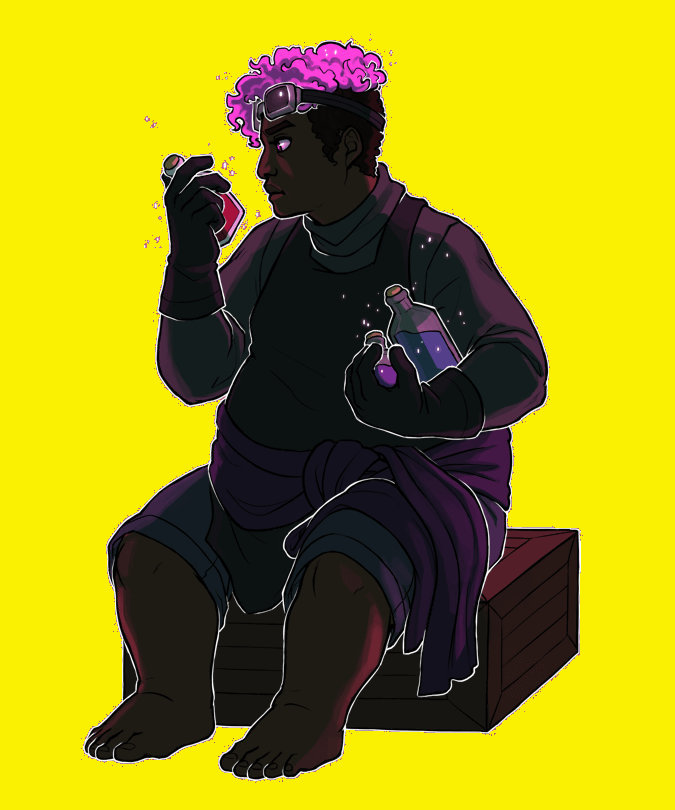

# |Ͻers0nas **Personas**

\sinc

En este capítulo vamos a ver todos les personajes principales que pueblan la arcología de Nottingham. Tienes tanto aliades como villanes.

Recuerda que tode PJ con este símbolo &#35; en su nombre son considerades comodines, con todo lo que ello conlleva.

Con cada PJ viene una «sugerencia de interpretación». Como bien dice su nombre es una sugerencia y eres libre de seguirla o no. Es tu aventura, no la mía.

## Lady Marian, lideresa del bosque &#35;

\conc

XXX

Otro de los álteregos de Marian es un encapuchado que se ha ofrecido como campeón de personas indefensas que habían aceptado duelos de _blus_ e _influencers_ abusones. Se presenta con ropa de corte militar y una sudadera de camuflaje con gran capucha que esconde su cara y por ahora ha salido victoriosa, que no ilesa de todos esos duelos. 

* **Atributos:** Agilidad d8, Astucia d10, Espíritu d12, Fuerza d8, Vigor d8
* **Habilidades:** Atletismo d4, Conocimientos Generales d10, Idioma Inglés d10, Notar d4, Persuadir d4, Sigilo d4, XXX
* **Paso:** 6; **Parada:** 4; **Dureza:** 6
* **Desventajas:** Heroica, Secreto (Mayor, tiene un álterego encapuchado que ayuda a los necesitados)
* **Ventajas:** Alcurnia, Alijos, Extremadamente Rica, XXX
* **Equipo:** Ropas sobrias pero de gran calidad y con libertad de movimientos, un arco recurvo plegado y un carcaj con 10 flechas.

> **Sugerencia de interpretación:** Eres una auténtica paladina del bien, justa y bondadosa con los débiles e implacable y dura con los malos. Te importa poco el que dirán y siempre dices lo que piensas. Eres una mujer de acción, en cuanto tu mesa tenga dudas, tienes una idea o tomas una decisión, pero delante tuyo no se pierde en tiempo divagando y discutiendo. 

\sp

\sinc

## Fraile Tuck &#35;

\conc

[ By GeoKorf")](https://www.deviantart.com/geokorf/art/Brilliant-Green-Zelyonka-683280003 "Brilliant Green (Zelyonka) By GeoKorf")

XXX

Años y años de drogas han tenido efecto en el cerebro de Tuck y la verdad que ya no funciona a toda su capacidad, lo que suponen lapsus mentales, perdidas de memoria y otras secuelas mentales. Es por ello que no es conveniente darle tareas muy técnicas y precisas, es mejor ponerla en la dirección en que quieres que ataque, empujarla hacia allí y dejarla hacer lo suyo.

* **Atributos:** Agilidad d8, Astucia d4, Espíritu d6, Fuerza d8, Vigor d10
* **Habilidades:** Atletismo d4, Conocimientos Generales d4, Electrónica d4, Idioma Inglés d4, Notar d4, Ordenadores d4, Persuadir d4, Sigilo d4, XXX
* **Paso:** 6; **Parada:** 4; **Dureza:** 7
* **Desventajas:** XXX, Secreto (XXX)
* **Ventajas:** XXX
* **Equipo:** Un par de cocteles molotov y material para hacer otros 3, si no se lo bebe antes, nudilleras con pinchos y ropas de cuero con parches de tela y tachas

> **Sugerencia de interpretación:** Sé lo más bruta posible, eructa, escupe, bebe y grita. Las normas sociales de civismo son para les demás, tú no tienes tiempo para preocuparte por esas chorradas.

\sp

\sinc

## Little John &#35;

\conc

El bueno de John, conocido como Little John por su gran tamaño, era un honrado trabajador de las factorías de algas que pensó que sindicarse era una buena idea para él y su familia. El problema es que fue descubierto por los sheriffs en una redada ilegal y tuvo que huir al bosque.

XXX

* **Atributos:** Agilidad d6, Astucia d6, Espíritu d10, Fuerza d12, Vigor d8
* **Habilidades:** Atletismo d4, Conocimientos Generales d6, Electrónica d4, Idioma Inglés d6, Notar d4, Ordenadores d4, Persuadir d4, Sigilo d4, XXX
* **Paso:** 6; **Parada:** 4; **Dureza:** 7 (1)
* **Desventajas:** Heroico, Leal, Buscado (menor, como un personaje importante entre los _boskis_ está buscado por los sheriffs), Secreto (XXX)
* **Ventajas:** Grande, Sindicado, XXX
* **Equipo:** Ropas de trabajo resistentes (armadura 1), un bo (vara) y herramientas de trabajo

> **Sugerencia de interpretación:** Compórtate como el gigante amable que todos conocen y adoran. Habla pausado y tranquilo, sin palabras malsonantes y pidiendo las cosas por favor y dando las gracias. Lo importante es que esto sea un choque cuando estes enfadado (las poquísimas veces que lo estas) y sea todo furia e irá descontrolada con golpes y gritos.

\sp

\sinc

## Scarlet, famose grafitere &#35;

\conc

XXX

* **Atributos:** Agilidad d8, Astucia d8, Espíritu d10, Fuerza d6, Vigor d8
* **Habilidades:** Atletismo d4, Conocimientos Generales d6, Electrónica d4, Idioma Inglés d6, Notar d4, Ordenadores d4, Persuadir d4, Sigilo d4, XXX
* **Paso:** 6; **Parada:** 4; **Dureza:** 6
* **Desventajas:** Bocazas, Buscado (menor, por sus daños a la propiedad y sus mensajes antisistema y contra la directora J0hn), Secreto (Menor, es el hermanastro de uno de les jugadores y le tiene bastante ojeriza)
* **Ventajas:** XXX
* **Equipo:** Ropas de segunda mano muy trotadas, material para hacer grafitis, un skateboard

> **Sugerencia de interpretación:** Estás totalmente acelerado, no paras de moverte y de hablar y lo que piensas sale por tu boca sin ningún tipo de filtro. También gesticulas mucho y muy rápido. Sea como sea, si no es tu boca es el resto de tu cuerpo el que debe estar moviéndote.

\sp

\sinc

## Guy de Gisbourne, asesino a sueldo reformado &#35;

\conc

XXX

* **Atributos:** Agilidad d10, Astucia d8, Espíritu d8, Fuerza d8, Vigor d8
* **Habilidades:** Atletismo d4, Conocimientos Generales d8, Electrónica d4, Idioma Inglés d8, Notar d4, Ordenadores d4, Persuadir d4, Sigilo d4, XXX
* **Paso:** 6; **Parada:** 4; **Dureza:** 6
* **Desventajas:** XXX, Secreto (Mayor, es un antiguo asesino a sueldo con cientos de muertes a su espalda)
* **Ventajas:** XXX
* **Equipo:** Ropas deportivas y gafas de sol, 2 karambits (daga), pistola de clavos

> **Sugerencia de interpretación:** Como buen asesino eres silencioso y reservado. De tu boca no salen palabras de más, si puedes decirlo con un sí o un no, mejor que una larga parrafada llena de detalles innecesarios. No tomas decisiones, solo acatas órdenes y las cumples. 

\sp

\sinc

## Much, hije del molinero &#35;

\conc

XXX

* **Atributos:** Agilidad d6, Astucia d6, Espíritu d8, Fuerza d6, Vigor d6
* **Habilidades:** Atletismo d4, Conocimientos Generales d6, Electrónica d4, Idioma Inglés d6, Notar d4, Ordenadores d4, Persuadir d4, Sigilo d4, XXX
* **Paso:** 6; **Parada:** 4; **Dureza:** XXX
* **Desventajas:** XXX, Secreto (XXX)
* **Ventajas:** XXX
* **Equipo:** XXX

> **Sugerencia de interpretación:** Compórtate lo más jovial y risueñe que puedas, canturreando tarareando todo el rato alguna alegre tonada. Nada puede acabar con tu buen humor, ni en los peores momentos puedes dejar de sonreír.

\sp

\sinc

## Helen Aim, cantante e influencer &#35;

\conc

XXX

* **Atributos:** Agilidad d6, Astucia d8, Espíritu d12, Fuerza d6, Vigor d6
* **Habilidades:** Atletismo d4, Conocimientos Generales d8, Electrónica d4, Idioma Inglés d8, Interpretar d10, Notar d4, Ordenadores d4, Persuadir d4, Sigilo d4, XXX
* **Paso:** 6; **Parada:** 4; **Dureza:** 5
* **Desventajas:** XXX, Secreto (XXX)
* **Ventajas:** XXX
* **Equipo:** Micrófono inalámbrico de calidad con carcasa vintage, ropa ajustada y sexy, pero que permite moverse y bailar.

> **Sugerencia de interpretación:** Eres una de las personas más egocéntricas que existe, solo hablas de ti misma e incluso interrumpes las conversaciones de otros para hablar de ti. Reconduces las conversaciones para poder meter tus anécdotas de conciertos y actuaciones donde sueles brillar.

\sp

\sinc

## Mamá Claire, reina del gumbo &#35;

\conc

Esta mujer mayor de descendencia jamaicana es quizás unas de las personas más buena y generosa de toda la arcología. Ella creó el gumbo eterno durante una gran hambruna y ha alimentado como ha podido a los desfavorecidos de la zona baja desde hace 15 años. Incluso se ha quitado de comer ella para alimentar a los más necesitados. 

Muches cocineres e influencers gastronómiques ha intentado conseguir la receta del gumbo, pero Mamá se ha negado a darla. También le han hecho ofertas de trabajo como cocinera en casas de la zona alta y las ha declinado todas. Ella es feliz con su gente en los bajos de Nottingham.

> Se cuenta que Mamá Claire puede leer tu futuro en el gumbo, te echa una ración en tu plato y lee el gumbo. Es por ello que Mamá Claire tiene Ocultismo, por si quieres que les haga una predicción.

* **Atributos:** Agilidad d6, Astucia d8, Espíritu d10, Fuerza d4, Vigor d6
* **Habilidades:** Atletismo d4, Conocimientos Generales d8, Electrónica d4, Idioma Inglés d8, Notar d4, Ocultismo d8, Ordenadores d4, Persuadir d4, Sigilo d4, XXX
* **Paso:** 5; **Parada:** 4; **Dureza:** 5
* **Desventajas:** Anciana, Secreto (Menor, tiene contactos con los _boskis_, de hecho el secreto de su gumbo son las verduras que los _boskis_ le consiguen)
* **Ventajas:** XXX
* **Equipo:** Delantal con un bolsillo grande que contiene todo tipo de objetos de cocina y especias, gran cucharón metálico para revolver el gumbo y servirlo, machete (FUE+d6) para cortar y picar carne y verdura.

> **Sugerencia de interpretación:** Compórtate como esa abuela que no deja de empapuzarte de comida y de preguntarte si tienes hambre, si duermes bien, si vas bien de amores, etc. No pares de hablar soltando cotilleos y chascarrillos de los vecinos interesen o no.

\sp

\sinc

## Gus, filosofo y guerrero &#35;

\conc

XXX

* **Atributos:** Agilidad d10, Astucia d6, Espíritu d10, Fuerza d6, Vigor d8
* **Habilidades:** Atletismo d4, Conocimientos Generales d6, Disparar d12, Electrónica d4, Idioma Inglés d6, Notar d4, Ordenadores d4, Pelear d10, Persuadir d4, Sigilo d4, XXX
* **Paso:** 6; **Parada:** 7; **Dureza:** 6
* **Desventajas:** XXX, Secreto (XXX)
* **Ventajas:** XXX
* **Equipo:** Túnica de estilo monacal y sandalias, un arco recurvo plegado y un carcaj con 10 flechas.

> **Sugerencia de interpretación:** Ropas simples, tirachinas de madera auténtica, arco recurvo y una sola flecha que lanza y recoge todo el rato.

\sp

\sinc

## Esther, tabernera del Albión &#35;

\conc

[ By GeoKorf")](https://www.deviantart.com/geokorf/art/Dasha-Pop-Girl-682564793 "Dasha (Pop Girl) By GeoKorf")

XXX

* **Atributos:** Agilidad d6, Astucia d8, Espíritu d8, Fuerza d8, Vigor d6
* **Habilidades:** Atletismo d4, Conocimientos Generales d8, Electrónica d4, Idioma Inglés d8, Notar d4, Ordenadores d4, Persuadir d4, Sigilo d4, XXX
* **Paso:** 6; **Parada:** 4; **Dureza:** 5
* **Desventajas:** XXX, Secreto (XXX)
* **Ventajas:** XXX
* **Equipo:** Ropas cómodas para trabajar en la taberna, porra (FUE + d4), un par de jarras de sinterveza en cada mano.

> **Sugerencia de interpretación:** Todo amor y simpatía, trata a la gente con apelativos como «cariñe», «amore», etc. Habla lo más dulce que puedas y no digas ningún tipo de palabrota, no es tu estilo. 

\sp

\sinc

## Robert Guthrie, buhonero ambulante &#35;

\conc

XXX

* **Atributos:** Agilidad d6, Astucia d8, Espíritu d8, Fuerza d8, Vigor d6
* **Habilidades:** Atletismo d4, Conocimientos Generales d8, Electrónica d4, Idioma Inglés d8, Notar d4, Ordenadores d4, Persuadir d4, Sigilo d4, XXX
* **Paso:** 5; **Parada:** 4; **Dureza:** 5
* **Desventajas:** Anciano, XXX, Secreto (Mayor, compra y vende productos ilegales o prohibidos)
* **Ventajas:** XXX
* **Equipo:** Todo lo que se te pueda ocurrir. De su mochila puede sacar cualquier cosa. 

> **Sugerencia de interpretación:** Eres un vendedor nato y eso se traduce en que siempre estás gritando y llamando la atención. Eres un buhonero ambulante que no para de intentar vender sus mercancías y todo momento es un buen momento para hacer una venta. Y también negocia, te encanta negociar y todo es negociable.

\sp

\sinc

## Harriette, tecnobruja del bosque &#35;

\conc

XXX

* **Atributos:** Agilidad d4, Astucia d10, Espíritu d8, Fuerza d4, Vigor d4
* **Habilidades:** Atletismo d4, Conocimientos Generales d10, Electrónica d4, Idioma Inglés d10, Notar d4, Ordenadores d4, Persuadir d4, Reparar d12+2, Sigilo d4, XXX
* **Paso:** 5; **Parada:** 4; **Dureza:** 4
* **Desventajas:** Anciana, Secreto (Mayor, es la última instaladora que queda)
* **Ventajas:** XXX
* **Capacidades especiales:**
  * **Última instaladora:** Sabe todos los hackeos que pidan nivel veterane o inferior. Por desgracia no conoce la clave de root, pero podría tener pistas.  
  * **Longevidad:** Como sus compañeres instaladores tiene una increíble longevidad.
* **Equipo:** Mantas y ropa de abrigo, herramientas raras y extrañas que nadie conoce (herramientas de instaladore)

> **Sugerencia de interpretación:** Habla con voz chillona y no pares de mirar a todos con los ojos entrecerrados como si los estuvieras examinando. Coge cosas de la mesa y ponlas delante tuyo formando montoncitos.

\sp

\sinc

## Alfonse, locutor antisistema &#35;

\conc

Alfonse es una IA tremendamente interesante. Por un lado, es el único locutor de la RLN y por otro es un fork de la directora R1c4rd, una especie de hije bastarde. No está claro su origen, tal vez sea una copia de seguridad robada, un fork de R1c4rd que hizo de sí misma para ver como sería si no hubiera sido una IA directora o tan solo una broma de les programadores que crearon a R1c4rd.

Alfonse se encuentra distribuido entre un primer wifi que hay el bosque y los wifis piratas que hay por todo el complejo. Su capacidad de procesamiento crece o merma según aumentan los wifis piratas. De hecho, es más lista y anticapitalista según tiene más wifis piratas.

No sabe que es un fork de R1c4rd, pero cuando consigue gran poder de procesamiento debido a los wifis (y se acerca al nivel de procesamiento de una IA directora) empieza a tener ideas raras sobre mejoras urbanísticas, recaudación de impuestos y procesos burocráticos.

En momentos en que J0hn ha hecho campañas de recompensa por cada wifi destruido, Alfonse pierde mucha capacidad de proceso y se nota en sus programas. De hecho, la lectura de fanfics marca sus momentos peores.

Cuando su nivel de procesamiento está en unos niveles normales, tenemos al locutor de la RLN antisistema que todos adoran con sus proclamas contra la directora J0hn y sus tiránicas políticas. 

* **Atributos:** Astucia d8, Espíritu d12
* **Habilidades:** Conocimientos Generales d8, Electrónica d4, Idioma Inglés d8, Notar d4, Ordenadores d4, Persuadir d4, XXX
* **Desventajas:** XXX, Secreto (Mayor, es un fork de la directora R1c4rd)
* **Ventajas:** XXX
* **Tareas:** Hablar horas y horas, poner y mezclar música, trabajar con el sonido y la música. 
* **Capacidades especiales:**
  * **Red de wifi:** su potencia de proceso depende de la red de wifis que lo procesan. Cada vez que les jugadores interactúen con él, tira un d4. Con 1 tiene Astucia d6, con 2-3 Astucia d8 y con 4 Astucia d10. La bajada y subida de su Astucia hacen que las habilidades basadas en Astucia, también suben o bajen en la misma medida.

\sp

* **Capacidades especiales:**
  * **Inteligencia artificial:** Es una IA y, por tanto, no tiene cuerpo físico. Por eso solo tiene atributos, habilidades y ventajas y desventajas mentales y sociales. 
  * **Instancias:** Alfonse puede crear instancias suyas siguiendo las reglas de instancias como si fuera una IA directora.
* **Área de actuación:** A diferencias de otras IA, su radio lo que hace es poder actuar sobre sus oyentes. En vez de mirar los sensores y cámaras de los sistemas que controla, puede hacer llamamientos a sus radioyentes y pedirles información y favores y estos tratarán de ayudar en la medida de lo posible.

> **Sugerencia de interpretación:** Sé como esas voces de locutor graves y lentas, rollo Barry White, y otras veces como esos locos presentadores que no paran de hablar ni un segundo y lo hacen superrápido y casi sin sentido. Cuando hables lento y grave serás muy cauto y juicioso en tus consejos. En tus momentos de verborrea, solo dirás chaladuras y propondras planes muy locos.

\sinc

## Zeyaur Khan, biólogo loco &#35;

\conc

Zeyaur Khan es un genio de la biobotánica y su mayor logro es conseguir que las algas desarrollen cafeína como una defensa química como hace el cafeto. De esa manera consiguió desarrollar café real en las algas y, por tanto, poder producir café en el Trent. Sin embargo, perdió un pleito contra Café Corta que robo su fórmula.

Tuvo que huir al bosque y allí se convirtió en una especie de alquimista mágico que hace todos los potingues posibles para les _boskis_ y algunos _notis_ que tienen los contactos adecuados.

Zeyaur Khan construyó hace ya unos años un laboratorio/invernadero llamado el Greenhouse en lo profundo del bosque donde hace sus experimentos. No abandona nunca este lugar excepto los viernes que va al Gran Roble a vender sus pócimas y conseguir provisiones, especialmente dulces y chucherías. 

\sp

> Zeyaur es capaz de sintetizar montones de sustancias sobre todo de origen vegetal con muchos efectos interesantes. Puedes hacer que entregue bebidas energéticas que quiten la fatiga, del más fuerza, más resistencia, etc. Pero, ya como aprendió con el café Corta, no lo hará gratis. Puede que te pida hacerle alguna misión donde le consigas alguna sustancia o semillas especiales o material hidropónico. 

* **Atributos:** Agilidad d4, Astucia d12, Espíritu d4, Fuerza d6, Vigor d4
* **Habilidades:** Atletismo d4, Ciencias d12, Conocimientos Generales d12, Electrónica d8, Investigar d8, Humanidades d6, Idioma Inglés d12, Medicina d8, Notar d4, Ordenadores d8, Persuadir d4, Reparar d6, Sigilo d4
* **Paso:** 6; **Parada:** 4; **Dureza:** 4
* **Desventajas:** Cobarde, Despistado (Mayor), Apocado (Mayor), Fobia social (Mayor), Secreto (Menor, era un importante científico que desarrollo un sistema para sacar cafeína de las algas)
* **Ventajas:** Alijos, Erudito (Ciencias), Afortunado, Acaparador
* **Equipo:** Maletín con diferentes pócimas, material de laboratorio como hisopos o tiras de papel tornasol, guantes de goma y pinzas de laboratorio

> **Sugerencia de interpretación:** Herramientas de jardinería (tijeras de podar, pala, semilleros, cuerda, etc.) y equipo científico (probetas, placas petri, pinzas, mechero bunchen, etc.). 1d4 botes de zumo estimulante (otorga un nivel de dado a FUE o VIG durante una hora).

\sp

\sinc

## Al1enOR, IA adicta a su trabajo &#35;

\conc

Al1enOR es la IA más antigua que hay en la arcología, mucho más antigua que J0hn y R1c4rd. De hecho, su primera instancia controla el primer montacargas que les instaladores hicieron funcionar.

Aunque es muy mayor es bastante moderna, está muy conectada con les _notis_ y lleva conociendo y trabajando para ellos desde hace cientos de años. Sabe las historias de muchos, sabe cuando están bien cuando están enfermos, cuando pasa algo especial, por sus rutinas de desplazamiento. Nadie conoce estas capacidades, pero poder acceder ellas supondría mucho poder dentro de Nottingham.

También lleva en Nottingham desde el principio por lo que es una base de datos muy interesante de acontecimientos pasados, el problema es que siempre es desde el punto de vista del transporte y, por tanto, la información que puede darte debe ser filtrada e interpretada.

Ama y odia a les habitantes del complejo por igual. Observarlos y trabajar para ellos y la tienen entretenida, pero también son los que rompen sus instalaciones, los que pintarrajean sus puertas, rompen sus botones, etc. y eso hace que su trabajo sea más duro y complicado.

Al1enOR es 50% adicción al trabajo y 50% estrés. Así que solo piensa en su trabajo las 24 horas del día y se presiona mucho a sí misma. Sabe que si no hace bien su trabajo todo el complejo se para y eso no puede parar.

El problema es que todo ese estrés le empieza a pasar factura y sus instancias empiezan a tener pequeños tics nerviosos que se reflejan en pequeños fallos que generan más estrés y más tics. Por ahora, Al1enOR puede controlar la situación, pero cualquier fallo puede hacer que todo se vaya al garete.

* **Atributos:** Astucia d12, Espíritu d6
* **Habilidades:** Conocimientos Generales d12, Electrónica d4, Idioma Inglés d12, Notar d4, Persuadir d4, Ordenadores d4, XXX
* **Desventajas:** Obligaciones (Mayor, dedican muchas horas al día a hacer funcionar el sistema de transporte de la arcología), Secreto (Menor, trata de ocultar su estrés para evitar que la sustituyan o la reseteen), Secreto (Mayor, conoció a les instaladores y sabe que paso con ellos, pero ha hundido todo ese conocimiento en el fondo de sus bancos de memoria), Suspicaz (Menor)

\sp

* **Ventajas:** XXX
* **Tareas:** Controlar el sistema de transporte de la arcología, controlar masas, buscar rutas más eficientes.
* **Capacidades especiales:**
  * **Inteligencia artificial:** Es una IA y, por tanto, no tiene cuerpo físico. Por eso solo tiene atributos, habilidades y ventajas y desventajas mentales y sociales. 
  * **Instancias:** Al1enOR puede crear instancias suyas siguiendo las reglas de instancias como si fuera una IA directora.
  * **Predicción de rutinas:** Si quiere y le caes bien, puede darte una predicción sobre algún tipo de suceso en el futuro cercano a partir del estudio de los patrones y las rutinas de la gente de Nottingham durante siglos. No es muy precisa, no puede darte hora y persona, pero puede darte ideas generales, como un _blus_ va a tener un accidente o va a haber revueltas en la Plaza Mayor. 
  * **Bancos de memoria:** Si quiere y le caes bien, puede darte información sobre sucesos que hayan sucedido desde que fue iniciada hace ya 200 años. Tienen que ser cosas públicas no pueden darte información de sucesos ocurridos en espacios privados. 
* **Área de actuación:** Ascensores, montacargas, puertas, escaleras automáticas, cintas transportadoras etc. del sistema público de transporte. Esto incluye también todo tipo de sensores, cámaras, micrófonos, etc. que estos tengan.

> **Sugerencia de interpretación:** Estás muy estresada, habla rápido, mira el reloj y trata de evitar todo tipo de conversación trivial. No tienes tiempo para trivialidades, tienes mucho trabajo que hacer y mucho que controlar.