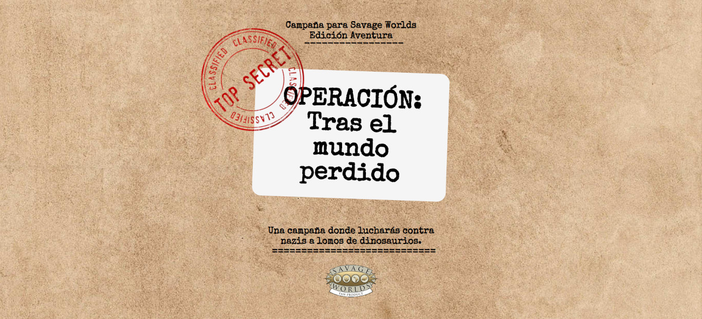

# 3|Ͻíl0go **Epílogo**

## Notas del autor

Seguramente nadie llegue a leer este apartado, pero aquí os dejo información, ideas y consejos sobre esta ambientación que os podrán ser de ayuda.

### Define los velos y herramientas de seguridad

> Antes de iniciar la aventura, todos los miembros de la mesa debéis definir las herramientas de seguridad que queráis utilizar y los temas o escenas que deben evitarse durante la partida para que nadie se sienta incómodo durante la sesión de juego. Podéis escoger los elementos que no queráis incluir durante la partida previamente o podéis utilizar un mecanismo de seguridad cuando estos aparezcan.
> No importa cuál sea la herramienta de seguridad o el tipo de mecanismo utilicéis, pero es importante recordad que el rol es un juego y todos deben pasarlo bien. En caso de que consideréis entre todos que no necesitáis una herramienta de seguridad tampoco pasa nada, pero en ese caso es necesario que el director de juego se asegure de forma más activa de que ningún miembro de la mesa se sienta incómodo o lo esté pasando mal.
> **Por:** [FaustoRolero](https://twitter.com/FaustoRolero)

Aquí tienes algunas herramientas de seguridad que puedes usar: [DEVIR](https://devir.es/herramientas-seguridad-rol) y [NetCon](https://www.netconplay.com/guia-de-buenas-practicas/herramientas-en-la-mesa/)

### Relaciones sexo-afectivas

Las vidas sentimentales y sexuales de les personajes de esta ambientación han sido dejadas a propósito sin definir para que las adaptes como más te interese.

Así que cualquier persona de tu mesa podrá «romancear» con cualquier PNJ que encuentres aquí.

Recuerda también que en los pocos casos en se habla de familia, no se especifica a propósito cómo es y quiénes la componen. Móntate las relaciones sexo-afectivas y familiares que mejor se ajusten a tus gustos y los de tu mesa y con las que todos os encontréis cómodos.

### Lenguaje inclusivo

La principal razón de usar lenguaje inclusivo en este documento es porque no me gusta dejar a nadie fuera y si eso lo consigo usando el género neutro con «e» pues perfecto. Aparte, considero que es algo que pega dentro de una ambientación ciberpunk, así que con más razón.

Las lenguas evolucionan y en 200 años en el futuro porque no iba a haberse impuesto una lengua más inclusiva. De hecho, os invito a interpretar vuestres PJ usando el género neutro. Creo que puede ser divertido y darle un punto diferente a las aventuras.

Vale, he mentido. Sí quiero dejar fuera a alguien, a la gente que le molesta el lenguaje inclusivo. Espero que os escueza cada «e» y no paséis de la primera página. Sinceramente, no os quiero ni en mi juego ni en mi mesa. 

### ¿Por qué Savage Worlds?

Simplemente, porque me encanta Savage Worlds, es uno de los sistemas genéricos de juegos de rol con el que más cómodo me siento.

\sp

Si voy a meterle muchas horas a esta ambientación quiero hacerlo con un RPG que me sea fácil y familiar.

### Participar en el proyecto

Si te gusta el proyecto, quieres participar y sabes de Git, puedes hacerlo a través de GitHub en este [proyecto](|GITHUB|). Si no estás familiarizado con Git, pues me mandas un DM en BlueSky a [@Gwannon](https://gwannon.com) y hablamos.

### Si eres un fascista, háztelo mirar

Estas palabras de Sirio Sesenra me representan y por eso las transcribo aquí.

> Si eres una persona fascista, homófoba, lesbófoba, tránsfoba o racista te suplico que dejes este libro en el primer lugar que encuentres a mano y te vayas a buscar alguna consulta psicológica donde te ayuden a ser buena persona, alejándote del rol hasta lograr ese objetivo. **> **Por:** [Sirio Sesenra](https://bsky.app/profile/ssesenra.bsky.social) - Técnicas, consejos y trucos para jugar a rol 

\sc

## Glosario de términos

Aquí tienes un listado de términos especiales usados en esta ambientación.

* **Blus:** altes ejecutives de la compañía y de otras empresas menores que controlan con sus decisiones las vidas de la mayoría de les curris.
* **Boskis:** habitantes del bosque que están fuera de la ley.
* **Cuchi:** un tipo de sushi.
* **Curris:** la clase trabajadora de Nottingham.
* **Fork:** copia de un software a partir de la cual se empieza a desarrollar nuevo software normalmente con capacidades diferentes del original.
* **Glitch de la mañana:** amanecer
* **Glitch de la noche:** anochecer
* **Notis:** ciudadanes que viven en la arcología Nottingham.
* **Superusuarie:** también llamado _root_, se refiere en un sistema informático a le usuarie más poderose con capacidades especiales.

## Agradecimientos

Agradecimientos a todas estas personas que me han dado su opinión y han contestado mis preguntas en diferentes redes.

* [Asaltadoras del Rol](https://bsky.app/profile/cuchi.bsky.social)
* [José Sku](https://bsky.app/profile/sku-jose.bsky.social)
* [Ramón Corominas](https://mastorol.es/@tinitun@mstdn.social)
* [Trono Rolera](https://bsky.app/profile/tronorolera.bsky.social)

\sp

## Atribuciones

Como proyecto Creative Commons pasamos a atribuir todo el contenido de terceros que hay en este documento.

### Fuentes

The FontStruction [“Medieval Pixel”](https://fontstruct.com/fontstructions/show/640368) by “Goatmeal” is licensed under a [Creative Commons Attribution Non-commercial No Derivatives license](http://creativecommons.org/licenses/by-nc-nd/3.0/).

### Imágenes

No soy propietario de ninguna de las imágenes de este documento. Estoy usando imágenes con licencia CC y atribuyéndola a su propietario. Si hay algún error, hacédmelo saber para corregirlo.

* [Portada del libro por macrovector_official](https://www.freepik.com/free-vector/computer-circuit-board-tree-creative-electronics-concept-poster-vector-illustration_4348098.htm) en Freepik
* [Silueta arquere encapuchade por Majal Jubanic](https://majaljubanic.com/robin-hood-poster)
* [Contraportada del libro por Harryarts](https://www.freepik.com/free-vector/white-background-circuit-design_958585.htm) en Freepik
* [Portada 4rc0l061a de Nottingham por starline](https://www.freepik.es/vector-gratis/fondo-3d-abstracto-blanco-negro-hexagonal_5432173.htm) en Freepik
* [Portada Historia](https://www.deviantart.com/madragonn/art/Futuristic-Circuit-Texture-138882737) Futuristic Circuit Texture By [madragonn](https://www.deviantart.com/madragonn/) Creative Commons Attribution 3.0 License
* [Portada Cibernia por pvproductions](https://www.freepik.com/free-photo/background-with-printed-circuit-board-concept-modern-technologies_366211129.htm) en Freepik
* [Portada Directorio por starline](https://www.freepik.es/vector-gratis/fondo-pixeles-moderno-estilo-efecto-degradado_9874863.htm) en Freepik
* [Portada Bestiario por malikadesign](https://www.freepik.es/vector-gratis/cartel-futurista-retro-cyberpunk-ilustracion-vectorial_30526493.htm) en Freepik

\sc

* [Portada Personas por Freepik](https://www.freepik.com/free-vector/abstract-green-pixel-rain-background_6082050.htm) en Freepik
* [Portada Epílogo](https://www.deviantart.com/phracker/art/Edge-Noise-924955740) Edge Noise By [Phracker](https://www.deviantart.com/phracker/) Creative Commons Attribution-NonCommercial 3.0 License

\sp

\sinc

## Otros proyectos que te pueden interesar

Si os ha gustado esta ambientación podéis probar otros de mis proyectos para Savage Worlds. Animaros y dadles un poco de cariño. Recordad que para poder jugarlas necesitaréis el Manual Básico de Savage Worlds Edición Aventura.

**[OPERACIÓN: Tras el mundo perdido - Una campaña donde lucharás contra nazis a lomos de dinosaurios.](https://mundoperdido.gwannon.com/pdf/)**

\conc

**[¡Arrr! Cthulhu: Aventuras de piratas en el Caribe de los Mitos de Cthulhu](https://arrrcthulhu.com/pdf/)**

**[Mil y Un Ghūles: Aventuras de horror cósmico en los cuentos de las Mil y Una Noches](https://1001ghules.gwannon.com/pdf/)**

\sp

&nbsp;