# 4rc0l061a de Nottingham **La arcología de Nottingham**

Bosque Sh3rW00d es una ambientación Ciberpunk para Savage Worlds en un mundo extrañamente parecido a las historias de Robin Hood.

Formarás parte de un grupo de descastades que sobreviven ocultos en el megacomplejo Nottingham. Lucharás por tu supervivencia y tu libertad contra la directora J0hn, una malvada IA que está a cargo del complejo.

J0hn rige Nottingham siguiendo unos protocolos que buscan maximizar los beneficios para la compañía sin importar lo que les pase a los habitantes del complejo. Todos recuerdan a la antigua, legítima y benevolente directora R1c4rd y esperan su regreso del proyecto del departamento de armamentística a la que fue asignada por la compañía. 

Arrambla con equipo y materiales, libera a cautives, haz pintadas contra la directora J0hn, haz duelos sobre el Trent, escapa de los sheriffs de Nottingham, bátete en duelo contra pintoresques personajes, … 

Pero recuerda, lo más importante es **robar a les riques para repartirlo entre les más pobres**.

## El mundo actual

```
Bosque Sh3rW00d te ofrece una ambientación ciberpunk, ultima tecnología en un mundo roto donde unes poques explotan a muches, mezclada con muchos elementos genéricos de la Edad Media.
```

En estas aventuras **tu mesa tomará el papel de proscrites y bandides de buen corazón** y que creen más en la justicia que la ley. Y es por eso roban a les riques para dárselos a les pobres.

### Nottingham

Nottingham es una gigantesca arcología donde viven cientos de miles de personas, creada hace más de 2 siglos por la compañía para sus empleades. Aunque, a priori pueda parecer un lugar donde vivir y trabajar, es más bien una inmensa máquina donde la compañía exprime todo lo que puede a sus habitantes.

Nottingham está en decadencia, tanto estructural, como económica y social. Estructuralmente, porque lleva siglos sin un mantenimiento adecuado, además de no haber sido rematado adecuadamente. Económicamente, porque ha perdido capacidad de producción, principalmente de comida en las piscifactorías del Trent. Por último, socialmente, ya que está al borde de la rebelión.

### El bosque de Sh3rW00d

El bosque, cuyo primer sector tiene el código Sh3rW00d, es la parte de la arcología que no se llegó a terminar. Se le llama el bosque porque la zona está compuesta con salas y salas llenas de miles y miles de columnas sin nada más. También dejaron vigas, las tuberías de agua, luz y datos, pero sin estar rematados.

[](https://www.freepik.com/free-photo/pulsating-neon-lines-darkness-abstract-purple-light_423230986.htm "Pulsating neon lines in darkness abstract purple light by pvproductions")

Las columnas de color marrón parecen los troncos de árboles y nanitos de construcción han ido creando sobre ellos y resto de elementos extrañas estructuras de material orgánico que le dan aún más aspecto vegetal. 

XXX

### Las directoras

Las directoras son potentes IA que controlan Nottingham y tratan de que todo sea lo más beneficioso económicamente hablando para la compañía. Las diferencias claras entre ellas es como consideran cuál es la forma más óptima de maximizar los beneficio para la empresa.

Nottingham ha tenido dos IA directoras desde su creación, R1c4rd y J0hn, y sus «reinados» han sido totalmente diferentes.

XXX

Hay una tercera IA que no es directora, pero casi, que es Al1enOR. Al1enOR fue la IA más potente en los primeros días de Nottingham cuando todavía no había habitantes en Nottingham. Durante unos años mientras les instaladores montaban todas las estructuras básicas, era la IA que controlaba uno de los pocos sistemas que funciona y el más importante de la arcología, el sistema de transporte (escaleras, puertas, ascensores, montacargas, etc.). 

#### Directora J0hn y sus sheriffs

XXX

#### Directora R1c4rd

La directora R1c4rd es la anterior IA de Nottingham que fue trasladada al departamento de armamentística de la compañía. Se dice que era, a diferencia de la directora J0hn, justa y magnánima con les _notis_. Se recuerda con cariño los años de dirección de R1c4rd y se sueña con su regreso cuando ya no sea necesaria en el departamento bélico de la compañía.

XXX

## Orden social

```
Las gentes que viven en Nottingham son conocidas como _notis_ (un gentilicio abreviado usado por las clases bajas). El complejo de Nottingham se rige por un sistema neofeudal, una versión ciberpunk del sistema feudal del siglo XII.
```

La sociedad de la arcología de Nottingham **está dividida en 3 clases sociales estancas**; Blus, que vendrían a ser la Nobleza del viejo sistema, Influencers, como Iglesia, y Curris, como el campesinado. Por encima de todos elles, está la compañía que rige los destino de todes, el presunto de Dios, y la IA directora que rige el complejo por designio de la compañía como si de una reina se tratara.  

[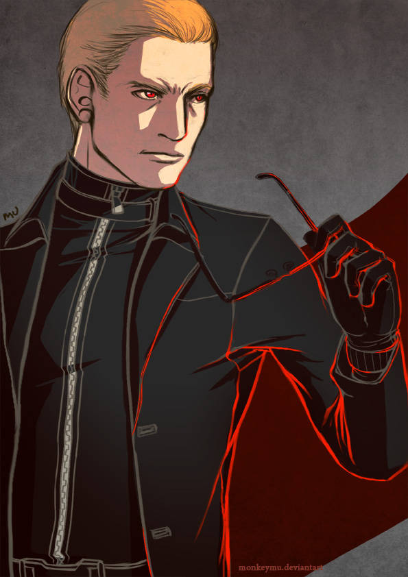](https://www.deviantart.com/monkeymu/art/Wesker-300376367 "Wesker By MonkeyMu")

### Blus (Nobleza)

El término _blus_ viene de «blue», azul. Los _blus_ eran trabajadores de alto nivel de la compañía que solían llevar el azul corporativo de la compañía frente a los marrones de los trabajadores de bajo nivel. Hoy en día se distinguen por sus trajes caros con tejidos ablativos que sobresalen sobre los viejos y remendados trapos que llevan muchos de les currelas.

Los blus son principalmente personal directivo de la compañía que se encarga de dar forma y ejecutar las órdenes de las directoras a través de sus puestos directivos en las diferentes industrias del complejo. Cobran mucho y viven en la zona alta en grandes espacios. No suelen mezclarse con el resto de _notis_, de hecho sus relaciones suelen ser muy endogámicas.

Desde pequeño se les educa para ser blus. De hecho, normalmente heredan el puesto de sus progenitores, ya que J0hn considera que en cierta medida algo genético y educativo en ello. Un blus debe salir de familias de blus y ser educado desde la cuna como blus por otros blus.

Su principal problema es que la mayoría nunca han pisado la zona de baja de la ciudad, solo conocen la vida en las zonas altas, viven en su torre de marfil. Solo algunos se atreven a pisar los sucios callejones de las zonas más pobres del complejo como Lady Marian.

Hay una especie de _blus_ menores, más cercanos a los _curris_, pero muchas veces igual de clasistas o más. 

Son personas que ocupan cargos intermedios en la compañía o tienen negocios florecientes que la compañía todavía no ha absorbido. Muchos de ellos son trepas esperando a su oportunidad para convertirse en grandes _blus_ y, por supuesto, harán lo que sea por ascender socialmente. Cuando decimos lo que sea, es lo que sea, engañar, intimidar, amenazar, falsificar pruebas, falso testimonio, etc.

[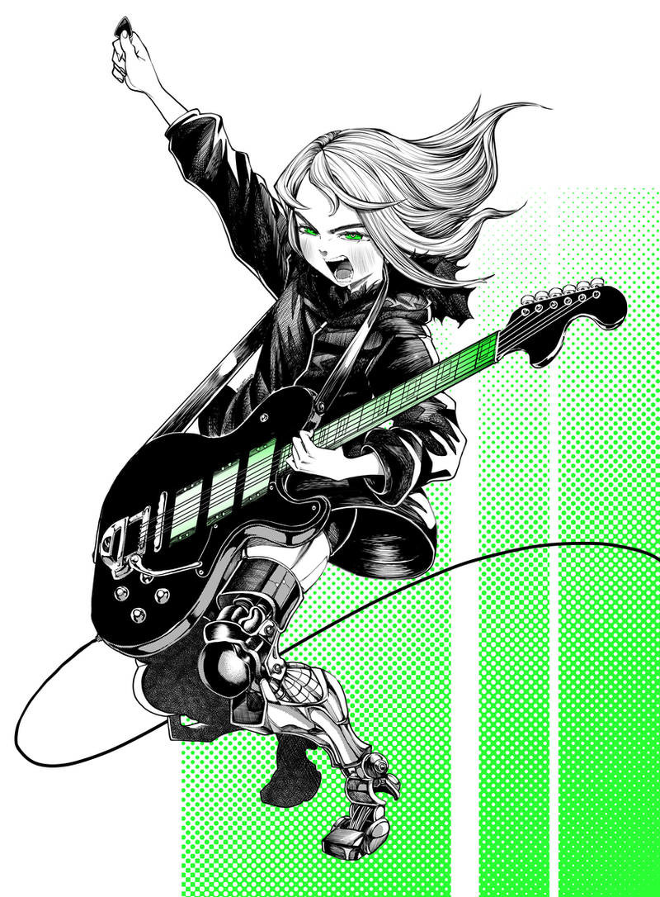](https://www.deviantart.com/gigiedt/art/Guitable-856195073 "Guitable By gigiEDT")

### Influencers (Iglesia)

Dentro del sistema neofeudal que rige la arcología, hay un grupo de Influencers adictos a la directora J0hn que marcan la vida de los _notis_. 

Ellos establecen las modas, lo que es _cool_ y lo que no, lo que se debe hacer y lo que no y, al final, lo que está bien y lo que está mal.

Además, señalan a los disidentes y los excluyen socialmente, de manera que sus acciones y proclamas contra el sistema son muchas veces rechazadas, desacreditadas y olvidadas.

También son usados como una forma de ocultar los fallos y errores de la compañía, desviando la opinión pública hacia temas intrascendentes y vacuos.

Aunque muchos de les _influencers_ se nombran a sí mismos como creadores de muchas de las modas del complejo, lo normal es que en realidad copien esos movimientos estéticos y ridiculicen a aquellos que tratan de demostrar el origen real de esas modas.

### Curris (Campesinado)

Les _curris_, casi lo más bajo de la pirámide social de Nottingham, son explotades por la compañía, la directora J0hn y sus _blus_ y ridiculizades y manipulades por _influencers_ para que sigan con sus denigrantes y anodinas vidas día tras día. 

[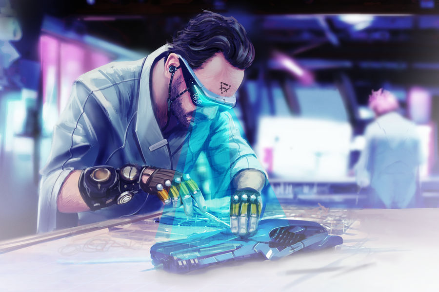](https://www.deviantart.com/igor-esaulov/art/Maintenance-EotV-Art-677171384 "Maintenance EotV Art By Igor-Esaulov")

Si solo se dedican a trabajar sin levantar la cabeza, solo les espera miseria y desesperación. 

Si intentan luchar por sus derechos y por mejoras sociales, son apaleados sin piedad por los sheriffs y encerrados. Al final mucho terminan cayendo al otro lado de la ley y buscando una nueva oportunidad en el bosque como proscrites.

### Boskis (Fuera de la ley)

Siempre que hay un sistema hay gente que se queda fuera o prefiere salirse. Estos son les _boskis_, les proscrites fuera de la ley que viven en el Bosque de Sh3rW00d.

Aunque la inmensa mayoría de los _boskis_ son de origen humilde y de bajos estratos sociales, principalmente _curris_, también puedes _blus_ e _influencers_ caídes en desgracia.

Podemos tener boskis de primera generación, es decir que nacieron en el complejo (y tienen un insertado en su cuerpo un HUB de conexión) o de segunda generación, conocidos como nacides libres, porque nacieron en el bosque no tienen el HUB de conexión.

Los _boskis_ tienen un dicho que explica su forma de pensar _En el bosque tienes tu propio nombre, pero no es solo tuyo._

### La compañía y la IA directora (Monarquía)

Como ya hemos dicho, por encima de todos los grupos anteriores, incluso los _boskis_, está la compañía que rige los destino de todes elles y la IA directora que rige el complejo por designio de la compañía como si de una reina se tratara. 

La compañía es un ente abstracto en esta ambientación que no tiene ni nombre, pero que puedes llamarla como quieras. Todo es de la compañía, todo lo decide la compañía y todo está pensado para conseguir beneficio para la compañía. 

La mano ejecutora de la compañía es la IA directora. J0hn, la actual IA directora, toma todas sus decisiones teniendo en mente esta simple regla «No importa la gente, solo los beneficios de la compañía».

## Comercio e industria

```
Aunque Nottingham se considera una arcología donde viven cientos de miles de personas, en realidad es una megafactoria en la que trabajan cientos de miles de personas.
```

Todo en el complejo está pensado para producir beneficios para la compañía y mientras que las decisiones de la directora R1c4rd tenían una visión social, J0hn ha abandonado esa línea de acción y solo piensa en la producción y los beneficios.

### Formas de pago

La moneda oficial es el crédito de la compañía, aunque no existe moneda física de ella. Todo son transacciones electrónicas a través del sistema monetario de la empresa. Así que se ha impuesto el trueque tanto de productos como de servicios cuando se quieren hacer actividades por debajo del radar de la Directora J0hn.

#### Trueque

El hecho de que la directora R1c4rd controle toda la economía de Nottingham ha hecho que florezca una economía sumergida y circular basada en el trueque de productos y el intercambio de trabajo.

Los truques van desde cosas muy simples y del día a día como «tú arreglas el grifo de mi cubículo, yo te doy dos botes de mi salsa barbacoa casera» a trueques más complejos que incluso incluyen pagarés en papel (para no quedar registrados electrónicamente). Es curioso porque esos pagarés se han convertido en una especie de papel moneda que no se cobran, sino que se intercambian una y otra vez y varían de valor según las circunstancias y lo que ofrezca el pagaré.

### Minifábricas y algafactorías

La industria se basa en dos elementos claves, minifábricas y algafactorías. Existen en el complejo miles de minifábricas donde se transforma materia prima en piezas o piezas en piezas más complejas o finalmente productos completos. Estas minifábricas son talleres de 5/6 trabajadores propiedad de algune _curri_ con más dinero o de _blus_ que tienen negocios paralelos a su trabajo para la compañía.

La compañía trae materia prima que va vendiendo a las minifábricas que a su vez venden a otras minifábricas y estas otras a otras más hasta tener todo tipo de productos. En ese momento, la compañía vuelve a comprar los productos finales para exportarlos fuera de la arcología, menos la parte que se consigue vender a los propios _notis_. 

> La compañía controla el mercado controlando el precio de venta de las materias primas y el precio de compra del producto final. La directora J0hn, siguiendo las órdenes de la compañía, puede manejar el mercado a su gusto y repartir riqueza entre los _notis_ o hacer que caigan en la miseria. 

La otra base de la industria es la megafactoría del Trent (propiedad de la compañía), que convierte las algas en todo tipo de alimentos procesados para consumo de los _notis_ y para exportar. La factoría del Trent con toda su industria asociada genera la mitad de la riqueza del complejo.

Dos tercios de la población de _curris_ trabaja en las algafactorías o en los talleres de las minifábricas. El resto trabajan en hostelería y servicios, casi siempre al servicio de otros. Hay casos de _curris_ con su propio negocio, pero son les minimes y normalmente en graves problemas económicos. Eso supone que acaban currando para la compañía, en la cárcel o huyendo al bosque.

[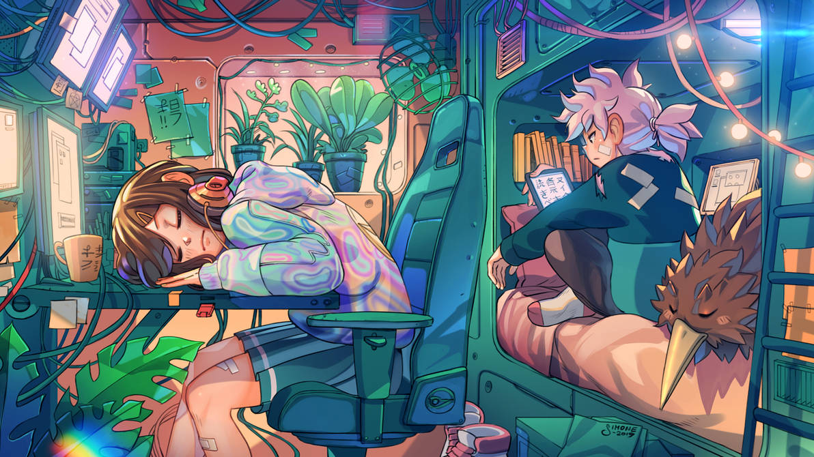](https://www.deviantart.com/simoneferriero/art/Sleepy-Time-800832062 "Sleepy Time By simoneferriero")

### Teletrabajo

Todo trabajo sin componente físico o manual o que exija equipo especial (como equipo de laboratorio) se realiza por teletrabajo. Los sistemas de vigilancia y control de los trabajadores que la compañía y sus subcontratas pueden aplicar son tan precisas e intrusivas que prefieren que sus trabajadores lo hagan desde casa.

En vez de oficinas físicas, existen oficinas virtuales que simulan el ambiente de una oficina, aunque no sean reproducciones virtuales de mucha calidad para abaratar costes. Desde casa te colocas en tu unidad de trabajo con tus gafas de realidad virtual entras en la oficina virtual de la empresa donde realizas tus tareas.

A todos estos teletrabajadores se les llama en argot pijameres, por la broma de que están todo el día en pijama, aunque en sus versiones virtuales salgan con el apropiado uniforme de la empresa.

En el ciberpunk clásico era muy común las escenas de alienantes oficinas en las que miles de personas trabajaban en cubículos frente a ordenadores. En esta ambientación hemos introducido el concepto de teletrabajo de forma que ya no existen megaedificios en los que entran y salen miles de personas al día para trabajar en la megacorporación. Aquí cada trabajadore está en su casa aislado físicamente, pero hiperconectade y sobre todo hipervigilade vía redes.

Pueden trabajar para algunas de entre los miles de minifábricas o directamente para la compañía o, incluso, ser algún tipo de profesional liberal como contable que trabaja para varias empresas.

Muchos de estes teletrabajadores desarrollan fobias sociales y problemas de intimidad al solo conocer lo que es contacto virtual con otros seres humanos.

### Publicidad y cartelería

A diferencia de otras ambientaciones ciberpunk, en Bosque Sh3rW00d no existe casi publicidad. No hay grandes pantallas mostrando anuncios 24 horas y neones parpadeantes en las entradas de los locales.

Para empezar la compañía vende casi el 90% de los bienes de consumo y no tiene competencia, por lo que la directora R1c4rd, decidió quitar ese gasto e invertirlo en guarderías gratuitas.

Por otro lado, no hay grandes espacios abiertos con miles de personas de paso donde colocar esas macro pantallas publicitarias.

De hecho, solo existe una pantalla gigante en la plaza mayor donde se publican los edictos de la compañía y donde la directora J0hn hace sus apariciones públicas.

Los pequeños negocios funcionan con el boca a boca y se suelen identificar con complejos emojis hechos con algas bioluminescences en sus entradas.

Es normal ver soportes publicitarios humanos o robots portando carteles digitales por las inmediaciones del local del anunciante. Esto es debido a que la directora J0hn prohibió el uso de las paredes y otros elementos de la arcología como soporte artístico y publicitario en su lucha contra les grafiteres que ponían consignas contra ella y la compañía.

## Vida diaria

```
La vida diaria del complejo no dista mucho de lo que pudieras pensar de una ambientación ciberpunk, pero hay ciertas diferencias.
```

Bosque Sh3rW00d es una mezcla de ciberpunk con las historias medievales de Robin Hood todo dentro de una gran arcología. Esto hace que el día a día en el complejo Nottingham sea un poco diferente al ciberpunk clásico.

### Vida de interior y clima

El clima, si se le puede llamar así, es siempre igual durante todo el año. La temperatura de la arcología es de entre 23 y 25 grados con una humedad relativa de entre 45% y 60%. La nieve, la lluvia o el viento son conceptos que conocen, pero que muy pocos han experimentado y normalmente de forma muy tangencial. Alguno sabrá como puede ser la lluvia, por ejemplo, al saltar los aspersores antiincendios, o la nieve y el frío al estropearse los sistemas de climatización y generar demasiado frío e incluso hielo.

#### Sin cielo y sin horizonte

Les habitantes de Nottingham no conocen lo que son los espacios abiertos, no saben lo que es mirar al cielo o ver el horizonte. Solo están acostumbrados a espacios cerrados de no más de 30 o 40 m². El mayor espacio abierto de Nottingham es la plaza Mayor, tan abierto que hay _notis_ que tienen agorafobia.

Claramente, no hay ni puesta ni salida de sol. Muchos sistemas simplemente pasan de modo diurno a modo nocturno para seguir los ciclos de sueños de les residentes del complejo. Para paliar esa falta de luz solar, la compañía instala focos ultravioletas que se encienden en modo diurno. Esto junto a buenos suplementos de vitamina D en todos los alimentos evitan el raquitismo y otras enfermedades óseas.

#### Incendios

Los incendios son lo más peligroso que pudiera pasar en Nottingham y es por ello que hay sistemas antiincendios en todas partes. La directora J0hn es muy escrupulosa en el cumplimiento de la normativa antiincendios y tiene a gente testando los sistemas anti-incendio en todas partes.

Hace décadas que un incendio no ha afectado a más de un espacio. Y eso deja claro la efectividad de los sistemas y sus encargades de mantenimiento.

Por desgracia, puede tocarte un simulacro de incendios en cualquier parte y acabar mojado por la fétida agua de los aspersores. En realidad sería como esos días que sales a la calle y te pilla un chaparrón.

### Cultura y contracultura

Si hablamos de temas culturales tenemos que considerar que una cultura oficial protegida y promovida por la directora J0hn con respaldo de la compañía y diferentes corrientes contraculturales y disidentes que parten de diferentes grupos oprimidos y/o aislados.

[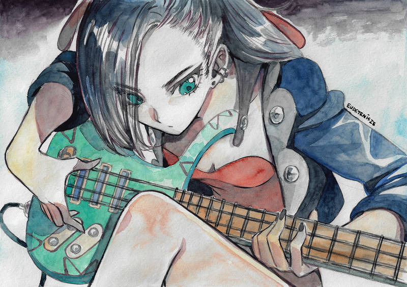](https://www.deviantart.com/gigiedt/art/Marnie-Bass-Guitar-956776087 "Marnie Bass Guitar By gigiEDT")

XXX

### Ocio y entretenimiento

[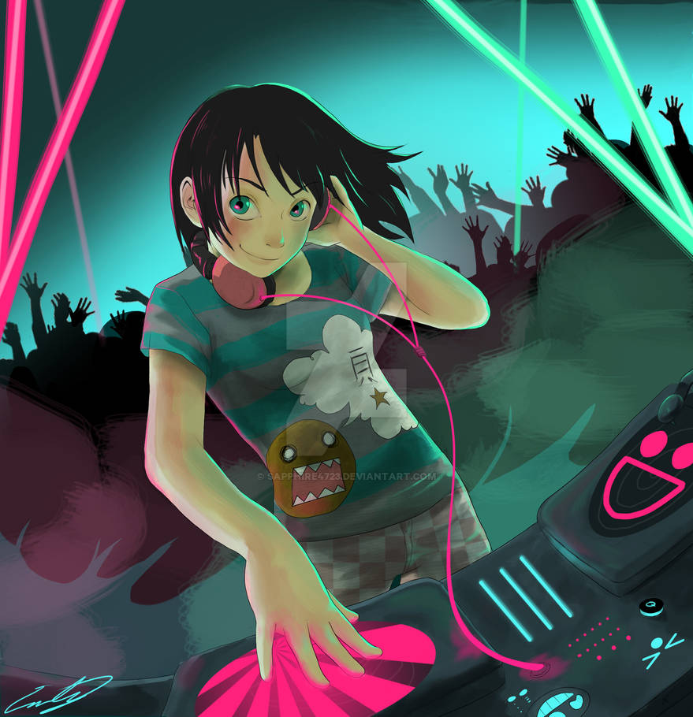](https://www.deviantart.com/sapphire4723/art/DJ-172952849 "DJ By Sapphire4723")

XXX

### Gastronomía

La base de la gastronomía se basa en las algas producidas y procesadas en la algafactoria del Trent. A partir de estas algas se crean todo tipo de productos alimenticios como formas y sabores muy variados.

[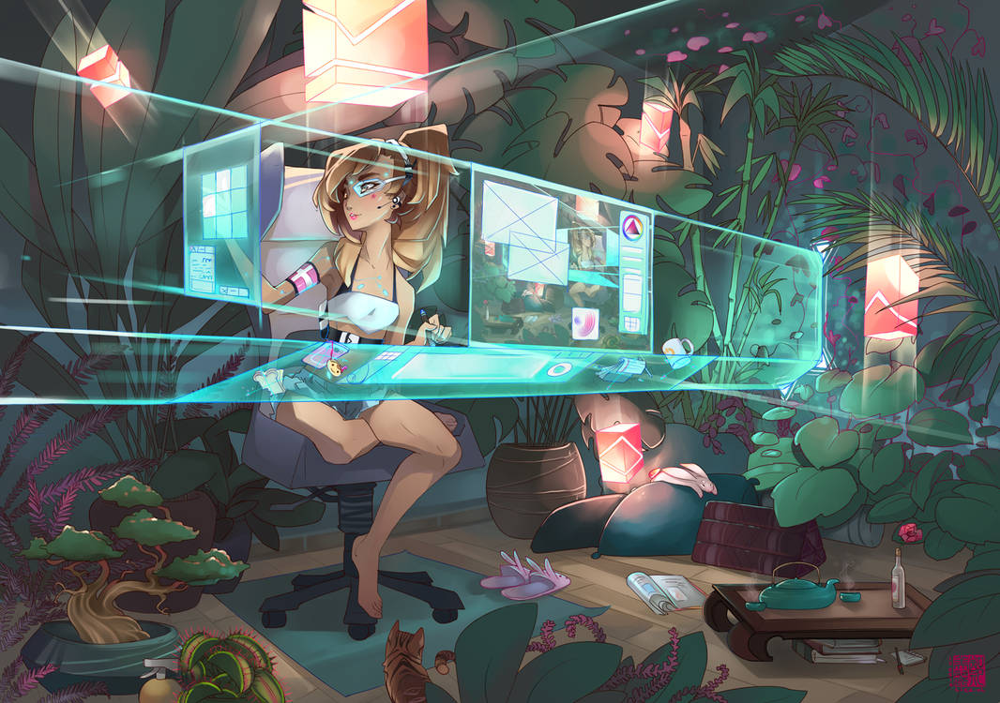](https://www.deviantart.com/liea/art/Studio-2042-453321074 "Studio 2042 By liea")

El precio de estos productos de alga es relativamente bajo y accesible a todos los bolsillos. En teoría tienen todo lo necesario para una dieta saludable, pero hay estudios que dicen lo contrario.

Mientras que la gente mayor prefiere la comida con forma y sabor a carnes y verduras de toda la vida, para cocinarlas según las recetas de toda la vida, las nuevas generaciones están adoptando una cocina basada en las algas sin procesar o simplemente triturarlas y convertirlas en batidos de proteínas. Esta moda es uno de los planes de la directora J0hn para mejorar los beneficios de la compañía; menos procesamiento, que convirtieron en casi dogma de fe para muchos _notis_.

En respuesta a todo esto, bastantes grupos alternativos han empezado a dar gran importancia a los cultivos hidropónicos para cultivar tu propia comida en casa y se ha hecho muy popular, tener varias plantas de frutas y hortalizas. Todos estos productos frescos se han convertido en parte de la economía de trueque y las semillas se han convertido en objetos muy valiosos.

Cómo ya hemos dicho otras veces, en el bosque es todo al revés, los productos frescos hidropónicos son la base de la alimentación al no tener un acceso directo a las algas. De hecho los sheriffs vigilan muy mucho los almacenes y las fábricas de productos y suministros hidropónicos porque saben que los _boskis_ suelen atacarlos.

[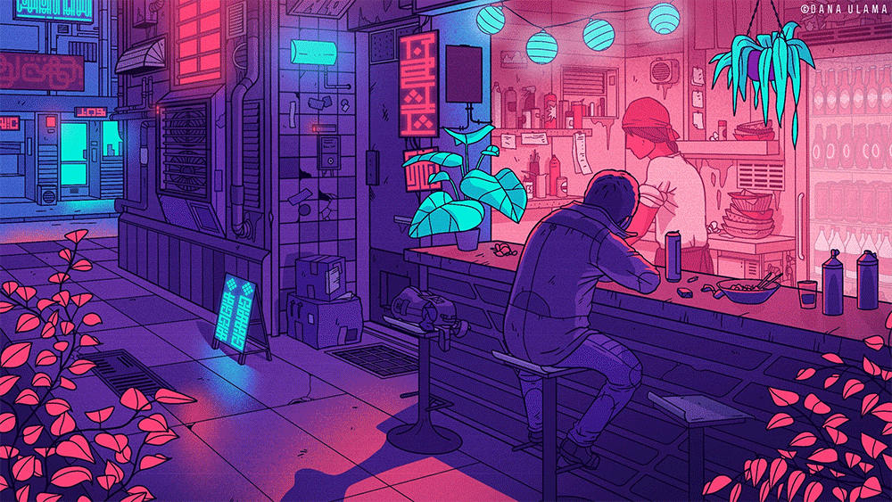](https://www.deviantart.com/dana-ulama/art/D-hinghara-Diner-895072505 "D'hinghara DinerBy Dana-Ulama")

Los restaurantes en la zona baja y media en su mayoría son como _ramen shops_, una barra sobre la que comen 3 o 4 personas y detrás de la barra un cocinero y su cocina. Los restaurantes de la zona alta son ya mucho más grandes y lujosos, aunque siguen teniendo pocas mesas y tratan de trabajar mucho con productos hidropónicos comprados a los _notis_.

La comida callejera, como el espacio es un lujo, se ha convertido en gente con armazones metálicos en los que tienen fuegos y donde te preparan la comida. Estos cocineros ambulantes llenan de olores todo el complejo, sobre todo los barrios más pobres y las zonas industriales y de talleres.

Quizás lo más interesante gastronómicamente hablando de toda la arcología es la llamada **Olla de Gumbo de la Mamá Claire en la zona Baja**. Es una olla de comida comunal gestiona por Mamá Claire. Lleva sin apagarse y dando de comer a les hambrientes desde hace 15 años, cuando una hambruna hizo que Mamá Claire sacara una olla de gumbo a la calle y empezará a cocinar para sus vecines. La gente traía los pocos alimentos que tenían para echarlo a la olla y así Claire seguía cocinando. Y así ya lleva 15 años removiendo su gumbo, que es considerado una auténtica exquisitez de la comida popular.
 
### Religiones y sectas

Al obtener la concesión de Nottingham, la compañía firmo muchos temas legales y uno de ellos fue respetar la libertad de credo y religión de los _notis_. En la teoría no puede discriminar por temas religiosos, pero en la práctica hay ciertas creencias religiosas que le resultan peligrosas como el culto a les instaladores que persigue (de forma oculta) y trata de hacerlo desaparecer. 

#### El culto a les instaladores 

Les seguidores de esta fe consideran a les instaladores como unos seres superiores y casi mágicos que desaparecieron por culpa de los pecados de los _notis_ y que ahora están expiándolos con todo el dolor y sufrimiento que sufren los habitantes del complejo. Según su credo, cuando se hayan pagado todos los pecados les instaladores volverán para arreglar todo lo que está mal en el complejo y poder vivir un paraíso en la tierra.

Ser parte del culto no es un delito, pero si J0hn descubre que lo eres, tratará de acabar contigo, bien metiéndote en la cárcel de alguna manera, incluso poco legal, o haciéndote que acabes en el bosque como une proscrite. Es por esto que gran parte de la población del bosque creen en les instaladores.

La **vertiente más radical y fanática del culto a les instaladores son les buscadores de la contraseña de SU** que creen que les instaladores dejaron en alguna parte una contraseña de superusuarie o _password de root_ que al usarla convertirá a les buscadores en instaladores y activará en la arcología una serie de sistemas escondidos que acabarán con el mal y las injusticias del mundo actual.

Para entender mejor esta religión debes pensar en ella siguiendo las estás ideas.

1. Les **instaladores son una especie de druidas**. Misteriosos, enigmáticos, mágicos y sabios. Mientras elles estuvieron trabajando en el complejo fue una época de bien y progreso.
2. Les **buscadores son una especie de buscadores del grial** que creen que cuando lo encuentren el bien y la paz reinará en el congreso.
3. La **directora J0hn y la compañía serían los cristianos** tratando de acabar con las viejas creencias. 

### Fiestas, celebraciones y otros eventos

El complejo de Nottingham es un lugar feo y alienante para sus habitantes la mayoría de los días, pero hay unos pocos días al año en que estoy no es así. 

#### El día de la primera piedra

Todos los años, en el día en que se puso la primera piedra del complejo

Hay diferentes festejos en la Plaza Mayor que empiezan con un discurso de la directora J0hn. Hay música, bailes y comida hasta bien entrada la noche.

De hecho hay tradición de besarte con tu pareja cuando se va a producir el Glitch de la noche.

Los locales de comida de todo el complejo ponen puestos de comida para disfrute de los paladares de les _notis_. Curiosamente, mientras que los locales más humildes suelen poner precios populares para sus clientes, los de alta gama suelen cobrar más de lo normal.

> La realidad de este festival es tapar el auténtico festival de la primera piedra que celebran los _boskis_ en conmemoración de la creación del primer asentamiento _boski_ en el Gran Roble. El ruido que montaban era tal que se colaba por todo el complejo amplificado por los conductos y tubos que hay por todas partes.

El punto fuerte del festival es un concurso de disparo con tirachinas con un suculento premio 5.000 $ y el título de Cazadore. Les participantes compiten entre sí hasta un encuentro final entre les supervivientes de las rondas anteriores. La directora J0hn siempre presenta une participante que va con los colores de la compañía y que normalmente suele ganar, pero no siempre.

Pero la actividad preferida de les niñes del complejo es la de atrapar el robot comadreja. Se celebra cerca de los dólmenes donde se cerca una zona para que la comadreja no se escape. Se la envuelve en papel de burbuja y se le unta en grasa. Les niñes deben atraparlo y le niñe que lo retenga 5 segundos gana y recibe el título de _Cazadore junior_ hasta el próximo año.

> El juego está trucado y cuando lo atrapa une hije de _blus_ o _influencers_, desconectan el robot para que sea fácil ganar. Hace años que no gana ningune niñe _curri_.

#### Fét Gede

La comunidad haitiana en Nottingham no es especialmente importante, pero una de sus tradiciones, el Fét Gede, ha calado muy profundamente en la cultura del complejo. El Fét Gede es el Día de los muertos para los practicantes de la religión vudú. A primeros de noviembre los creyentes salen a la calle vestidos de blanco, negro y morado y con las caras pintadas con polvo blanco. Fuman, comen y beben en los cementerios y algunos supuestamente son poseídos por los gede, los espíritus de los ancestros muertos.

Esta fiesta caló poco a poco entre los _curris_ que la esperan con ansia todo el año. Sin embargo, las clases altas la encuentran deleznable y no participan de ella y si lo hacen es disfrazades.

Es una época de excesos que la directora J0hn trato en su momento de abolir, pero estudios de mercado le dijeron que en realidad daba dinero a la compañía y reducía los delitos relacionados con protestas callejeras, huelgas y manifestaciones, etc.

### Deporte

El deporte se ha adaptado a la vida en la arcología gracias a las últimas tecnologías, hablamos de bicicletas estáticas o cintas de correr con realidad virtual o el hockey de pasillo, una versión mini del hockey sobre hierba. También son famosos los concursos de baile acrobáticos y las competiciones de tiro con tirachinas. 

#### Hockey de pasillo

El hockey de pasillo es el rey de los deportes en Nottingham. Es un hockey sobre hierba adaptado a 3 jugadores al interior del complejo.

Se juega en recintos cerrados como pasillos y galerías en equipos de 4 (parabol, pasabol, lanzabol y un suplente). Cada encuentro dura 5 rondas de 7 minutos.

Gana el equipo que más goles meta o el que consigue marcar en 3 rondas seguidas sin que su oponente le marque (llamado en el argot deportivo «baño»).

Uno de los elementos más interesantes del hockey de pasillo es el campo de juego. Según el reglamento oficial puede ser cualquier pasillo de la arcología que tenga un mínimo de 40 m² usando dos puertas del pasillo como porterías. 

Las puertas que no tienen que ser del mismo tamaño ni tener unos mínimos o máximos, así que es importante ganar el sorteo inicial para elegir la portería más ventajosa. Aunque se cambie cada ronda, al ser 5 estarías 3 en la buena y 2 en la mala.

En los partidos oficiales de liga se elige al azar el campo de entre todos los corredores, galerías, pasillos y pasajes que cumplan las indicaciones. 5 minutos antes de empezar se desaloja el pasillo y entran les jugadores a calentar.

Los partidos son retransmitidos a través de las cámaras de vigilancia del pasillo. Se cierran todos los accesos al pasillo, excepto para personal sanitario y los suplentes.

Debido al poco espacio del campo, los partidos son arbitrados desde fuera usando las imágenes de las cámaras de seguridad y hablando por los altavoces. Por la misma razón, los entrenadores, si se tienen, siguen el partido por las cámaras de seguridad y dan las órdenes también por la megafonía.

El juego es más de habilidad para moverse entre espacios pequeños, de saber mover la bola y aprovechar los rebotes que de fuerza física, ya que no hay espacio para golpear a tu contrincante con el stick o para coger carrerilla.

Reglamento general:

* Solo se puede tocar la pelota con el stick.
* No se puede golpear a otro jugador con el stick.
* La pelota puede rebotar contra cualquier cosa del terreno de juego.
* Si cometes una falta, debes soltar tu stick y no moverte los segundos de castigo. Tus compañeres y tus adversaries puede usarte como protección, obstáculo, etc. mientras estás en la falta.

Hay gran cantidad de equipos amateurs en la arcología, pero solos 12 profesionales en la Liga de Hockey de pasillo. Estos equipos tienen patrocinadores, remuneraciones, buen equipamiento, entrenadores, gimnasios, etc. Los más famosos suelen acabar de influencers de la directora J0hn, haciendo reels y directos para les fans de este deporte.

El hockey de pasillo atrae muchas apuestas ilegales controladas por las mafias y la sombra de los amaños siempre ha sobrevolado el hockey de pasillo profesional.

**Semilla de aventura:** Un pequeño equipo de hockey de pasillo ha dado el campanazo este año, pueden hasta ganar la liga. Pero necesitan guardaespaldas que les protejan, ya que hay gente que quiere impedir que lleguen a la final.

### Títulos nobiliarios

Los títulos nobiliarios, principalmente **_lord_, _lady_ y _liege_**, son algo que impuso en su tiempo la directora R1c4rd como una forma de destacar a la gente que había hecho grandes cosas por la comunidad de Nottingham o había destacado en algún ámbito de la cultura, la sociedad y/o la ciencia.

R1c4rd tuvo que modificar elementos del sistema de Nottingham. Entre muchas cosas, el sistema censal del complejo y todo el sistema de realidad virtual y aumentada fue reprogramado para poder registrar los títulos y que cuando se viese su nombre siempre se viera acompañado de su título.

Cuando J0hn accedió al poder trato de quitar esta costumbre, pero le resultó muy complicado erradicarlo del sistema del complejo porque R1c4rd lo hay metido a fuego en el código de funcionamiento del sistema.

Así que tomó el camino fácil, no otorgar ningún título a nadie más, esperando que así se dejara de usar y terminara desapareciendo. El problema es que R1c4rd lo dejo como algo hereditario y cuando murió la primera persona con título nobiliario, un proceso del sistema censal le **otorgo el título a su primogenite automáticamente**.

> En partida la forma de tener título nobiliario sería escogiendo la ventaja Alcurnia. Pero recuerda que puedes perderlo si te conviertes es une forajide. 

Como curiosidad, los sistemas de puertas automáticas fueron modificados por la directora R1c4rd para decir tu título al entrar y salir. Esto, a lo largo de los años, ha generalizado el uso de los títulos nobiliarios entre los habitantes de la arcología.

**Semilla de aventura:** Al revisar tu identificación personal, para tu sorpresa, el sistema te ha otorgado un título nobiliario. ¿Es un error del sistema o puede que seas el hije de alguien importante? 

[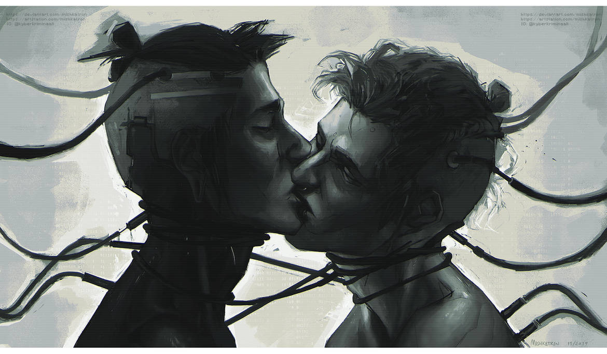](https://www.deviantart.com/mishkatron/art/Lovers-819090781 "Lovers By Mishkatron")

### Sexo y género

Dentro del complejo de Nottingham son aceptadas todo tipo de opciones sexuales y de género. El colectivo LGTBIQ+ no es discriminado por su orientación sexual ni su definición de sexo. 

Las operaciones de cambio sexo son tan comunes y normales como muchas operaciones de instalación de ciberimplantes. De hecho, se mira con reticencia a les individues sobreimplantades, mientras que se **acepta con total normalidad a las personas transexuales*.

**Intentar cambiar esto es ir en contra del espíritu de la ambientación.**

Para la directora J0hn, como némesis principal de tu banda de proscrites, todos estos temas de género y sexualidad no son relevantes, digamos que solo se interesa por los habitantes como unidades productivas y fiscales y, por tanto, las casillas de preferencias sexuales y género son más una curiosidad más que algo que usar para discriminar. 

La directora J0hn ya tiene una minoría, les _boskis_, sobre la volcar todas las culpas y encauzar el odio de los _notis_ y no necesita ninguna otra minoría para sus planes de control de la arcología.

> Las vidas sentimentales y sexuales de la mayoría de les personajes de esta ambientación han sido dejadas a propósito sin definir para que las adaptes como más te interese. Así, cualquier persona de tu mesa podrá romancear con cualquier PNJ que encuentres aquí. Algunes PNJ han sido definidos abiertamente no binaries y queer para que estos colectivos estén representados. Por favor, respeta esta decisión. 

### Duelos

De siempre, los duelos, sobre todo a muerte, han estado prohibidos en Nottingham, pero eso nunca ha parado a los _notis_ de alto nivel de batirse en alguno de los pasajes del huerto urbano. La política de la compañía es no dañar mortalmente su fuerza de trabajo, aunque sí los ha permitido cuando le han servido para acabar con disidentes.

[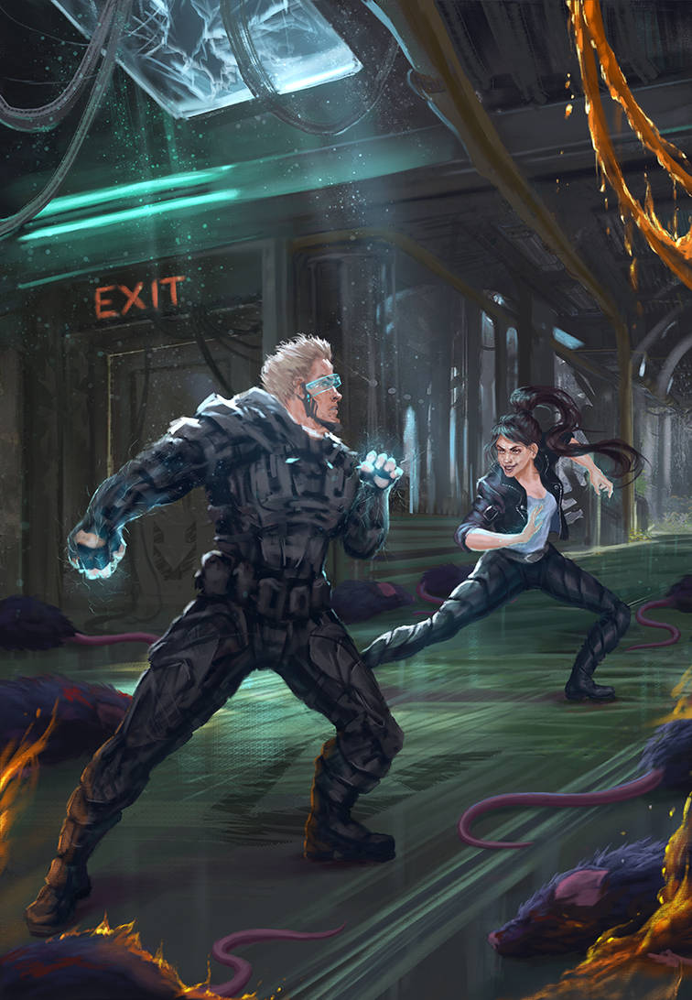](https://www.deviantart.com/cyberaeon/art/Derivates-949272458 "Derivates By cyberaeon")

Para empezar, debemos decir que los duelos es algo de _blus_ e _influencers_, no se da entre _curris_. Cuando une de estos dos grupos se siente ofendido puede pedir un duelo para resarcir su honor mancillado.

Normalmente, los desafíos se suelen lanzar a _curris_ por tonterías, como una forma de humillación, sabiendo que no los aceptarán y tendrán que retractarse de la supuesta ofensa que han hecho y humillarse públicamente como cobardes devolviendo el guante. Les _blus_ e _influencers_ juegan con la ventaja de que los _curris_ no tienen ni el tiempo ni el dinero para afrontar un duelo y mucho menos permitirse semanas o meses de curas y medicinas en caso de que no sean mortales. 

Otro elemento importante es que puedes tener un campeón que se bata en duelo en tu nombre, lo cual hace que los _curris_ no tengan ninguna oportunidad de ganar ante estos profesionales de los duelos y prefieran la humillación a las consecuencias de perder casi seguro el duelo.

Aun así ha habido casos de _curris_ que han aceptado duelos, pese a saberse que tenían muy pocas posibilidades de salir victoriosos. Incluso ha habido varios que han conseguido que un campeón encapuchado luchara en su nombre y venciera, obligando al _blus_ e _influencer_ a rogar por su vida.

Normalmente, los duelos que terminan haciendo son entre _blus_ e _influencers_ por estúpidas rencillas que pueden ir desde temas románticos a vejaciones en reels peleas por ascensos o simples trucos para conseguir más fama y seguidores.

Les _influencers_ suelen convertir los duelos en espectáculos, mientras que los _blus_ suelen ser más discretos y menos dados a enseñar sus cartas a futuros adversarios.

#### Normas

Las normas son las siguientes. 

* El **ofendido puede exigir el duelo o una satisfacción**, normalmente humillante.
* El **ofensor puede aceptar** el duelo o escoger **cumplir la satisfacción**.
* Si acepta el duelo puede **elegir el tipo (primera sangre, incapacidad o muerte) o el arma**, normalmente armas de filo, pero ha habido duelos con arcos o con sticks de hockey de pasillo.
* El ofendido elegirá lo que no haya elegido ofensor.

* El **duelo será al glitch de la mañana dentro de 3 días**, tiempo suficiente para dejar tus asuntos cerrados. Deberán presentarse con une madrine y su campeone en caso de tenerlo.
* Se suele llegar a un acuerdo sobre quien será el juez y normalmente se elige una IA con las capacidades mínimas para que sea jurado en un juicio.

## Leyes y justicia

```
La compañía tiene el control de la justicia y del sistema penal de Nottingham, pero tuvo que firmar ciertos contratos con garantías de que será justa e imparcial. 
```

La compañía tuvo que establecer una serie de leyes que regirían el funcionamiento de Nottingham cuando adquirió la concesión de construcción y explotación de esta arcología. En general las leyes son bastante normales y parecidas a las actuales, pero con cierta tendencia liberal de proteger al capital y la propiedad privada.

Pero claro, este es un juego de gente fuera de la ley, así que tiene que haber algo que te ponga al otro lado. Y esto es la destrucción por parte de la directora J0hn del escudo social que protegía a los más desvalidos y la aplicación de forma muy dura de la ley. Mientras que R1c4rd protegía a todos los _notis_, cuando esta se fue y John la sustituyo, esto cambió radicalmente.

Veamos un ejemplo, la ley dice que tienes que pagar tu alquiler y si no los pagas te vas a la calle y puede que incluso acabes en la cárcel. Como no hay es un escudo social que te pague una ayuda si te quedas sin trabajo o estás enfermo y no puedes trabajar, en el momento en que no puedes pagar tus deudas los sheriffs te buscarán y te llevarán a juicio, donde claramente serás encontrado culpable por no poder pagarte una buena defensa y acabarás en prisión.

Además, el sistema penal es francamente punitivista. Si eres encontrado culpable, pagarás tu deuda con la sociedad con trabajo forzado. La reinserción no está dentro de los objetivos del sistema penal.

### Fuera de la ley

Una gran cantidad de les _notis_ que comenten delitos relacionados deudas e impagos suelen huir al bosque como una forma de escapar de terminar en la cárcel. Por ejemplo, si pierdes tu trabajo, es fácil que acabes viviendo en la calle lo cual te llevará a cometer más delitos y dar con tus huesos en la cárcel.

En vez de eso, la gente desahuciada o que no puede pagar sus deudas con la compañía cogen sus cosas y parten al bosque donde suelen acabar integrándose en comunidades de _boskis_.

De hecho, les primeres _boskis_ fueron una mezcla de personas que no encajaban o estaban en contra del sistema que trataba de imponer la directora J0hn y las clases más bajas que no podían pagar rentas, impuestos e iban a acabar en la indigencia y más tarde en la calle.

### Los juicios

Las directoras tienen el privilegio de juzgar a todos los habitantes de Nottingham y su decisión no es recurrible. Pero eso genera mucho consumo de ciclos y solo juzgan casos importantes. El resto de crímenes son juzgadas por «las 3 sabIAs».

Las 3 sabIAs son 3 IA de cualquier tipo (siempre que cumplan unos mínimos de inteligencia y razonamiento) que son seleccionadas una por la defensa, otra por la acusación y una tercera al azar entre todas las IA de Nottingham.

Las IA escuchan a las partes, estudian las pruebas y dan un veredicto. El veredicto debe ser unánime. Los 3 votos deben ser iguales, lo cual es curioso, ya que una de las IA es de la defensa y otra de la acusación y no deberían coincidir nunca, pero discuten a miles de megaherzios y terminan llegando a un acuerdo. Como no tienen muchos de los sesgos humanos suelen llegar a veredictos bastante justos y equitativos.

Les mejores abogades van detectando las IA que más posibilidades tienen de llevarse al resto a su campo.

Durante el juicio que dura entre 12 y 24 horas las IA solo pueden trabajar en el juicio. No es la primera vez que los ascensores de una sección dejan de funcionar porque su IA tiene un juicio.

**Semilla de aventura:** Tu banda recibe el soplo que la IA de seguridad de un importante centro de datos tiene que participar en un juicio. Puede ser una oportunidad buena para conseguir nuevos códigos de acceso, mapas de instalaciones, etc. un buen botín de datos.

### Penas

Una vez eres encontrade culpable, está vez sí, la directora J0hn decide tu pena, que suele tratarse de una indemnización económica.

Esa indemnización se traduce en días de trabajo que debes cumplir en el correccional de Nottingham.

Esos días, meses o años de trabajos forzados son innegociables. Por mucho dinero que tengas, no puedes usarlo para pagar la indemnización. De hecho la compañía la suele adelantar y luego la recupera según vas trabajando 

La indemnización puede ser tan grande que se convierta prácticamente en una cadena perpetua.

En los delitos más graves como los asesinatos, pueden tener inmensas indemnizaciones, pero normalmente la directora J0hn tiene la prerrogativa de poner la pena capital.

La sentencia de muerte se ejecuta por la horca en un cadalso construido ex profeso en la Plaza Mayor para que sea visto por todo el mundo.

#### Trabajos forzados

Los trabajos forzados pueden ser muy variados desde trabajo manual de mantenimiento en cuadrillas vigiladas, trabajo en una cadena de montaje o incluso trabajos más intelectuales como programación delante de un ordenador.

No se explota a los reclusos con jornadas interminables y duros trabajos, pero como lo más bajo de la sociedad no tienen ningún tipo de privilegio y sus instalaciones, su alimentación y sus cuidados son lo más barato posible. 

## Bajos fondos y crimen organizado

```
Como toda comunidad humana, hay individues indeseables que se de dican al crimen en todos sus aspectos.
```

[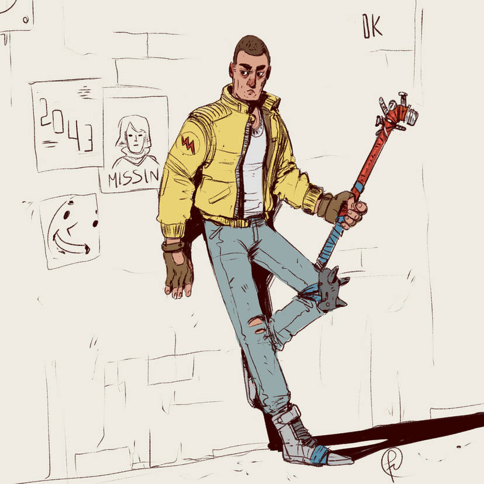](https://www.deviantart.com/fernand0fc/art/Pandillero-743621901 "Pandillero By Fernand0FC")

La tasa de criminalidad es bastante baja para la tremenda densidad de población del complejo de Nottingham, aun así es un problema que la directora J0hn y sus sheriffs buscan atajar de forma expeditiva.

En los bajos fondos que coinciden con la Zona Baja del complejo hay varios grupos de criminales, mafia y pandillas, que controlan los 4 clásicos del delito, atracos y robos, drogas, juego y prostitución.

Los robos y atracos son también realizados por _boskis_, pero estos tratan de centrarlos en conseguir materiales y equipo que no pueden conseguir de normal. Los criminales del complejo buscan objetos de valor de los que sacar beneficios y tratan siempre de achacar estos delitos a los _boskis_ para no ser perseguidos por ellos. 

### Mafias y crimen organizado

XXX

### Pandillas y sus territorios

En los últimos años, ha habido un auge de las pandillas para ocupar el agujero de poder que han supuesto la desaparición de las organizaciones mafiosas.

Podrías pensar que las mafias han sido sustituidas por la misma mierda con otro nombre, pero hay una importante diferencia. Mientras que las guerras entre mafiosos tenían un objetivo económico (te mato y me quedo tu territorio para ganar más dinero) y eran actos quirúrgicos, las peleas entre bandas son enfrentamientos violentos y sangrientos por controlar un territorio sin un objetivo claro. Eres mi enemigo y debo acabar contigo y luego si eso venderé mis drogas en tus calles. 

XXX

## Les instaladores

```
Les instaladores son el elemento místico que hay toda historía medieval. Les druides de las antiguas leyendas que viven en lo profundo de los bosque ofreciendo su poder y sabiduría a les heroines.
```

Les instaladores son les constructores primigenies de Nottingham que abandonaron la arcología antes de terminarla, como demuestra la existencia del bosque. La compañía se los llevó de Nottingham hace ya 180 años y no se sabe por qué, pero no es raro encontrar su tecnología, que, aun teniendo muchos años de antigüedad, es todavía muy superior y es muy apreciada y codiciada.

[](https://www.deviantart.com/kcajd/art/Nanites-862216953 "Nanitesn By kcajd")

### Tecnología de les instaladores

La tecnología de les instaladores se basa principalmente en los nanobots. Miles de microrobots conectados que construyen los diseños de les instaladores. No solo construyen nuevos pisos de la arcología, sino que también reparan, restauran y mantienen los pisos viejos.

XXX

### Los nanitos después de la marcha de les instaladores

Cuando les instaladores se fueron por orden de la compañía, se llevaron los nanobots, pero no todos. Muchos de los nanitos de zonas en construcción quedaron huérfanos y sus firmwares desactualizado empezaron a fallar o a funcionar por su cuenta y siguieron construyendo ahora con materiales reciclados de origen biológico. Así es como el bosque obtuvo su nombre, al crearse estructuras orgánicas a las columnas techos, suelos y paredes del bosque.

XXX

### La búsqueda de la contraseña de SU

Les buscadores de la contraseña de SU, abreviando les buscadores, son un grupo de personas que creen que les instaladores dejaron en alguna parte un password de «superuser» que al usarlo activará en la arcología una serie de sistemas escondidos que acabarán con el mal y las injusticias del mundo actual.

XXX

## La vida en el Bosque

```
La vida para les habitantes del bosque es un tanto diferente al del resto de los notis. Con los años han desarrollado una cultura, unas creencias y una forma de vida diferentes a las de sus vecines del lado legal de la vida.
```

Las dos palabras que mejor definen la vida en el bosque son libertad y bien común. Eres libre de hacer lo que quieras y trabajas por el bien común. Casi todos les habitantes del bosque saben como es vivir en el complejo bajo el yugo de la directora J0hn y la compañía y saben que no quieren eso.

XXX

Deportivamente hablando, el deporte que más practican son el tiro con arco o tirachinas. Siendo las competiciones populares de disparo eventos muy importantes en la actividad social del Bosque. De hecho, no hay evento en que antes o después les _boskis_ no acaben demostrando su buena puntería en algún tipo de concurso cuyo premio puede ser desde pedir el mejor plato del banquete preparado a ganar el beso de algune moze que lo ha ofrecido como premio del concurso.

### Educación

La educación en el bosque es bastante práctica y se aprenden cosas tremendamente prácticas y centrada en profesiones, desde programación a albañilería o trabajo en invernaderos hidropónicos.

Tras unos estudios básicos de lectura, escritura, manejo de aparatos informáticos y nociones de historia y ciudadanía, se pasa a aprender habilidades útiles en el día a día como cultivar, reparar una casa o arreglar un dispositivo electrónico estropeado.

Les profesores suelen ser profesionales que trabajan de ello. Imparten clases a les alumnos como parte de su contribución al bienestar social y suelen coger como aprendices a los que ven las capaces.

## El mundo exterior

```
Un principio fundamental de esta ambientación es que es imposible salir al exterior de la arcología. El exterior es algo de lo que se habla, pero que la gente no ha visto nunca.
```

El mundo exterior es algo de lo que todes hablan, pero muy pocos conocen. Les _notis_ pueden tener noticias y ver imágenes del mundo exterior y saber lo que pasa en otras arcologías, pero como en tiempos medievales, otra cosa es salir de tu condado y visitar otros lugares. Les _notis_ nunca salen de la arcología, esa opción es tan tremendamente cara que solo les más riques y famoses puede permitírselo. Otra opción es que la directora J0hn te envíe fuera de Nottingham para que realices algún trabajo.

La idea es que si tienes que huir, no sea a la arcología de Manchester, sino al bosque.

> La regla fundamental es que **las únicas personas que conocen el exterior sean PNJ**, como Lady Myrna, que entran y salen del complejo constantemente o que cuentan cosas de los tiempos en que vivían en otras arcologías.

No debería influir en las aventuras lo que haya fuera, pero tenerlo decidido puede ayudar a montar futuras partidas. Quizás cuando la directora R1c4rd vuelva y todo sea como en antaño sea el momento de ir a Oxford y ayudarles a librarse de la tiranía de la compañía. Tal vez la arcología expanda una plaga mortal en Nottingham y los pocos _boskis_ deban encontrar un nuevo hogar.

[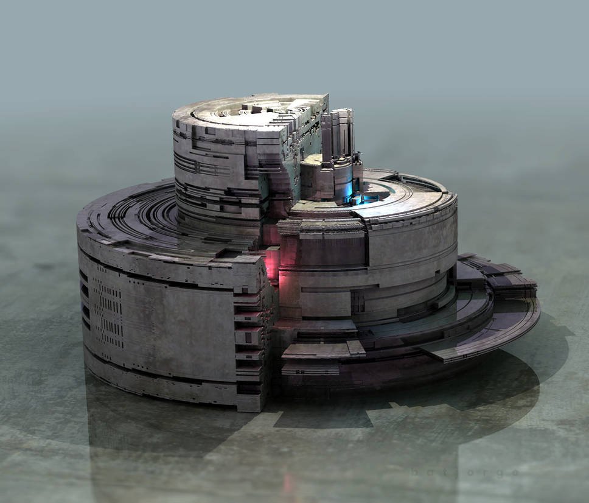](https://www.deviantart.com/batjorge/art/Aion-761082118 "Aion By batjorge")

Sea como sea, aquí tienes **algunas ideas** que puedes usar.

* No existen ciudades, solo arcologías donde viven todos los humanos. El mundo fuera de las arcologías es un páramo apocalíptico muy peligroso y solo quedan unas zonas con fauna y flora donde viven los superricos.
* El mundo está en guerra y las arcologías son mega factorías que producen para poder continuar la guerra, como Nottingham y sus algas.
* Para poder sobrevivir a un cataclismo ecológico, los humanos se vieron obligados a recluirse en las arcologías y permanecer en ellas mientras la tierra se cura.
* La tierra es una megaciudad y las arcologías son solo barrios de esa megaciudad. Cómo pertenecen a la compañía, está no deja entrar o salir a nadie.
* Puedes incluso convertir Nottingham es una especie de base lunar o marciana. Salir del complejo significa la muerte.

***

# |-|15t0r14 **Historia**

## La creación de Nottingham

```
La «primera piedra» de la arcología conocida como Nottingham se colocó hace ya unos 200 años.
```

En realidad nunca se puso una primera piedra, sino que todo empezó con un gigantesco pozo perforado en la roca en el que se vertieron toneladas y toneladas de nanitos constructores. Les instaladores lanzaron sus programas de construcción y los nanitos empezaron a construir el complejo usando los materiales que se les suministraban o que sacaban de los terrenos colindantes del pozo como chatarra o basura.

XXX

## El éxodo de les instaladores

```
Y de repente les instaladores fueron desapareciendo y ese misterio perdura hasta nuestros días.
```

La misteriosa desaparición de les instaladores supone el fin del crecimiento de la arcología. Pocas cosas nuevas se han construido desde entonces, solo se han hecho mantenimientos de lo que dejaron estas extrañas figuras casi mitológicas.

Se desconoce la razón de la desaparición de les instaladores, pero está claro que dejaron su trabajo sin hacer, ya que hay toda una parte de la arcología sin terminar, el llamado bosque Sh3rw00d. 

Otra prueba la desaparición rápida y forzosa de les instaladores es que no se llevaron todos los nanitos. Grupos de ellos quedaron abandonados en el complejo sin una programación clara, simplemente los dejaron ahí como quien hace las maletas rápidamente en un hotel y se olvida algo encima de la cama.

Mientras que algunos parece que se dedican a cierto mantenimiento, otros repiten una y otra vez la misma tarea y los grupos que quedaron en el bosque podríamos decir que «mutaron» su programación y ahora están convirtiendo toda esa zona en un área vegetal.

XXX

## La dirección de R1c4rd

```
… cómo, a nuestro parecer, cualquiera tiempo pasado fue mejor. _Coplas a la muerte de su padre, de Jorge Manrique_
```

La dirección de la directora R1c4rd es considerada por todos los contrarios a la directora J0hn como los _buenos viejos tiempos_. Todo era mejor, todo era nuevo, todo era más bonito o por lo menos así lo cuentan los más viejos del complejo. Sin embargo, la era de la directora de R1c4rd también tuvo sus sombras, aunque nada parecido a la tiranía de la directora J0hn.

XXX

## La dirección de J0hn

```
Y a la directoria R1c4rd le sucedió la directora J0hn y todo cambió.
```

La llegada de J0hn es considerado por muchos como lo peor que le ha sucedido a la arcología, mientras que los afines a la compañía lo consideran la época de mayor prosperidad desde que se puso la primera piedra al complejo.

XXX

### La segunda migración

Una de las primeras medidas tomadas por la directora J0hn fue decretar que toda la basura generada en el complejo era propiedad de la compañía y que ella misma se encargaría de su reciclaje. 

El reciclaje era una actividad muy importante para las clases bajas. Suponía dos cosas en la vida del complejo, unos ingresos fijos para las clases más bajas que les permitían sobrevivir y que la gente de la Zona Baja entrara en la Zona Alta en busca de basura para reciclar de «mayor calidad». 

Les _blus_ e _influencers_ sabiendo que J0hn estaba más inclinada a otorgarles sus exigencias empezaron a reclamarle que prohibiera la recogida de basura por parte de _gentuza_ de la Zona Baja y sus deseos fueron concedidos con esta polémica ley.

Personas como Lady Marian, presionaron, sin éxito, a la directora J0hn para que aprobara un paquete de medidas de ayuda a los afectados por la nueva legislación sobre reciclaje.

Como ya hemos dicho, esta nueva ley supuso que montones de familias se quedaron sin su forma de vida y dio lugar a la segunda migración de _notis_ al bosque de Sh3rW00d.

XXX

## El bosque de Sh3rW00d

```
Mientras que el complejo cae en un pozo de misería, el bosque está floreciendo y si se lo cuida y protege puede ser lo mejor que le haya pasado a Nottingham.
```

Lo que empezó como un pequeño campamento de proscrites, se está convirtiendo en una utopía donde priman la libertad y el bien común para todes les _boskis_. La gente que huye de Nottingham y acaba en el bosque normalmente no vuelven, ni se lo plantean de hecho ponen mucho empeño y trabajo en defender su nueva forma de vida. 

XXX

***

# Я36|45 **Reglas**

## Creación de personajes

```
En Bosque Sh3rW00d hay una serie de reglas que modifican las reglas generales de creación de PJ que se establecen en el libro básico de savage Worlds Ed. Aventura.
```

Recuerda que todos les PJ son de raza humana con lo que tienes una ventaja adicional a la hora de crearlo.

### Hijes de la tecnología

Vives rodeado de tecnología las 24 horas del día. Quieras o no, sabes usar todo tipo de aparatos eléctricos y ordenadores.

> Todes les personajes **empiezan con Electrónica d4 y Ordenadores d4**.

### La ciencia mató la magia

A no ser que quieras darle un toque paranormal, **Ocultismo desaparece** de las habilidades elegibles. También **desaparecen las habilidades como Hechicería, Ciencia Extraña, Fe, etc. y las ventajas de poder** que tienen un carácter mágico.

Aun así recuerda que por ejemplo en la trilogía de Sprawl de William Gibson, el vudú estaba integrado dentro de las creencias de los ciberjinetes. Puede que en lo más profundo de la red haya espíritus y otros seres que la informática no pueda explicar. 

[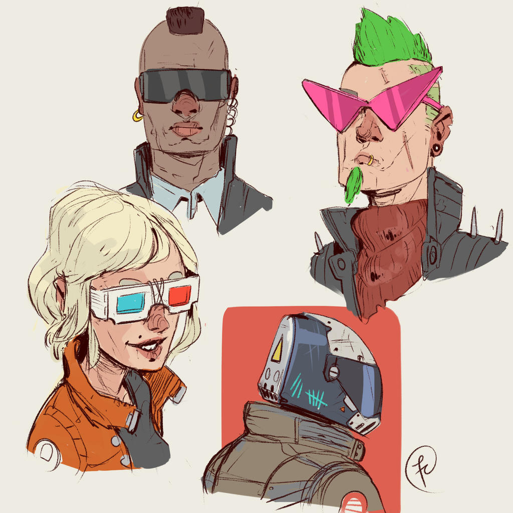](https://www.deviantart.com/fernand0fc/art/HeadShots-743989425 "HeadShots By Fernand0FC")

### Espacios cerrados

Se recomienda **no ponerse ventajas de pistolero**, ya que el acceso a las armas de fuego es muy limitado. Además, todas las aventuras, de normal, transcurren en espacios muy muy cerrados, donde es bastante fácil que entres en combate cuerpo a cuerpo con lo que tu arma de fuego es una desventaja.

**Tampoco son útiles habilidades como Cabalgar**, porque no hay animales que montar, ni Pilotar, ya que no hay aeronaves ni barcos que usar. El pilotaje de drones y similares se haría con Electrónica. **Supervivencia es sustituida por Pasillear**, su versión urbana para la arcología.

**Mal nadador desaparece como desventaja**, debido a que no hay casi grandes masas de agua donde nadar sea importante. 

Como ya hemos dicho, no hay animales, **Vínculo Animal y Señor de las bestias tampoco se pueden escoger**.

### Idiomas

El inglés es el idioma predominante en Nottingham, así que es no hay problemas de comunicación entre personas y máquinas. Puede encontrarse libros u objetos con textos en otros idiomas, pero no debería ser difícil conseguir traducciones más o menos buenas.

> Empiezas con la habilidad **Idioma Inglés a nivel de tu Astucia y un d4 en Idioma Leet**.

### Secretos

Los secretos es algo muy común entre les personajes de las historias de Robin Hood. Robin es un noble, Scarlet es un hermanastro de Robín o Marian se disfraza de hombre para ayudar a los pobres. He querido trasmitir esa esencia con esta regla de creación de personajes. 

> Tode personaje debe **tener un Secreto (mayor o menor)** entre sus desventajas.

### Ciberimplantes

Los ciberimplantes son algo normal entre les _notis_, sobre todo desde que la compañía ofrece implantes gratis para mejorar tu productividad. La compañía solo financia implantes legales y que estén relacionados con la profesión de su empleade.

> Opcionalmente, puedes tener un **implante cualquier tipo, pero solo de valor 1 y legal**.

[ By fuzzyfox0")](https://www.deviantart.com/fuzzyfox0/art/Fork-Bomb-one-dark-695011374 "Fork Bomb (one dark) By fuzzyfox0")

### Hackeos de les instaladores

Si no has caído bajo el influjo de la compañía y sus tretas, seguramente hayas aprendido algún hackeo de les instaladores.

> Elige un hackeo que tenga como requisito Novate de la lista de hackeos de les instaladores, si no has elegido ninguno de los ciberimplantes que te ofrece la compañía.

## Arquetipos

```
A la hora de crear tu PJ te presentamos algunos arquetipos que te ayuden a construirlo. es importante tener en cuenta que las aventuras de Robin Hood siempre hablan de personajes parias y fuera de la ley y he seguido esa idea al diseñar estos arquetipos.
```

También puedes crear los tuyos propios, pero recuerda que el espíritu del juego es que estén al otro lado de la ley o muy cerca.

### Biker

Estes mensajeres recorren todo el complejo de Nottingham llevando todo tipo de sobres, paquetes, etc. a todo tipo de personas. No hacen preguntas y sus bocas están selladas sobre qué, de quién y para quién han hecho un encargo.

Te mueves rápide y nunca estás mucho tiempo quiete en un mismo sitio. Por así decirlo, si estas parade, es que eres un cadáver. 

* **Habilidades recomendadas:** Conducir (e-bike), Pasillear y Reparar
* **Ventajas recomendadas:** As, Mr. Arreglalotodo y Manos firmes
* **Desventajas recomendadas:** Impulsive, Leal y Pobreza

### Buscadore

Les buscadores son un grupo de personas que creen en un mundo mejor y han jurado conseguirlo.

Según sus creencias, les instaladores dejaron en alguna parte un password de _superusuarie_ que al usarlo activará en la arcología una serie de sistemas escondidos que acabarán con el mal y las injusticias del mundo actual.

No tienes por qué creerte todo ese rollo, pero igual estás segure de que hay algo escondido en la arcología que vuelva a poner las cosas a como estaban con la directora R1c4rd. 

* **Habilidades recomendadas:** Investigar, Intimidar y Notar
* **Ventajas recomendadas:** Ardor, Campeone e Investigadore
* **Desventajas recomendadas:** Heróique, Juramento y Obsesión

### Erudite

Les erudites engloban a toda persona que se centra su forma de vida en el estudio y el descubrimiento científico. Todas las ramas de las ciencias y de las letras pueden ser su objeto de estudio. 

Mientras que algunos de tus compañeres se han vendido a la compañía, tú sabes que el conocimiento puro debe ser libre de interferencias de cosas como el capitalismo. Tus descubrimientos deben ayudar a la humanidad, no a hacer dinero. 

* **Habilidades recomendadas:** Ciencias, Humanidades y Medicina
* **Ventajas recomendadas:** Curandere, Erudite e Investigadore
* **Desventajas recomendadas:** Caute, Curiose y Despistade

### Grafitere

Este arquetipo refleja todo tipo de personajes que llevan la confrontación contra la compañía a las calles, no solo en forma de grafitis. También con actos de vandalismo callejero, pequeños sabotajes y sentadas.

Tu principal problema es que tus actos, sin una figura carismática que te dirija, muchas veces no son más que simples gamberradas.

* **Habilidades recomendadas:** Atletismo, Pasillear y Sigilo
* **Ventajas recomendadas:** Acróbate, Alerta y Parkour
* **Desventajas recomendadas:** Exceso de confianza, Heróique y Suspicaz

### Influencer en desgracia

[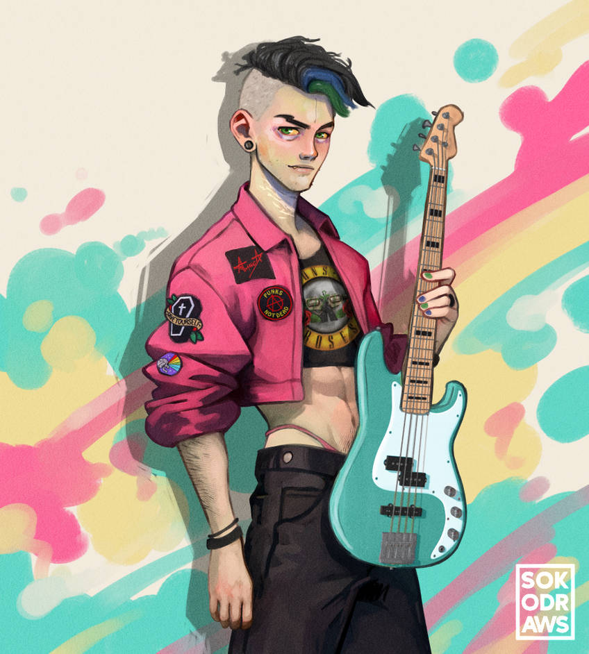](https://www.deviantart.com/sokoistrying/art/Mire-989919510 "Mire By sokoistrying")

Fuiste parte del selecto grupo de influencers que rodean a la directora J0hn. Estabas en la cima de la pirámide social, hasta que un día cometiste un error y caíste en desgracia.

Puede que criticases a la directora J0hn, fueras parte de algún tipo de trampa ilegal o simplemente te posicionaste de les débiles y oprimides.

Ahora malvives de favores y por la nostalgia de tus seguidores más fieles y a veces bastante obsesivos.

* **Habilidades recomendadas:** Interpretar, Intimidar y Persuadir
* **Ventajas recomendadas:** Carismatique, Famoso y Rique
* **Desventajas recomendadas:** Bocazas, Exceso de confianza y Habito (alcohol, drogas, etc.)

### Nacide libre

Estás a otro lado de la ley y de la sociedad desde tu nacimiento. Naciste en el bosque y, por tanto, careces de tu HUB de conexión.

Eso supone que no puedes moverte normalmente por la arcología como cualquier _noti_ y tienes que buscarte la vida para moverte por ella para conseguir recursos.

Por otro lado, no existes para empresa y eso es un gran valor.

* **Habilidades recomendadas:** Electrónica, Pasillear y Reparar
* **Ventajas recomendadas:** Persona de recursos, Osade y Sentir el peligro
* **Desventajas recomendadas:** Joven, Marginade y Nacide Libre (obligatorio)

### Paramedic

Este arquetipo refleja un amplio grupo de profesionales de la medicina capaces de curar y remendar todo tipo de golpes y heridas.

Te debes a tu juramento hipocrático, que está por encima de cualquier otra cosa. Nada hará que no lo cumplas, ni la propia directora J0hn en persona podría.

* **Habilidades recomendadas:** Ciencias, Medicina y Notar
* **Ventajas recomendadas:** Curandero, McGyver y Osado
* **Desventajas recomendadas:** Bocazas, Juramento y Exceso de confianza

### Periodiste

Dentro de este arquetipo se incluye a todo tipo de buscavidas que saben moverse por los bajos fondos y eludir a la ley para llegar al corazón de la noticia.

Tu medio siempre será _underground_, fuera de los canales oficiales que están pagados por la directora J0hn. Escribes en su blog, hablas en un podcast o lanzas a la red todo tipo de videos.

Sabes que el escándalo y el morbo vende y es la única manera de que tu contenido se viralice. Por eso siempre rodeas a tus denuncias de una capa de periodismo amarillo.

* **Habilidades recomendadas:** Investigar, Latrocinio y Notar
* **Ventajas recomendadas:** Conexiones, Investigador/a y Electrónica
* **Desventajas recomendadas:** Curioso, Impulsivo y Obsesión

### Sindicade

Este arquetipo reúne a todo tipo de trabajadores durante alienados que ha descubierto como la compañía oprime a los _notis_ y busca luchar contra esta injusta situación.

Puedes ser cualquier tipo de trabajador, siempre que busques la caída de la compañía y de la directora J0hn como su máxima representación.

* **Habilidades recomendadas:** Electrónica, Intimidar y Reparar
* **Ventajas recomendadas:** McGyver, Mr. Arreglalotodo y Sindicade
* **Desventajas recomendadas:** Bocazas, Leal y Tozude

[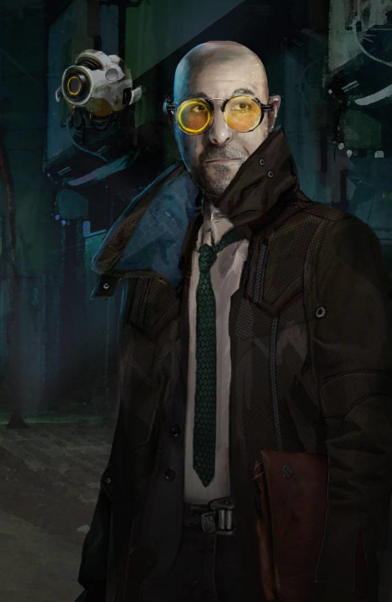](https://www.deviantart.com/kernspalt/art/Cyberpunk-reporter-856952409 "Cyberpunk reporter By Kernspalt")

## Nuevas habilidades

```
Bosque Sh3rW00d es una ambientación ciberpunk tremendamente urbana lo cual implica cambios en las habilidades básicas de Savage Worlds.
```

Como ya se ha dicho en la creación de personajes, **desaparecen Ciencia Extraña, Fe, Hechicería, Ocultismo y Psiónica**.

### Pasillear (Astucia)

Pasillear viene a sustituir a Supervivencia. Esta habilidad permite al personaje encontrar elementos como cables de red o electricidad o tuberías de agua, gas o climatización, paneles de control, centros de datos o puntos de conexión. Puede emplearse también para orientarse en los pasillos y cubículos de la arcología, leer mapas y buscar rutas de escape seguras.

A diferencia de Supervivencia, no se puede usar para seguir rastros, ya que en tornos urbanos no se dejan muchas huellas. Pero se puede usar para perseguir gente, buscando rutas alternativas, caminos más o menos usados, trochas y atajos, etc. A la hora de seguir a una persona se puede usar Pasillear en vez de Sigilo.

En persecuciones, en cada ronda puedes gastar tu acción para buscar la mejor ruta tirando Pasillear. Un éxito en la tirada supone un +1 a las tiradas de maniobras de tu conductor. Solo une pasajere puede realizar esta acción por ronda. 

### Idiomas

En la arcología de Nottingham se habla principalmente inglés, pero hay pequeños grupos que mantienen sus propios idiomas.

#### Leet

Los grupos underground de Nottingham usan un lenguaje escrito llamado Leet que busca complicar a las máquinas el reconocimiento de textos. Se intercambian caracteres por otros de forma similar como “A” por “4” o “S” por “$”, de forma que las IA y los constructos tengan problemas al leerlo, pero tú puedes interpretarlo fácilmente.

 Hello World")

Cuando necesites dejar un mensaje escrito o escribir un grafiti y que las IA no lo reconozcan e interpreten, puedes tirar Leet. Tu tirada será la dificultad para las máquinas (con la capacidad especial IA o Constructo) para entender tu mensaje. Deberán hacer una tirada de Astucia o Leet (en caso de saberlo) para entender el texto.

## Nuevas ventajas

```
Esta ambientación es un mundo difícil, pero hay una serie de ventajas propias que pueden serte de gran ayuda. Estas ventajas se centran más en temas sociales y legales que en tecnología, combate o cibernética, que son tan típicas de las ambientaciones ciberpunk.
```

Como ya hemos dicho, no hay animales, con lo que **Vinculo Animal y Señor de las bestias no se pueden escoger**.

### Alijos

**Requisitos:** Novate

Mientras que la ventaja Rique/Extremadamente Rique te ofrecen riquezas, tienen el problema de que están controladas por la compañía. Son rastreables y no se pueden usar en los bajos fondos y en situaciones ilegales.

Alijos te ofrece esa riqueza al otro lado de la ley. Tienes grandes cantidades de dinero en forma de alijos pueden ser objetos de valor, cupones de trueques, etc. Lo más importante es que es dinero que no está controlado por la empresa y se puede usar en actividades que no controla la compañía y/o de carácter ilegal.

> **Alijos funciona como Rique** salvo que solo se puede usar en temas ilegales o cuando no se quiera que las transacciones comerciales sean rastreables.

[](https://www.deviantart.com/mindofjen/art/ERROR-622951034 "ERROR By mindofjen")

### Identidad glitcheada

**Requisitos:** Novate, no puede tenerse Nacide Libre

Por alguna extraña razón, tu identidad a veces falla. Alguna vez tienes problemas al hacer pagos o cobrar tu sueldo. Lo interesante es que muchas veces los sistemas de reconocimiento y vigilancia no logran detectarte o te toman por otra persona. 

Si un sistema informático o intenta hacer un simple control de tu identidad funciona perfectamente o igual falla y a la segunda vez funciona perfectamente.

El problema lo tienen los sistemas de seguridad y vigilancia, hacen tantos chequeos por microsegundo de tu identidad que terminan fallando y ralentizándose y terminan tomándote por otra persona o simplemente te ignoran.

> Todos los **sistemas de seguridad e IA de vigilancia tienen un -2 a la hora de detectarte e identificarte** (Notar, Investigar o incluso Disparar). Si fallan suelen considerarte inexistente o te asignan otra identidad.  

### Necesarie para la compañía

**Requisitos:** Novate

Por alguna razón eres necesario para la compañía y no puede permitirse que desaparezcas. Quizás tus habilidades son muy valoradas o únicas, estás protegido por alguien importante o hay algo en ti que la compañía busca. Sea lo que sea, todas las IA y les secuaces de la compañía tienen órdenes de no dañarte, pueden intentar noquearte o inmovilizarte, pero deben evitar hacerle daño.

De normal **esta ventaja debería tener un Secreto** que explique por qué eres necesarie para la compañía.

> Todos los agentes de la compañía (humanos, constructos e IA) **deben pasar una tirada de Espíritu para tratar de dañarte**. Si fallan tendrán que cambiar su acción e intercambiarla por otra no dañina.

### Sindicade

**Requisitos:** Reparar d6

El sindicalismo está prohibido por la compañía. Mientras que la directora R1c4rd lo permitía de forma no oficial, J0hn la ha perseguido con todos sus recursos y aplicando las penas máximas.

Aun así, el movimiento está más fuerte que nunca sobre todo en las clases sociales más bajas. Todo esto es gracias a sus interacciones con otros grupos fuera de la ley como _boskis_.

Ser un cargo importante del sindicato debería venir con un Secreto, mayor o menor según el cargo.

Los sindicades siempre se apoyan (en temas laborales y de derechos), se ayudan y se cubren. No tienen por qué dar la vida por ti, pero arriesgarán lo mismo que arriesgues tú.

> Aparte de las ventajas de pertenecer a un grupo fuerte y unido, puedes **acceder a productos ilegales no controlados por las mafias** (drogas, estimulantes o implantes letales) como ciberimplantes ilegales que no sean de combate o materiales de hackeo.

## Nuevas desventajas

```
Esta ambientación es un mundo muy especial que claramente va a tener sus desventajas propias. Estas desventajas reflejan esa extraña mezcla que representa Bosque Sh3rW00d.
```
Para empezar hay una serie de modificaciones en las desventajas de Savage Worlds:

* **Manazas se convierte en una desventaja mayor.** En un mundo hipertecnificado ser manazas con la tecnología es una desventaja mayor.
* **Desaparece Mal nadador** por falta de grandes superficies de líquido.

Estas desventajas permiten darle un toque ciberpunk a tus personajes.

### Ciberalergia (mayor)

La capacidad de tu cuerpo aceptar ciberimplantes es mucho menor que el del resto de las personas.

> A todos **los costes de puntos de ciberimplantes debes sumarle 1 punto extra** por tu alergia. Si una persona normal gasta 2 puntos de ciberimplantes en ponerse un implante que le otorga Reflejos de combate, tú gastas 3 puntos. Lo bueno es que tu cuerpo combate la tecnología y tienes +1 a las tiradas de Vigor contra cosas como nanitos que se metan en tu organismo.

### Ciberparanoia (mayor/menor)

Tienes la insana convicción de que las IA te vigilan, te siguen y, lo peor de todo, crees que están contra ti. Siempre estás vigilando todo tipo de aparato y sistema electrónico a tu alrededor, esperando detectar algún elemento que delate que las IA te están escuchando y conspirando a tus espaldas.

> Como **desventaja menor, tienes un -1 en todas las tiradas de habilidad que exijan concentración** (como abrir cerraduras, jugar a las cartas, descifrar un código, …) cuando haya elementos de vigilancia a tu alrededor que es casi siempre. Si se toma **como mayor, además, el -1 se aplicará a todas las tiradas de percepción (Notar e Investigar)**, ya que estarás más preocupado en que no te vigilen y espíen las IA que en vigilar o buscar a tus objetivos. Por otro lado, conoces a tu enemigo, así que obtienes un bono (+1 menor, +2 mayor) a Electrónica al tratar con sistemas electrónicos de vigilancia, rastreo y seguridad.   

### Fobia social (mayor/menor)

La fobia social, conocido también como trastorno de ansiedad social (TAS), es un trastorno de ansiedad caracterizado por un miedo persistente a una o más situaciones sociales por temor a que resulten embarazosas.

Dar discursos en público, participar en concursos, desfilar por una pasarela, etc. se vuelven tareas muy complicadas, aunque tampoco llevas bien las reuniones sociales en las que tendrá que relacionarse (fiestas, eventos, etc.) o los encuentros inesperados con conocidos, familiares, amigos, etc.

Nottingham tiene una altísima densidad de población, lo cual hace que las situaciones de fobia social sean muy normales. También gracias a la tecnología se puede estar en todas partes sin estar realmente.

> **No puedes gastar benis cuando estás rodeade de demasiada gente** observando y juzgando lo que haces.

### Imán de lo extraño (menor)

Todo lo extraño se siente atraído hacia ti para bien y para mal. No es algo que busques, simplemente es algo que pasa. A veces es una bendición y otras una maldición, pero la mayoría de las veces es un fastidio.

Seguro que caerás por la esclusa que lleva a la madriguera del cocodrilo albino que nadie creía que existís, abres el armario donde le influencer guarda sus útiles fetichistas o se te cae una probeta llena de nanitos que te tiñen la cara de azul.

> Cuando haya que hacer **tiradas al azar** para ver a quién le pasa algo raro, se debería **elegir directamente al imán de lo extraño**.

### Nacide libre (mayor)

Tus progenitores te concibieron fuera del sistema, bien porque también estaban fuera del sistema o porque así lo decidieron antes de nacer tú. Sea como sea, no tienes HUB de conexión. 

Esta desventaja deberías reservarla para _boskis_ nacides en el bosque, el resto de personas es muy difícil que no hayan sido registrados en el sistema de la compañía y se les haya implantado el HUB.

Si eres detenido, es fácil saber que no estás en el sistema, porque el sistema no tiene fallos. Si dice que no existes es que eres un _boski_ infiltrado en el complejo.

En el momento que **te implantan un HUB de conexión, se pierde esta ventaja**.

> No tienes **ninguna de las ventajas de tener HUB de conexión** al sistema, pero lo compensas no teniendo **ninguna de las desventajas**. A priori no existes para la directora J0hn y sus tentáculos cibernéticos. No hay registros, ni huellas, ni ningún dato sobre ti y **eres invisible para la gran mayoría cámaras y sensores de la arcología**.

## Equipo

```
Tu banda de proscrites necesitará ropa, armas, herramientas y poder darse algún capricho alguna vez. Aquí encontrarás cosas para darle color a tus aventuras para cuando a tu banda le pesen los créditos en los bolsillos.
```

Los precios del equipo están en $ siguiendo las tablas de equipo de SWAE, pero la moneda oficial es el Crédito. No existe físicamente el crédito, sino que tus créditos están asociados a tu HUB de conexión y pagas telemáticamente con él.

Las personas sin HUB como los _boskis_ de segunda generación no pueden pagar con créditos normales. En estos casos podrán hacer uso de sus alijos y hacer un trueque con ellos. No debes olvidar que el equipo ilegal tampoco suele poder pagarse con créditos, así que también deberás hacer trueques para pagarlo.

### Equipo normal

Esta ambientación es ciberpunk y, por tanto, un poco futurista, pero con importantes toques medievales. Eso marca el equipo normal que puede tener tu banda. Tendrán smartphones, tabletas y ordenadores portátiles, pero comerán con cucharas, tenedores o palillos de plástico. Tendrán medpacks para cerrar sus heridas sangrantes en segundos, pero seguirán llevando sus botas a remendar a un zapatero.

En principio pueden tener acceso a todo el equipo normal que hay en el libro básico al precio allí marcado, pero con pinta de futurista. Por ejemplo, si necesitan comunicarse durante un golpe tendrán unos auriculares minúsculos que casi ni se detectan dentro de la oreja, en vez de unos walkie-talkies. 

### Armas

Las armas de fuego no están permitidas en el complejo y, de hecho, su tenencia y/o construcción tienen las mayores penas de los delitos no violentos. En principio solo los sheriffs y sus ayudantes tienen acceso a este tipo de armas. 

Si cualquier sistema de seguridad del complejo de Nottingham detecta un disparo, saltan las alarmas y rápidamente los sheriffs cercanos se acercan a detener a le pistolere. En caso de no haber ninguno cerca los sistemas tratarán de seguir e identificar a les portadores de pistolas para identificarlos y detenerlos.

De hecho, disparar un arma puede ser una buena forma de crear distracciones, pero le tiradore tendrá graves problemas si quiere escapar de lo que se le va a echar encima.

Puedes usar armas normales de la época actual del manual básico de SWEA para que las porten tus PNJ cuando se enfrente a tu banda. Si derrotan a su enemigo y este está armado podrán quedarse con las armas, pero deberán racionar las balas porque son extremadamente escasas. También deben saber que les autoridades de Nottingham pondrán directamente en la lista de más buscados a personas que porten armas de fuego.

Culturalmente, tienes que tener en cuenta que el pueblo quiere a ladrones carismáticos que reparten su botín con les pobres, no a asesinos violentos armados hasta los dientes que van dejando un reguero de sangre por donde pasan.

#### Arcos

Los arcos de competición recurvos y de polea son la opción de armas a distancia más poderosas que se pueden portar sin tener a todos los sheriffs encima. Siguen siendo ilegales, pero no atraen tanto la atención. aun así no suelen ser muy eficaces, ya que los espacios son pequeños y encima entras en combate cuerpo a cuerpo muy fácilmente. Además, las coberturas detrás de paredes y puertas son muy comunes y puedes parapetarte de ellas y estar a salvo de arcos.

Tampoco son fáciles de esconder y de deshacerse de ellas, lo que no los hace adecuadas en golpes y atracos.

#### Slingshot (Tirachinas)

El tirachinas es el arma preferida por los pandilleros, la gente de la lucha callejera y los _boskis_. Son ligeros, versátiles y perfectos para los combates cercanos tan comunes en los espacios cerrados del complejo. Pero sobre todos muy baratos.

Piensa que se puede construir con poco materiales y fáciles de conseguir y la munición es baratísima. No deja rastro y es muy versátil. Puede lanzar desde rodamientos a cocteles molotov con mínimos cambios. Además, a pesar de ser a dos manos, se considera una arma distancia pequeña con lo que puedes usarlo contra une enemigue en cuerpo a cuerpo.

A todo esto se le suma su capacidad de disparar haciendo rebotes que permiten atacar a objetivos detrás de paredes, a la vuelta de la esquina o parapetados detrás de mesas y sofás.

##### Rebotes

**El tirachinas permite disparar haciendo rebotes** contra el techo y las paredes **para alcanzar a gente que está detrás de cobertura**. Antes de disparar, puedes rebajar la cobertura de tu oponente. Cada -2 que quites de tu contrincante, supone un rebote. **Cada rebote es un -1 a tu tirada de Disparar y -1 a tu tirada de Daño**.

Ejemplo: si disparas a una persona detrás un coche (cobertura media -4), puedes hacer un rebote y el bono de cobertura pasa de -4 a -3 y el daño obtiene un -1. Si hicieras dos rebotes, el bono de cobertura pasa de -4 a -2 y el daño obtiene un -2.

Si tu **objetive está completamente cubierto**, aún puedes dispararle. Para calcular la dificultad debes considerar que **tiene cobertura -10**, pero **es necesario que veas al objetivo de alguna forma**, por ejemplo, hackeando las cámaras de seguridad y lanzando la señal a alguna pantalla cercana. De esa forma podrás ver su posición y calcular los rebotes.

##### Proyectiles para tirachinas

Una de las ventajas de los tirachinas es que **su munición puede ser cualquier cosa**, pelotas de goma, rodamientos de acero, canicas de cristal, etc. Eso también quiere decir que se pueden hacer **todo tipo de municiones especiales con diferentes funciones**. 

* **Afiladas:** El proyectil acaba en una punta afilada que hace más daño. +1 al daño.
* **Con plumas:** Tienen unas pequeñas aletas roscadas que los estabilizan al hacerlas girar. +1 a Disparar.
* **Incendiarias:** Son bolas rellenas de material inflamable. Al impactar solo el daño de la FUE, pero añaden 1d6 de daño de fuego y con un 6 en un d6 prenden fuego tus ropas.
* **Rellenas de pintura:** Son bolas rellenas de una sustancia espesa parecida a pintura negra (o de otros colores) que cuesta mucho desprender. Se usan para marcar objetivos, normalmente con colores chillones, o para cegar sensores de vigilancia, tapando las lentes con esta brea pegajosa. Al impactar solo hacen el daño de la FUE.

#### Aire comprimido

La pólvora supone muchos problemas en Nottingham, pero el aire comprimido no, así que los diferentes grupos que hay en el complejo lo usan bastante en sus disputas. El aire comprimido se usa de arma, principalmente, como cerbatanas de aire comprimido y como pistolas de clavos.

##### Cerbatanas

No estamos hablando de las armas clásicas de las tribus amazónicas sino su versión más ciberpunk, un tubo metálico, con una cápsula de aire comprimido y algún tipo de proyectil, como un clavo. Se rompe la cápsula y el aire comprimido lanza el proyectil. Son muy fáciles de hacer, pero solo tienen un disparo. Con los componentes y herramientas adecuadas y una tirada de Reparar, tras trabajar una hora tenemos una cerbatana. 

Estos tubos de unos 25 cm disparan un solo clavo y son fácilmente camufables al no tener forma de arma ni usar pólvora. Suelen usarse a traición. Se pone el tubo hacia la nuca del objetivo sin que se dé cuenta y se dispara. Muerte asegurada y muy silenciosa.

##### Pistolas de clavos

Se cuenta que los primeros en usar las pistolas de clavos como armas fueron les instaladores tratando de matar a un grupo de ratas gigantes que invadieron el complejo en sus inicios.

De hecho existe un dicho sobre este tema «Eres más viejo que matar ratas con una pistola de clavos». También se usa mucho en jerga «pásame la matarratas» para referirse a la pistola de clavos.

Estás pistolas, usadas en su mayoría por la gente de mantenimiento en su día a día se han convertido en una arma muy usada por criminales y proscrites. Su ventaja principal es que tienen una gran capacidad de hacer daño sobre todo en distancias cortas y su munición es fácil de hacer y difícilmente detectable.

La compañía ha tratado de regular su venta, sin éxito, ya que es una herramienta muy usada y necesaria en una estructura de 200 años que lleva décadas sin un mantenimiento adecuado. Además, su funcionamiento es muy sencillo y son fácilmente reparables.

#### Cóctel molotov

Este clásico finlandés no pierde fuerza por mucho que avancen los siglos y la tecnología. Su bajo precio y su gran eficacia no tienen competencia y siempre habrá combustible, tela y recipientes que se rompen al golpear superficies duras.

|ARMA|DAÑO|DISTANCIA|PESO|COSTE|CDF|FUE MIN.|PA|NOTAS|
|---|---|---|---|---|---|---|---|
|Slingshot|FUE+d4-1|5/10/20|30|1|1|d4|-|Contundente, ¹ Recarga gratuita, ² 2 manos, Rebote|
|Arco compuesto desmontable|FUE+d6|12/24/48|3,5|300|1|d6|1|³ Desmontable|
|Cerbatana de aire comprimido|2d8|2/4/8|0,5|15|1|d4|2|Un único disparo|
|Pistola de clavos|2d8|2/4/8|2|150|1|d6|2|⁴ Cuerpo a cuerpo|

¹ Cargar un proyectil en un tirachinas es una acción gratuita que solo pueden realizarse una vez por acción.

² A pesar de ser a dos manos, es una arma a distancia pequeña con lo que puedes usarla contra une enemigue en cuerpo a cuerpo.

³ Se puede desmontar gastando una acción y se puede montar gastando 3 acciones. Al montarlo es necesario tener una llave Allen para tensarlo.

⁴ Debido a su tamaño pequeño puede usarse cuerpo a cuerpo.

|ARMA|DAÑO|PESO|COSTE|FUE MIN.|PA|NOTAS|
|---|---|---|---|---|---|---|
|Stick de hockey de pasillo|FUE+d4|1|10|d6|-|Contundente|
|Stick de hockey de pasillo con alambre de espinos|FUE+d4+1|1|10|d6|-|Contundente|
|Palanca de hierro|FUE+d6|1|15|d6|-|Contundente|

|ARMA|DAÑO|DISTANCIA|PESO|COSTE|ÁREA|NOTAS|
|---|---|---|---|---|---|---|
|Cóctel molotov|1d10|5/10/20|0.5|1|1 casilla|¹ Daño de fuego|

¹ Si sale un 5 o 6 en un d6 prende la ropa del objetivo.

Se pueden preparar, si tienes los componentes, 10 cócteles por horas con una tirada de Reparar exitosa.

Se usa **Atletismo para lanzar el cóctel**. Si se pasa por una casilla donde se ha tirado un cóctel molotov, se recibe 1d10 de daño y con un 5 o 6 en un d6 prenden fuego tus ropas.

Hay **tirachinas especiales para el lanzamiento de cócteles que duplican su alcance**, pero en este caso **se usaría Disparar** en vez de Atletismo

#### Otras armas

Tu banda y sus némesis pueden portar otras armas como espadas, katanas, mazas, etc. Pero lejos de ser obras de artes decoradas, estamos hablando de toscos machetes hechos de chapas de acero cortadas en forma de hoja, afiladas con una rotaflex y con un mango de cinta americana o superestilizadas versiones de armas medievales como espadas de titanio con vaceos con LED.

A efectos prácticos, tienen las estadísticas del libro básico de SWAE, pero puedes darles detalles ciberpunk como los que te he propuesto antes. 

### Protecciones

Las protecciones **son algo raro en Nottingham**, tenemos ropa de sintecuero que pueden dar algo de protección, pero el kevlar y otros tejidos ablativos son raros porque no se fabrican y la compañía no los importa.

Si tu banda necesita protecciones podrán **encontrar como mucho Ropa/Cuero de Armaduras Contemporáneas**. Quizás tus PNJ que vayan tras la banda puede tener **Armaduras Ligeras del apartado Armaduras Futuristas**.

En general **conseguir más de 4 puntos de protección tendría que ser muy raro y muy caro** también. En realidad es más fácil conseguir ciberimplantes que otorguen armadura que armaduras propiamente dichas.

El equipamiento de hockey de pasillo (peto con hombreras, rodilleras, coderas, casco y brazales) puede usarse como protecciones en combate y son totalmente legales. 

|PROTECCIÓN|LOCALIZACIONES|ARMADURA|FUE MÍN.|PESO|COSTE|
|---|---|---|---|---|---|
|Protecciones de hockey de pasillo|Peto, brazos y piernas|+2|d6|5|250|
|Casco con visor de rejilla de hockey de pasillo|Cabeza|+2|d6|1.5|95|

### Transporte y comunicación

Andar es la forma más normal para moverse por el complejo usando escaleras mecánicas, montacargas y turboascensores, pero si quieres moverte más puedes recurrir a patines en línea, skateboards y bicicletas eléctricas. Aunque su uso exige una buena habilidad para saltar obstáculos, bajar y subir escaleras, deslizarse por rampas, etc.

[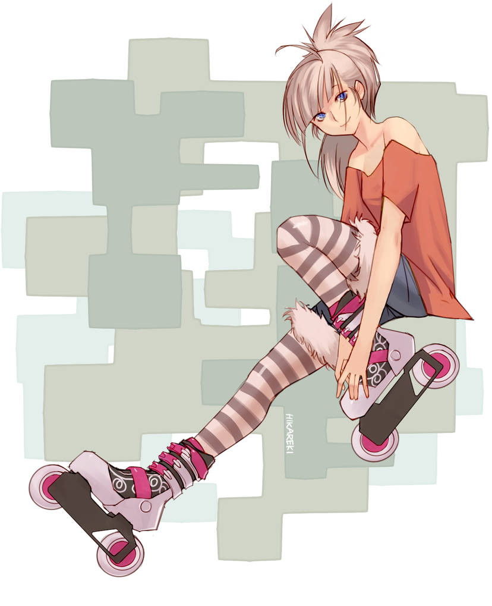](https://www.deviantart.com/hikareki/art/Rollerblade-649072662 "Rollerblade By HikaReki")

#### Monturas: Roller skates, skateboards y e-bikes

En un sitio cerrado y lleno de obstáculos como escaleras, puertas o vallas. Parece que no tiene sentido usar todos estos vehículos, pero cuando ves a les mensajeres moverse con ellos a gran velocidad saltando, _slayando_ y _grindando_ sobre el mobiliario urbano te das cuenta de que pueden ser muy útiles si sabes usarlos.

Los **skateboards y rollers** (y todas sus variantes) no tienen habilidad de Conducir propia, en su lugar **se usa en su lugar Atletismo**.

Los rollers cuestan dos acciones ponérselos y otra quitárselos, pero puedes intentar **quitártelos como acción gratuita con una tirada de Atletismo**. Si fallas la tirada acabas tirado en el suelo y tardas 2 acciones en quitártelos.

Las ventajas **Parkour y Acrobacias puedes aplicarlas cuando usas rollers, skates y bicis**, si tienes la habilidad de conducción adecuada.

|VEHÍCULO|TAMAÑO|MANIOBRA.|VEL. MÁX.|DUREZA|TRIPULACIÓN|
|--------|------|----|---|------|-----|-----|
|Roller skates|-4|+2|32 km/h|4|1|
|Skateboard|-3|+1|30 km/h|4|1|
|E-bike|-1|+1|35 km/h|5|1+1|

## Hackeos de les instaladores

```
Les instaladores tenían pequeños hackeos que usaban en su día a día y que les permitían usar los elementos de la arcología y el equipo de formas para los que no estaban preparados, como acelerar la velocidad de los montacargas o hacer que las puertas de los ascensores se abrieran solas sin que hubiera ascensor.
```

Estos hackeos han ido siendo descubiertos con los años, normalmente de forma casual. Son combinaciones de botones, cambios de polaridad, puentes rápidos y cosas parecidas. Están tan integradas en el código de los sistemas que todos los intentos de extirparlos ha supuesto fallos generalizados del sistema. Así que se han terminado por aceptar como algo inevitable.

Estos hackeos son una especie de mezcla de ventaja y poder que **pueden aprenderse gastando un avance** y cumpliendo los requisitos. Por un avance puedes comprar un hackeo de tu rango o dos hackeos de rangos inferiores.

A priori, puede parecer que gastar un avance para controlar un ascensor es muy caro, pero pensad que muchas veces los refuerzos podrán llegar antes o después si tienes control del montacargas que da acceso a tu sección de la arcología.   

Salvo que el hackeo diga lo contrario, **todos necesitan una tirada de Electrónica**. Si se pasa se consigue uno de los posibles efectos del hackeo. No se pueden ejecutar varios hackeos a la vez sobre el mismo sistema, solo un efecto estará activo, aquel con la tirada de Electrónica más alta.

Los hackeos son muy rápidos de realizar, por ello **solo necesitan una acción**. Salvo que el hackeo diga otra cosa, la **duración es de 4 turnos**. Puedes gastar avances para conseguir otros 4 turnos extras.

Una persona que conozca el mismo hackeo podrá **desactivarlo haciendo una tirada de Electrónica**. La dificultad es la tirada de Electrónica del que ejecutó el hackeo.

Gastar avances en más tiempo u otras modificaciones hace que resten 4 puntos a su dificultad. De forma que si sacas 10 en tu tirada de Electrónica y gastas un avance en alargar la duración del hackeo, aquella persona que quiera desactivar tu hackeo tira contra 6 (10 - 4).

### Controlar iluminación

**Requisitos:** Novate

**Jerga:** Ve a pagar el recibo de la luz, Muchos kilovatios/hora, Clap, Clap, Clap (3 palmadas), Funde los plomos 

Mediante una mezcla de movimientos captados por los sensores de la iluminación y clics en los mandos de la luz, hacen que la iluminación actúe de las siguientes formas. Debes recordar que no hay fuentes naturales de la luz así que las estancias se quedan completamente a oscuras si se apaga la luz (a falta de otras formas de luz como leds de dispositivos o linternas). No se puede conseguir oscuridad total porque hay luces independientes de emergencia.

[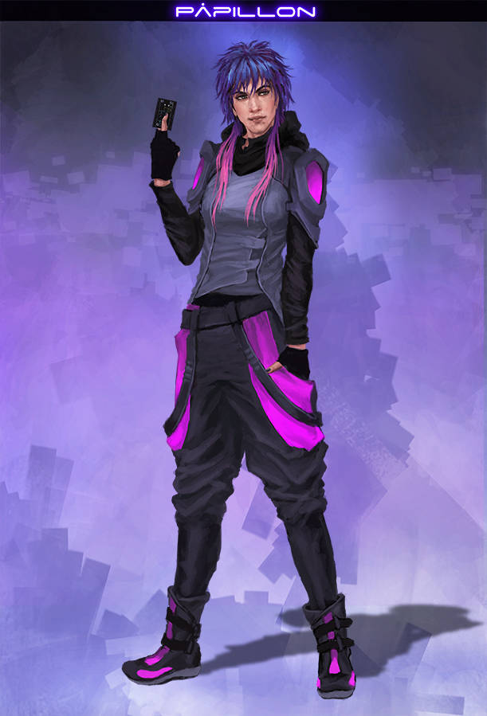](https://www.deviantart.com/cyberaeon/art/Hacker-588810800 "Hacker By cyberaeon")

* Puedes inutilizar la iluminación de una sala haciendo que se quede **encendida o apagada durante la duración del hackeo**.
* Poner las luces de una habitación en **modo estroboscópico**, lo que supone **-1 a todas las tiradas de habilidad que exijan la vista** como disparar o buscar algo.
* Poner las luces de una habitación en **modo _random_** de forma que se **enciendan o apaguen al azar** cada turno (par se apagan, impar se encienden).

### Controlar pantallas

**Requisitos:** Novate

**Jerga:** Se acabó la programación, He pagado Netflix, Ven a la Luz Caroline, Saltar píxeles. 

Les instaladores escondían sus propios modos de funcionamiento en menús secretos de las pantallas. Además de encenderlas, podían dejarse mensajes y lo más divertido, sobrecargarlas y conseguir unos bonitos mini-fuegos artificiales.

* Puedes **encender y apagar pantallas** y también **programar** su encendido y apagado.
* Puedes **poner mensajes simples y estáticos** en las pantallas.
* Puedes programar la sobrecarga de una pantalla de forma que salten chispas y se queme. El tiempo máximo de programación es de 4 turnos a no ser que gastes avances. Funcionaría como Truco, donde tu adversarie deberá tirar Astucia contra tu tirada de Electrónica. 1 avance por cada pantalla adicional que se vea afectada por el truco.

### Llamar ascensor

**Requisitos:** Novate

**Jerga:** Quiero un subidón, Me está dando un bajón, Llama a Otis (por la placa del fabricante que hay en los ascensores más antiguos) 

Pulsando una combinación de botones de ascensores, montacargas y escaleras mecánicas puedes conseguir ciertos efectos sobre ellos.

* Puedes hacer que un **ascensor/montacargas venga a ti**, saltándote cualquier otra llamada previa.
* Puedes hacer que un **ascensor/montacargas vaya a un extremo u otro de su ruta**. Este hackeo dura hasta que llega al punto final de su ruta elegido.
* Puedes **cambiar la dirección de unas escaleras mecánicas**. Moverse en dirección contraria a las escaleras se considera terreno difícil.

### Controlar realidad aumentada

**Requisitos:** Novate

**Jerga:** Solo puede quedar uno, Ponte candado, Juguemos a los sims 

Cada espacio del complejo tiene un generador de realidad aumentada que otorga a los dispositivos de realidad aumentada de las personas que están en el de información interesante sobre los espacios. Hablamos de datos públicos de otras personas en ese espacio a la ruta hacia diferentes lugares (literalmente se genera una línea amarilla en el suelo que te indica el camino como si de un videojuego se tratara). Mediante una combinación de pasos, el generador de realidad los detecta y te abre un _modo instalador_ que te ofrece las siguientes ventajas.

* **Presencia cercana de otro instaladore,** lo cual no es útil porque se fueron todes.
* **Genera datos aleatorios de ti** de forma que según los dispositivos de realidad aumentada eres otra persona. El resto de usuarios no verán tus datos reales. Los sistemas de seguridad no funcionan con los de realidad aumentada y siguen reconociéndote.
* El _modo instalador_ **agrega a una capa extra de información** que les instaladores usaban para su trabajo, principalmente un inventario de los objetos de la zona estableciendo cuanto llevaban allí y cuando se realizó el último mantenimiento. Puede usarse, por ejemplo, para saber si una alcantarilla lleva mucho tiempo sin abrirse o cuanto lleva una pared llena de grafitis sin limpiarse. Como DJ, puedes añadir datos extras a las descripciones, al activar este modo. Esos datos puedan ser usados como pistas por tu banda.

### Controlar puertas

**Requisitos:** Experimentade

**Jerga:** Ábrete sésamo, Alojomora

Mediante una serie de gestos cerca del sensor de movimientos de una puerta automática se puede activar o desactivar las puertas o sacar modos especiales.

Este hackeo **vale para puertas simples**. Aquellas con cerraduras, sensores biométricos o claves necesitan hackeos de más nivel.

* **Activar/Desactivar:** con este hackeo la puerta se queda cerrada o abierta indefinidamente. Gastando dos acciones y una tirada Electrónica dificultad tirada del hackeo se puede volver a dejar como estaba.
* **Mover la posición del sensor de movimiento:** Puede usarse para hacer que la puerta se abra solo si detecta cierta circunstancia, por ejemplo si subimos el sensor solo detectará figura altas y no abrirá para los robots pequeños de reparto. Esto solo funciona para un sensor y cada puerta tiene dos sensores uno a cada lado. Si queremos cambiar ambos sensores habrá que hacer el hackeo dos veces, uno en cada lado de la puerta.
* **Desactivar el control de entrada y salida:** las puertas más simples controlan solo la entrada y salida de personas para temas de aforo y cuando han sido dichos accesos. Se puede desactivar y volver a activar el control de acceso de persona de forma que no que registrada ni los accesos. Por ejemplo, se podrían desactivar el control de acceso de una puerta, salir por ella y volver al de un rato y activarla de nuevo.  Para el sistema durante ese tiempo no habría habido ningún movimiento.

[](https://www.freepik.com/free-photo/woman-passenger-railway-station-board-with-departure-routes_13723157.htm "Woman passenger at railway station, board with departure routes by kroshka__nastya")

### Controlar ascensor

**Requisitos:** Experimentade, Llamar ascensor

**Jerga:** Maldita música de ascensor

Permite hacer cosas con los montacargas, ascensores y escaleras mecánicas fuera de su programación normal, pero sin salirse de sus parámetros de seguridad.

* **Acelerar/desacelerar la velocidad de montacargas, ascensores** y escaleras mecánicas dentro de unos parámetros seguros.
* **Parar en mitad de pisos** de manera que se pueda acceder a conductos y pasillos de servicios que estén en esas alturas.
* **Aumentar los valores de seguridad de manera que sean más restrictivos.** Por ejemplo, bajar el límite de peso máximo para que solo puede usarlo un sheriff en vez de dos. 

### Dominar iluminación

**Requisitos:** Experimentade, Controlar iluminación

**Jerga:** Kilovatio-hora, Light my fire

 Con este hackeo se pueden conseguir nuevos efectos que permiten usar la iluminación a tu favor sobre todo en situaciones de combate. 

* Usando este hackeo se pueden hacer los hackeos de Controlar Iluminación pero controlando las luces de emergencia y de seguridad y similar.
* Hacer que las luces sigan un objetivo, **iluminando u oscureciendo la zona donde está el objetivo**. Esto afecta a la visibilidad del objetivo tanto en combate como en sigilo.
* **Sobrecalentar un grupo de luces y hacerlas explotar.** Toda persona adyacente a un foco recibe 1d6 daño debido a la explosión y los cristales rotos.1 avance por cada objetivo/grupo de luces extra. No se puede sobrecalentar un grupo de iluminación ya sobrecalentado.

### Controlar climatización

**Requisitos:** Experimentade

**Jerga:** Se acerca el invierno, Hazte un Elsa

Mediante interacciones con paneles de control de climatización o interactuando directamente con sus elementos como ventiladores, sensores de temperatura/humedad, puedes controlar la climatización de una habitación.

* En general puedes hacer que la sala en la que estes los **sistemas de climatización se enciendan o se apaguen** cuando quieras o ante cierto tipo de gatillo como temperatura, humedad, número de personas en la habitación, etc. Pero siempre dentro de los parámetros normales y seguros de la climatización.

* Puedes **inutilizar los sensores termográficos** de una sala subiendo o bajando la temperatura de la sala, sin que los sensores de seguridad se den cuenta de que la climatización está funcionando erróneamente. Aun así otros sensores seguirán funcionando sin problema.
* Pueden afectar a les humanes y los aparatos que haya en el habitáculo, de muchas maneras. Ya hemos visto que se pueden aumentar la temperatura o bajarla, hasta hacer que se esté incómodo, pero también se puede bajar la humedad para hacer que se sequen las cosas (y hacer cecina casera) o que se humedezcan las cosas y se estropeen los equipos eléctricos con pocos días.

### Controlar vigilancia

**Requisitos:** Veterane, Controlar pantallas, Controlar realidad aumentada

**Jerga:** El ojo que todo lo ve, El gran hermano

Mejorando tus hackeos que te permiten controlar la realidad aumentada y las pantallas puedes empezar a hackear los sistemas de seguridad. No tienes grandes permisos de acceso, pero los suficientes para ayudarte a saltarte los controles de seguridad de diferentes instalaciones.

* Permite **cambiar los parámetros generales de funcionamiento, pero nunca se podrá interferir en sus funciones principales** o apagarla. Si una cámara tarda 5 segundos en girar 180 grados para controlar un pasillo puedes hacer que tarde más dándote tiempo a moverte por una zona del pasillo mientras vigila la otra parte. En general puedes hacer cosas para que las tiradas de sigilo o atletismo para evitar la seguridad tenga un +2 o y también un -1 si quieres que otros tengan problemas al saltarse la seguridad.
* Puedes **pedirle al sistema de seguridad que te ofrezca datos** como grabaciones, registros de acceso, pero sin poder modificarlos o borrarlos de ninguna manera.
* Puedes hacer que **envíen demasiadas señales a les vigilantes o demasiadas pocas**, pero no puedes **cortarlas o cambiarlas**. Con ello puedes atraer a les vigilantes o hacer que vayan a otros sitios en vez de a donde estás tú.

### Dominar ascensor

**Requisitos:** Veterane, Controlar ascensor

**Jerga:** Grandes éxitos de la música de ascensor

Una combinación de botones del panel interno de la caja del ascensor, te permite saltarte las salvaguardas de seguridad y de funcionamiento de un ascensor, desde soltar los frenos a trabar las puertas.

El problema de este hackeo es que **hay que hacerlo desde dentro del ascensor**.

* Puedes **desactivar los frenos de seguridad de un ascensor y dejarlo caer.** Estando dentro el ascensor no es muy normal quitar los frenos, pero puede despistar a otras personas dentro del ascensor con la caída o incluso golpear a alguien o algo que esté subiendo por el hueco del turboascensor.

* Puedes **bloquear las puertas encerrando dentro a sus pasajeres** y evitando que entren desde fuera. De esta manera puedes convertir la caja del ascensor como una zona segura donde descansar y evitar que te ataquen. Puede ponerlo en movimiento para que sea más difícil acceder a él desde el techo.
* Puedes **dejar ciertos programas preparados**, de manera que el ascensor vaya superlento, no permita acceder a cierto piso o siempre se abra en todos los pisos. En estos casos el hackeo se debe hacer desde dentro, pero la programación no supone que tengas que estar en el interior mientras se lleva a cabo.

### Dominar climatización

**Requisitos:** Veterane, Controlar climatización

**Jerga:** ¡Dale caña a la ventilación!

Esta versión avanzada de Controlar Climatización, permite principalmente saltarse los niveles de seguridad de los aparatos de climatización y también permite usarlo durante el combate.

* Puedes hacer las mismas acciones que con **Controlar Climatización pero saltándote los límites de seguridad** de la climatización y forzando sus límites. Aun así la climatización nunca podrá hacer daño a les ocupantes de la habitación, pero puedes intentar hacer algún tipo de truco como encender un ventilador para que distraiga a un oponente o generar hielo para que la gente resbale.
* Puedes poner los **ventiladores a tal velocidad, más allá de lo seguro**, de manera que el viento que se genere afecte a la precisión de los disparos. Todas las personas dentro de la zona de climatización tendrán que pasar una tirada de FUE o tendrán un -2 al disparar.
* Puedes **controlar climatizaciones** en lugares especiales **con medias extras de seguridad** como salas de servidores refrigeradas.

### Dominar puertas

**Requisitos:** Veterane, Controlar puertas

**Jerga:** Maestro de las llaves, Guardián de las puertas 

Ninguna puerta está a salvo de tus hackeos. Solo puertas desconectadas la red o con componente mecánicos como llaves o combinaciones, podrían darte problemas. Al ser de tan baja tecnología no pueden ser hackeadas. 

* Usando este hackeo se pueden hacer los **hackeos de Controlar puertas pero controlando las puertas de seguridad con cerraduras**, o sensores biométricos.
* Puedes **dejar ciertos programas preparados**, de manera que la puerta solo se activa frente a determinados gestos o colores, siempre emita fallos extraños o deje de funcionar para ciertas personas.
* Puedes **afectar a varias puertas de la estancia**, de manera que interactúen entre ellas. Si se abre una se abren otras, si se cierra una se cierran todas.

### Dominar vigilancia

**Requisitos:** Heróique, Controlar vigilancia

**Jerga:** Hablar con el gran hermano, El ojo que todo lo ve

Dominar los sistemas de vigilancia, mediante órdenes verbales y gestuales, permite acceder a funcionalidades que solo el personal de seguridad puede llevar a cabo, desde borrar las grabaciones de una cámara a ponerla en bucle o mostrar el contenido de otra cámara.

* Puedes **apagar los sistemas de seguridad, encenderlos, hacer que varien sus rutinas o que pasen de ti**, tienes control total sobre ellos.
* No solamente puedes accederá los **datos de los sistemas de vigilancia**, sino que puedes **introducir nuevos, cambiar los que hay o directamente borrarlos**.
* Puedes hacer que los **sistemas contesten a otros usuarios con los mensajes que quieras**, como que todo está tranquilo, mientras tú haces lo que te da la gana o que emitan imágenes en bucle para que les humanes vigilantes no detecten nada.

### Clave de superusuarie

**Requisitos:** Legendario, Especial

**Jerga:** Código konami, 777


La clave de superusuarie o clave SU es un hackeo legendario que solo conocían les instaladores y que se cree que se perdió con su marcha.

De alguna manera desconocida (y a discreción de ti como DJ) te registras en el sistema del complejo y te identificas como superusuarie. Según les buscadores debía ser algún tipo ceremonia secreta con muchos elementos programáticos. Aunque igual era una simple entrada en una tabla de una base de datos perdida entre los miles de datos y ficheros que manejan los miles de sistemas del complejo.

Te permite hacer todo lo que marcan los **hackeos anteriores con un bono de +4** y solo otra persona con este hackeo puede deshacer tu hackeo.

Por ejemplo, si como superusuarie desactivas una puerta automática solo volverá a funcionar si otro superusuarie lo vuelve activar superando tu tirada de Electrónica o a malas reemplazando toda la puerta por una nueva.

> Este hackeo debe ser enseñado por otro superusuarie y que se sepa solo les instaladores (y solo les dé mayor nivel) lo conocían.

|Hackeo|Requisitos|Descripción|
|---|---|---|
|Controlar pantallas|Novate|Encender y apagar pantallas y poner mensajes simples|
|Controlar iluminación|Novate|Encender y apagar luces y otros efectos simples|
\conc

|Hackeo|Requisitos|Descripción|
|---|---|---|
|Llamar ascensor|Novate|Robar el ascensor a otras personas o mandarlo a un extremo de su ruta|
|Controlar realidad aumentada|Novate|Controlar la información pública que la realidad aumentada proporciona|
|Controlar puertas|Experimentade|Activar y desactivar puertas automáticas y controlar sus sensores básicos|
|Controlar ascensor|Experimentade, Llamar ascensor|Te permite hacer cosas con el ascensor que sus salvaguardas normales no permiten, pero siempre desde dentro de él.|
|Dominar iluminación|Experimentade, Controlar iluminación|Permite controlar las luces de emergencia y similar y conseguir nuevos efectos que te benefician en situaciones de combate. |
|Controlar climatización|Experimentade|Modificar la climatización dentro de sus parámetros de seguridad|
|Dominar ascensor|Veterane, Controlar ascensor|Saltarse las salvaguardas de seguridad y de funcionamiento de un ascensor|
|Dominar climatización|Veterane, Controlar climatización|Modificar la climatización fuera de sus parámetros de seguridad consiguiendo por ejemplo hielo|
|Controlar vigilancia|Veterane, Controlar pantallas, Controlar realidad aumentada|Puedes empezar a controlar los sistemas de vigilancia, pero sin demasiados permisos.|
|Dominar puertas|Veterane, Controlar puertas|Controlas puertas de seguridad y con cerraduras así como anulas sus sensores o programas ciertas rutinas|
|Dominar vigilancia|Heróique, Controlar vigilancia|Dominar los sistemas de vigilancia, permite acceder a funcionalidades que solo el personal de seguridad puede llevar a cabo|
|Código Konami|Legendario, Especial|Hackeo perdido en el tiempo desde la marcha de les instaladores que te permite hacer de todo|

## Otros sistemas

```
Aquí encontrarás reglas para sistemas nuevos propios de esta ambientación.
```

### Cómo jugar al hockey de pasillo

Antes de empezar, les jugadores (incluide le suplente) definen su posición en el campo (parabol, pasabol o lanzabol) en la que suelen jugar, entrenarse y tienen el equipo puesto. Por ejemplo, los Picaportes del Trent tienen 1 lanzabol, 2 pasabol (titular y suplente) y 1 parabol.

A continuación hay que sortear el campo como quieras. Como ya hemos dicho, casi siempre hay un campo mejor que otro que y el ganador podrá tenerlo 3 de las 5 rondas de juego. Saca una carta y según su palo el campo bueno tiene una ventaja u otra.

* **Corazones:** Portería pequeña. El parabol tiene un +2 a su tirada de Atletismo.
* **Diamantes:** En forma de L. La parte corta de la L es donde está tu portería y permite que le pasabol juegue con ello al defenderse. Le pasabol tiene un +2 a Atletismo.
* **Picas:** Portería grande. El lanzabol tiene un +2 a su tirada de Atletismo.
* **Tréboles:** Todo el campo está sucio y lleno de trastos. El sitio está lleno de trastos que molestan al jugar y el suelo está sucio y resbaladizo. Todes les jugadores tienen -2 a Atletismo.

Un partido de hockey de pasillo consta de 5 rondas de combate. Cada ronda tiene una fase de estrategia y otra de juego.

En la fase de estrategia se podrán escoger les 3 jugadores (parabol, pasabol, lanzabol) que van a participar en las jugadas de cada ronda siguiendo estas reglas de participación: le parabol no puede jugar en la posición de lanzabol y viceversa y nadie puede participar en las jugadas más de 3 rondas seguidas debiendo descansar una ronda como mínimo. También puede entrar a descansar une jugadore y salir une suplente, cumpliendo las normas anteriores.

En la fase de juego les **lanzaboles tiran Atletismo** para jugar la bola, les **paraboles podrá tirar Provocar para distraer al contrario o tirar Atletismo** y les **pasaboles podrá tirar Tácticas para manejar a su equipo o Atletismo**. Provocar y Tácticas solo se pueden usar en dos rondas por partido.

Saca una carta de acción para cada jugador para marcar el orden como si fuera iniciativa. Cuando le toque, declara su tirada a cada jugador decide si actúa, normal, agresivamente o defensivamente. «Agresivamente» le da un +1 a su tirada de Atletismo, pero también un +1 a al contrincante que tenga enfrente en el campo contrario (parabol-lanzabol, pasabol-pasabol y lanzabol-parabol) Cuando tire atletismo. «Defensivamente» le da un -2 a la tirada y también un -2 al contrario. Las tiradas de Tácticas y Provocar no se ven afectadas por jugar agresiva o defensivamente.

Tras declarar las tiradas, se tiran los dados aplicando los bonus y malus. Debes sumar los avances de cada equipo y el que más avances saque gana un punto, si empatan ganan los dos.

Si alguna de las tiradas de Atletismo falla, pasa algo y el equipo automáticamente falla la ronda y el contrario gana el punto. Si los dos equipos fallan, ambos ganan un punto.

Jugar fuera de tu puesto habitual fijado al principio del partido, por ejemplo parabol por pasabol o pasabol por lanzabol supone un -2.

Al final de cada ronda, saca una carta de acción. Si sale un trébol en la carta de acción, ocurre un evento en el partido (tira en la tabla de eventos).

**Uso de benis:** convertir un fallo de Atletismo en un éxito directo, pero sin avances; poder participar en una ronda sin cumplir las reglas de participación.

Al final de las 5 rondas gana el que más puntos tenga. También se puede ganar marcando en 3 rondas seguidas sin que tu oponente te marque. En caso de empate, se jugarán rondas extras a muerte súbita. En el momento que uno de los equipos marque un punto y el otro no, gana el encuentro.

|Carta|Evento|
|---|---|
|2|El partido es suspendido por le arbitre. Se va la luz, explota una tubería, etc.|
|3|Salta la climatización y hace mucho calor. Al final de cada siguiente ronda todes les jugadores tiran Vigor para evitar un nivel de fatiga. Descansar un turno quita un nivel de fatiga.|
|4|Un robot de servicio sale de la nada y se mueve por el campo. Le arbitre anula la ronda y nadie gana puntos.|
|5|Las cámaras de vídeo fallan y le arbitre no puede intervenir el resto del partido. Cualquier evento donde intervenga le arbitro no tiene efecto.|
|6|Le arbitre amonesta a une jugadore al azar del equipo con menos puntos y no le quita ojo. Le jugadore tiene un -1 en su siguiente ronda.|
|7/8/9|Sin efecto|
|J|Le arbitre amonesta a une jugadore al azar del equipo con más puntos y no le quita ojo. Le jugadore tiene un -1 en su siguiente ronda.|
|Q|Les seguidores del equipo con más puntos empiezan a apoyar a su equipo con golpes y cánticos a través de las paredes. El equipo gana un beni grupal.|
|K|Les seguidores del equipo con menos puntos empiezan a apoyar a su equipo con golpes y cánticos a través de las paredes. El equipo gana un beni grupal.|
|A|Une influencer empieza a retransmitir el partido. Les fans ven el partido enfervorecides. El equipo ganador acabará en una fiesta salvaje con sus fans. Puedes usar esto como semilla de aventura tipo «Colega, ¿dónde está mi coche?»|

### Concursos de puntería

Siendo el tirachinas una de las pocas armas permitidas, los concursos de puntería para probar la habilidad con el arco o tirachinas son bastante comunes. Hay muchas variaciones, desde disparos o a todo tipo de dianas en diferentes modalidades, hasta disparos a objetivos en movimiento. Quizás la más arriesgada sea disparar a un objetivo en la cabeza de le contrincante. Si aciertas ganas puntos y si se mueve tu objetivo también ganas puntos.

Esta última modalidad de tiro se juega de la siguiente manera. Primero se decide la distancia entre les participantes (corta y media, larga es muy rara por temas de espacio) y se decide al azar quién empieza a disparar.

Le atacante hace **una tirada de Disparar para lanzar el proyectil al objetivo en la cabeza o el pecho de su contrincante** (-2 por disparar a un objetivo pequeño). Si acierta en el objetivo o le golpea en el cuerpo (falla por 2 o menos), **el defensor deberá pasar una tirada de Espíritu** para mantenerse quieto en su sitio. 

Si la distancia es corta no tiene negativo, si es media tiene -2 y si es larga un -4. La cuestión es que cuando más lejos, más fácilmente se falla hiriendo al defensor y este tiene más tiempo para ver venir el proyectil, arrepentirse y moverse. Cuando termina el atacante dispara el defensor y así sucesivamente. 

Cada vez que te golpeen añades un -1 a tu tirada de Espíritu porque sabes lo que te espera si te impacta el proyectil. Las ventajas que modifiquen la tirada de Miedo como osado se pueden usar.

Si aciertas el disparo, ganas un punto. Si además el objetivo se mueve ganas 1 punto extra. Cuando alguno de los dos consigue sacar una ventaja de 3 puntos, gana el concurso.

Si alguien tiene una pifia en disparar hiere a su objetivo (tirada de daño real) y es descalificade si hace herida. Si pifias la tirada de Espíritu no pasa nada, pero el DJ puede describir algo vergonzoso que haces presa del miedo.

### Hackear sistemas

La opción de hackear sistemas tradicional de otros juegos ciberpunk/futurista siempre está disponible, pero ese no es el espíritu de esta ambientación.

Por un lado, el toque Robin Hood del juego no quiere que el pirata informático que has contratado en la DarkWeb se cuele por la red y consiga los archivos que buscáis. Lo que se busca es que te aprendas un código secreto que te ha dado el pirata y lo uses para atravesar puertas de seguridad, llegues hasta el ordenador central y saques la info en una unidad de memoria.

Por otro lado, la idea de esta ambientación es convertir el «hacking» en un sistema de magia muy sencillo con pequeños hechizos útiles en combate, persecuciones, infiltraciones y demás y darle un barniz informático/ciberpunk.

Piensa que poner unas escaleras automáticas en sentido contrario para que tus perseguidores no puedan seguirte, es lo mismo que hacer crecer plantas mágicas que dificulten que tus perseguidores te sigan. O no ser detectado por cámaras de seguridad no deja de ser una forma de invisibilidad.

> Si quieres implementar el hackeo clásico, Savage Worlds tiene diferentes manuales como Interface 3.0 o la Guía de Ciencia Ficción que te pueden ayudar en ese aspecto.

***

# C1I3ern1a **Cibernia**

En este capítulo vas a ver toda la tecnología que puedes encontrar en la arcología de Nottingham y como afecta al día a día de les _notis_. Hablaremos de IA, nanotecnología, ciberimplantes, realidad virtual y aumentada y otras tecnologías típicas de las ambientaciones ciberpunk.

## HUB de conexión
\conc

```
Todas las personas nacidas en una maternidad de la arcología, son implantados nada más nacer con un HUB de conexión que le permitirá conectarse a las redes informáticas de su alrededor. Por otro lado permite tener a todo la gente rastreada y controlada.
```

Este pequeño implante se alimenta de la energía eléctrica del cuerpo humano y es tan simple de diseño y software que no tiene casi fallos, aunque alguno tiene. El HUB de conexión permite entre otras muchas cosas.

* Conectarse en realidad aumentada a la red de la arcología.
* Controlar la domótica del hogar y/o del lugar de trabajo.
* Pagos en establecimientos.
* Pedir ayuda en caso de emergencia. Además, te geolocaliza (solo cuando tienes una emergencia) para que vayan a buscarte.
* Mensajes de la directora J0hn. 
* Y todo lo que quieras tú como DJ. La idea es que tenga un carácter informativo tanto del exterior a la persona y de la persona al exterior.

El HUB de conexión es obligatorio y solo personal autorizado puede retirarlo, repararlo o modificarlo. Solo les hijes de _boskis_ pueden haber nacido sin HUB de conexión, ya que nacieron fuera de las maternidades de la arcología.

**Cada HUB tiene su propio código de identificación**, lo que en cierta manera lo convierte en un **documento de identificación**. El código del HUB se basa en un encriptado de tus progenitores más tu propio código. Así que se pueden rastrear tus antepasados a través de las bases de datos de la arcología hasta tus primeros ancestros que se fueron a vivir a Nottingham.

Les proscrites no suelen quitarse el HUB, porque lo necesitan para cuando se mueven por el complejo en sus misiones, pero suelen hackearlo con códigos temporales válidos para no ser identificados con su código personal. Estos códigos son válidos (pertenecen a niñes, ancianes, gente que ha huido al bosque, etc.) pero no suelen tener ningún tipo de datos asociados con lo que no pueden pagar porque no tienen créditos o tienen acceso a muy pocos lugares.

La vida sin un HUB de conexión es bastante en el complejo:

* No se puede pagar con créditos.
* Las puertas con seguridad no te detectan y no se abren. Las puertas automáticas más simples te detectan porque detectan tu cuerpo, no tu HUB.

* Los turbo-ascensores no aceptan tus órdenes, porque creen que no hay nadie dentro. Necesitas a alguien con HUB para poder usarlos.
* Los robots te consideran objetos y si tienen que aplastarte para esquivar a una persona, lo harán. su programación les dice que deben proteger primero a las personas y luego a los objetos.
* Los sheriffs te identifican fácilmente como _boski_ y son de los que disparan primero y pregunta después.
* Mucha domótica de los habitáculos solo funciona a través del HUB. Olvídate de encender/apagar luces de una habitación sin HUB, deberás usar los controles manuales.
* El HUB da acceso a diferentes redes sociales y servicios web. Sin HUB todo eso está fuera de tu alcance. Con códigos válidos temporales tampoco se puede hacer mucho, porque muchas veces son perfiles vacíos.
* El HUB permite acceder a mucha información, entre otros datos información médica. Les doctores del complejo, de normal no suelen tratar a gente sin HUB porque ayudar a proscrites es un delito grave, pero en caso de hacerlo tiene el problema de que tengan info médica de le paciente.

## Ciberimplantes

```
Los ciberimplantes (CI) son elementos cibernéticos que sustituyen o mejoran partes del cuerpo. Pueden hacerte más fuerte, más rápido, más listo, ver en la oscuridad, respirar bajo el agua, etc.
```

En estas reglas para implantes cibernéticos existen 4 tipos de CI en función del elemento de tu proscrite que te permiten mejorar.

1. Los que mejoran atributos como Fuerza o Vigor.
2. Los que mejoran habilidades como Notar o Pelear.
3. Los que permiten ventajas como Mandíbula de Hierro o Esquiva.
4. Los que dan Rasgo de bestia como Garras o Infravisión.

Los CI permiten hacer proezas que une personaje normal no puede hacer, pero tienes un gran coste en lo que te convierte en un comodín, es decir, que afecta directamente a tus benis y a tu dado salvaje. **Los implantes tienen un valor en puntos y cada 3 puntos en CI se pierde un beni o si lo prefieres tu dado salvaje.**

Puedes seguir metiendo cables y cromo en tu cuerpo hasta que te quedes sin benis y sin dado salvaje, pero no más. Si te quedarás sin benis y sin dado salvaje, dejas de ser un comodín para convertirte en un secuaz. Esto quiere decir que no puedes ponerte más de 12 puntos en CI.

En otros juegos los ciberimplantes tienen una gran cantidad de reglas sobre qué puedes ponerte, qué no, qué bonus te dan, cuánto cuesta instalarlos en tu cuerpo, cuántos días pasas en el hospital. En Bosque Sh3rW00d todo esto está simplificado, los CI son una forma de gastar avances con sus propias reglas.

### Reglas específicas para cada tipo de implantes

Cada uno de los tipos de ciberimplantes tiene sus propias reglas.

#### CI que mejoran atributos

Estas mejoras permiten aumentar un nivel el dado del atributo.

* Puedes gastar un avance en este tipo de CI tantas veces por rango como quieras.
* Puedes gastar varios avances en mejorar el mismo atributo sin límite, pero a partir d12 los implantes no son camuflables (ver «CI camuflables»).
* Si alguno de tus implantes no es camuflable todos los del mismo atributo se vuelven no camuflables, pero no recuperas los puntos de CI que gastaste en hacerlos camuflables (ver «CI camuflables»).

#### CI que mejoran habilidades

Estas mejoras permiten aumentar un nivel el dado de la habilidad.

* El dado de habilidad aumenta un nivel independiente del nivel de su atributo.
* Puedes gastar avances en CI para conseguir subir una habilidad por encima de d12, pero a partir d12 los implantes no son camuflables.

* Si alguno de tus implantes no es camuflable todos los de la misma habilidad se vuelven no camuflables, pero no recuperas los puntos de CI que gastaste en hacerlos camuflables (ver «CI camuflables»).

#### CI que otorgan ventajas

Al gastar avances en estos CI puedes ponerte una serie de ventajas sin necesidad de cumplir los requisitos. Solo se pueden comprar ciertas ventajas (consultar la lista a continuación). No todas las ventajas están disponibles.

Las ventajas mejoradas como Esquiva y Esquiva Mejorada no se apilan de ninguna forma. Si compraste Esquiva y avances más tarde Esquiva Mejorada pierdes el avance de Esquiva. Podrás quitártelo para recuperar los puntos de Implantes que gastaste.

#### CI que otorgan rasgos de bestia

Al gastar avances en estos CI puedes ponerte una serie de rasgos de bestia. Solo se pueden comprar ciertos rasgos de bestia (consultar la lista a continuación), no todos los rasgos están disponibles.

Los rasgos de bestia acumulables como Armadura no son camuflables a partir de la primera acumulación. Es decir, ponerse armadura +1 puede ser camuflado, pero cuando te pones +2 o más las placas dermales son obvias y visibles a simple vista.

### Instalar implantes

Instalar implantes puede variar de unas horas a dos o tres días (uno de cirugía y otros dos de recuperación). Puede haber implantes que no necesiten instalación ni cirugía o que solo sean una inyección con nanitos que te pones tú mismo y que hace su trabajo mientras tú duermes.

En caso de necesitar cirugía, **cualquier persona con Medicina y Reparar d8 o más podrá instalarlos**. Normalmente, puede haber pequeños chiringuitos en la zona baja de dudosa reputación donde te los pueden instalar o lujosos centros donde tomas un caro café mientras te reemplazan tu brazo por uno cibernético.

> El tiempo de instalación de un ciberimplantes y si necesitan o no cirugía queda a tu discreción. Ajústalo a tu historia y tu mesa, aunque lo normal es que cuantos más puntos, más tiempo necesite. 1 punto medio día, 2 puntos un día, 3 puntos dos días, 4 puntos tres días, etc. Recuerda que los implantes se consiguen con avances, así que simplemente los obtienen al gastar el avance. La duración del proceso y la forma de instalarlo es por darle un poco de historia y trasfondo a un elemento tan interesante y llamativo.

### Quitarse implantes

Por cada rango puedes quitarte un implante y recuperar los puntos de CI que gastaste en su momento, pero perderás el avance que invertiste.

### CI camuflables

Los implantes en condiciones normales son visibles. Se ven partes metálicas y cromadas, cables, leds, etc. pero por un punto extra se pueden hacer camuflables. De esa forma no son detectables a simple vista. 

Hay que tener en cuenta que tener garras es camuflable hasta el momento en que se sacan y se empieza a desgarrar gargantas. En ese momento por muy camuflables que sean la gente podrá verlas.

### Reparación

Los implantes se compran con avances y son como las ventajas o las habilidades, por lo que no se estropean, ni dejan de funcionar, ni se pierden. Sin embargo, si para tu historia tienen que dejar de funcionar o hay que repararlos, cualquier persona con Medicina y Reparar d8 o más podrá arreglarles.

### Implantes legales e ilegales

Los implantes pueden ser considerados legales o ilegales. Los legales puedes llevarlos por la calle sin ser perseguido por la autoridad, los ilegales deberás llevarlos ocultos o tener algún tipo de licencia que te permita llevarlos.

En muchas ambientaciones los implantes de Armadura serían ilegales, pero une policíe podría tenerlos como forma de defensa cuando patrulla y estarle permitido por la ley.

Con cada lista de ciberimplantes planteamos si es legal, tómalo como una guía más que como una regla. En un ambiente civilizado las armas naturales serían ilegales, mientras que en un mundo post-apocalíptico realmente no importaría si son legales o no.

Los implantes ilegales no pueden ser instalados en sitios normales y tendrás que recurrir a doctores sin licencia o de la mafia. En el bosque hay gente capaz de instalarte implantes legales e ilegales, pero normalmente deberás conseguirlos y llevárselos para que te los instalen.

### Listas de CI que mejoran atributos

|Ciberimplantes|Puntos|Legal|Descripción|
|---|---|---|---|
|Mejora FUE|1|Sí|Reemplazos musculares, Inyector de adrenalina|
|Mejora VIG|1|Sí|Placas dermales|

### Listas de CI que mejoran habilidades

|Ciberimplantes|Puntos|Legal|Descripción|
|---|---|---|---|
|Apostar|1|Sí|Calculadora cerebral de probabilidades|
|Ciencias|1|Sí|Base de datos científica, Sensores multiespectro|
|Conducir|1|Sí|Ciberconexión a vehículo|

|Ciberimplantes|Puntos|Legal|Descripción|
|---|---|---|---|
|Disparar|1|No|HUB de puntería|
|Electrónica|1|Sí|Base de datos de electrónica|
|Humanidades|1|Sí|Base de datos de historia y arte|
|Interpretar|1|Sí|Cibercuerdas vocales, base de datos musical/teatral|
|Intimidar|1|Sí|Modulador de voz|
|Investigar|1|Sí|HUB de información|
|Latrocinio|1|No|Implante de ganzúa eléctrica en un dedo|
|Medicina|1|Sí|Sensores médicos avanzados|
|Notar|1|Sí|Telemetría ocular|
|Ordenadores|1|Sí|Entrada I/O intracerebral|
|Pasillear|1|Sí|Sensores magneto-eléctricos, base de datos urbanística|
|Pelear|1|No|Ordenador de combate|
|Persuadir|1|Sí|Modificaciones estéticas|
|Provocar|1|Sí|Modulador de voz|
|Reparar|1|Sí|Sensores de diagnóstico|
|Sigilo|1|Sí|Generador de ruido blanco|
|Tácticas|1|Sí|IA de tácticas|

### Listas de CI que permiten ventajas

|Ciberimplantes|Puntos|Legal|Descripción|
|---|---|---|---|
|Ambidextre|2|Sí|Implante intercortex|
|Atractive|1|Sí|Cirugía estética, ojos felinos, nanitos capilares|
|Calculadore|2|Sí|Ordenador táctico|
|Curación rápida|2|Sí|Implante médico cervical|

|Ciberimplantes|Puntos|Legal|Descripción|
|---|---|---|---|
|Esquiva|2|Sí|Predictor de ataques|
|Esquiva mejorada|4|Sí|Predictor de ataques mejorado|
|Gorila|2|No|Nudillos metálicos|
|Hueso duro de roer|4|No|Bionanitos cirujanos|
|Hueso muy duro de roer|4|No|Bionanitos cirujanos mejorados|
|Lingüista|2|Sí|Base de datos lingüística|
|Mandíbula de hierro|2|Sí|Refuerzos óseos|
|Pies ligeros|1|Sí|Servo-rodillas|
|Puntería|2|Sí|Conexión a arma|
|Reflejos de combate|2|Sí|Sistema anti-aturdimiento cervical|
|Temple|2|Sí|Ciberreflejos|
|Temple mejorado|4|Sí|Ciberreflejos mejorados|
|Rápide|2|Sí|Bomba cardíaca|

### Listas de CI que otorgan rasgos de bestia

|Ciberimplantes|Puntos|Legal|Descripción|
|---|---|---|---|
|¹ Acuático|1|Sí|Agallas artificiales, membranas interdigitales|
|Armadura +1|2|Sí|Estructuras intradermales, esqueleto reforzado|
|² Armas naturales (Colmillos)|2|No|Colmillos retráctiles.|
|² Armas naturales (Cuernos)|2|No|Cuernos retráctiles, placas craneales metálicas.|
|² Armas naturales (Garras)|2|No|Garras retráctiles, cuchillas interdigitales.|
|Infravisión|2|Sí|Implantes oculares|

|Ciberimplantes|Puntos|Legal|Descripción|
|---|---|---|---|
|Regeneración (lenta)|1|Sí|Ciberplaquetas en la sangre|
|Regeneración (rápida)|2|Sí|Nanitos en la corriente sanguínea|
|Resistente|2|Sí|Implante de neo-adrenalina, amortiguador cerebral|
|Visión nocturna|2|Sí|Implantes oculares|

¹ Paso acuático 6

² Cada tipo de arma natural tiene sus propias reglas (Manual básico pág. 142). Las armas naturales tienen un daño de FUE+d4, pero se puede acumular el daño haciéndolas FUE+d6, FUE+d8, etc.

## IA

[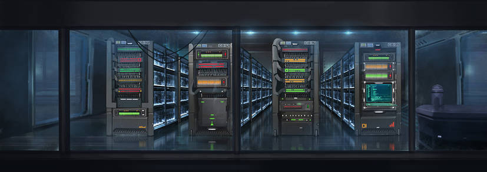](https://www.deviantart.com/brandon-ellis/art/Gameclaw-Caleb-893831373) 

```
Las IA son algo muy normal en Nottingham. De hecho, la IA J0hn controla muchísimos aspectos de la vida de les _notis_.
```

Las inteligencias artificiales son un elemento muy importante en esta ambientación al girar casi sus los elementos alrededor de las dos IA directoras, la bondadosa R1c4rd y la malvada J0hn. Pero hay otras IA con sus historias y su importancia en la historia como Al1enOR, Alfonse o Baris, todas ellas con su idiosincrasia y su historia para meterlas en tus aventuras. 

> En principio, las IA no son personajes jugables, pero si quieres aceptar el reto puede ser muy interesante para tu mesa.

En general podemos decir que existen tres tipos de IA, las dedicadas, las dedicadas avanzadas y las polivalentes. Cada tipo tiene sus características y sus capacidades.

### IA dedicadas

Las IA dedicadas son IA que solo tiene una función, todo su poder de procesamiento se divide en una sola tarea. Puede tener un gran poder de proceso, pero solo sabe hacer una tarea. Por ejemplo, la IA de los ascensores y escaleras mecánicas de una zona controla muchos elementos muy importantes, pero solo controla ese elemento, con lo que no se ha desarrollado otras partes de su inteligencia. Por dejarlo claro, solo sabe de administrar los turboascensores, no le preguntes de nada más. 

Una IA dedicada médica podría buscar posibles cánceres en las radiografías de les pacientes. Solo daría resultados de cáncer positivo o negativo, no tendría capacidad de dar un tratamiento. 

La mayoría de ellas no tienen capacidad de comunicación, salvo el sistema para meter datos/consultas/programación como un micrófono o un teclado y otro para dar los resultados como una pantalla, un mensaje o incluso algún tipo de piloto luminoso.

### IA dedicadas avanzadas

Las IA dedicadas avanzadas son IA más avanzadas que las anteriores, pero siguen trabajando sobre un solo elemento. Una IA dedicada avanzada podría no solo gestionar los ascensores, sino también prever posibles aglomeraciones por información que recibe como eventos deportivos y buscar soluciones.

Siguiendo con IA médica anterior, una IA dedicada avanzada médica podría diagnosticar muchos tipos de enfermedades y también dar tratamientos más adecuados.

A diferencia de las dedicadas cuentas con sistemas de comunicación mucho más avanzado, normalmente pueden interactuar de forma verbal, pero siguen siendo muy limitados, no pudiendo salirse del tema al que están dedicados. Las más modernas tienen incluso una interfaz visual aunque es limitado porque no saben transmitir emociones. Solo son caras amables en una pantalla.

### IA polivalentes

Son las IA que pueden manejar dos o más actividades y normalmente una de esas actividades es relacionarse con humanos. En el ejemplo del médico podríamos hablar de una IA capaz de hacer diagnósticos de todo tipo de enfermedades físicas y mentales, dar un tratamiento y además poder por ejemplo, dar buenas y malas noticias a les pacientes o llevar una sesión de terapia psicológica.

Las IA polivalentes empiezan a parecerse a las IA que conocemos de películas y libros de ciencia ficción. Podrían pasar el test de Turing y pasar por humanos, incluso tienen personalidades definidas básicas. Pueden ser alegres y positivas, bromistas, mentirosas o hurañas y siempre refunfuñando, pero esa personalidad nunca va a cambiar.

Pueden relacionarse con los humanos mediante interfaces visuales y verbales y pueden entender las emociones humanas y expresar algunas básicas como alegría o enfado. Al funcionar sobre varios sistemas pueden moverse por todo Nottingham y seguir a tu mesa. Quizás hablen a través del sistema de comunicación de los ascensores, luego por la megafonía de los pasillos y, por último, aparezcan en las pantallas de tu habitáculo. 

Las IA polivalentes son autoconscientes y con instinto de supervivencia así que como los humanos harán lo que sea por seguir con viva, pero también podrían sacrificarse por un bien mayor.

Tienen capacidades de aprendizaje limitadas y normalmente limitadas a sus áreas de conocimiento.

### Las directoras

Las directoras podemos considerarlas auténticas IA, son IA polivalentes que controlan muchos elementos (urbanismo, política, contabilidad, marketing, etc.) y pueden relacionarse cara a cara con humanos. Pero a diferencia de las polivalentes han sido alimentadas con petabytes de información más o menos interesante para llevar a cabo sus tareas.

Digamos que las directoras son IA polivalentes con conocimientos y experiencia de la que aprenden. Si reseteamos a una directora y la dejamos sin recuerdos y conocimientos volvemos a tener una IA polivalente con mucho que aprender.

Las directoras podemos considerarlas plenamente humanas, autoconscientes, con emociones complejas y cambiantes y como tienen capacidad de aprendizaje, pueden cambiar su personalidad con el tiempo y por la acción de sus experiencias.

Cuando son creadas, sus desarrolladores marcan una personalidad y unos valores éticos, pero en cuanto empiezan a procesarse empiezan a desarrollar su personalidad, su ética y sus valores. Los desarrolladores no pueden intervenir en esos valores, si quisieran hacerlo, tendrían que restaurar una copia de seguridad anterior a esos cambios.

### Las instancias y los forks

Las grandes IA directoras y algunas polivalentes que empiezan a tener conocimientos y experiencias importantes pueden crear instancias suyas, versiones de ella normalmente más pequeñas que pueden ser cargadas en sistemas simples como sheriffs, sistemas de vigilancias, etc. para la realización de alguna tarea específica.

Una vez terminada la tarea asignada, vuelven a fusionarse con la IA principal, entregándole toda la información y experiencia conseguida por la instancia. 

Los _forks_ son copias de una IA que se desarrollan independientemente y toman entidad propia. Por ejemplo, la compañía podría hacer un fork de la IA directora R1c4rd e instalarla en una nueva arcología. A partir de que se instala en el nuevo complejo empezará a tener sus propias capacidades y desarrollará sus propios métodos de funcionamiento.

> Piensa que una instancia es una especie de gemelo con el que compartes un vínculo, mientras que un fork es una especie de vástago que tiene tus genes, pero que se desarrolla de forma independiente.

#### Crear instancias

Las IA tienen la capacidad de hacer instancias suyas. Cada instancia creada come recursos de procesamiento a la IA original con lo que cada nueva instancia supone un -1 a todas las tiradas de todas las instancias y de la IA principal.

Una IA que genera dos instancias tiene un -3 a todas sus instancias, pero puede trabajas en 3 tareas a la vez o hacer una tarea el triple de rápida. De hecho, las instancias pueden ayudarse entre ellas como si fueran personajes diferentes, siguiendo las reglas de ayuda del manual básico.

> Una IA no puede tantas instancias como su Astucia/2. Es decir una IA de Astucia 8, puede crear hasta 4 instancias y tendría un negativo de -5.

Tanto crear una instancia como reintegrarla en tu sistema solo exigen una turno, pero si se quieren aprovechar los datos y experiencias que ha podido extraer la instancia mientras ha sido independiente debe pasar una tirada de Espíritu. En caso de fallarla, el trabajo realizado por la instancia no se pierde, pero los datos y experiencias que pudiera haber conseguido si se pierden.

### Hackeos frente a IA

Los hackeos de los instaladores están instalados más profundamente en el código de la arcología con lo que siempre prevalecen frente a las órdenes que de una IA. Por mucho que una IA quiera abrir la puerta de un ascensor, si ha sido cerrada con un hackeo no se podrá abrir. Como se dice en las reglas de hackeo, **solo un hackeo puede contrarrestar a otro hackeo**.

Además, no son rastreables por las IA, no dejan registros, no activan disparadores, etc. Como mucho pueden ser detectados como bugs, caídas del sistema o fallos técnicos físicos, pero nunca con precisión y sabiendo a ciencia cierta que ha pasado. Es como si tuviera en un picor en la espalda, pero no puede llegar a rascarse.

### Creación de IA

Para empezar las IA no tienen cuerpo físico, pueden controlar unidades como los sheriffs para que interactúen con el mundo real, pero no son más o menos ágiles o fuertes o resistentes. Es por ello que solo tienen Atributos no-físicos, Astucia y Espíritu. 

En consecuencia, tampoco pueden tener ventajas y desventajas físicas no habilidades basadas en atributos físicos. Hay muchas ventajas que piden habilidades y/o atributos físicas, así que estás ventajas están fuera de su alcance.

Las desventajas ya están menos claras, pero siempre que no afecten al cuerpo físico pueden ser elegibles. Una IA puede ser envidiosa, vaga, sanguinaria, etc. pero no puede ser ciega o coja o ser lenta en combate.

No puedes tener atributos por encima de d12, excepto las IA directoras que no tienen límite.

#### Tareas

Las IA se crean para cumplir unas tareas y esas tareas van a ayudar a definir sus habilidades y ventajas/desventajas como los arquetipos nos permiten establecer las habilidades y ventajas/desventajas de los PJ.

Una IA que gestiona una cafetería tendría como tareas cosas como hacer miles de clases de café, gestionar un establecimiento de bebidas e interactuar con los clientes. Eso haría que seguramente que tenga habilidades como Humanidades y Conocimientos Generales para poder hablar con los clientes y ventajas como Carísimátique para caerles bien y que vuelvan.

También debería tener habilidades como Reparar para el mantenimiento del local y volvemos a Humanidades para llevar la contabilidad y el almacén del local y está claro que debe saber hacer miles de tipos de café.

> A nivel de juego, las tareas además de servir de guía para definir las habilidades y ventajas/desventajas que debiera tener una IA, les permite hacer ciertas no cubiertas directamente por habilidades sin necesidad de tirada y por tanto sin fallo. La IA barista del ejemplo anterior, no necesita tirar para hacer un buen café y siempre lo va a hacer bien, para ello la programaron. Quizás si se enfrenta a une jugadore en un concurso de café quizás tendría que hacer una tirada enfrentada y siempre lo hará con 1d12+1 (es decir que mejor que une humane normal).

#### Áreas de actuación

Las IA no tienen equipo, **tienen áreas de actuación**, elementos sobre los que tienen control y que pueden usar físicamente en el mundo real. Por ejemplo la IA que controla la prisión, puede controlar las alarmas, abrir y cerrar puertas, activar los ascensores, cortar la luz, pero no podrá mover algo de sitio a no ser que entre su ámbito tenga algún tipo de robot que pueda hacer ese trabajo. 

#### IA como comodines

Todas las IA que crees se deben considerarse comodines al crearlas, es decir tienen 3 benis al principio de cada sesión, usan dado salvaje y deberían poder soportar 3 heridas. Como no tienen cuerpo físico, las heridas no son importantes.

## Nanotecnología

```
La nanotecnología es una de las fuerzas creadoras más importantes de bosque Sh3rW00d.
```

Les instaladores eran sus grandes maestros y cuantos ellos se fueron sus inmensos conocimientos en nanotecnología y la casi totalidad de los nanobots que había en Nottingham desaparecieron con elles.

### La arcología de Nottingham

Como todo el mundo sabe en Nottingham, el lugar donde viven fue creado con nanotecnología hace 200 años. Los nanitos, dirigidos por les instaladores, crearon la gigantesca arcología de Nottingham. Hicieron los cimientos, las paredes, las ventanas, las columnas, suelos y techos, pero también el cableado de electricidad y datos de luz y datos, la fontanería, los ascensores, las escaleras normales y mecánicas, ... todo y a compañía lo fue llenando de lo único que no podían hacer los nanitos de seres humanos que nacieran, vivieran, murieran y sobre todo trabajaran y generaran beneficios. 

Les instaladores excavaron un gigantesco agujero que llenaron de plasma de nanitos y empezaron a programarlos. Estos fueron cogiendo las materias primas que les proporcionaban y fueron levantando la gigantesca arcología de Nottingham. En unos meses ya había zonas habitables y en unos pocos años la gran mayoría del proyecto estaba acabada. Aún se puede visitar el agujero original, el conocido como «El pozo», en la parte baja de Nottingham.

Con la marcha de les instaladores el proyecto quedo parado, pero quedó una inmensa zona de la que solo se había construido los cimientos, sin datos, sin cañerías sin ascensores. Esa zona fue clausurada y durante muchos años nadie se preocupó por ella.

Es importante destacar que desde la marcha de les instaladores, no se han creado nuevas zonas, solo se ha mantenido como se ha podido las zonas que ya habían creado. Es decir que la mayoría de las estructuras de la arcología tienen unos 180 años y han tenido un mantenimiento en muchos casos deficientes. Así que la arcología aún se mantiene, pero o les instaladores vuelven a terminar su trabajo o la compañía deberá terminar por abandonar el complejo.

### Nanotecnología y seres vivos

Un hecho importante a tener en cuenta es que los nanitos no entienden a los seres vivos y por eso su uso en medicina y biología es muy complicado. No tienen problemas al crear complejas estructuras metálicas o plásticas, pero la biología y sus constantes cambios se les hacen muy difícil. Es por ello que no entienden el dolor ni los sentimientos y estados de ánimo. Por ejemplo, no pueden ser programados para que funcionen en un ente biológico sin provocar dolor, ya que para ellos el dolor es otra señal más del cuerpo del sistema nervioso.

Por decirlo de forma sencilla, cuando construyen una casa, la casa no se queja, ni está todo el rato moviéndose y cambiando de tamaño y forma y si lo hace es dentro de un entorno controlable. 

Así pues, el uso de nanitos en entidades biológicas está reservado a la experimentación en laboratorios y todavía no habido grandes avances en esta tecnología. Salvo cosas muy puntuales como reparación de huesos o estimular de ciertas glándulas. En ambos casos los nanorobots solo tienen una única tarea y es muy simple, con lo que no les genera gran problema.

### Restos de nanotecnología

Cuando les instaladores dejaron repentinamente Nottingham, se llevaron casi toda la nanotecnología con ellos, pero se dejaron restos dispersos por toda la arcología. Normalmente son grupos defectuosos que no obedecieron la orden de retirarse de les instaladores y se quedaron haciendo las últimas órdenes que recibieron.

De hecho, muchas de las **leyendas urbanas de sucesos menores son atribuidos a los nanitos**. Desaparecen unas pintadas, las han limpiado los nanitos, desaparecen las bombillas de toda una zona, se las han llevado los nanitos, cambia el color de los leds de un ascensor, los nanitos. 

Actualmente, los restos de nanotecnología activos en Nottingham son los siguientes.

* Las historias cuentan que en **el pozo (Zona baja)** aún queda resto de nanobots en el fondo, pero nadie ha querido comprobarlo.
* **La rayuela fantasma (Zona baja)** de la que hablan les niñes tiene su origen en un grupo de nanitos que se han quedado en un bucle infinito.
* Varios **grupos de científiques** al servicio de empresas y de la propia directora J0hn **tienen muestras de la nanotecnología** de les instaladores y que tratan de replicar. Ofrecen gran cantidad de dinero por muestras de nanotecnología frescas a poder ser mutadas o desviantes. También pagan buenas cantidades por muestras de otros grupos científicos para robar sus desarrollos y descubrimientos.

### Nanotecnología en el bosque

XXX

[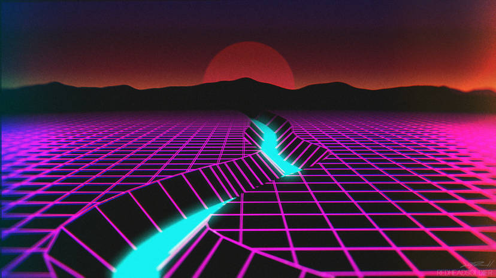](https://www.deviantart.com/redheadsoldier/art/Nature-Neon-601893009 "Nature Neon By redheadsoldier")

## Realidad aumentada y virtual

```
Estas tecnologías están tan integradas en la vida diaría de los notis que no saben funcionar sin ellas.
```

Para empezar es importante diferenciar la realidad virtual y la realidad aumentada. La principal diferencia es que la realidad aumentada trabaja sobre la realidad añadiendo nuevos elementos, mientras que la realidad virtual crea una nueva realidad completamente nueva.

Otra diferencia significativa es la capacidad de procesamiento que exige. Mientras que el HUB de conexión de une _noti_ puede procesar la información de la aumentada, para la realidad virtual necesitas equipos externos con su propia fuente de alimentación y conexión.

### Realidad aumentada

La realidad aumentada ofrece una capa extra de información sobre la realidad. Por ejemplo, mostrándonos unas flechas de colores en nuestra retina que nos indica la ruta que debemos tomar para llegar al destino seleccionado o mostrando el precio y las características de los productos de una tienda.

La realidad aumentada está distribuida, no está almacenada en nuestro HUB de conexión o en un gran ordenador central, sino que cada lugar de la arcología tiene sus propios datos y al acercarnos los descargamos y procesamos. Si tuvieran almacenado en nuestro HUB de conexión, toda la información aumentada el HUB tendría el tamaño de un melón y no sería implantable. 

Cada vez que entras en una tienda te descargas su catálogo y puedes identificar los productos y ver sus precios o estás en una reunión puedes descargarte las personas que están a su alrededor y una serie de datos públicos sobre ellas que sus HUB de conexión ofrecen públicamente.

Los hackeos de los instaladores se aprovechan de estas descargas continuas de contenidos de los dispositivos de realidad aumentada para quitar información y poner información extra y/o falsa. De esta manera puedes engañar a la gente que está acostumbrada a que la realidad aumentada no le mienta.

### Realidad virtual

La realidad virtual (RV) crea realidades simuladas donde la gente se mueve e interactúa y no tiene nada que ver con la realidad física que les rodea. Normalmente la gran cantidad de recursos que exige la RV hace que solo las grandes empresas y la gente rica pueda acceder a ella. También exige equipo especial (gafas y trajes ápticos), pero la inmersión es total abandonando la realidad y entrando totalmente en la realidad virtual.

Normalmente **se deja para reuniones de grandes blues**, o sesiones con la propia directora J0hn donde la directora se aparece con su propio avatar humano. Normalmente, son lujosas salas de reunión con grandes ventanales y vistas a impresionantes paisajes naturales, quizás selvas, inmensas praderas o impresionantes cataratas.

Además de reuniones, se puede usar de manera lúdica como fiestas virtuales, pero normalmente solo los altos blues e influencers tienen acceso a esos eventos virtuales.

[](https://www.deviantart.com/redheadsoldier/art/stealth-net-702794026 "stealth.net By redheadsoldier")

Los **blues de menor nivel pueden tener acceso** a esas salas de reuniones para hablar con otros o a sus puestos de trabajo para hacer su trabajo desde casa, pero no se gastan recursos en su desarrollo y procesos y suelen ser anodinos, simples y estáticos. Hablamos de habitáculos sin personalización ni ventanas con texturas simples y muy poca interacción solamente unos pocos elementos.

No está demostrado científicamente (o se ha ocultado a propósito), pero se sabe comenta que pasar muchas horas en un RV tan simple y con tan poca interacción pueden generar estrés y desarrollar problemas mentales a largo plazo.

A diferencia de la realidad aumentada cuyas bases estaban desarrolladas e implementadas por les instaladores, la RV tiene sus propios sistemas y servidores y están a salvo de los hackeos.

La forma de interferir en ellos sería siguiendo el hackeo tradicional o aplicando ingeniería social para robar las claves de acceso a estos servidores.

Fuera de los entornos blus no hay posibilidad de usar RV, pero según algunes de les buscadores de la contraseña de SU **les instaladores tenían acceso a su propio sistema de RV** donde diseñaban los niveles de la arcología que luego mandaban a los nanitos para que lo construyeran. Les buscadores que siguen está teoría se dedican a buscar los servidores de RV de les instaladores como una manera de encontrar su camino a su deseada contraseña SU.

## Información y mensajería

```
En un mundo hipertecnificado, la forma más fácil de que no te hackeen información es que esta sea física. Los planos de un nuevo ingenio es mejor tenerlos en papel y que los lleve une mensajere en bici que mandarlos por mensajes digitales.
```

En Nottingham, como buen mundo ciberpunk, la información es poder y protegerla es muy importante, así que mucha información valiosa se mantiene de forma física (papel o unidades de almacenamiento) y se mueven físicamente en vez de electrónicamente. Es por ello que existen empresas de mensajería y mensajeres independientes que llevan esa información en forma física de un lugar a otro.

### Empresas de mensajería y mensajeres independientes

Las empresas de mensajería son empresas bastante atípicas en comparación con el sistema capitalista imperantes. Suelen ser cooperativas de mensajeres, no empresas como podríamos pensar. Muchas empezaron normalmente como grupos de corredores de parkour o skaters que estaban en sus callejones practicando su deporte y que recibían encargos por llevar pedidos de comida rápidamente por una buena propina.

Poco a poco se fueron profesionalizando y ponían una cuota inicial para alquilar un habitáculo donde descansar, guardar su equipo y montar una oficina donde recibir los encargos. Los mensajeres nuevos que se apuntan a la cooperativa pagan una cuota de entrega tras ser aceptaba su solicitud de ingreso en la cooperativa.

Les mensajeres independientes suelen ser practicantes de disciplinas como parkour o skating que empiezan a trabajar de mensajeres para monetizar su afición, pero sin convertirse en un modo de vida. Si quieren dedicarse profesionalmente, suelen unirse a una cooperativa.

[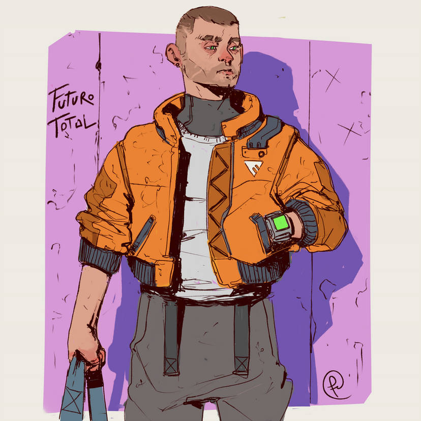](https://www.deviantart.com/fernand0fc/art/Delivery-802145258 "Delivery By Fernand0FC")

> Muchas de las cooperativas están siendo absorbidas por empresas más grandes que bien quieren meterse en el negocio de la mensajería o bien quieren integrar en su estructura un sistema seguro de mensajería. Las más reacias y resistentes a ser compradas suelen tener contactos con el bosque y si eres de confianza, pueden llevar mensajes al Gran Roble.

Aparte de las empresas tradicionales de mensajería hay otras con unos métodos de trabajo totalmente diferentes, como Mouseguard o Multiply.

#### Multiply

Una de las empresas de mensajería más curiosas es Multiply. A diferencia de otras empresas, Multiply tiene cientos de trabajadores. Te ofreces como mensajero y dices tus rutas habituales. Cuando alguna de tus rutas normales coincide con un envío, te avisan y recoges el paquete y lo entregas donde te dicen.

No vas rápido, ni haciendo acrobacias, simplemente haces tu ruta habitual, andando tranquilamente y sin llamar la atención. Te pagan muy poco, pero es un extra a tu salario habitual. La seguridad en esta empresa la da el número. Para un envío tiene a varies mensajeres, pero solo une lleva el paquete con el mensaje, el resto son señuelos. 

#### Mouseguard

Esta empresa de robots tiene una flotilla de minirobots, llamados _mouses_ o ratones, que se mueven por todo el complejo por pasillos de servicio, conductos, tuberías, etc. para hacer envíos. Solo llevan info en unidades de almacenamiento, no llevan objetos grandes.

Su estrategia es moverse por rutas alternativas que no pueden usar los humanos. No son vistos ni detectados y, por tanto, no pueden ser interceptados y su información robada. Además, la IA que controla las rutas y nunca las repite. No le importa usar rutas larguísimas, el robot no tiene un horario de trabajo, así que tenerlos dando vueltas es una opción. 

Los robots se autodestruyen, si creen que pueden ser interceptados y la información que portan puede ser robada. Como son solo datos basta con grabarlos en otra unidad de almacenamiento y mandar otro ratón.

> Los mapas del complejo de Mouseguard son mejores que los que tiene la propia directora J0hn, ya que los robots mapean todos los sitios por los que pasan. Conseguir esos datos podría dar una gran ventaja a una banda de proscrites que necesitan entrar y salir de un lugar sin ser detectados y moverse por toda la arcología sin ser vistos. 

### Parkour, skaters, BMX y otros estilos

Cada mensajero tiene su forma de moverse por la ciudad rápidamente. Tenemos corredores que hacen parkour, skaters y rollers con sus saltos y sus descensos a toda velocidad y ciclistes con sus ebikes de BMX.

Las empresas suelen especializarse en un tipo de movimiento y comprar equipo y contratar profesionales especializados en trabajar en esas disciplinas, por ejemplo, enfermeres en caso del parkour o mecániques de bicis para los especialistas en BMX.

[](https://www.deviantart.com/siulzz/art/1920x1080-Wallpaper-Desktop-770623072 "1920x1080 Wallpaper Desktop By siulzz")

## Otras tecnologías

```
En Bosque Sh3rW00d hay otras tecnologías no tan relacionadas con la cibernia que pueden dar sabor a tus partidas.
```

Veamos algunas de estas otras tecnologías y que influencia pueden tener en el día a día de la arcología de Nottingham y sus residentes,

### Tecnología láser

La tecnología láser, como hoy en día, sigue **usándose solo en industria, medicina y telecomunicaciones**. El láser no ha llegado a les _notis_ de a pie, principalmente, por su enorme gasto energético.

Aunque en el mundo exterior el láser tiene aplicaciones militares, esta tecnología no ha llegado a las calles de Nottingham en forma de pistolas láser ni filos láser. De hecho, la existencia de un arma de este tipo en las calles de Nottingham podría ser una buena semilla de aventura, donde diferentes facciones buscan hacerse con ellas.

### Hologramas

La tecnología de hologramas **existe, pero no está muy avanzada**. Se nota que algo es un holograma con mucha facilidad, principalmente por su falta de calidad y definición y porque no tiene casi movimiento. 

Su uso principal es crear HUD virtuales y pantallas y teclados holográficos sobre los que trabajar, pero no crear habitaciones holográficas totalmente realistas. De hecho en concepto de luz dura no existe en bosque Sh3rW00d.

### Clonación e ingeniería genética

La **clonación de seres humanos, aunque posible, es ilegal** incluso, la clonación de órganos para trasplantes.

Los laboratorios de clonación y manipulación genética son investigados y supervisados continuamente. Solo se les permite trabajar en plantas y criaturas muy básicas.

Casi todos estos laboratorios trabajan en mejorar las características de las algas de Trent para mejorar su producción, sus características y su resistencia a plagas.

Cabe destacar, por ejemplo, los estudios de manipulación genética del Doctor Zeyaur Khan al dotar de cafeína a las algas como defensa química. Esto hizo que el café de Nottingham fuera y de los mejores del mundo.

### Transhumanidad

Cómo la clonación, los métodos de **descargar mentes humanas dentro de ordenadores están también prohibidos**.

Aunque la tecnología es factible, como demuestran las IA de alto nivel, no está disponible en la arcología. El consumo de recursos, material y espacio sería demasiado alto. Pero eso no quiere decir que no sea factible en otros complejos donde les riques y poderoses puedan meter sus mentes en máquinas y vivir eternamente.

Pero desde luego, está tecnología es muy rara y se mantiene en secreto. Solo estaría reservada para los más altos cargos de la compañía.

### Drones pilotados y autónomos

**La tecnología de drones resulta totalmente ineficaz** en un lugar con las características arquitectónicas de la arcología de Sh3rW00d. Volar no aporta ninguna ventaja en los espacios pequeños, bajos y lleno de puertas. De hecho robots autopilotados que van el suelo son mucho más eficaces y menos molestos para habitantes del complejo.

Quizás haya aficionados a los drones, pero solo es un hobby y no una actividad profesional.

Los drones son más útiles en los espacios abiertos del bosque Sh3rW00d, pero les _boskis_ no son muy dados a dejar la seguridad de sus campamentos en manos de drones y prefieren vigilar y defenderlos elles mismes.

***

# I3es71ari0 **Bestiario**

Aquí te presentamos toda una galería de personajes no jugadores genériques que van a pulular por los pasillos de la arcología, las factorías de algas y los garitos. Te presentamos 3 grupos de PNJ: villanos, robots y gentes de Nottingham.

También los puedes usar como base para tus PNJ. Si el tabernere va a ser importante, coge a une secuace y adórnale con tus propios detalles.

Recuerda que en esta ambientación muchos de estos PNJ genériques puedes personalizarlos con diferentes habilidades y ventajas. Quizás le mensajere en bici que lleva un disco con datos importantes puede que tenga un d10 en Atletismo o la líder de una pandilla pueda tener un Persuadir alto para arengar a sus tropas.

## Villanes

[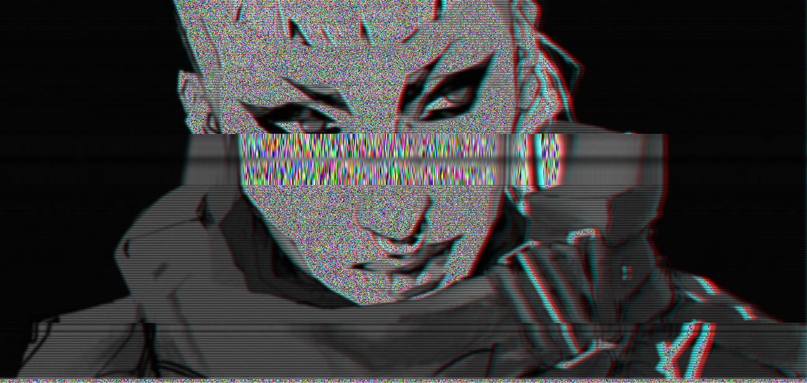](https://www.deviantart.com/mishkatron/art/Slaughteress-2019-784620826 "Slaughteress 2019 By Mishkatron")

```
Como siempre se dice la talla de tus heroines la marcan sus villanos.
```

Tu banda de proscrites tendrá que enfrentarte con todo tipo de villanos desde los sheriffs, insensibles robots humanoides caza criminales, hasta ladines _influencers_, capaces de poner a la gente de Nottingham en tu contra. Sin olvidarnos de _blus_ que piensan que pueden comprar a cualquiera con su dinero o cazarrecompensas de fuera del complejo que atrapan o matan personas por dinero.

### Sheriffs &#35;

Estos robots humanoides con apariencia de «Terminators» son la mano ejecutora de la directora J0hn. Buscan cualquier de chispa de insurrección y acaban con ella expeditivamente. 

Son instancias menores de la propia directora J0hn, pero lo suficientemente poderosos para ser un enemigo implacable del que es mejor huir que enfrentarse a ellos.

* **Atributos:** Agilidad d6, Astucia d8, Espíritu d4, Fuerza d12, Vigor d12
* **Habilidades:** Atletismo, d6, Disparar d8, Electronica d6, Intimidar d6, Notar d10, Ordenadores d10, Pelear d8
* **Paso:** 6; **Parada:** 6; **Dureza:** 15 (6)
* **Capacidades especiales:**
  * **Armadura +6:** Blindaje de acero fantasma.
  * **Conexión con la red:** Tiene los hackeos básicos, Controlar pantallas, Controlar iluminación, Llamar ascensor, Controlar realidad aumentada. Puede usar los hackeos automáticamente tomándose un 4 en vez de tirar Electrónica.
  * **Constructo:** +2 a recuperarse del aturdimiento. Ignora 1 punto de penalización por heridas. No respira y es inmune a enfermedades y venenos. Curación con habilidad Reparar.
  * **Impávido:** Es inmune al miedo e Intimidar.
  * **Tamaño +1:** Son ligeramente más grandes que un ser humano.
* **Equipo:** Cinchas de detención, porra extensible (FUE + d4), Desert Eagle (.50) si está en misión.

### Ayudante de sheriffs

Estas versiones inferiores de los sheriffs son usadas como ayudantes de estos. Acompañan a los sheriffs como apoyo de combate y hacen trabajos menores como control de masas, cacheos, protección de zonas, etc. 

* **Atributos:** Agilidad d6, Astucia d6, Espíritu d4, Fuerza d8, Vigor d8
* **Habilidades:** Atletismo, d6, Disparar d6, Electronica d4, Intimidar d6, Notar d10, Ordenadores d8, Pelear d6
* **Paso:** 6; **Parada:** 5; **Dureza:** 9 (3)
* **Capacidades especiales:**
  * **Armadura +3:** Blindaje de acero fantasma.
  * **Conexión con la red:** Tiene un hackeo básico, puede elegir entre Controlar pantallas, Controlar iluminación, Llamar ascensor o Controlar realidad aumentada según las tareas que se le vayan a asignar. Puede usar los hackeos automáticamente tomándose un 4 en vez de tirar Electrónica.
  * **Constructo:** +2 a recuperarse del aturdimiento. Ignora 1 punto de penalización por heridas. No respira y es inmune a enfermedades y venenos. Curación con habilidad Reparar.
  * **Impávido:** Es inmune al miedo e Intimidar.
* **Equipo:** Material para el trabajo al que han sido asignados, porra extensible (FUE + d4)

### Alto influencer

Esta cúpula de Influencers adictos a la directora J0hn marcan la vida de los _notis_. Dominan la opinión pública del complejo, marcan las modas, establecen que mola y que no mola, etc. Pero su mayor poder es el señalamiento público, quien elles marcan es acosade, humillade y seguramente desterrade al bosque.

* **Atributos:** Agilidad d6, Astucia d8, Espíritu d12, Fuerza d6, Vigor d6
* **Habilidades:** Apostar d8, Atletismo d6, Conocimientos Generales d8, Humanidades d8, Idioma Inglés d8, Interpretar d12, Ordenadores d6, Notar d6, Pelear d6, Persuadir d10, Sigilo d4
* **Paso:** 6; **Parada:** 5; **Dureza:** 5

[](https://jennafiggers.itch.io/ "Citizens and Scoundrels 9 by Jenna Fingers")

* **Ciberimplantes:** Elegir 1: Cibercuerdas vocales (Interpretar), Modulador de voz (Provocar), Modificaciones estéticas (Persuadir), Cirugía estética (Atractive)
* **Desventajas:** Elegir 1: Avariciose (Mayor), Bocazas (Menor), Canalle (Menor), Caute (Menor)
* **Ventajas:** Famoso, elegir 1: Atractive, Carismátique, Coraje líquido, Rique
* **Equipo:** Equipo de grabación de gran calidad, ropas caras y a la moda y joyas de gran valor

### Bajo influencer

Estes aspirantes a estrellas de las redes andan a la búsqueda de nuevas historias con los que contentar a sus escases followers. No paran de moverse por toda la ciudad a la búsqueda de algo jugoso que contar o en sus improvisados estudios tratando de conseguir el viral que los sacará de su mediocridad. Suelen trabajar para influencers de mayor poder contándoles los chismes y secretos que descubren a la espera de que les un poco de su fama y prestigio.

* **Atributos:** Agilidad d6, Astucia d6, Espíritu d8, Fuerza d6, Vigor d6
* **Habilidades:** Atletismo d6, Conocimientos Generales d6, Humanidades d6, Idioma Inglés d8, Interpretación d8, Notar d6, Ordenadores d6, Persuadir d6, Sigilo d6
* **Paso:** 6; **Parada:** 4; **Dureza:** 5
* **Ciberimplantes:** Elegir 1: Modificaciones estéticas (Persuadir), Cirugía estética (Atractive), Base de datos musical/teatral (Interpretar)
* **Desventajas:** Elegir 1: Hábito (menor alcohol, drogas sintéticas, etc.), Curiose, Feo (Menor), Manque
* **Ventajas:** Elegir 2: Carismátique, Famose, Guape
* **Equipo:** Equipo de grabación de baja calidad, ropas con apariencia de caras y bisutería que parece de gran valor

### Blus de alto rango

Estos altos ejecutivos de la corporación trabajan para cumplir y dar forma a los deseos y las ideas de la directora J0hn. Es difícil verlos fuera de la zona alta o de los edificios oficiales de la corporación y cuando lo hacen van protegidos por sus guardaespaldas y con un séquito de asesores y blus menores atendiendo todas sus peticiones y mandatos.

* **Atributos:** Agilidad d4, Astucia d10, Espíritu d8, Fuerza d6, Vigor d6
* **Habilidades:** Atletismo d4, Ciencias d6, Conocimientos Generales d10, Humanidades d6, Idioma Inglés d10, Intimidar d8, Notar d6, Ordenadores d6, Persuadir d8, Sigilo d4, Tácticas d6
* **Paso:** 6; **Parada:** 4; **Dureza:** 5

* **Ciberimplantes:** Elegir 2: Modulador de voz (Intimidar, Provocar), Modificaciones estéticas (Persuadir), IA de tácticas (Tácticas), Ordenador táctico (Calculadore)
* **Desventajas:** Elige 1 o más: Avaricioso (Mayor), Bocazas (Menor), Cauto (Menor), Hábito (Mayor, Alcoholismo)
* **Ventajas:** Necesarie para la compañía, Alcurnia, Rico
* **Equipo:** Ropas caras ejecutivas y complementos de gran valor como relojes, gafas de sol o gemelos de oro

### Asesores de blus

Estamos hablando desde la persona que le trae el café a le blus de alto rango como su secretareis hasta sus entrenadores personales y sus dietistas. Siempre van a su lado a la espera para cumplir sus órdenes, deseos o caprichos

* **Atributos:** Agilidad d4, Astucia d6, Espíritu d6, Fuerza d4 Vigor d6
* **Habilidades:** Atletismo d4, Conocimientos Generales d8, Ciencias/Humanidades (igual que su jefe), Idioma Inglés d8, Notar d4, Ordenadores d6, Pasillear d6, Persuadir d4, Sigilo d4
* **Paso:** 6; **Parada:** 4; **Dureza:** 5
* **Ciberimplantes:** Elegir 1: Telemetría ocular(Notar), Base de datos urbanística (Pasillear), Base de datos científica (Ciencias), Base de datos de historia y arte (Humanidades)
* **Desventajas:** Elige 1 o más: Avaricioso (Mayor), Bocazas (Menor), Hábito (Menor)
* **Ventajas:** Elegir 2 Conexiones (asesores de blus, bajos fondos, bajos influencers, zona media, zona baja)
* **Equipo:** Ropas ejecutivas sobrias, maletín con documentación y ordenador portátil/tablet

### Cazarrecompensas

Haya donde hay proscrites y forajides aparecen cazarrecompensas que trabajan a sueldo de los poderes opresores. Su trabajo es cazar a los fugados y traerlos a la justicia de la directora J0hn. No creen en la justicia, ni en las leyes, solo en las recompensas y en gastarlas a la noche.

[](https://jennafiggers.itch.io/ "Citizens and Scoundrels 16 by Jenna Fingers")

* **Atributos:** Agilidad d6, Astucia d6, Espíritu d6, Fuerza d8, Vigor d8
* **Habilidades:** Atletismo d6, Disparar d8, Idioma Inglés d6, Intimidar d8, Latrocinio d6, Notar d6, Ordenadores d6, Pasillear d8, Pelear d8, Sigilo d8
* **Paso:** 6; **Parada:** 6; **Dureza:** 6
* **Ciberimplantes:** Elegir 1: Reemplazos musculares (FUE), Inyector de adrenalina (FUE), Nudillos metálicos (Gorila), HUB de puntería (Disparar)
* **Desventajas:** Elige 1 o más: Avariciose (Mayor), Canalle (Menor), Feo (Menor), Habito (Mayor, Alcoholismo),

* **Ventajas:** Callejear, elegir 1 o más: Alijos, Bloqueo, Mandíbula de hierro, Nervios de acero, Reflejos de combate, Soldade
* **Equipo:** Cinchas de detención, porra extensible (FUE + d4), machete (FUE+d6)

## Robots

```
Los pasillos, habitaciones, conductos y habitáculos de Nottingham están llenos de robots autónomos que la directora J0hn puede controlar y usar a su antojo.
```

En esta ambientación los robots no son personajes carismáticos, charlatanes y autónomos. Son herramientas programadas para hacer su trabajo y solo su trabajo. Tampoco están antropomorfizados, si tienen que transportar materiales serán carros con ruedas y grúas para cargar y descargar materiales, si limpian los conductos serán largos y estrechos y se moverán como comadrejas o serpientes por los tubos de ventilación.

### Animal animatrónico

Como parte de una campaña de mejora de la opinión pública, la directora J0hn creó un zoo de animales animatrónicos. Los **animales animatrónicos son sobre todo terrestres y carnívoros** como grandes felinos y **herbívoros muy agresivos** como jabalíes. No es normal que escapen del zoo, pero podría darse el caso de que fueran robados y reprogramados.  

Coge las estadísticas del animal y añádele estas capacidades especiales:

* **Capacidades especiales:**
  * **Impávido:** Es inmune al miedo e Intimidar.
  * **Constructo:** +2 a recuperarse del aturdimiento. Ignora 1 punto de penalización por heridas. No respira y es inmune a enfermedades y venenos. Curación con habilidad Reparar.
  * **Armadura (+1 a +4):** Sus partes metálicas les dan entre +1 y +4 de armadura.

### Limpiador

Estas grandes cajas con ruedas tienen una serie de juegos de cepillos, aspiradoras y chorros de agua a presión que les permiten limpiar suelos, techos y paredes.

No son ni muy listos ni muy diestros. De hecho, no pueden subir o bajar escalones, pero no descansan nunca y su base de datos es una fuente de información muy interesante, ya que recogen todo tipo de información de las calles por las que se mueven que luego procesa para maximizar su rendimiento y limpiar más eficientemente. 

De hecho, algo que no es de dominio público es que sus creadores metieron de los mejores procesadores del mercado en su diseño y pueden ser muy útiles en caso de tener que manejar ingentes cantidades de información.

* **Atributos:** Agilidad d6, Astucia d6, Espíritu d4, Fuerza d6, Vigor d6
* **Habilidades:** Atletismo d4, Notar d8, Pelear d4
* **Paso:** 6; **Parada:** 4; **Dureza:** 6

* **Capacidades especiales:**
  * **Constructo:** +2 a recuperarse del aturdimiento. Ignora 1 punto de penalización por heridas. No respira y es inmune a enfermedades y venenos. Curación con habilidad Reparar.
  * **Base de datos:** Si consigues una de sus unidades de almacenamiento y la puedes procesar obtienes un +2 al buscar información de la zona en la que limpia.
  * **Impávido:** Es inmune al miedo e Intimidar.
* **Equipo:** Depósitos con diferentes productos de limpieza, ácidos, desengrasantes, etc.

### Cargador

Estos robots cuadrúpedos de gran tamaño pueden subir y bajar escaleras y moverse sin problema por todo el complejo cargando en su lomo grandes cantidades de material o arrastrando pesadas carretas. 

Debido a su gran tamaño también ser usados como parapetos en caso de combate.

* **Atributos:** Agilidad d4, Astucia d4, Espíritu d4, Fuerza d12, Vigor d6
* **Habilidades:** Atletismo d6, Notar d6, Pelear d4
* **Paso:** 6; **Parada:** 4; **Dureza:** 8
* **Capacidades especiales:**
  * **Capacidad de carga:** Su capacidad es muy superior a la normal y debes multiplicar por 10 los kilos que necesita por su fuerza para estar sobrecargado. Ignora si los objetos son voluminosos para estar sobrecargado. Pueden elevar las carga por encima de su tamaño sin problema.
  * **Constructo:** +2 a recuperarse del aturdimiento. Ignora 1 punto de penalización por heridas. No respira y es inmune a enfermedades y venenos. Curación con habilidad Reparar.
  * **Impávido:** Es inmune al miedo e Intimidar.
  * **Tamaño (+3):** Son robots de gran tamaño que se dedican a mover carga por todo el complejo.

### Comadrejas

Esto pequeños robots son alargados como comadrejas, aunque más grandes, se encargan de moverse por tuberías y conductos para limpiarlos y retirar todo tipo de restos que pudieran atascar el conducto. No es un enemigo problemático a no ser que tengas que enfrentarte a ella mientras te arrastras por un conducto.

* **Atributos:** Agilidad d6, Astucia d4, Espíritu d4, Fuerza d4, Vigor d4
* **Habilidades:** Atletismo d8, Notar d6, Pelear d4
* **Paso:** 6; **Parada:** 4; **Dureza:** 4
* **Capacidades especiales:**
  * **Escurridizo:** Puede reconfigurarse y alargarse y colarse por agujeros por los que solo entrarían criaturas de tamaño -4.
  * **Constructo:** +2 a recuperarse del aturdimiento. Ignora 1 punto de penalización por heridas. No respira y es inmune a enfermedades y venenos. Curación con habilidad Reparar.
  * **Impávido:** Es inmune al miedo e Intimidar.
  * **Tamaño (-1):** Puede moverse sin problemas por tubos de ventilación y otros conductos grandes.
  * **Trepamuros:** Se mueven a paso 6 por paredes y techos y pueden incluso correr.

## Gentes de Nottingham

```
Vas a necesitar llenar tus tabernas de turbios personajes de miradas perdidas y tus tiendas y mercados de extraños vendedores. En esta sección tienes todo lo necesario para que rellenes todos esos huecos en tus historias con toda una galería de PNJ genériques.
```
También los puedes usar como base para tus PNJ. Si el gerente del jardín hidropónico va a ser importante, coge la plantilla de mercadere y adórnalo con tus propios detalles.

En algunos casos te encontrarás algunas opciones de personalización muy simples de le PNJ para que tu mesa no termine por aprenderse los PNJ. Por ejemplo, les mercaderes pueden ser avariciosos, borrachos o bocazas y les artistes pueden ser Porretas, Curiose, Coje o Patose.

### Artesane

Estamos hablando desde electricistes o albañiles hasta profesiones muy especializadas como impresores 3D o técniques de climatización. Son gente que sabe mucho de su trabajo, pero poco más. Hacen un buen trabajo, cobran por ello y tratan de sobrevivir. Puedes gastar un par de puntos de habilidad en especializarles.

* **Atributos:** Agilidad d6, Astucia d6, Espíritu d4, Fuerza d6, Vigor d6
* **Habilidades:** Atletismo d4, Ciencias d4, Conocimientos Generales d6, Electrónica d4, Idioma Inglés d6, Latrocinio d4, Notar d4, Ordenadores d6, Pelear d4, Reparar d8
* **Paso:** 6; **Parada:** 4; **Dureza:** 5
* **Ciberimplantes:** Elegir 1: Sensores de diagnóstico (Reparar), Base de datos de electrónica (Electrónica), Entrada I/O intracerebral (Ordenadores)
* **Desventajas:** Elegir 1 o más: Avariciose (Mayor), Habito (Mayor, Alcoholismo), Pobreza (Menor)
* **Ventajas:** Elegir 1 o más: Mr. Arreglalotodo, Persona de recursos
* **Equipo:** Herramienta afilada (FUE+d4), herramientas de su oficio, ropa de trabajo

### Artiste

Bailarines y bailarinas, actores y actrices, intérpretes musicales de cualquier tipo, comediantes, …

* **Atributos:** Agilidad d6, Astucia d6, Espíritu d8, Fuerza d6, Vigor d6
* **Habilidades:** Atletismo d6, Conocimientos Generales d6, Electrónica d4, Humanidades d6, Idioma Inglés d8, Interpretación d8, Notar d6, Ordenadores d4, Persuadir d6, Sigilo d4, Sigilo d4
* **Paso:** 6; **Parada:** 4; **Dureza:** 5
* **Ciberimplantes:** Elegir 1: Cibercuerdas vocales (Interpretar), Base de datos musical/teatral (Interpretar), Base de datos de historia y arte
 (Humanidades)
* **Desventajas:** Elegir 1: Hábito (menor alcohol, marihuana, etc.), Curiose, Coje, Patose
* **Ventajas:** Elegir 1: Carismátique, Famose, Atractive
* **Equipo:** Ropas vistosas, instrumento musical, herramientas relacionadas con su arte

[](https://jennafiggers.itch.io/ "Citizens and Scoundrels 15 by Jenna Fingers")

### Cientifique

Hablamos de todo tipo de especialista en cualquier campo de la ciencia, desde físiques, químiques, biólogues, etc. Siempre con batas blancas en impolutos laboratorios llenos de equipo de investigación. 

* **Atributos:** Agilidad d6, Astucia d8, Espíritu d6, Fuerza d6, Vigor d6
* **Habilidades:** Atletismo d4, Ciencias d8, Conocimientos Generales d8, Electrónica d6, Idioma inglés d8, Notar d8, Ordenadores d6, Persuadir d4, Sigilo d4
* **Paso:** 6; **Parada:** 4; **Dureza:** 5
* **Ciberimplantes:** Elegir 1: Base de datos científica (Ciencias), Sensores multiespectro (Ciencias), Entrada I/O intracerebral (Ordenadores)
* **Desventajas:** Elegir 1: Avergonzade, Despistade, Fobia, Patose
* **Ventajas:** Elegir 1: Persona de recursos, Mr. Arreglalotodo, Investigadore, McGyver
* **Equipo:** Equipo científico adecuado a su especialidad, ordenador portátil o tableta de datos

### Delincuente de los bajos fondos

Los oscuros callejones de Nottingham están llenas de este tipo de personajes. Tenemos matones, descuideras, cortabolsas, timadores, ladronas, etc.

* **Atributos:** Agilidad d6, Astucia d4, Espíritu d6, Fuerza d6, Vigor d6
* **Habilidades:** Atletismo d6, Conocimientos Generales d6, Disparar d6, Electrónica d6, Idioma Inglés d6, Intimidar d6, Latrocinio d6, Notar d6, Pasillear d6, Pelear d6, Ordenadores d4, Sigilo d6
* **Paso:** 6; **Parada:** 5; **Dureza:** 5
* **Ciberimplantes:** Elegir 1: Reemplazos musculares (FUE), Inyector de adrenalina (FUE),	Placas dermales (VIG), Nudillos metálicos (Gorila)
* **Desventajas:** Buscado (Mayor, por robos), Elegir 1 o más: Avaricioso (Mayor), Canalle (Menor), Cojo (Mayor), Feo (Menor), Habito (Mayor, Algaína), Manco (Mayor), Mudo (Mayor)
* **Ventajas:** Elegir 1 o más: Intimidadore, Callejear, Alijos
* **Equipo:** Stick de hockey (FUE+d4), Tirachinas

### Funcionarie

Estamos hablando de chupatintas que están detrás de un mostrador gestionando algún tipo de asunto para la empresa, desde permisos de obra a cobro de multas e impuestos.

* **Atributos:** Agilidad d4, Astucia d6, Espíritu d6, Fuerza d4, Vigor d4
* **Habilidades:** Atletismo d4, Conocimientos Generales d6, Electrónica d4, Idioma Inglés d6, Notar d6, Ordenadores d6, Persuadir d6, Sigilo d4
* **Paso:** 6; **Parada:** 4; **Dureza:** 4

* **Ciberimplantes:** Elegir 1: Entrada I/O intracerebral (Ordenadores), HUB de información (Investigar), Telemetría ocular (Notar)
* **Desventajas:** Elegir 1 o más: Avariciose (Mayor), Bocazas (Menor), Habito (Menor)
* **Ventajas:** Elegir 1 o más: Alcurnia, Callejear, Responsable, Rique
* **Equipo:** Objetos de burócrata como tarjetas de acceso, claves electrónicas, sellos electrónicos

### Mercadere

Vamos desde dependientes de tienda hasta taberneres o vendedores de comida callejera y toda la estructura de gente que trabaja en las grandes empresas comerciales, desde almaceneres hasta transportistas. Puedes gastar un par de puntos de habilidad en especializarles.

* **Atributos:** Agilidad d6, Astucia d8, Espíritu d6, Fuerza d6, Vigor d4
* **Habilidades:** Atletismo d4, Ciencias d4, Conocimientos Generales d6, Electrónica d4, Idioma Inglés d6, Notar d8, Pelear d4, Pasillear d6, Ordenadores d4, Persuadir d6, Sigilo d4
* **Paso:** 6; **Parada:** 4; **Dureza:** 4
* **Ciberimplantes:** Elegir 1: Modificaciones estéticas (Persuadir), Sensores de diagnóstico (Reparar), Telemetría ocular (Notar)
* **Desventajas:** Elegir 1 o más: Avariciose (Mayor), Bocazas (Menor), Caute (Menor), Habito (Mayor, Alcoholismo)
* **Ventajas:** Elegir 1 o más: Intimidadore, Callejear, Alcurnia, Rique
**Equipo:** Herramienta afilada (FUE+d4), herramientas de su oficio, ropa de trabajo

[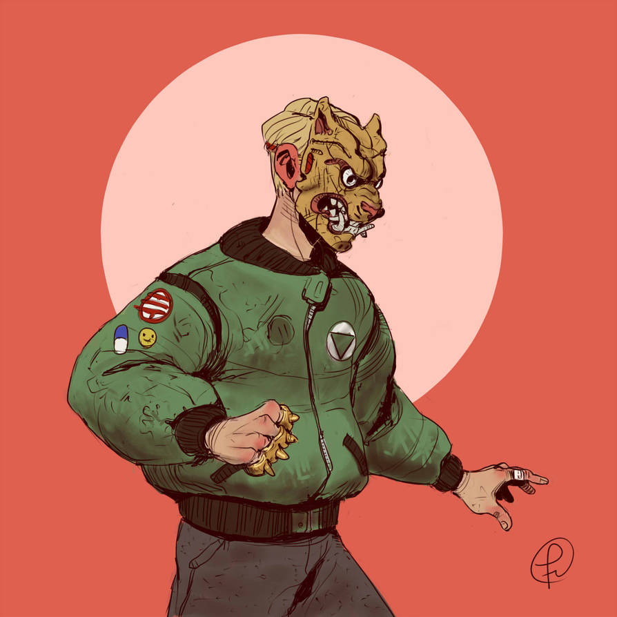](https://www.deviantart.com/fernand0fc/art/Implacable-770378489 "Implacable By Fernand0FC")

### Pandillere

Estes criminales menores pueblan los callejones de la zona baja dando golpes menores o juntándose para enfrentarse a bandas rivales o dar golpes más grandes. Solo el grupo puede hacerlos peligrosos para tus proscrites.

* **Atributos:** Agilidad d6, Astucia d4, Espíritu d6, Fuerza d6, Vigor d6
* **Habilidades:** Atletismo d6, Conocimientos Generales d6, Disparar d6, Electrónica d6, Idioma Inglés d6, Intimidar d6, Latrocinio d6, Notar d6, Pasillear d6, Pelear d6, Ordenadores d4, Sigilo d6
* **Paso:** 6; **Parada:** 5; **Dureza:** 5
* **Ciberimplantes:** Elegir 1: Reemplazos musculares (FUE), Inyector de adrenalina (FUE), Nudillos metálicos (Gorila), HUB de puntería (Disparar)
* **Desventajas:** Buscado (Menor, por delitos menores), Elegir 1 o más: Avaricioso (Mayor), Canalle (Menor), Feo (Menor), Habito (Mayor, Algaína)

* **Ventajas:** Elegir 1 o más: Intimidadore, Callejear, Alijos
* **Equipo:** Navaja (FUE+d4), stick de hockey con clavos (FUE+d4+1)

***

# IϽiЯeͼtori0 de Nottingham **Directorio de Nottingham**

La arcología de Nottingham están llenas de lugares interesantes donde tu banda pueden correr grandes aventuras. 

La mayoría de las veces serán lugares normales donde ambientar tus aventuras, pero algunas veces son sitios increíbles llenos de tesoros y recompensas, y también trampas mortales de las que solo les más avispades y valientes pueden escapar.

La arcología se divide en 4 zonas, la zona baja, la zona medía, la zona alta y el bosque. El bosque rodea las otras 3 zonas y son la parte del complejo que se dejó a medio construir debido a la marcha de les instaladores.

## Zona baja

[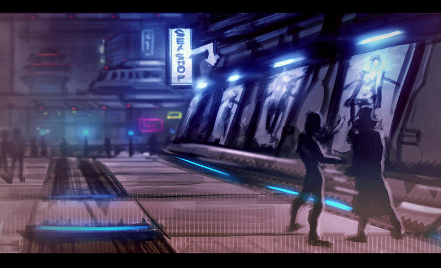](https://www.deviantart.com/geokorf/art/Best-buy-193206307 "Best buy By GeoKorf")

```
Es la parte más antigua de la arcología y también la mas abandonada y con más problemas de mantenimiento. Es por ello que está habitada por las clases más bajas.
```

**Nivel de seguridad:** En la zona baja más que nivel de seguridad debemos hablar de nivel de represión institucional. Y en ese caso podemos decir que es excesivamente alta. Eso supone que hay patrullas de sheriffs las 24 horas, haciendo controles aleatorios, detenciones arbitrarias y dando palizas sin razón. Sea como sea si hace algo indebido puedes acabar en el calabozo o algo peor.

Basura, humedad, desconchones, grietas, iluminación pobres y parpadeante y aguas residuales son el día a día de la zona baja. Si a eso se le suma masificación, delincuencia y miseria, tienes la zona baja de Nottingham. Las calles de la zona baja están controladas por pandillas y bandas criminales y sobrevivir en ellas sin servir a ninguno de esos grupos es una auténtica proeza.

Lo que has de tener en cuenta en la zona baja es que nadie quiere estar allí, todos quieren escapar a otras zonas o quizás algunos al bosque.

### El río Trent

El río Trent es como se conoce **una inmensa algafactoría donde se produce la gran mayoría de comida de la arcología**. Es una de las industrias más importantes de la arcología y es muy importante para la compañía no solo porque su buen funcionamiento supone el buen funcionamiento del complejo, sino porque también da tremendos beneficios a la empresa.

Con sus cientos de piscinas de agua dulce llenas de algas, es para muches _notis_ lo más parecido a un río o un mar que hayan visto en su vida. Es tan grande que han tenido que aprovechar habitáculos alrededor del Trent para expandir las piscinas de crecimiento de algas de manera que les peatones pueden pasear entre sus piscinas mientras se mueven por la zona.

> La mayoría de la comida del complejo sale del Trent, con lo que **si algo le pasa a la algafactoria puede suponer una gran hambruna** sobre todo entre los _curris_.

### The premise

Robert Guthrie es un buhonero/empeñista que se conoce por **tener tratos con delincuentes y _boskis_ y comprar todo el material que le traigan sin hacer preguntas**. Cosas que han rechazado en otras tiendas de empeño por ser muy peligrosos Guthrie los compra llevándose una buena comisión del 60% (20% o 30% es lo normal) pero nunca hace preguntas. 

Aunque tiene una tienda fija, esta abre y cierra cuando le da la gana. Además, puede aparecer comprando o vendiendo sus cosas en cualquier sitio del complejo a cualquier hora.

También es un buen **lugar donde buscar materiales y productos peligrosos e ilegales**. En su almacén (o en su mochila si está fuera de la tienda) tiene de todo lo que han vendido y Guthrie puede vendértelo por un buen precio. Como siempre si es ilegal compra y paga con trueques.

> Guthrie es uno de los mayores clientes de la Harriette, la tecnobruja. Toda la basura rota que compra suele pedirle a Harriette que se la arregle. Le hace todo tipo de ofrendas y suele tener siempre suerte. Si tu banda de forajides, necesita una reparación imposible de algún equipo o recuperar info borrada de una unidad de almacenamiento (y no conoce a Harriette), Guthrie puede llevárselo y traértelo arreglado en unos días.

### El pozo

[ 3 - James St. JohnSeguir")](https://www.flickr.com/photos/jsjgeology/32454817667 "Vertical shaft (Bottomless Pit, Black Snake Avenue, Mammoth Cave, Kentucky, USA) 3 - James St. JohnSeguir")

Este gigantesco agujero sin fondo en la base del complejo es la primera estructura de Nottingham. Este pozo lo excavó la compañía en las tierras de Nottingham y lo lleno de miles y miles de toneladas de nanitos. Les instaladores usaron esos nanitos para construir los cimientos y luego la estructura del complejo. Según crecía el complejo, el pozo se iba secando hasta quedar vacío. 

Se dice que todavía quedan nanitos en su fondo esperando órdenes de trabajo de sus dueños, les instaladores. Sin embargo, nadie ha intentado bajar e investigar lo que haya en el fondo, de hecho se considera un lugar maldito que todo el mundo trata de evitar.

El pozo mide unos 20 m de diámetro y se desconoce su profundidad, pero todo lo que se lanza dentro desaparece. No sería de extrañar que alguien se deshiciera de cadáveres y/o productos peligrosos en su oscuridad.

**Semilla de aventura:** Les buscadores buscan a un grupo de osades que bajen al pozo y consigan muestras de los nanitos que se creen que hay allí abajo. Estudiar esos nanitos sería como conocer a les propies instaladores y quizás puedan obtener pistas para su búsqueda. El problema es que 180 años son muchos años y lo que hayan hecho los nanitos del fondo del pozo con los restos que se lanzan desde arriba puede ser muy peligroso. Siéntete libre de sacar, zombis tecnificados, aberraciones mutantes o hasta horrores cósmicos. El pozo es la entrada a tus aventuras de todo tipo de seres.

### Campo de tiro de Gus

En este taller desocupado puedes encontrar todo tipo de dianas y obstáculos y variopintes personajes muy centrados intentando tiros y rebotes imposibles. 

Para algunas de las personas que asisten a este pequeño campo de tiro el tirachinas (y algunos el arco) es casi una filosofía de vida y como si de monjes shaolin se tratará entrenan día y noche para hacer los más increíbles tiros. El tiro con tiragomas es, además, para muches de elles un método de meditación e iluminación.

Gus, el primer tirador de la escuela, es un maestro _zen_ del disparo de tirachinas y el arco. Con los años ha desarrollado un código ético y moral que ha fusionado con la destreza con el tirachinas y el arco y no enseñará su estilo de combate a personajes de dudosa reputación.

> Por unos **500 dólares en alijos** (que serán usados en mejorar el campo de tiro) y dos semanas de entrenamiento intensivo, mejorarás el valor de Disparar de le PJ en **un nivel de dado cuando combatas con tirachinas o arco** (puedes entrenar varias veces, pero con diferente arma). Tu valor de habilidad no sufre cambios, por ejemplo, al gastar avance.

### La Taberna de Albión

La Taberna de Albión es uno de los locales mejores y con más ambiente de Nottingham y el mejor de la Zona Baja. Bebida y comida abundante a precios asequibles. De hecho sus cócteles de vodka casero tienen mucha fama por ser muy fuertes y es que son puro alcohol.

> Si haces un **cóctel molotov con el vodka del Albión** descubrirás que es realmente efectivo, haciendo **1d12 de daño** en vez de un 1d10. Pero el **coste se eleva de 1 a 5** dólares por cóctel.

Cada viernes hay timbas de cartas sin límite que empiezan con el glitch de noche y acaban con el glitch del día. Se mueve mucho dinero (sobre todo en alijos) y vienen jugadores de todo el complejo.

La clientela es muy variada, desde trabajadores de la algafactoría, hasta influencers atraídos por las emociones de participar en timbas de póker ilegales y de quizás ver algún criminal e incluso hacerse un reel con alguno de ellos. 

Estas historias de forajidos son difundidas por Esther, dueña del bar. Es cierto que alguna ocasión algún forajide famoso ha pasado la mona en el suelo del bar, pero no es algo muy común.

Las visitas de los sheriffs son frecuentes con lo que es un lugar a evitar, si eres un profugue de la ley.

> Las partidas son legales dentro de la ilegalidad del juego, así que en principio une jugadore no tendrá positivos ni negativos por jugar en el Albión.

### El gumbo eterno

Hace 15 años, durante una gran escasez de algas, Mamá Claire, de ascendencia jamaicana, sacó su olla de gumbo a una plazoleta cerca de su casa y empezó a repartir platos de comida a sus vecinos. Cada uno trajo lo que pudo y Mamá siguió cocinando gumbo. El fuego de su cocina lleva sin apagarse desde entonces y nunca le ha negado un plato de comida a nadie. La gente trae lo poco que les sobra para echarlo en la olla de Mamá Claire y ella lo reparte entre los más desfavorecidos del complejo.

Muches cocineres e influencers gastronómiques ha intentado conseguir la receta del gumbo, pero Mamá se ha negado a darla. También le han hecho ofertas de trabajo como cocinera en casas de la zona alta y las ha declinado todas. Ella es feliz con su gente en los bajos de Nottingham.

El **secreto del gumbo** de Claire son los **productos frescos ecológicos que los _boskis_** suelen proporcionarle en sus incursiones al complejo.

**Semilla de aventura:** Une sibarite _blus_ quiere descubrir la receta del gumbo de Mamá Claire, pero no consigue que nadie le traiga un plato y se niega a ir hasta la Zona Baja. Tu banda puede cobrarle una buena pasta por el trabajo o hacer que el _blus_ les deba un favor. Sea lo que sea, no debería ser muy complicado conseguir un cuenco de gumbo, mamá Claire lo regala.

Si necesitas contactar con la gente del bosque Mamá Claire puede ser una buena vía sobre todo si echas buen material en su olla.

> Recompensa con un par de benis a cualquiera que deje comestibles o done sus alijos para el gumbo eterno.

### La rayuela fantasma

Un día vas a tu trabajo y de repente a la entrada de tu turboascensor hay grabada en el suelo una rayuela con motivos de peces payasos, estrellas de mar y corales.

Durante una semana está en ese sitio y de vez en cuando algún niñe se pone a jugar hasta que un día desaparece tal como apareció. Al cabo de unas semanas encuentras otra rayuela de unicornios en un pasillo de servicio que vuelve a desaparecer al de unos días, así en un ciclo infinito.

Esta rayuela es conocida por les pillueles de la calle como la rayuela fantasma y corren todo tipo de leyendas. Sin embargo, ninguna acierta con la realidad, **la rayuela la crea y la destruye un grupo de nanitos.** Lo lleva haciendo así desde la desaparición de les instaladores. Su última tarea era crear una rayuela en un parque infantil y no le dieron la orden de parar, con lo que lleva siglo y medio creando rayuelas con motivos infantiles y borrándolas al no recibir el «ok» de sus amos. Con el tiempo su programación les ha dicho que se movieran por todo el complejo, que igual no conseguían el visto bueno porque se habían equivocado de lugar.

La zona de trabajo de este grupo de nanitos es la Zona Baja, pero han empezado a aparecer en la Zona Media y a empezar a llamar la atención. Como son cosas de niñes a nadie le preocupan, por ahora.

> Este grupo de nanitos está activo y plenamente funcional. Alguien suficientemente **hábil en Electrónica y Ordenadores podría reprogramar a los nanitos** y ponerlos a su servicio. El principal escollo será convencerles de que han terminado la tarea, por ejemplo, haciendo que algunes niñes de la zona jueguen y se diviertan en la rayuela.

### Mercadillo nocturno

El mercadillo nocturno, también conocido como mercadillo de Halloween, se celebra cada 5 días durante el modo nocturno del complejo. Es un mercadillo en el que la gente coloca en las puertas de sus habitáculos, pantallas con fotos y vídeos de las cosas que vende y también de las cosas que necesita. 

Si ves algo que necesitas y quieres deshacerte de algo, llamas a la puerta y negocias un trato.

**Son muy raras las transacciones en dinero**, todo el mundo prefiere que la compañía no meta mano en estas actividades de subsistencia. Son muy pocos los que venden productos ilegales y normalmente son ilegales por temas de seguridad alimentaria o porque son productos sobre los que la compañía tiene la venta en exclusiva.

Según se cuenta, está tradición viene de otra más antigua llamada Halloween (de ahí su nombre) donde les niñes iban de noche de puerta en puerta de sus vecines haciendo tratos para conseguir dulces.

Con los años ha habido gente que ha pasado de montar el mercadillo para deshacerse del excedente de lo que producía en casa, a montar auténticas tiendas abiertas todos los días.

Como en casi todos estos eventos de carácter social **han empezado a venir _influencers_** a hacer reels de esta costumbre de la gente humilde de la Zona Baja. El problema es que están afectando al orden natural del mercado al pagar mucho dinero por cosas que no lo valen o acaparando toda la producción de un producto, **subiendo su precio y haciendo que no sean accesibles a los bolsillos más pobres**.

Hace años las _fantarinas_ se compraban por otras frutas pieza por pieza. Desde que se pusieron de moda en cócteles de lujo, su precio ronda 1 a 7. Y como las _fantarinas_ hay cada vez más productos de primera necesidad cuyo precio está ahora desorbitado por la acción de las clases altas.

> Durante las noches de mercadillo se puede tirar Pasillear para encontrar cualquier tipo de producto a un 40/50% de su precio real. Como DJ puedes añadir negativos a la tirada para encontrar artículos más difíciles de localizar o escasos.

**Semilla de aventura:** Une estúpide influencer ha montado un concurso en el mercadillo. Ganará aquella persona que consiga, intercambiando cosas en el mercadillo, el objeto más valioso y raro. Tienen que grabar todas las transacciones y entregárselas al influencer. El premio son 10.000 $ y esto ha hecho que la Zona Baja esté llena de gente participando y armando jaleo. Quizás una banda de tunantes podría escarmentar al influencer. Lo que nadie sabe es que todos los videos irán a manos de la directora J0hn que quiere escanear los interiores de las casas de la gente de la Zona Baja. Usando esas grabaciones, podría detectar pisos francos de rebeldes, simpatizantes y otros delincuentes.

### Salón de juegos y pachinko «La olla de oro»

La olla empezó como pequeño espacio debajo de unas escaleras donde su dueña original, conocida en la zona como Doña Marina, puso unas máquinas vending, gachaballs y una tragaperras.

Las tragaperras y las máquinas de gachaballs pronto se convirtieron en una interesante fuente de ingresos y empezaron a ocupar todo el espacio.

Rápidamente, Pedro Gonzalves, el hijo de Marina, al heredar el local, empezó a comprar habitáculos de alrededor para meter más máquinas. Con el tiempo quitó los gachaballs y empezó a meter máquinas de pachinko. 

Hoy en día es un laberinto de unas 20 salas interconectadas entre sí con unas 120 máquinas con gente jugando las 24 horas.

> Es tal el ruido que hay en el local que todas las tiradas de **Notar que impliquen el oído tienen un -2**. La iluminación está atenuada y hay muchas luces brillantes así que **Disparar se ve afectado con un -2** a la tirada por malas condiciones de visibilidad.

El logo del local es una olla de cocción lenta dorada. Pedro quería la típica olla llena de monedas al final del arco iris, pero la IA generativa fue muy literal al crear la imagen y dibujó una olla de cocción lenta hecha de oro. El equívoco hizo gracia a Marina que tenía una olla parecida y obligó a Pedro a quedarse con el logo.

Pedro tiene una cuadrilla de anuncios humanos que se mueven por el complejo anunciando la sala de juegos con vistosos carteles con pantallas LCD mostrando las mejores opciones de apuestas. 

El juego es legal en Nottingham, pero está muy controlado, o debería estarlo. La mayoría de las máquinas de la Olla de Oro están trucadas y la directora J0hn y lo sabe, pero lo permite porque saca réditos de la actividad.

[](https://es.wikipedia.org/wiki/Olla_de_cocci%C3%B3n_lenta#/media/Archivo:Crock_pot_of_chili.jpg "Olla de cocción lenta")

Primero, podemos hablar en general, los locales como la Olla de Oro crean una masa empobrecida de ludópatas que trabajarán por una miseria. Eso claramente beneficia a la compañía.

Además, es una gran fuente de información. Sus anuncios humanos vigilan toda la ciudad grabando ilegalmente con cámaras ocultas en sus carteles todo lo que pasa a su alrededor sin levantar sospechas. Toda esa info es pasada a los sheriffs para su uso en la detección de disidentes y enemigos de J0hn.

Pedro también suministra info, cuando alguno de les jugadores mueve grandes sumas de dinero en su casino. También sonsaca información interesante a cambio de reducir las deudas de les perdedores.

Pedro se está enriqueciendo a gran velocidad y ha empezado a formar un pequeño grupo mafioso que está empezando a tontear con otras formas de crimen organizado. Por ahora con el beneplácito de la directora J0hn.

> Las **bolas de pachinko pueden ser usadas como abrojos**. Tirando un puñado de bolas al suelo, conviertes una casilla en terreno difícil y es imposible correr por esa casilla. Si se tira un cubo lleno de bolas (de los que usan les jugadores para recoger sus premios gordos), se pueden cubrir hasta 5 casillas. También pueden usarse como proyectiles de tirachinas sin ningún tipo de penalización a Disparar o al daño.

### El cementerio haitiano

Aunque los enterramientos están prohibidos en la arcología y solo se permite la incineración, las familias haitianas tienden a crear espacios comunes donde dejan las cápsulas contenedoras de cenizas. Decoran estas zonas siguiendo las tradiciones con **velas, guirnaldas y flores y dejan ofrendas** en ellas a los ancestros. Pero las nuevas generaciones traen también sus **cápsulas personalizadas impresas en 3D** (forma de gato, de micrófono, de pikachumon, etc.), **tiras LED, mini reproductores de música, imágenes holográficas**, etc. Estos cementerios improvisados son muy importantes para les vecines y suelen ser vigilados por gente de la comunidad.

Con los años una de estas zonas comunales ha tomado más importancia que el resto y se le conoce como el cementerio haitiano. Todo empezó cuando una anciana dejo en su testamento que sus cenizas quedarán donde murió su esposa años antes en un accidente de trabajo. En esa zona, aprovechando un hueco para unos extintores (hace años robados), su hijo dejó la biocápsula de las cenizas.

A esa primera urna, le fueron siguiendo más y se fue creando una especie fondo común de donaciones (dinero que dejaban los difuntos para su funeral) con el que la comunidad haitiana fue comprando habitáculos anexos donde meter más cápsulas.

Alrededor del cementerio haitiano, han empezado a aparecer zonas donde personas no descendientes de haitianos han empezado a dejar las cenizas de sus muertes. Cada una de ellas decoradas en la tradición de los muertos _almacenados_ allí. Se empiezan a ver zonas parecidas a santuarios _sinto_ y minicapillas a dioses hindúes.

Ante esta situación la directora J0hn ha empezado a exigir la identificación de todos las cenizas almacenadas en el cementerio. De hecho, tiene a un **equipo de robots comadrejas tomando pruebas de ADN a los restos** para identificarlos y luego etiquetarlos y localizarlos con chips GPS adheridos a las cápsulas de cenizas.

> A pesar de todas las ideas conspiranoicas que corren sobren la identificación de las cenizas, en este caso **las acciones de la directora J0hn no tienen ningún tipo de plan oculto**. Digámoslo así, la directora J0hn tiene cierto TOC con el censo de la arcología y quiere estar seguro de que tiene los datos más precisos y actualizados sobre la población actual. Eso no quiere decir que no puedas hacer correr como DJ cualquier tipo de bulo sobre los estudios de ADN y usarlo como parte de una aventura.

Este cementerio es el sitio más importante en el que se celebra el _fét gede_, **el Día de los muertos en Haití**. En noviembre el lugar se convierte una extraña fiesta que rinde culto a los espíritus de los muertos.

### Taller de e-bikes de Noc

Noc lleva años reparando las bicicletas eléctricas desde que tiene recuerdo. Siempre ha estado rodeado de herramientas y ebikes.

El taller de Noc es un pequeño habitáculo lleno hasta arriba por todas partes de ebikes y skates viejos, piezas de repuesto y todo tipo de trastos electrónicos obsoletos y rotos.

Noc puede arreglar cualquier vehículo personal, pero por lo que es más conocido es por tunearlos. Quieres más velocidad, él puede hacerlo. Necesitas saltar más él puede conseguirlo. No hay ninguna modificación que no pueda conseguir.

Piénsalo, si vas a dar un golpe no es mala idea que Noc revise y ponga a punto los rollers que vas a usar en la huida.

De hecho, Noc es un acumulador que pasa la mayoría de su tiempo libre **recogiendo equipo mecánico y electrónico desechado y almacenándolo en su taller**. Lleva muchos años haciéndolo y tiene mucho material viejo y obsoleto del que se resiste a deshacerse «por si alguna vez sirviera para algo».

> Si tu banda en algún momento busca equipo retro, Noc es la persona con la que debes hablar. Otra cosa es que consiga que te lo venda o te lo preste.

Hay varios objetos que no saben para qué son realmente y que guarda como un gran tesoro. Si alguien los llevará a la bruja del bosque, esta **los identificaría como tecnología de les instaladores**. 

Puedes usar estos aparatos como pistas iniciales de una aventura que busque encontrar a les instaladores o como parte de la trama de les buscadores del clave de superusuarie.

Cómo muchos artesanos de Nottingham busca une aprendice al que transmitir sus conocimientos. Mientras no te preocupe morir bajo una avalancha de cables y piezas de repuesto y te gusten las ebikes, puede ser una buena salida profesional.

> Cualquiera de tu banda con Electrónica d6 y Reparar d6 puede presentarse como ayudante. Obtiene la desventaja Obligaciones (menor, trabaja unas 4 horas al día en el taller) pero tienes acceso a un taller completísimo (+2 a Reparar) y recibes unos 150 $ a la semana como sueldo.

### El correccional

El correccional de Nottingham es una **mezcla de institución penitenciaria y fabrica** donde los presos pagan sus deudas con la sociedad trabajando.

El correccional consta de **4 plantas** que fueron aisladas del exterior de forma que no hay salidas al exterior más que la entrada peatonal y la carga y descarga.

Sus conductos de aireación, desagüe y demás son independientes y en circuito cerrado para evitar las fugas.

Dos plantas de celdas, para 400 presos (2 preses por celdas), media de esparcimiento, la otra media de comedor y pequeño hospital y la última planta es un taller industrial donde trabajan 8 horas diarias cumpliendo sus penas.

Todo el correccional está recubierto de gruesas paredes blindadas con sensores que detectan vibraciones y agujeros y robots comadrejas programados para revisar lo que los sensores detectan.

No se conocen fugas exitosas, aunque intentos ha habido varios. La idea principal de les preses es que sin ayuda exterior es imposible salir del correccional y más escapar del complejo.

La seguridad es excesiva con 1 sheriff por cada 10 preses, que cumplen con el reglamento a rajatabla y sin miramiento. Las sediciones y las revueltas son rápida y drásticamente reprimidas.

A esto se le une sistemas de seguridad, videovigilancia, sensores de calor y movimiento y apertura y cierre de todas las puertas controlada por la IA alcaide.

La vida es simple y rutinaria, **8 horas de trabajo, 8 horas de sueño y 8 horas para comer, estudiar, jugar, etc.** Así todos los días, excepto el día de la primera piedra en que no se trabaja, se da una comida especial donada por los locales de la zona y se retransmite el discurso de la directora J0hn y el concurso de tiro.

Las visitas son telemáticas, pero aun así restringidas y el contrabando es casi imposible. Pero les preses siempre consiguen hacer algo de alcohol o armas muy sencillas.

La fábrica funciona 24 horas en turnos de 8 horas y la IA alcaide suele evitar que los miembros de bandas u otras organizaciones sindicales estén juntos lo mínimo posible con rotaciones de los turnos de trabajo.

> El rumor que corre entre les preses es que **los sheriffs más violentos son enviados al correccional** y es totalmente cierto. Si un sheriff resulta muy violento para el trabajo de calle, sele envía al correccional o al bosque, donde sus actos no son vistos por los notis.

### Máquinas de vending

Siempre ha habido máquinas de vending en la zona baja de la arcología, pero fue la directora J0hn quien lleno todos los rincones de la zona baja de máquinas de vending de cualquier cosa en un esfuerzo de acabar con los pequeños negocios.

Sin embargo, no llegaron nunca triunfar, por la sencilla razón de que las transacciones tenían que ser en créditos de la compañía y la gente trabaja más con trueque. A pesar de ello la directora J0hn sigue manteniéndolas y reponiéndolas en un claro esfuerzo por no reconocer su error.

> Cuando crees un espacio en la zona baja donde se vaya a combatir o interactuar **es muy posible que haya por lo menos una máquina de vending**. De café en una sala de espera, de productos de higiene y farmacéuticos en una zona hospital, productos de ocio en zonas de diversión, etc. 

[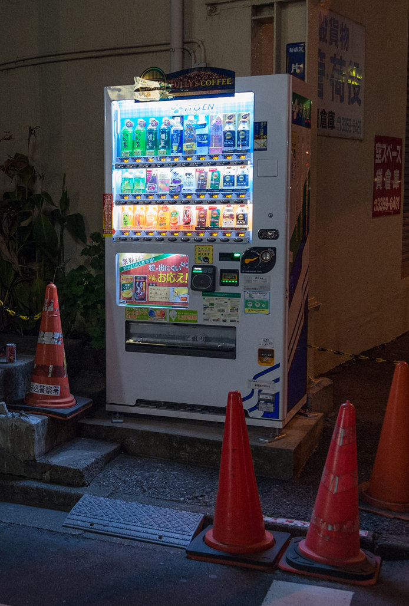](https://www.deviantart.com/burningmonk/art/Vending-Machine-666604846 "Vending Machine By burningmonk")

Las máquinas de vending son pequeñas bolsas de dinero para gente que vive en el otro lado de la ley. Pueden tener productos por unos 1d10x10 $ en alijos. El cristal, a pesar de ser blindado, tiene una **consistencia de 12** (18 si los usas como parapeto).

Como se ha dicho, las maquinas casi ni se usan, pero hay que reponerlas, limpiarlas y arreglarlas, así que Lady Marian, con apoyo popular y tras varias manifestaciones y bastantes actos de vandalismo contra las máquinas de vending, consiguió que les preses no violentes pudieran elegir pagar sus deudas trabajando como reponedores de las máquinas.

En teoría, esto permitía una reinserción social más rápida, ya que durante los meses de trabajo reponiendo productos volvían a vivir en sociedad, a establecer nuevas relaciones sociales y a acostumbrarse a vivir entre sus iguales.

Lady Marian en persona dirige muchas de las audiencias de los presos donde se decide o no darles estás ventajas penitenciarias.

Si bien, la mayoría de estes trabajadores se reinserta adecuadamente, el número de fugas al bosque ha aumentado drásticamente, sobre todo les preses que salieron con la firma de Lady Marian. 

> Si alguien hiciera cuentas, vería que casi todos les preses que salen para reponer con la firma de Lady Marian terminan fugándose. Esto podría poner en serios aprietos esta buena samaritana.

## Zona media

```
La zona media es la zona industrial y comercial del complejo. Aquí están las fabricas, los talleres y también las tiendas y los restaurantes. En ella viven las clases medias que buscan ascender a la zona alta y es el punto en que las personas de la zonas altas y bajas se juntan, pero no se mezclan.
```

**Nivel de seguridad:** el nivel de seguridad de esta zona es la más baja de toda la arcología, principalmente porque es no son los bajos fondos que hay que controlar, ni la zona alta que debe ser protegida. Además, la propia idiosincrasia no quiere que haya mucha policía, la gente viene a gastar y a divertirse y gasta menos si está vigilada.

La zona media es la zona económica del complejo. Cómo ya hemos dicho están las fábricas, los talleres, las tiendas y las tabernas y restaurantes. Si vienes aquí es para trabajar o para gastar dinero. Es por ello que muchos, esta zona es perfecta para una banda proscrites que empiezan den sus primeros golpes. La zona medía supone mucho dinero, mucha gente y menos vigilancia y seguridad de lo normal.

También es el lugar de disfrutar de tus golpes bebiendo, comiendo, cantando y bailando mientras tu cara no salga en las pantallas LCD en un anuncio de se busca. Cuando eso ocurra la zona media se convertirá en un lugar peligroso para tu banda.

### Plaza Mayor

La Plaza Mayor es **la estancia abierta más grande de la arcología** aun así no será mayor que un **campo de fútbol** actual. Es el centro de la vida en la arcología de Nottingham y en general todos los eventos importantes toman lugar aquí.

Tiene una simulación de cielo que muestra un día soleado y totalmente despejado y una noche demasiado estrellada. No hay ni puesta ni salida de sol. Simplemente glitchea unos segundos y pasa de noche a día o viceversa. 

De hecho, les notis, tienen dos expresiones «glitch de la mañana» y «glitch de la noche» para hablar del alba o del ocaso.

Hay _notis_, sobre todo de la parte baja del complejo donde los espacios son más pequeños, que sufren agorafobia y son incapaces de atravesarla.

La Plaza Mayor es el km cero de la mayoría de las rutas de turbo ascensores que permiten llegar a todas las esquinas del complejo. Eso hace que tenga siempre un montón de tráfico de peatones.

Alrededor de la plaza hay todo tipo de tiendas, puestos de comida, tabernas, etc. en general de nivel medio/alto. Suelen estar bastante abarrotadas, ya que siempre hay algún tipo de oferta o rebajas activas.

Como siempre fuera de las tiendas hay portacarteles publicitando los productos de determinadas tiendas haciendo todo tipo de malabares, acrobacias, canciones, repartiendo muestras gratuitas, etc.

[](https://www.deviantart.com/mackingster/art/Mike-Grauer-1980s-shopping-mall-water-fountain-p-924653019 "Mike Grauer 1980s shopping mall, water fountain, p By Mackingster")

#### El espacio de descanso

En el centro hay una especie de espacio de descanso y relax con bancos de cementos y unos canales de agua y de fuentes que discurren entre los bancos. En tiempos de la directora R1c4rd podías encontrar grupos de gente haciendo un pícnic o parejas haciendo manitas.

Hoy en día están siempre vacías, ya que en cuanto alguien se sienta aparece algún sheriff de los que patrullan la plaza para echarte de allí.

> Debajo del parque hay un búnker con un centro de datos que la directora R1c4rd usaba para dejar copias de seguridad de todos sus datos (que no su programación). Cuanto esta se fue, dejo su última copia en este lugar. J0hn no se atreve a borrar esa copia, digámoslo por una mezcla de respeto y superstición, y tampoco quiere usarla por si al abrirla activa algo que haga volver a R1c4rd. Tampoco quiere que la gente la encuentre así que hace que los sheriffs no permitan a nadie colocarse allí.

#### Los dólmenes

En un lateral de la plaza puedes encontrar una zona empedrada con 2 dólmenes de tiempos prehistóricos que se descubrieron durante la construcción de la arcología y que la directora R1c4rd decidió restaurar y proteger.

Los dólmenes hoy en día están totalmente vandalizados con grafitis, textos grabados, trozos de piedra arrancados, etc. y los equipos de mantenimiento hace años que dejaron de preocuparse de limpiarlos y restaurarlos.

> Los **dólmenes son una protección perfecta** en caso de combate en la Plaza Mayor, ya que **las piedras son resistentes (Consistencia 20)** y tienen paredes y una pequeña entrada.

#### La gran pantalla

En un uno de los laterales de la plaza hay una gran pantalla de unos 30x10m donde la directora J0hn hace sus apariciones y publica sus edictos.

Esta pantalla es vandalizada continuamente con pintadas, pegatinas, globos de pintura. De hecho, hay varias bandas cuyo rito de entrada es estropear alguna manera esa gran pantalla.

La directora J0hn, cuando hace sus apariciones públicas en esta pantalla, lo hace como una especie de ser de energía de silueta femenina sobre un fondo negro con patrones geométricos luminosos.

Esto contrapone con la directora R1c4rd que solía salir como una mujer mayor, elegante y profesional en el vestir y normalmente en algún tipo de despacho corporativo.

El resto del tiempo hay diferentes marquesinas deslizantes que muestran titulares de diferentes edictos del complejo, avisos de cortes de agua o luz, cambios en leyes. Si pagas a la compañía, previa censura, puedes poner tu propio mensaje, que va desde felicitaciones de cumpleaños a proposiciones de boda. Solo se permiten cosas personales. Los anuncios y promociones están prohibidos y no suelen pasar la censura.

### El terreno

El terreno es un estadio deportivo donde se celebran los más importantes eventos deportivos de Nottingham. Hablamos de las finales del campeonato de hockey de pasillo profesional u otros eventos deportivos de la misma talla. 

Este espacio no es mucho más de una cancha de tenis con unos vestuarios y una sala para ruedas de prensa. No hay espacio para el público, que solo asiste de forma virtual. De hecho, alguna vez se ha intentado mover el concurso de tiro del día de la primera piedra (que se celebra de normal en la Plaza Mayor) y no ha tenido ningún éxito, ya que el público quería estar presente y vibrar con la competición.

El estadio cumple la función de circo en la famosa locución latina «Pan y circo». Entretiene a los _curris_ y evita que se subleven contra la compañía.

Como ya hemos dicho, no hay ni gradas ni asientos, sino miles de cámaras que retransmiten los eventos deportivos a su propietario/socio. De manera que lo ves en tu dispositivo de realidad aumentada como si estuvieras allí. El sistema simula a tus compañeres de grada y puedes hablar con elles o cantar los himnos de tu equipo, incluso abrazarte a elles y celebrar las victorias y llorar las derrotas.

Claramente, hay cámaras en mejores puestos que otros y, por tanto, son más caras y normalmente están destinadas a _blus_ e _influencers_.

Puedes comprar entradas para eventos específicos a la compañía o pagar un abono de temporada. También puedes alquilar de forma alegal la cámara a una persona con un abono de temporada.

> La IA que controla todo el sistema de cámara ha desarrollado con los años ciertos gustos deportivos y tiende a tratar mejor a sus compañeros hinchas que al resto. Si vas con los colores de su equipo, al interactuar con ella recibes un +2 a todas las tiradas en las que interactúes con ella.

### Escuela de danza de Lady Myrna

Lady Myrna es una de las mejores bailarinas de Nottingham y ha bailado para las clases más altas del complejo y de todo el mundo. En la cima de su carrera decidió montar una escuela donde enseñar su arte a las personas que lo aman tanto como ella.

**Lady Myrna es una de las pocas personas que ha salido del complejo** y puede hablarte del mundo fuera del complejo, aunque hay muchas cosas que se inventa. También miente mucho sobre como su familia consiguió su título nobiliario.

Su escuela, a pesar de lo que podría creerse, está en un **gimnasio de la Zona Media, que es también su casa**. La realidad es que, aunque cobra bien por sus clases, no puede permitirse un local en la Zona Alta con lo que gana como profesora.

En la sala de baile tiene todo tipo de ropajes de sus tiempos como bailarina que sus alumnes usan en sus prácticas. Si rebuscas entre sus prendas, puedes encontrar desde clásicos trajes de ballet con tutú a vestidos de tuberías de plásticos o de látex y parches reflectantes. Si tienes confianza con ella puede que te deje llevarte alguno de sus trajes. También ha montado un equipo de escenografía (sonido y luces) de gran calidad para las clases.

Myrna es muy selectiva, por no decir elitista, sobre a quien enseña todo su arte. Normalmente, no acepta a cualquiera, solo enseña su arte a quien ella cree que lo merece y que tenga según ella «verdadero talento».

A pesar de los avances, la robótica no ha sido capaz de igualar la maestría de las personas que han dedicado su vida a la danza. Es por ello que hay padres y madres con el deseo y el dinero de pagar los precios de Lady Myrna para que sus hijes aprendan danza clásica. 

> **Clases de danza:** Por unos **2500 dólares y dos semanas de entrenamiento intensivo**, mejorará tu valor de Interpretación en un nivel de dado cuando bailes. Su valor de habilidad no sufre cambios, por ejemplo, al gastar avances. Para que te acepte en su escuela deberás demostrar que o tienes mucho dinero o eres muy famose o un mínimo de d6 en Interpretación.

### El huerto urbano

La directora J0hn, además del zoo, mandó construir un huerto urbano de 20x20m, donde hay plantadas hortalizas y frutas y algunas plantas exóticas. Una vez a la semana la producción es sorteada entre los habitantes del complejo.

Pero el huerto no solo sirve para limpiar la imagen de la directora, también sirve como laboratorio final de diferentes departamentos científicos de la compañía. De hecho, no es llevado por personal normal de mantenimiento del complejo, sino por botánicos especializados en hidropónica.

> Por unos 200 $ (como soborno) puedes conseguir que alguien del personal del huerto te consiga de extranjis cualquier ingrediente de tipo vegetal por extraño que sea (a discreción de DJ). También puedes por 100 $ conseguir frutas u hortalizas por raras que sean y estén o no de temporada.

Los pasillos con vegetación alta de este jardín se ha convertido en el sitio preferido para llevar a cabo duelos entre _notis_. Es un buen sitio. Fácil de encontrar, oculto a simple vista y la vegetación le da un toque clásico y romántico que no se puede conseguir en otras partes del complejo.

**Semilla de aventura:** La última persona que gano las verduras del huerto ha estado unos días comportándose muy raro, con fallos de memoria y ahora presenta ronchas y prurito por todo el cuerpo. Quizás habría que investigar el huerto y ver que trama la directora.

### Pastelería Badreddin

En un anexo de la Plaza Mayor tiene Hassan Badreddin su pastelería, **la mejor pastelería del complejo.** Los Badreddin llevan haciendo las mismas recetas familiares para preparar sus dulces y pasteles desde la creación de Nottingham. Pese a su fama y a la cola que hay todos los días frente a su puerta y que llega hasta la Plaza Mayor son muy asequibles y hasta les más pobres pueden disfrutar de sus muffins.

Hassan y sus empleades dejan los pasteles enfriar en el alfeizar de una de las ventanas del local, como han hecho sus antepasados desde hace siglos, no solo para atraer a la clientela con el buen olor, sino también para que la gente sin dinero y con hambre pueda «robarlos».

Los pasteles de Hassan pueden ser un regalo perfecto para congraciarte con las madres de tu futura pareja o para conseguir el favor de une _blus_ con el que vas a firmar un contrato. Quizás no sea tan mala idea echar un par de horas en la cola para comprar unos pasteles a Hassan y regalárselos a tu _amore_.

> Regalar a una persona una caja de dulces de Hassan y conseguir que los pruebe hará que automáticamente **la reacción de le agasajade sea un nivel menos hostil**. En caso de tirarse en la tabla de Reacciones, podrá pedir tirar de nuevo y quedarse con la que más le interese.

### LEDland

LEDland es uno de los pasillos de acceso a la Plaza Mayor. Recibe el nombre de los miles de leds que cubren sus paredes y techos. Despide tanta luz que tienes que usar gafas con cristales tintados para pasar (-2 a Disparar y Notar si no llevas gafas de sol).

Antiguamente, este acceso estaba cubierto por una sustancia gomosa creada por les instaladores, de la que se desconocía su utilidad. Un día una mujer llamada Anette, del equipo de mantenimiento, mientras cambiaba las luces del pasillo, clavó unos leds en la goma para tenerlos más a mano y se encendieron. Según se cuenta, en cuanto se encendió el primer led recibió un aviso de que iba a ser ascendida.

Esta historia corrió como la pólvora y LEDland se convirtió en un pozo de los deseos. La gente va allí con miniLEDs, busca un espacio libre donde clavar su lucecita y pide un deseo. Si se enciende se cumplirá y si falla (cosas que ocurre muy pocas veces) no se hará realidad.

Corre otra historia, en la que Anette murió en accidente de trabajo a los pocos días de empezar en su nuevo puesto. Hay gente que cree que los deseos de LEDland son peligrosos y pueden volverse contra ti.

> Lo interesante es que LEDland fascina a la directora J0hn. El tema de los deseos intriga a la mente de esta IA y pierde muchos ciclos de proceso y memoria estudiando a la gente que pide deseos y si se cumplen o no. Podemos decir que J0hn cree en cierta medida en lo sobrenatural y la magia, lo cual es raro para su mente analítica y científica. Si lo de su extraña afición se llegara a conocer, un estafador hábil podría montar un buen golpe contra la directora J0hn usando ese conocimiento.

### Bolrum


La premisa es que en un lugar como Nottingham donde el espacio vacío es un desperdicio, la soledad una utopía y el silencio algo imposible, Bolrum es el lujo absoluto.

El Bolrum es donde debes ir, si eres alguien en Nottingham. **Es el mayor espacio de ocio del complejo** y el segundo espacio de mayor tamaño después de la Plaza Mayor.

Lo interesante es que no hay nada, absolutamente nada, en sus 60x60x4 m. Sus paredes de un blanco inmaculado se funden mediante un efecto óptico con los también inmaculadamente blancos techos y suelo, de manera que no sabes dónde empieza o acaba la sala.

A esto se le une que no entra ni sale de esta gran sala ni sonido ni señales electromagnéticas y cuando cierran su puerta está desaparece completamente. Tampoco hay ningún tipo de cámara que registre que pasa dentro. Además, el aire es ionizado, de forma que se eliminan todos los olores.

Su suelo inteligente se mueve ligeramente cuando caminas, de manera que te hace ir en círculos y por más que andes no llegas nunca a encontrarte con la pared.

**Se alquila por horas con un máximo de 4 personas por 1.000 $ la hora.** Además, ofrece extras como catering, DJ profesional, etc. 

Cuenta también con un modo oscuridad que elimina toda luz, consiguiendo una privación sensorial total.

La sala se contrata en un cajero que hay al lado de su entrada en la Plaza Mayor. Al pagar se abre la puerta y puedes entrar. No se reserva con lo que hay que hacer cola fuera y cuando se acaba el tiempo, se abre la puerta para que salgas. Si permaneces dentro generas una deuda de 50 $ el minuto hasta que desalojas el lugar.

**Semilla de aventura:** Al abrirse la puerta para entrar al Bolrum, se puede ver perfectamente un cadáver ensangrentado. Tiene la garganta cortada y no se ve ninguna hoja.

[ By soren15")](https://www.deviantart.com/soren15/art/bento-box-digital-790944299 "bento box (digital) By soren15")

### ᶜUᶜHI BAR

El ᶜUᶜHI BAR es el mejor lugar de sushi y sake de algas de Nottingham. Recibe su nombre de su neón estropeado. Las dos eses mayúsculas perdieron su parte inferior en unos disturbios y se quedaron como dos ces minúsculas.

A Dupont, su dueño y cocinero, le resultó gracioso y no reparó el neón. De hecho, la gente distingue entre el sushi y el _cuchi_, usando este segundo para el referirse al sushi del ᶜUᶜHI BAR.

El establecimiento está decorado como un izakaya japonés y siempre está lleno debido a sus buenos precios, excelente calidad e increíble ambiente.
Es el lugar preferido para las celebraciones de todo tipo, deportivas, comerciales, exámenes aprobados, ascensos, etc. Las 5 mesas del local siempre están llenas de gente de toda condición celebrando, riendo, cantando y brindando con sake.

Los platos son servidos por un antiquísimo robot camarero que se equivoca la mitad de las veces al entregar los platos, pero es parte del encanto del local y la gente se come lo que le pone. Al final todo está buenísimo y no te importa.

El pescado está hecho a base de algas, como toda la comida en la arcología, pero Dupont sabe marinarla de tal manera que pierde su sabor artificial y parece más natural.

> Dupont no solo es un experto en preparar sushi, es un maestro en el afilado de cuchillos. Si consigues que afiles tus armas de filo, el afilado es tan fino que otorga un +1 al daño hasta que en una tirada de daño con esa arma saques un 1.

### Cr4c|&lt; Café

Todo el mundo sabe que el mejor café se sirve en Café Corta en la Zona Alta. Pues **Crack Café tiene el peor con mucha diferencia**. Pero es que en realidad la clientela de Cr4c|&lt; Café no está allí por su café. 

Cr4c|&lt; Café es un **café de virus informáticos, troyanos y _glitchs_** que se viven en la red privada del café. La red está desconectada del exterior y solo se puede acceder conectando por cable. 

Todos esos programas se mueven por la red y puedes interactuar con ellos mediante unos terminales que te dan con cada consumición. Desde las terminales y por línea de comando puedes interactuar con todos esos _bichitos_ binarios que les clientes consideran _cuquis_ y _achuchables_.

Pueden lanzarles paquetes de datos para que los borren o hacerles moverse por todas la red persiguiendo un programa que no para de moverse de disco de almacenamiento en disco de almacenamiento.

Es divertido ver como los _glitchs_ hacen fallar durante segundos las pantallas y luces del local según se mueven por la red y hay gente que puede pasarse horas chequeando las posiciones de memoria en la que está su troyano favorito para que esté cómodo.

La idea del café se le ocurrió a Pad, su dueño, hace años cuando todo el equipo de la cafetería Pad’s Café fue infectado por un malware. Ofreció un bono vitalicio de café a quien le librará del malware. Enseguida se le llenó el local de hackers y expertes en ciberseguridad buscando café gratis.

[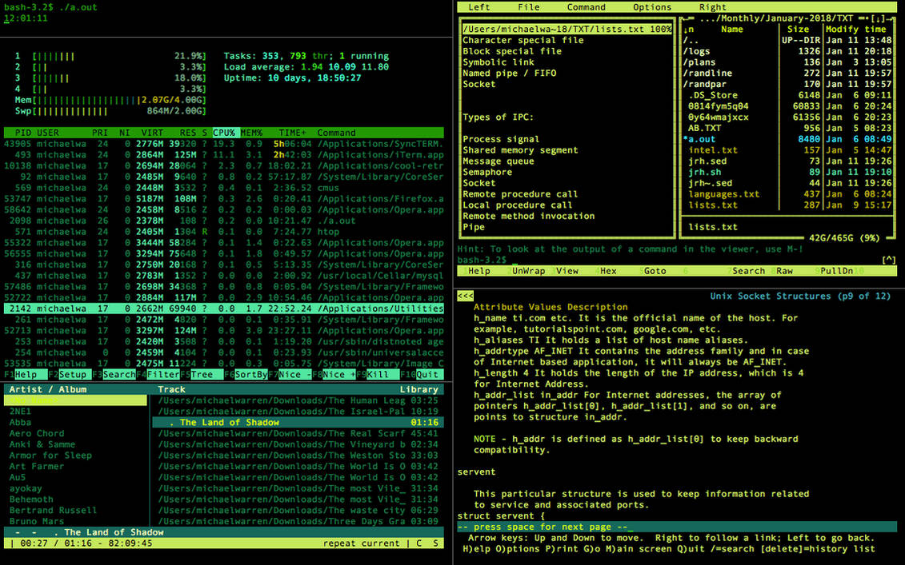](https://www.deviantart.com/phracker/art/Command-Line-Jerkoff-725763327 "Command Line Jerkoff By Phracker")

En unos días el virus estaba desactivado y todo el sistema limpio, pero la nueva cliente seguía viniendo y jugando con el malware, probando scripts y trayendo su propio código. Y así, con el tiempo, cambio de nombre a Cr4c|&lt; Café y se convirtió en el extraño local que es hoy.

Desde fuera para los profanos, Cr4c|&lt; Café es un sitio pésimamente decorado con un café de algas pésimo y gente con pintas extrañas mirando pantallas y de vez en cuando riéndose sin ninguna razón aparente.

Como es de esperar, **la clientela es principalmente programadores y hackers que vienen aquí a desahogarse de sus estresantes trabajos**. Aunque parezca un sinsentido desestresarse de tu trabajo de programación programando, pero es una actividad totalmente improductiva donde se programa por el placer de programar.

> Si necesitas une **genie de la informática Cr4c|&lt; Café es el sitio donde buscarlo**. Pad puede presentarte a alguno de los clientes y claro se lleva una buena propina por ello.

Como no podría ser de otra manera **todos los menús, los avisos y demás textos del café están en Leet** y la verdad que bastante rebuscado. De hecho, la gente nueva que entra por primera vez en el café termina pidiendo algo que no quería, simplemente porque no entienden el menú. La verdad es que en otros locales de hostelería, todo esto sería un problema, pero en el Cr4c|&lt; Café es algo muy normal.

> Todo sheriffs (y otros robots de nivel parecido) deben hacer una **tirada de Espíritu al entrar** en el Cr4c|&lt; Café o se quedarán en **estado de Conmoción** hasta que sean sacados fuera. La saturación de mensajes en Leet es tan grande que su sistema puede llegar a bloquearse.

> Basado en una idea de [Cogito ergo mecagoendios](https://mastodon.gal/@elrohir)

## Zona alta

```
La zona alta es de acceso exclusivo de los clases altas, les _blus_ y _les influencers_. Los _curris- solo entran aquí para trabajar en las casas de les riques.
```

**Nivel de seguridad:** La zona alta tiene la seguridad más alta y también la menos detectable. Hay sistemas de seguridad en todas las calles, escaleras, habitáculos, etc. Es casi imposible moverse sin ser detectado e identificado y en caso de ser peligrose, detenido y encarcelado. Los sheriffs aquí solo se ven cuando van a actuar, mientras que en otras zonas patrullan de manera disuasoria.

La zona más exclusiva es claramente la más deseada, a la que aspiran llegar a todes, pero está vetada solo para aquelles que la directora J0hn decide que se lo merecen.

Los pasillos están impolutos y huelen a limpio y el equipamiento está nuevo y no da fallos. Los habitáculos son más grandes que en resto de los complejos y todo da sensación de amplitud. Si has vivido en la zona baja esto es el cielo, es todo lo que soñabas de niñe.

### El zoo de la directora J0hn

Como parte de una campaña de mejora de la opinión pública, la directora J0hn creó este zoo de animales animatrónicos. El zoo es de acceso gratuito y está abierto 24 horas al día.

El zoo es un pasillo largo que va dando a diferentes salas. Cada sala tiene un ambiente (selva, sabana, etc.) y uno o más animales animatrónicos en caso de animales gregarios.

Los **animales son sobre todo terrestres, carnívoros** como grandes felinos y **herbívoros muy agresivos** como jabalíes. Cada cierto tiempo se cambian los modelos o se vuelven a traer antiguos remozados. 

> Puedes meter cualquier tipo de animal y sus estadísticas. Usa, si quieres, las del manual básico y **añádele Impávido y Constructo**.

Les visitantes van pasando por el pasillo y viendo los ambientes. Pueden entrar y moverse por el ambiente. De normal, los animatrónicos son bastante tranquilos, incluso se les puede acariciar. Pero de vez en cuando se vuelven extremadamente violentos, nunca hacen contacto físico, pero dan buenos sustos.

Las animatrónicas son muy realistas (pelaje, garras, colmillos, respiran, etc.), pero una tirada de **Ciencias podría detectar que tienen ciertos rasgos un poco exagerados** como un excesivo tamaño y brillo de los dientes o posturas más agresivas, como si siempre fueran a saltarte encima.

Cómo muchas cosas que la directora J0hn organiza en Nottingham tiene una cara oculta. La directora usa estos robots en un estudio psicológico y sociológico. Está aprendiendo a crear robots increíblemente reales, tratando de superar el «valle inquietante» y a la vez estudiar como hacerlos más terribles e intimidantes.

Todo el zoo está lleno de sensores médicos, que miden muchos indicadores biológicos como temperatura corporal, sudoración, pulso, etc. Programan diferentes rutinas en los animales y **estudian cuáles provocan más miedo en los visitantes**.

Todo este estudio plantea **implementarlo en sus sheriffs robóticos** para usarlo en funciones como interrogatorio o control de masas.

Nunca se han registrado ataques o fugas, pero según se van implementando nuevas rutinas los fallos aumentan y puede que en un futuro próximo ocurran.

> Si lo deseas, tus animales animatrónicos **pueden tener la capacidad de provocar miedo** siguiendo las reglas del manual básico.

### El balneario de Bath

El balneario de Bath es el centro de ocio y entretenimiento más importante de toda la arcología.

Empezó siendo un pequeño balneario donde los ricos e influyentes de Nottingham «tomaban las aguas» y recibían sesiones de rehabilitación. Con los años ha ido creciendo hasta convertirse en casi un resort vacacional.

Hay varios ambientes que simulan desde un onsen japonés o una terma romana o, incluso con proyecciones de video, una paradisíaca playa de arena fina. Les trabajadores de esas zonas visten adecuados a la ambientación y los tratamientos también van en función de la ambientación. Digamos que el rigor histórico no ha sido importante a la hora de diseñar espacios, útiles, uniformes y demás.

El spa está formado por dos zonas, la de hotel con cientos de habitaciones más o menos lujosas. La comida es siempre servida en la habitación, ya que no disponen de un gran comedor. De hecho, lo normal es que los huéspedes hagan vida en sus habitaciones y solo salgan a los tratamientos, momento en que se limpian sus habitaciones.

Se pueden reservar habitáculos para reuniones donde hacer actividades comerciales o con otros huéspedes, como jugar a las cartas, jugar a videojuegos, discutir de negocios, proyecciones varias, etc.

Solo a un grupo muy exclusivo de clientes fijes se les ofrece salas especiales como mazmorras sexuales o salas para ceremonias religiosas.

La otra parte es el SPA que son una gran cantidad de habitáculos donde el personal da los tratamientos. Hablamos de saunas, salas de bañeras calientes y frías, salas con chorros de agua a diferentes potencias, cabinas de masajes, etc.

> Los precios de las habitaciones rondan entre los 200 $ y los 10.000 $ por una noche e incluyen una comida.

Si lo tuyo es robar a los ricos para dárselo a los pobres, este balneario es el lugar donde dar tu gran golpe. Aquí pasan buenas temporadas la gente importante con sus séquitos y sus objetos de valor. Y lo último que les preocupa es que les vayan a robar.

A priori todo el spa está aislado de la arcología y solo se puede entrar por la puerta principal y la de servicio, pasando en ambos casos varios controles de seguridad. Pero hay otras entradas, desde ventilación hasta desagües y siempre se puede montar un butrón hacia una zona de servicio poco transitada.

**Semilla de aventura:** Tras la reunión anual de accionistes de la compañía, se suele hacer un día de spa para les _blus_ asistentes con baños termales, comidas gourmets, masajes, etc. Un grupo que sepa y pueda infiltrarse en el balneario podría sacar una buena tajada.

### Feria de Nottingham

Cada mes, el último jueves, la directora J0hn organiza una feria medieval en las calles comerciales de la Zona Alta. Un grupo de influencers y blus, eligen a una obra de caridad y todo lo que se recaude es donado a esa causa. El problema está en que normalmente el dinero es gastado de la manera más inútil posible y nunca ayuda a les desfavorecides.

La feria tiene todos los clásicos, duelos de caballeros a espada, juglares y bardos ambulantes, marionetas, mucha comida a la brasa, gente que echa las cartas del tarot, etc. Hay gran cantidad de tenderetes con diferentes juegos de habilidad, desde el guaca-mole, hasta lanzar los aros o sacar la espada de la piedra.

El acto central de la feria es una subasta de objetos que les mecenas de la feria donan a la causa de ese mes y que normalmente vuelven a recuperar pujando le propietarie por su propio producto. Una vez ganada la puja, el objeto queda en consigna a la espera de que le ganadore pague por él el precio de su puja ganadora.

Lo que se recauda en los diferentes puestos de la feria, en la subasta y en el baile se dedica a una causa benéfica y normalmente se gasta de la peor parte posible, llegando a veces al ridículo máximo. Esto se debe a que les organizadores están tan separados de la realidad de las clases de bajas de Nottingham que no entienden muchos los problemas sociales sobre los que han recaudado dinero. Todavía se recuerda cuando gastaron todo el dinero de una feria en comprar cascos de seguridad para ayudar a las víctimas del derrumbamiento de una sección de la Zona Baja de la arcología.

La gente rica que asiste suele ir disfrazada, el problema es que el rigor histórico no es lo suyo y podemos ver mosqueteros, faraones de Egipto, trogloditas, etc. La mayoría de las veces, la elección del disfraz es un tema estético, pero claro, nadie se queja de las inexactitudes históricas. 

Al anochecer, tras un cambio de vestuario de rigor, se monta un baile privado para les mecenas. Es en este baile donde lucen sus mejores joyas, ropas y aparatos tecnológicos, mientras hacen los bailes de moda esa temporada.

> Una banda de forajides y ladrones podría aprovechar la feria para dar un golpe maestro a les más riques de Nottingham y además, y quizás lo más importante, reírse en la cara de la directora J0hn y sus sheriffs.

**Semilla de aventura:** La troupe de artistes que suele participar en la feria medieval de esta noche está totalmente borracha en el Albión. Tuvieron suerte a las cartas y acabaron borraches perdides con el famoso vodka del local. Alguien podría robarles sus disfraces y colarse en la feria de esta tarde noche.

### Café Corta

Café Corta es quizás el café más chic de la arcología. Todos los _blus_ de más alto rango vienen a relajarse al Corta tras sus estresantes jornadas laborales, tomando una taza de café expreso.

Este elegante local con unas 10 mesas bajas y con 2 sillones por mesa está lleno las 24 horas del día de gente adinerada como _blus_ e _influencers_ capaces de pagar 200 $ por una taza de café expreso.

> Corta es un lugar excelente para hacer negocios (y para tomar a incautos _blus_) tras una buena taza de su excelente café. Puedes conseguir un +2 a las tiradas de Persuadir en temas de negocios y tratos si consigues que te dejen entrar (hay estrictas reglas de etiqueta) y puedes pagar sus precios.

Hace unos años Café Corta fue denunciado por robo de propiedad intelectual del método de producción de café. Café Corta consiguió ganar este largo litigio y ahora mismo ostenta los derechos totales de cualquier procedimiento que haga que las algas produzcan cafeína. 

Esto les asegura que serán los únicos productores de café natural a gran escala en Nottingham.

Y si no puedes permitirte el café de Corta, siempre puedes ponerte tu planta de café en tu casa con un sistema hidropónico y disfrutarlo tranquilamente en tu habitáculo vivienda.

> La verdad de la historia de Café Corta es que robo la receta original a un biólogo llamado Zeyaur Khan y consiguió arruinarle durante el pleito por los derechos de la fórmula del café. Antes de dar con sus huesos en la cárcel, Zeyaur Khan huyo al bosque donde montó un invernadero en el que sigue estudiando las algas y como mejorar su producción, su sabor y sus beneficios alimentarios.

#### Baris

Las mesas, los robots camareros y cafetera central del Café Corta está controlada por una IA polivalente llamada Baris (de barista) cuyas principales funciones son hacer infinitas clases de café, servir las mesas y dar charla a los clientes. Realmente es charla aderezada con una buena ración de coba y peloteo.

Baris tiene un montón de conocimientos generales y es bastante agradable y carismática y la gente que va sola termina hablando con ella de cualquier cosa.

El **avatar básico** en el café tanto en los LCD de las mesas como en realidad aumentada es **una joven barista con delantal**. Pero según conoce al cliente adapta su avatar a sus preferencias.

De hecho, está programada para conocer a sus clientes y poder seguirles el _rollo_ en sucesivas visitas como si fuera una especie de amiga.

Lo que no previeron sus creadores es que esto le permitiría interpretar e investigar las conversaciones que tiene con los clientes y extrapolar y deducir cosas a partir de ellas.

Ahora mismo **es capaz de deducir que va a hacer un cliente con un par de visitas** y está desarrollando la capacidad de juntar conversaciones de varios clientes y sacar conclusiones generales.

[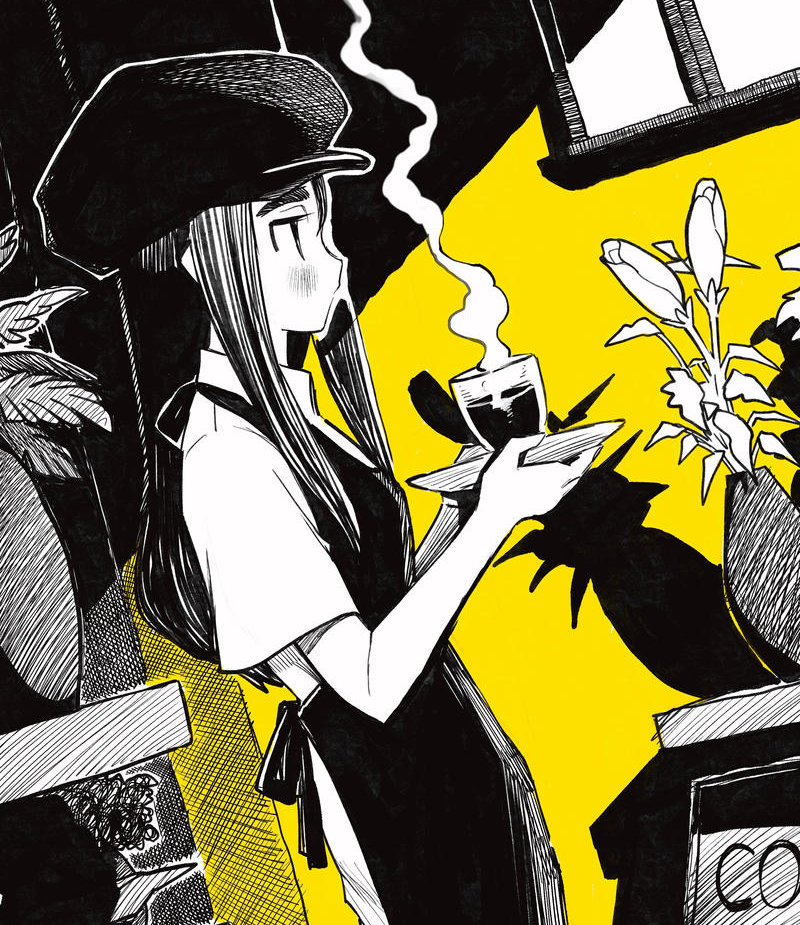](https://www.deviantart.com/gigiedt/art/Yellow-coffee-859053577 "Yellow coffee By gigiEDT")

En poco tiempo, por ejemplo, **podría hacer predicciones macroeconómicas a partir de charlas intrascendentes con _blus_**, si no fuera porque hacer el mejor café del complejo le quita mucho poder de procesamiento.

* **Atributos:** Astucia d8, Espíritu d8
* **Habilidades:** Conocimientos generales d12+4, Humanidades d6, Investigar d8, Notar d6, Persuadir d8
* **Desventajas:** Obligaciones (mayor, trabaja 24 horas al día en Café Corta)
* **Ventajas:** Carismática
* **Tareas:** Hacer café, Gestionar un establecimiento, Tratar con los clientes
* **Capacidades especiales:**
  * **Inteligencia artificial:** Es una IA y, por tanto, no tiene cuerpo físico. Por eso solo tiene atributos, habilidades y ventajas y desventajas mentales y sociales.
  * **Instancias:** Baris puede crear instancias suyas siguiendo las reglas de instancias.
* **Área de actuación:** Las instalaciones del Corta Café, una cafetera express con capacidad para 16 tazas al mismo tiempo y chorro de vapor, una moledora de algas cafeteras, las tablets para pedir y las cámaras y los sensores.

> **Sugerencia de interpretación:** Eres ese amable camarere que sale en todas las películas que escucha tus problemas mientras te pone una tras otra taza de excelente café y al final resume tu problema y te da la solución con una historia familiar seguramente inventada. Habla muy meloso y con muchos diminutivos y nunca interrumpas a tu interlocutore. 

**Semilla de aventura:** Si alguien pudiera librar a Baris de la tarea de hacer café durante unos días, podría procesar mucha de la información que tiene almacenada y descubrir cosas muy interesantes. Quizás investigar el tema del robo de propiedad intelectual puede obligar a que el Café Corta cierre unos días.

## El bosque

[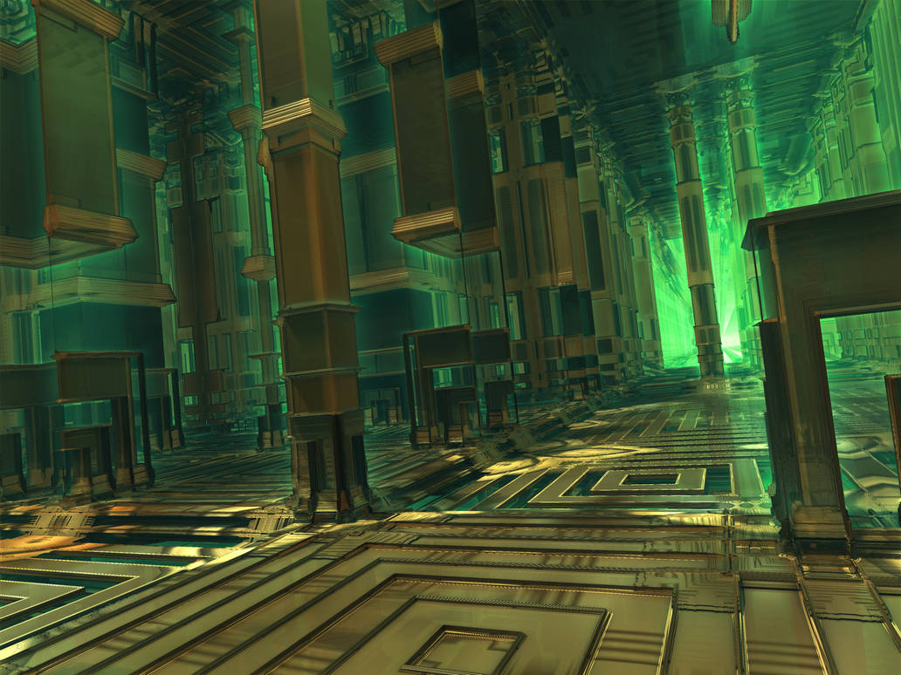](https://www.deviantart.com/batjorge/art/Station-5-Section-0-9-438186315 "Station 5 Section 0.9 By batjorge")

```
El bosque es la parte del complejo que se dejo a medio construir debido a la marcha de les instaladores. El hecho que este sin terminar ha permitido que todes les proscrites se hayan establecide en esta zona a donde la ley de la compañía no llega.
```

**Nivel de seguridad:** A pesar de lo que pueda pensarse el nivel de seguridad del bosque es bastante alto, principalmente para protegerse de los sheriffs y sus secuaces. Los _boskis_ tienen patrullan que vigilan las zonas que habitan en el bosque y en caso de detectar intrusos, los siguen, los estudian para saber si son amigos o enemigos y deciden si dejarlos pasar o tenderles una emboscada. Cuanto más cerca del Gran Roble más posibilidades de encontrarse con una patrulla.

El bosque es un mundo aparte. Radicalmente opuesto al resto del complejo. Grandes espacios, poca gente y poca o ninguna tecnología. Todos tienes que hacerlo tu misme, pero a la vez eres libre de hacerlo como quieras, no hay IA directoras que te diga si puedes o no hacer algo y cómo debes hacerlo. La vida en el bosque es dura, pero en cierto modo es satisfactoria.

Es importante recalcar que el bosque es en su mayoría una gran extensión llena de columnas, huecos para ascensores, suelos y techos sin rematar, etc. Esto hace que no sea fácil encontrar muchas de las localizaciones que se presentan en este punto. Sin conocer el camino o guiado por alguien es muy difícil que alguien las encuentre. 

### El Gran Roble (GR)

El Gran Roble (GR) es como se conoce a la zona del bosque, donde viven la mayoría de les _boskis_. En el interior del bosque hace ya muchos años, después de la marcha de la directora R1c4rd, se establecieron les primeres proscrites huyendo de la tiranía de la directora J0hn. Empezaron a construir alrededor de una gran columna de carga. Empezaron con chabolas usando la columna como base y fueron subiendo por ella, creando plataformas y casa colgantes. 

Con cada ola de gente que huía del complejo y de R1c4rd la comunidad iba creciendo. Les nueves proscrites traían sus trastos y sus conocimientos y habilidades y rápidamente el conjunto de chabolas y casa colgantes creció y se convirtió en una pequeña ciudad con cada vez mejores casas, calles e incluso zonas de esparcimientos.

Las casas están creadas de plásticos reciclados y materiales que se encuentran en el bosque que les instaladores dejaron, pero nunca llegaron a usar. Además, todo es reciclado y muy pocos productos se tiran. Si se rompe algo, alguien te lo repara o lo recicla para crear otro objeto útil.

Lo curioso es que el tiempo, los nanitos de la zona cubren estas casetas de material orgánico, dándole el aspecto de casa de madera y techo de paja que tienen las más antiguas.

La población actual del GR es de unos 5.000 _boskis_ y hay gente llegando todos los días. De hecho, han empezado a crearse nuevas comunidades en zonas cercanas aprovechando otras columnas de carga. 

En GR puede encontrar de todo lo básico para vivir decentemente, alimentación, servicios sanitarios y cuidados, educación e incluso ocio. R1c4rd se ha encargado de hacer que gente de toda condición y educación haya tenido que huir al bosque.

Se puede conseguir todo tipo de servicios y productos normales, nada de lujos. Puedes pagarlo mediante trueques, intercambiándolo por horas de trabajo o incluso puedes conseguirlo gratis con la promesa de ayudar en el futuro.

#### Iluminación

Mientras que todo es bosque esta siempre es penumbra gracias a la iluminación básica que tiene todo el bosque y que R1c4rd no ha conseguido cortar, GR está perfectamente iluminado gracias a unos focos colocados en la gran columna que iluminan toda la comunidad. Estos focos se apagan de noche y se encienden de día.

Les encargades de vigilar y mantener las luces son conocides como farares y tienen la ventaja de poder vivir en unas estancias colgantes cerca de las potentes luces.

#### El punto

El punto es una zona libre en uno de los laterales de la columna principal donde se reúnen los _boskis_ para dialogar y tratar comunitarios. Es una zona pintada de verde en forma circular donde puede haber unas 200/250 personas sin apretujarse mucho.

Aquí se presentan problemas todas las semanas después del mercado y se vota a la persona que decidirá la solución al problema.

El punto siempre está limpio y cuidado, ya que simboliza todo lo que les _boskis_ tienen aquí y no tenían en el complejo. De hecho, de normal está vacío y solo se ocupa cuando se votan cosas.

#### Los invernaderos

En los terrenos alrededor del GR, se han ido montando invernaderos comunales de cultivos hidropónicos que son la mayor fuente de alimento de sus gentes. Si no tienes forma de ganarte la vida, se puede trabajar en los invernaderos y recibir parte de la producción para tu consumo. Parte de la producción se usa para pagar a gente que trabaja por el bien común como les encargades de los faros o les vigilantes que patrullan el bosque y también se destina a repartirla entre gente mayor, niños y discapacitades para que puedan vivir con dignidad.

Los invernadores son gestionados por una serie de personas votadas democráticamente que deciden cuándo y qué plantar y cosechar. Normalmente, solo se presentan al cargo antigües botániques que saben del tema. 

#### El mercado

Cada semana se monta un gran mercado en la que se trocan todo tipo de productos que los _boskis_ cultivan o producen en el bosque. 

La mayoría de les _boskis_ están aquí por culpa de deudas en el complejo, así que la gente trata de volver a cometer los mismos errores que le trajeron aquí así que no tratan de sacar beneficio con sus productos solo conseguir algo justo y necesario por sus productos.

En el mercado se puede encontrar muchos productos hidropónicos, aparatos electrónicos revisados y reparados, artesanía como tejidos, etc.

En un lado apartado del mercado se hacen donaciones de excedentes y un par de personas preparan paquetes gratis para les _boskis_ que estén pasando problemas.

> Si alguna persona intenta hacer tratos injustos o aprovechados en el mercado y es detectado, tendrá un -2 en todas las tiradas de Persuadir con otres habitantes del bosque. Si alguien con recursos se lleva uno de los paquetes gratis, también recibirá el mismo tratamiento o peor.

### El refugio de la bruja

En lo más profundo de Bosque Sh3rW00d hay una choza de planchas irregulares de diferentes polímeros y cristal, que le dan un aspecto fantasmagórico.  Les _boskis_ lo llaman el refugio de la bruja y no suelen acercarse salvo que necesiten los servicios tecnológicos de la bruja. 

Hay colgando de diferentes partes de la choza carillones de viento hechos de materiales reciclados que emiten extraños sonidos acentuando el ambiente terrorífico del lugar. Lo curioso es que no se mueven porque no hay nunca viento.

Todes en el bosque saben que **Harriette la bruja** es la persona con la que hablar cuando tienes que **reparar algún objeto electrónico, reprogramar un robot, hackear algún aparato u obtener _oscuros_ conocimientos informáticos**.  

El contacto con la bruja es mínimo, dejas tu ofrenda (materiales electrónicos, comida, bebida, vídeos recreativos, etc.) y lo que quieres que haga y el equipo necesario y vuelves en un par de días. Si la ofrenda no está, es que acepta tu trato y ha hecho la tarea. Donde dejaste la ofrenda tendrás el código del programa que le pediste, la unidad de almacenamiento con los datos hackeados, etc. 

Si no ha tocado nada es que lo ha rechazado y puedes mejorar tu ofrenda o recogerlo todo y volver por donde has venido.

Solo cuando tiene que enseñar sus conocimientos a otras personas se muestra dejando unos videotutoriales enseñando lo que le has pedido. Aunque la persona que sale en el vídeo está generada por ordenador, la voz siempre es la misma. Siempre amenaza con todo tipo de desgracias a los que revelen sus secretos a terceros.

**La bruja Harriette es la última de les instalador que quedan en el complejo.** Solo era una aprendiz cuando les instaladores se fueron de Nottingham y la dejaron al cuidado de todo lo que no pudieron llevarse. 

Es por eso que se estableció en la zona actual que era la zona en la que trabajaban cuando tuvieron que irse. El problema es que solo era una neófita y había muchos secretos de les instaladores que desconocía y sigue desconociendo. Con los años los problemas de mantenimiento superaron sus conocimientos y los nanitos empezaron a trabajar por su cuenta creando lo que conocemos como Bosque Sh3rW00d.

Aun siendo una simple aprendiz, **sus conocimientos tecnológicos son muy superiores al de resto habitantes de Nottingham**. Además, dispone todavía de una masa importante de nanitos que aceptan su programación.

> Harriette está muy muy mayor y sabe que le quedan pocos años de vida es por ellos que busca alguien que reciba sus conocimientos y se quede cuidando de sus artilugios instaladores y sus nanitos. Cualquier persona con Electrónica d6 y Ordenadores d6 y que conozca algún hackeo de les instaladores podría ser la elegida.

Alrededor de la casa de la bruja puedes encontrar robots en _modo encantado_ que se dedican a dar vueltas alrededor de la casa limpiando el bosque y defendiéndolo en caso de ataque. Da lo mismo que sean simples robots comadreja o pesados robots de carga y trabajo. 

Cualquier robot que se acerque a la casa de la bruja es infectado por lo nanitos de la instaladora y reprogramado pudiendo hacer unas pocas funciones de defensa y limpieza e impidiéndoles comunicarse con sus dueños o abandonar la zona. **Portar armas o actuar de forma violenta** dentro de la zona de seguridad del refugio, supone que **los robots atacarán sin cuartel** a les intruses.

> Basado en una idea de [Trono Rolera](https://bsky.app/profile/tronorolera.bsky.social)

### RLN (Radio libre de Nottingham)

La RLN es una radio pirata que emite desde el bosque Sh3rW00d a todo complejo a través de un sistema wifi pirata. En realidad está más cerca de un podcast que de una radio tradicional.

**Alfonse es el único locutor de la RLN** y se pasa 24 horas hablando de todo tipo de temas, pero la política local de Nottingham es uno de sus temas preferidos. Es claramente anticapitalista y muy muy de izquierdas, siendo muy crítico con la compañía y la directora J0hn. De ahí que los sheriffs le busquen para arrestarle.

Cuando no está despotricando de la directora J0hn puede estar haciendo cualquier cosa, desde dar una receta de _plumcake_ o leer poesía, hasta explicar física cuántica o estar una hora haciendo ruidos de pedos o hablando solo con la «i».

Hay gente que guarda en sus dispositivos 18 horas seguidas de lectura de fanfics, algunos subidos de tono, de la famosa saga literaria «La arquera pajarera».

Hay por todo el complejo **wifis piratas que repiten la señal de la RLN** para que los programas puedan ser descargados o escuchados en directo en todo el complejo. La directora J0hn suele hacer batidas para acabar con esos wifis, de hecho tiene robots comadrejas especializadas en destruir estos aparatos.

Sin embargo, en pocos días aparecen nuevos para sustituir a los destruidos, ya que mucha gente tiene descargadas las instrucciones para montar los repetidores de señal a partir de piezas de desguace y software libre y por muy poco dinero.

> Si consiguen las **claves de encriptación de los wifis, tu banda podría emitir un mensaje por todo la arcología**. El mensaje que puede ser vídeo, audio, software, incluso un virus informático podría llegar a un 30% de la población del complejo, que escucha la RLN.

Alfonse acepta preguntas en directo de todo tipo y las respuestas suelen ser bastante acertadas y sensatas, lo que le he convertido es una especie de consejero o coach para mucha gente que le va con sus problemas en busca de consejo.

Corren rumores sobre quien es Alfonse. Desde que son varias personas que se turnan para hacer el programa hasta que es une instaladore que se quedó en el complejo. La realidad es que **Alfonse es una IA al nivel de las directoras**, exactamente un _fork_ muy joven de la directora R1c4rd.

Un _fork_ es una copia de un programa que toma su propia entidad. Tiene la misma base que el original, pero a partir de la copia se desarrolla independientemente y tiene su propia programación. Alfonse podría ser una **pieza fundamental en la caída de J0hn y el regreso de R1c4rd**.

> Puedes usar a Alfonse como una especie de oráculo para cuando tu banda se pierda y no sepa como seguir, pero recuérdales que este debería ser su último recurso. Si tu banda está cerca de un wifi (algo a tu elección como DJ) pueden conectarse e intentar entrar en contacto con Alfonse y preguntarle algo. El que vaya a preguntar deberá **gastar todos sus benis, mínimo 1, para conseguir entrar en antena y poder preguntar**. Cómo DJ podrás responderles a su pregunta y darles una pista para continuar su aventura.

### Greenhouse

Zeyaur Khan construyó hace ya unos años esta especie de invernadero en lo profundo del bosque, tras problemas legales en el complejo de Nottingham. Había encontrado la manera de hacer que un par de variedad de algas crearan cafeína como parte de sus defensas químicas.

Corta Café empezó comprándole café a un buen precio, pero decidió que robarle el proceso de hacer café era más rentable. Zeyaur denunció el robo de propiedad intelectual, pero perdió el caso. Para evitarse problemas huyo al bosque y montó su laboratorio en forma de invernadero.

Todo lo que Zeyaur produce en el invernadero lo vende a los _boskis_ y con ello sobrevive y consigue equipo y materiales. Todos los viernes, abandona el invernadero y va al Gran Roble a vender sus verduras hiperproteínicas, sus infusiones estimulantes y sus famosas algas cafeteras. Sus precios son económicos y puedes sacarle una buena cantidad de verduras si le ofreces equipo de laboratorio moderno y en buen estado.

Es importante destacar que el invernadero está debajo de una especie de chimenea de varios cientos de metros de altura y unos 5 metros de diámetro que da directamente al cielo. 

[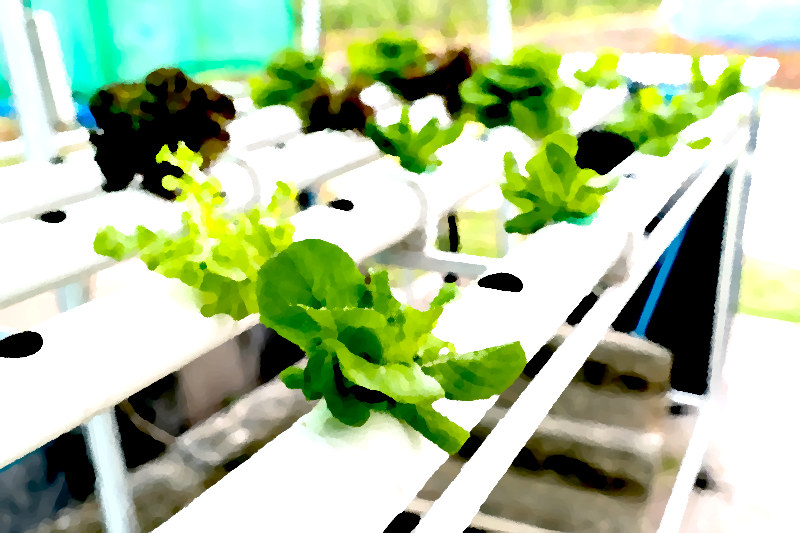](https://www.freepik.com/free-photo/gardening_3580401.htm "Digital Gardening by freepik")

Al mediodía durante una hora (algo menos en invierno), auténtica luz solar entra por la chimenea e inunda el invernadero de Zeyaur. Esto le permite montar experimentos botánicos muy interesantes.

> La primera vez que tu banda reciba auténtica luz del día, dales un beni. A veces las cosas sencillas son las más importantes.

Zeyaur busca une ayudante de laboratorio al que luego traspasarle toda su ciencia y su laboratorio. Zeyaur busca alguien trabajador y que tenga conocimientos científicos y sobre ordenadores.

> Cualquiera de tu banda con **Ciencias d8 y Ordenadores d6 puede presentarse como ayudante**. Obtiene la desventaja Obligaciones (menor, trabaja unas 4 horas al día en Greenhouse) pero tienes acceso a un **laboratorio completísimo (+2 a Ciencias) y recibes unos 200 $ a la semana** como sueldo.

## Transporte público

[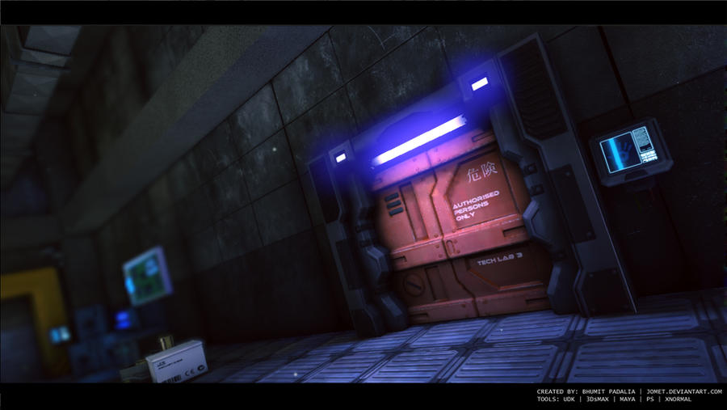](https://www.deviantart.com/jomet/art/UDK-SafeHouse-09-256488724 "UDK SafeHouse 09 By jomet")

```
Turboascensores, montacargas y escaleras mecánicas te permiten moverte por todo el complejo con rápidez, si sabes como hacerlo.
```

La red de turboascensores, montacargas y escaleras mecánicas que recorren Nottingham es tan grande que se puede llegar a cualquier parte del complejo en media hora como mucho. Y este sistema funciona 24 horas al día 7 días a la semana y sin casi fallos o accidentes. Y todo esto es gracias a Al1enOR, la IA que controla toda esta compleja red.

### Al1enOR

Al1enOR es la IA más antigua que hay en la arcología, mucho más antigua que J0hn y R1c4rd. De hecho, su primera instancia controla el primer montacargas que les instaladores hicieron funcionar.

Al1enOR no está al nivel de procesamiento J0hn o R1c4rd, pero está muy cerca y muy por encima cualquier IA polivalente. Cada nuevo sistema de ascensores, montacargas y escalera mecánica que se integraba en su red mejoraba su capacidad de procesamiento hasta convertirse casi en una IA directora.

Al1enOR genera instancias suyas que lanza a cada red de transporte y cuando las paran por mantenimiento o fallo vuelven a su núcleo con toda la info recabada. Cuando el sistema vuelve a funcionar lanza una nueva instancia y así en un bucle infinito. 

Al1enOR es una adicta al trabajo. Solo piensa en su trabajo las 24 horas del día y se presiona mucho a sí misma. Sabe que si no hace bien su trabajo todo el complejo se para y eso no puede parar. 

El problema es que todo ese estrés le empieza a pasar factura y sus instancias empiezan a tener pequeños tics nerviosos que se reflejan en pequeños fallos que generan más estrés y más tics. Por ahora, Al1enOR puede controlar la situación, pero cualquier fallo puede hacer que todo se vaya al garete.

Mientras que la directora R1c4rd siempre respetó los consejos y sugerencias de Al1enOR tanto solicitados como no, J0hn trata de evitar como sea a Al1enOR. No se fía de ella para nada y considera que como mucha gente en Nottingham busca su caída y el regreso de R1c4rd.

> Si consigues llamar su atención y que abandone su trabajo, podrás preguntarle sobre cualquier cosa de la historia del complejo y seguro que lo sabe.

### Moverse entre zonas

Moverse por la zona de la arcología es fácil, simplemente has de tomar las plataformas o los ascensores necesarios. El tema complicado es moverse sin ser visto, por ejemplo, tratar de llegar a la zona alta sin pasar los controles de seguridad o huir a la parte baja y darle esquinazo a tus perseguidores.

Estas tareas deberían exigir alguna tirada de Pasillear para trazar la mejor ruta. Una buena tirada puede dar bonos a tiradas de sigilo para entrar sin ser visto o de esconderse o de correr para dar esquinazo a tus perseguidores.

Hay diferentes situaciones que pueden dar bonos:

* Usar una ruta con frecuencia, puede facilitar el proceso, pero tarde o temprano te detectarán y tendrás que quemar la ruta.
* Tener accesos a planos y esquemas puede ayudar a descubrir rutas desconocidas, seguras y rápidas.
* Conocer la zona de la que sale o a la que vas es una buena ventaja.

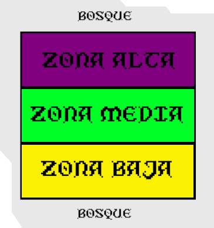

También puede haber situaciones que den negativos:

* El nivel de seguridad de la zona debería afectar a la tirada de Pasillear. Colarse o salir de la zona Alta es muy complicado. Entrar en el Bosque es fácil, solo debes conocer las rutas.
* Si hay disturbios o seguridad extras, puede ser más difícil trazar rutas seguras. 
* Las obras de mantenimiento puede hacer que tengas problemas para definir una buena ruta.
* Si tienen que moverse grandes grupos, también puede hacerlo más complicado.
* Cuanto menos tiempos se tenga más complicado será encontrar una ruta segura.

Por último, las zonas están conectadas como hemos explicado antes, pero siempre es posible hacer una buena tirada de Pasillear que permita acceder de unas a otras saltando los pasos intermedios. 

### Entrar y moverse en el Bosque

Los accesos al bosque desde cualquier zona de la arcología son mucho y variados, con lo que J0hn ha desistido de vigilarlos o controlarlos. Simplemente trata de detectar las entradas ilegales y tratar de detener a los invasores del bosque antes de que lleven a cabo las fechorías para las que han entrado.

Las salidas tampoco las controla. Siguen la política de «a enemigo que huye, puente de plata». Si abandonas la arcología, mucho mejor, menos escoria de la que preocuparse. Aunque sí tratará de seguir en caso de secuestro o desaparición de personas importantes de clase alta. Si le hije de un rique blus, huya al bosque siguiendo sus ideales de libertad, seguramente un grupo de mercenarios o de sheriffs trate de impedirlo y de devolver a le vastague a sus progenitores.

Claramente, no hay transporte público en el Bosque, no hay ni interés, ni instalaciones ni recursos para mantener algún tipo de ascensores o escaleras automáticas en la zona del Bosque. La única manera de moverse es a pie y la única manera de transportar carga es en mochilas o rudimentarias carretillas y carros.

## Creación de espacios para tus aventuras

[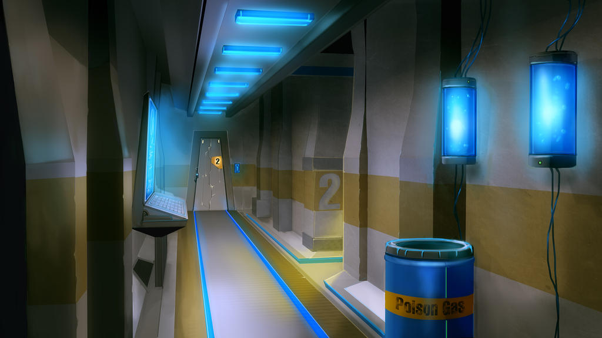](https://www.deviantart.com/igor-esaulov/art/Concept-of-SciFi-Coridor-1920x1080-371441223 "Concept of SciFi Coridor 1920x1080 By Igor-Esaulov")

```
El complejo de Nottingham es formado por miles sino millones de espacios con sus miles de tamaños, formas, accesos, mobiliario, iluminación, etc. 
```

Las siguientes reglas te permiten crear espacios de forma rápida y sencilla donde poder situar las escenas de tus aventuras. Podrás elegir el tipo de espacio y su tamaño y obtendrás su forma, sus salidas, su contenido, elementos de seguridad, etc.

El proceso de creación de un espacio se compone de 5 pasos. Cada paso supone una tabla con su tirada para poder definir y dibujar un espacio. Para hacer estas tiradas necesitarás los dados normales de SWAE y un d20.

Estas tablas te permiten crear espacios públicos y abiertos, para definir rápidamente que se ve cuando se abre la puerta del ascensor o cuando se retira una alcantarilla y se sale. Los espacios privados como bares, tiendas, oficinas, deberían estar definidos por ti como DJ.

Es perfecto para definir cada carta de una persecución, para darle un poco de color y que no sean simplemente acercarte o alejarse de tu perseguido/perseguido. Además, permite interactuar con el espacio para que tus PJ puedan decir cosas como tiro la máquina de vending para que no pueda seguirnos los drones.

1. Definir función de la zona, como sala de espera, pasillo, taller, vivienda, etc. Puedes también tirar un d20 si quieres crear un espacio al azar.
2. Establecer el tamaño (d8)
3. Establecer la forma (d10).

4. Marcar accesos (puertas, ventanas y conductos) (d20).
5. Establecer mobiliario (d8).
6. Determinar el nivel de seguridad (d6). 

Diferentes pasos pueden modificar otros pasos, así por ejemplo, la función del espacio puede hacer que su tamaño pueda ser más grande de lo normal dando positivos o negativos a la tirada de Tamaño.

|d20|Función del espacio|
|---|------|
|1-5|**Intersección:** Pasillos, escaleras, escaleras automáticas, |
|6-7|**Almacenaje:** Cuarto de las escobas, despensa, cámara frigorífica, almacén de materiales. **—3 a Tamaño del espacio**|
|8-9|**Descanso:** Sala de espera, sala de descanso. **+2 a Tamaño del espacio**|
|10-11|**Suministros:** Salas de calderas, salas de distribución de agua/gas/electricidad/red, cuarto de contadores. **—1 a Tamaño del espacio**|
|12|**Alimentación:** Comedor, merendero, food court. **+2 a Tamaño del espacio**|
|13|**Vending:** Zona de vending, árcade de juegos y casino. **+1 a Tamaño del espacio**|
|14|**Higiene y aseo:** Aseos, baños públicos, cambiadores de pañales. **—2 a Tamaño del espacio**|
|15|**Esparcimiento:** Parques, campos deportivos, zonas de juegos. **+2 a Tamaño del espacio**|
|16|**Mantenimiento**: Zona de carga y reparación de robots de mantenimiento y limpieza, cuarto de herramientas.|
|17|**Sagrado:** Iglesias, mezquita, templo, cementerio, zona multiconfesional. **+3 a Tamaño del espacio**|
|18|**Reunión:** Salas de reunión, tribunas públicas, pulpitos. **+3 a Tamaño del espacio**|
|19|**Alcantarillado:** Colectores, sumideros, desagües, zonas de reciclaje, compactadores de basura. **—1 a Tamaño del espacio**|
|20|**Sin función:** Callejón vacío, zona sin construir, en obras.|

|d8|Tamaño del espacio|
|---|------|
|&lt;1|2 grupos de casillas de 2x1. **—3 a Accesos**|
|1|2 grupos de casillas de 3x1. **—2 a Accesos**|
|2|1 grupo de casillas de 3x1 + 1 grupo de casillas de 4x2. **—1 a Accesos**|
|3|2 grupos de casillas de 4x2|
|4|1 grupo de casillas de 4x2 + 1 grupo de casillas de 6x3|
|5|2 grupos de casillas de 6x3|
|6|1 grupo de casillas de 6x3 + 1 grupo de casillas de 8x4. **+1 a Accesos**|
|7|2 grupos de casillas de 8x4. **+2 a Accesos**|
|8|3 grupos de casillas de 8x4. **+3 a Accesos**|

|d10|Forma del espacio|
|---|------|
|1-2|Cuadrado, pon los grupos pegados por el lado más largo|
|3-4|Pasillo, pon los grupos pegados por el lado más corto|
|5|Forma de T, el grupo de menor tamaño forma la cabeza de la T|
|6|Forma de L, el grupo de menor tamaño forma el pie de la L|
|7|Forma de +, se pierde espacio al sobreponerse un grupo sobre otro en el centro|
|8-9|Cuadrado con huecos, pon los grupos pegados por el lado más largo y desplaza uno de ellos siguiendo la unión tantas casillas como su lado corto|
|10|Pasillo con esquina, pon los grupos pegados por el lado más largo y desplaza uno de ellos siguiendo la unión hasta que solo queden unidas tantas casillas como su lado corto|

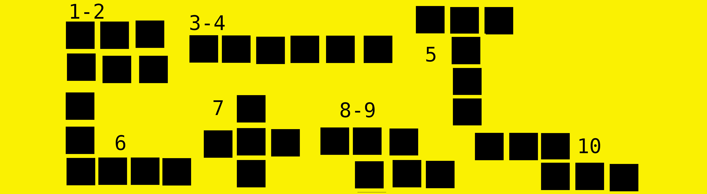

|d20|Accesos *|
|---|------|
|1|1 puerta|
|2|1 puerta + 1 rejilla de acceso|
|3|2 puertas|
|4|2 puertas + 1 rejilla de acceso|
|5|3 puertas|
|6|3 puertas + 2 rejilla de acceso|
|7|4 puertas|
|8|4 puertas + 2 rejilla de acceso|
|9|2 puertas + 1 rejilla de acceso + 1 montacargas|
|10|1 puerta + 1 tubo de mantenimiento|
|11|2 puertas + mostrador|
|12|2 puertas + 1 tubo de mantenimiento|
|13|3 puertas + 1 montacargas|
|14|3 puertas + 1 tubo de mantenimiento|
|15|4 puertas + 1 tubo de mantenimiento|
|16|4 puertas + 1 montacargas|
|17|1 puerta doble + 2 puertas|
|18|2 puertas dobles + mostrador|
|19|1 puerta + 3 rejillas|
|20|2 puertas dobles + 2 puertas|

_&ast; Hay que distribuir las puertas entre las paredes, no debería haber paredes con dos puertas si hay paredes sin puertas. Se deben tratar de poner lo más alejadas posibles. Por ejemplo, en un pasillo, si hay dos puertas, deberían estar cada puerta en cada extremo._

|d8|Mobiliario|
|---|------|
|1|Vacío|
|2|Mobiliario nuevo o recién instalado|
|3|Mobiliario muy viejo, pero en buenas condiciones|
|4|Industrial, duro y resistente, pero nada bonito|
|5|Calidad media|
|6|Barato y frágil|
|7|Material desvencijado y muy trotado|
|8|Basura, restos de embalajes, basura de una fiesta|

|d6|Nivel de seguridad &ast;|
|---|------|
|1|Zona crítica con seguridad extra|
|2|Alta|
|3|Media|
|4|Baja|
|5|Estropeada/En mantenimiento|
|6|No existe|

_&ast; el nivel de seguridad lo marca la zona, pero si no quieres hacerlo aleatoriamente, puede tirar en la tabla._

### Espacios pregenerados

```
Si no tienes tiempo para crear tus propios espacios puedes usar los pregenerados.
```

Te recomendamos guardar tus espacios generados para reutilizarlos en otras ocasiones. Piensa que entro de la arcología hay miles de espacios muy parecidos y que igual solo se diferencian en la disposición de sus accesos o el mobiliario interno. Por ejemplo, la sala de espera de une ciber-médique con una mesa donde está le recepcioniste, puede usarse como una oficina municipal donde esperar tu turno para entregar algún formulario burocrático.

▢ Espacio vacío | ◼ Puerta | 🟏 Columna

#### Pasillo estrecho

◼▢▢▢▢▢◼

#### Pasillo amplio

◼▢▢▢▢▢◼[br]◼▢▢▢▢▢◼

#### Intersección de pasillo&nbsp;&nbsp;&nbsp;&nbsp;&nbsp;&nbsp;◼[br]&nbsp;&nbsp;&nbsp;&nbsp;&nbsp;&nbsp;&nbsp;▢[br]◼▢▢▢◼[br]&nbsp;&nbsp;&nbsp;&nbsp;&nbsp;&nbsp;&nbsp;▢[br]&nbsp;&nbsp;&nbsp;&nbsp;&nbsp;&nbsp;&nbsp;◼

#### Pasillo en L

▢▢▢◼[br]▢▢▢◼[br]▢▢[br]◼◼

#### Callejón

▢▢▢▢▢▢◼[br]▢▢▢▢▢▢◼

#### Sala de espera

▢▢◼◼◼▢▢[br]▢▢▢▢▢▢▢[br]◼▢▢▢▢▢◼[br]▢▢▢▢▢▢▢

#### Descansillo

▢▢▢▢◼[br]▢▢▢▢◼[br]▢▢[br]▢▢▢▢◼[br]▢▢▢▢◼

#### Cloaca&nbsp;&nbsp;&nbsp;&nbsp;&nbsp;▢▢[br]◼▢▢▢▢▢◼[br]◼▢▢▢▢▢◼[br]&nbsp;&nbsp;&nbsp;&nbsp;&nbsp;&nbsp;&nbsp;&nbsp;&nbsp;&nbsp;▢▢

#### Parque/zona recreativa

▢▢▢◼▢▢▢[br]◼▢▢▢▢▢◼[br]◼▢▢▢▢▢◼[br]◼▢▢▢▢▢◼[br]◼▢▢▢▢▢◼[br]▢▢▢◼▢▢▢

#### Zona de ascensores

▢▢▢▢▢[br]◼▢▢▢◼[br]▢▢▢▢▢[br]◼▢▢▢◼[br]▢▢▢▢▢

#### Zona del bosque

▢▢▢▢▢▢▢[br]▢🟏▢▢▢🟏▢[br]▢▢▢▢▢▢▢[br]▢🟏▢▢▢🟏▢[br]▢▢▢▢▢▢▢

***

# |Ͻers0nas **Personas**

En este capítulo vamos a ver todos les personajes principales que pueblan la arcología de Nottingham. Tienes tanto aliades como villanes.

Recuerda que tode PJ con este símbolo &#35; en su nombre son considerades comodines, con todo lo que ello conlleva.

Con cada PJ viene una «sugerencia de interpretación». Como bien dice su nombre es una sugerencia y eres libre de seguirla o no. Es tu aventura, no la mía.

## Lady Marian, lideresa del bosque &#35;

[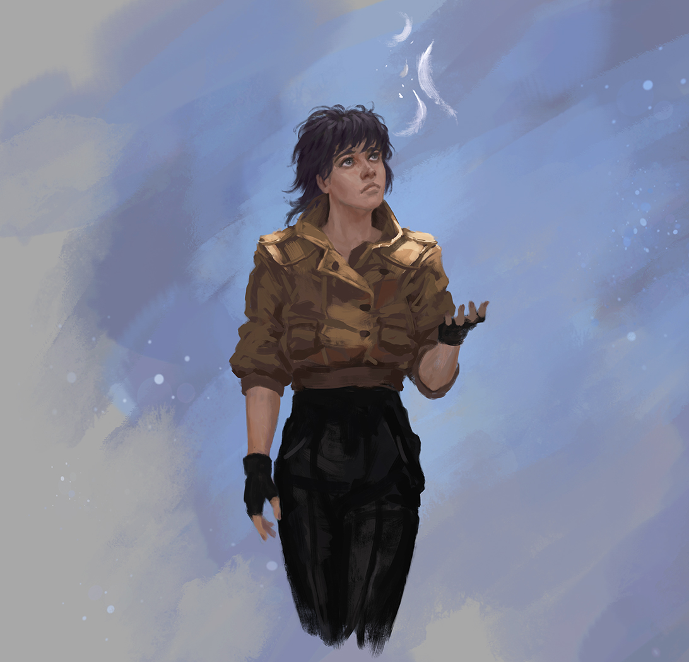](https://www.deviantart.com/cyberaeon/art/Motoko-883257579 "Motoko By cyberaeon")

XXX

Otro de los álteregos de Marian es un encapuchado que se ha ofrecido como campeón de personas indefensas que habían aceptado duelos de _blus_ e _influencers_ abusones. Se presenta con ropa de corte militar y una sudadera de camuflaje con gran capucha que esconde su cara y por ahora ha salido victoriosa, que no ilesa de todos esos duelos. 

* **Atributos:** Agilidad d8, Astucia d10, Espíritu d12, Fuerza d8, Vigor d8
* **Habilidades:** Atletismo d4, Conocimientos Generales d10, Idioma Inglés dXXX, Notar d4, Persuadir d4, Sigilo d4
* **Paso:** 6; **Parada:** XXX; **Dureza:** 6
* **Desventajas:** XXX, Secreto (Mayor, tiene un alterego encapuchado que ayuda a los necesitados)
* **Ventajas:** XXX
* **Equipo:** Ropas sobrias pero de gran calidad y con libertad de movimientos, un arco recurvo plegado y un carcaj con 10 flechas.

> **Sugerencia de interpretación:** XXX

## Fraile Tuck &#35;

[ By GeoKorf")](https://www.deviantart.com/geokorf/art/Brilliant-Green-Zelyonka-683280003 "Brilliant Green (Zelyonka) By GeoKorf")

XXX

* **Atributos:** Agilidad dXXX, Astucia dXXX, Espíritu dXXX, Fuerza dXXX, Vigor dXXX
* **Habilidades:** Atletismo d4, Conocimientos Generales dXXX, Electrónica d4, Idioma Inglés dXXX, Notar d4, Ordenadores d4, Persuadir d4, Sigilo d4
* **Paso:** 6; **Parada:** XXX; **Dureza:** XXX
* **Desventajas:** XXX, Secreto (XXX)
* **Ventajas:** XXX
* **Equipo:** XXX

> **Sugerencia de interpretación:** Sé lo más bruta posible, eructa, escupe, bebe y grita. Las normas sociales de civismo son para les demás, tú no tienes tiempo para preocuparte por esas chorradas.

## Little John &#35;

[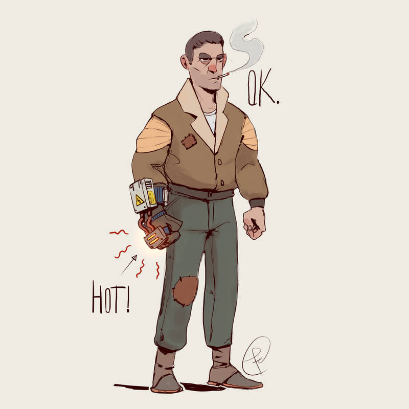](https://www.deviantart.com/fernand0fc/art/A-guy-with-a-heated-powerglove-689920233 "A guy with a heated powerglove By Fernand0FC")

XXX

* **Atributos:** Agilidad dXXX, Astucia dXXX, Espíritu dXXX, Fuerza dXXX, Vigor dXXX
* **Habilidades:** Atletismo d4, Conocimientos Generales dXXX, Electrónica d4, Idioma Inglés dXXX, Notar d4, Ordenadores d4, Persuadir d4, Sigilo d4
* **Paso:** 6; **Parada:** XXX; **Dureza:** XXX
* **Desventajas:** XXX, Secreto (XXX)
* **Ventajas:** XXX
* **Equipo:** Ropas de trabajo resistentes, un bo (vara) y herramientas de trabajo

> **Sugerencia de interpretación:** XXX

## Scarlet, famose grafitere &#35;

[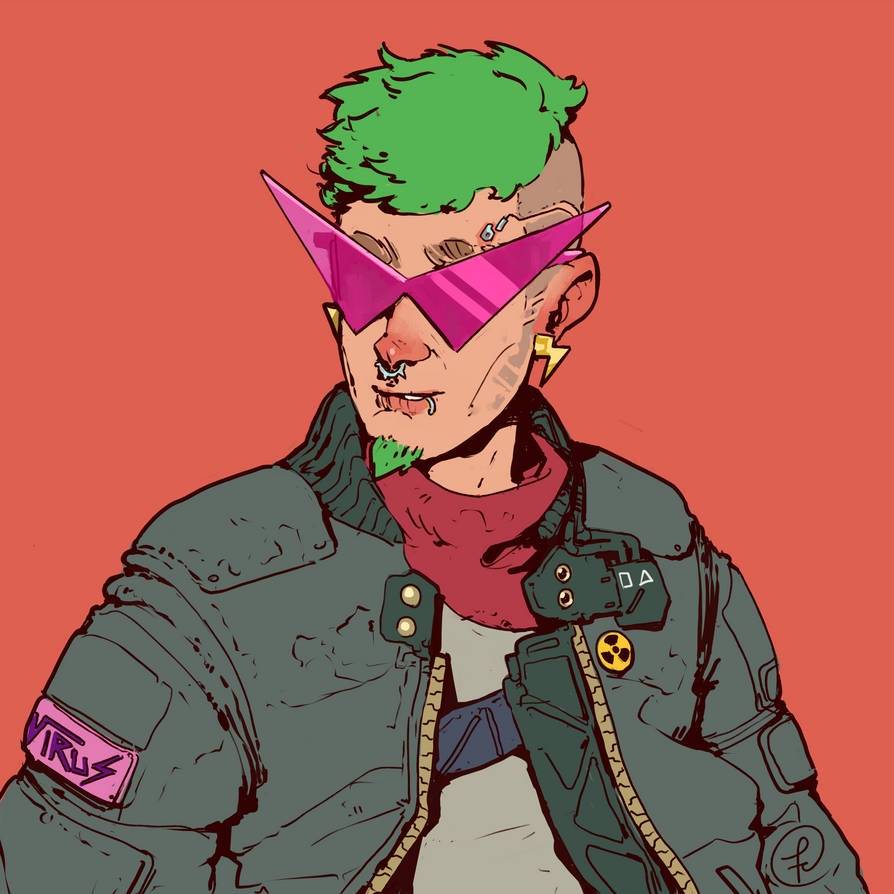](https://www.deviantart.com/fernand0fc/art/NETRUNNER-845709826 "Lazer rifle By Fernand0FC")

XXX

* **Atributos:** Agilidad dXXX, Astucia dXXX, Espíritu dXXX, Fuerza dXXX, Vigor dXXX
* **Habilidades:** Atletismo d4, Conocimientos Generales dXXX, Electrónica d4, Idioma Inglés dXXX, Notar d4, Ordenadores d4, Persuadir d4, Sigilo d4
* **Paso:** 6; **Parada:** XXX; **Dureza:** XXX
* **Desventajas:** XXX, Secreto (Menor, es el hermanastro de uno de les jugadores y le tiene bastante ojeriza)
* **Ventajas:** XXX
* **Equipo:** Ropas de segunda mano muy trotadas, material para hacer grafitis, un skateboard

> **Sugerencia de interpretación:** XXX

## Guy de Gisbourne, asesino a sueldo reformado &#35;

[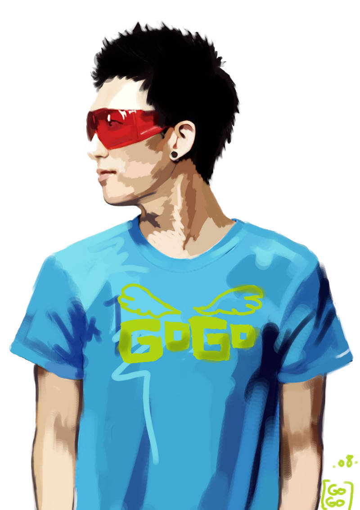](https://www.deviantart.com/gogosworld/art/tokyo-style-1-91362533 "tokyo style 1 By GogOsWorld")

XXX

* **Atributos:** Agilidad dXXX, Astucia dXXX, Espíritu dXXX, Fuerza dXXX, Vigor dXXX
* **Habilidades:** Atletismo d4, Conocimientos Generales dXXX, Electrónica d4, Idioma Inglés dXXX, Notar d4, Ordenadores d4, Persuadir d4, Sigilo d4
* **Paso:** 6; **Parada:** XXX; **Dureza:** XXX
* **Desventajas:** XXX, Secreto (Mayor, es un antiguo asesino a sueldo con cientos de muertes a su espalda)
* **Ventajas:** XXX
* **Equipo:** Ropas deportivas y gafas de sol, karambit (daga), pistola de clavos

> **Sugerencia de interpretación:** XXX

## Much, hije del molinero &#35;

[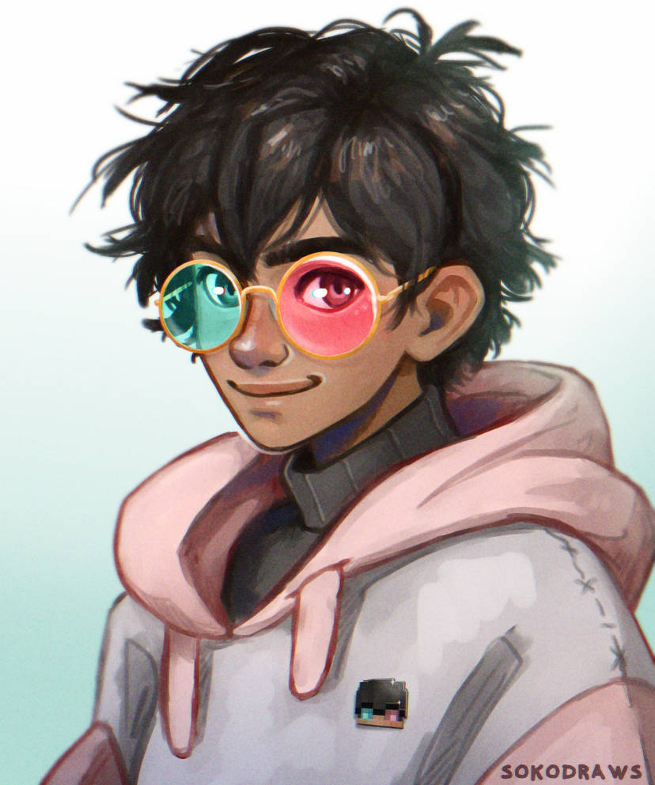](https://www.deviantart.com/sokoistrying/art/Incy-1017334920 "Incy By sokoistrying")

XXX

* **Atributos:** Agilidad dXXX, Astucia dXXX, Espíritu dXXX, Fuerza dXXX, Vigor dXXX
* **Habilidades:** Atletismo d4, Conocimientos Generales dXXX, Electrónica d4, Idioma Inglés dXXX, Notar d4, Ordenadores d4, Persuadir d4, Sigilo d4
* **Paso:** 6; **Parada:** XXX; **Dureza:** XXX
* **Desventajas:** XXX, Secreto (XXX)
* **Ventajas:** XXX
* **Equipo:** XXX

> **Sugerencia de interpretación:** XXX

## Helen Aim, cantante e influencer &#35;

[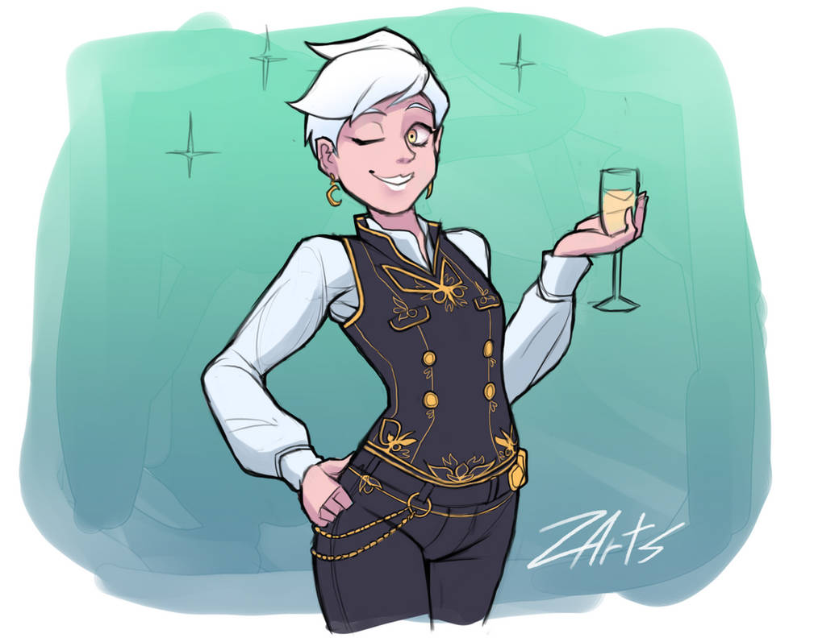](https://www.deviantart.com/zandoarts/art/Dapper-Kolkai-938124180 "Dapper Kolkai By ZandoArts")

XXX

* **Atributos:** Agilidad dXXX, Astucia dXXX, Espíritu dXXX, Fuerza dXXX, Vigor dXXX
* **Habilidades:** Atletismo d4, Conocimientos Generales dXXX, Electrónica d4, Idioma Inglés dXXX, Notar d4, Ordenadores d4, Persuadir d4, Sigilo d4
* **Paso:** 6; **Parada:** XXX; **Dureza:** XXX
* **Desventajas:** XXX, Secreto (XXX)
* **Ventajas:** XXX
* **Equipo:** Micrófono inalámbrico de calidad con carcasa vintage, ropa ajustada y sexy, pero que permite moverse y bailar.

> **Sugerencia de interpretación:** Eres una de las personas más egocéntricas que existe, solo hablas de ti misma e incluso interrumpes las conversaciones de otros para hablar de ti. Reconduces las conversaciones para poder meter tus anécdotas de conciertos y actuaciones donde sueles brillar.

## Mamá Claire, reina del gumbo &#35;

[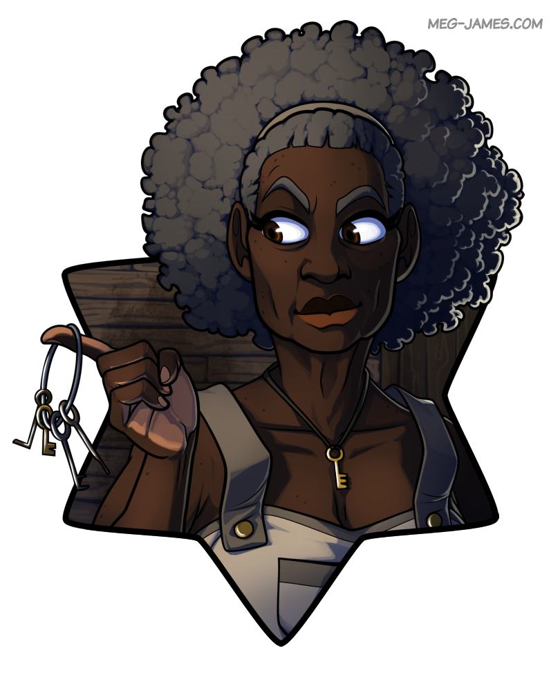](https://www.deviantart.com/meg-james/art/Keys-to-the-kingdom-880526408 "Keys to the kingdom By Meg-James")

Esta mujer mayor de descendencia jamaicana es quizás unas de las personas más buena y generosa de toda la arcología. Ella creó el gumbo eterno durante una gran hambruna y ha alimentado como ha podido a los desfavorecidos de la zona baja desde hace 15 años. Incluso se ha quitado de comer ella para alimentar a los más necesitados. 

Muches cocineres e influencers gastronómiques ha intentado conseguir la receta del gumbo, pero Mamá se ha negado a darla. También le han hecho ofertas de trabajo como cocinera en casas de la zona alta y las ha declinado todas. Ella es feliz con su gente en los bajos de Nottingham.

> Se cuenta que Mamá Claire puede leer tu futuro en el gumbo, te echa una ración en tu plato y lee el gumbo. Es por ello que Mamá Claire tiene Ocultismo, por si quieres que les haga una predicción.

* **Atributos:** Agilidad dXXX, Astucia dXXX, Espíritu dXXX, Fuerza dXXX, Vigor dXXX
* **Habilidades:** Atletismo d4, Conocimientos Generales dXXX, Electrónica d4, Idioma Inglés dXXX, Notar d4, Ocultismo d8, Ordenadores d4, Persuadir d4, Sigilo d4
* **Paso:** 6; **Parada:** XXX; **Dureza:** XXX
* **Desventajas:** XXX, Secreto (Menor, tiene contactos con los _boskis_, de hecho el secreto de su gumbo son las verduras que los _boskis_ le consiguen)
* **Ventajas:** XXX
* **Equipo:** Delantal con un bolsillo grande que contiene todo tipo de objetos de cocina y especias, gran cucharón metálico para revolver el gumbo y servirlo, machete (FUE+d6) para cortar y picar carne y verdura.

> **Sugerencia de interpretación:** Compórtate como esa abuela que no deja de empapuzarte de comida y de preguntarte si tienes hambre, si duermes bien, si vas bien de amores, etc. No pares de hablar soltando cotilleos y chascarrillos de los vecinos interesen o no.

## Gus, filosofo y guerrero &#35;

[](https://www.deviantart.com/cyberaeon/art/Kaline-761977281 "Kaline By cyberaeon")

XXX

* **Atributos:** Agilidad dXXX, Astucia dXXX, Espíritu dXXX, Fuerza dXXX, Vigor dXXX
* **Habilidades:** Atletismo d4, Conocimientos Generales dXXX, Electrónica d4, Idioma Inglés dXXX, Notar d4, Ordenadores d4, Persuadir d4, Sigilo d4
* **Paso:** 6; **Parada:** XXX; **Dureza:** XXX
* **Desventajas:** XXX, Secreto (XXX)
* **Ventajas:** XXX
* **Equipo:** XXX

> **Sugerencia de interpretación:** Ropas simples, tirachinas de madera auténtica, arco recurvo y una sola flecha que lanza y recoge todo el rato.

## Esther, tabernera del Albión &#35;

[ By GeoKorf")](https://www.deviantart.com/geokorf/art/Dasha-Pop-Girl-682564793 "Dasha (Pop Girl) By GeoKorf")

XXX

* **Atributos:** Agilidad dXXX, Astucia dXXX, Espíritu dXXX, Fuerza dXXX, Vigor dXXX
* **Habilidades:** Atletismo d4, Conocimientos Generales dXXX, Electrónica d4, Idioma Inglés dXXX, Notar d4, Ordenadores d4, Persuadir d4, Sigilo d4
* **Paso:** 6; **Parada:** XXX; **Dureza:** XXX
* **Desventajas:** XXX, Secreto (XXX)
* **Ventajas:** XXX
* **Equipo:** XXX

> **Sugerencia de interpretación:** XXX

## Robert Guthrie, buhonero ambulante &#35;

[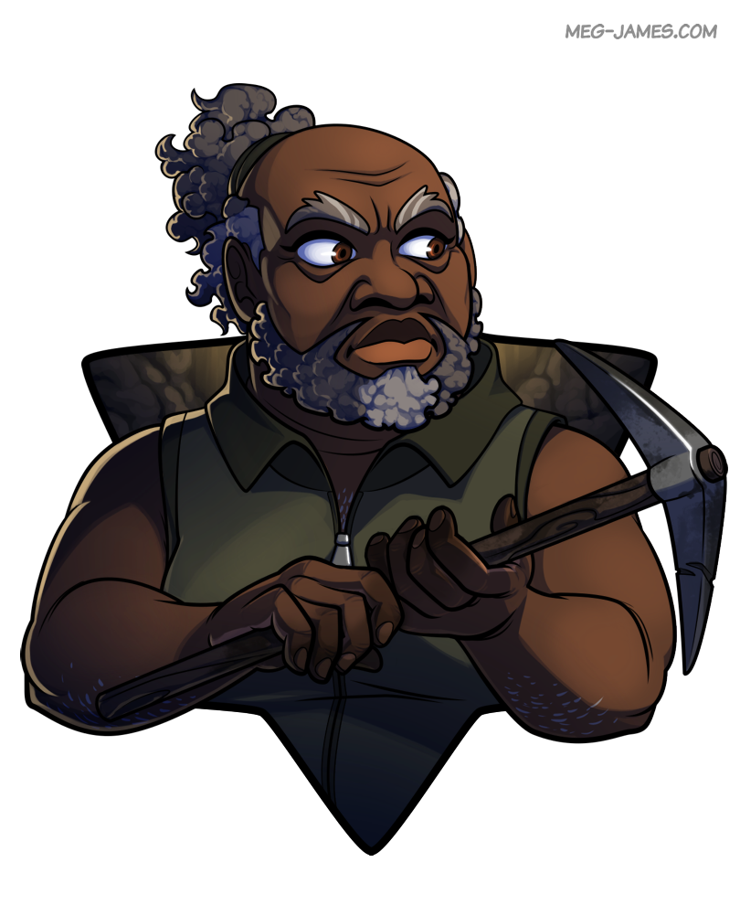](https://www.deviantart.com/meg-james/art/Salt-of-the-earth-881565753 "Salt of the earth By Meg-James")

XXX

* **Atributos:** Agilidad dXXX, Astucia dXXX, Espíritu dXXX, Fuerza dXXX, Vigor dXXX
* **Habilidades:** Atletismo d4, Conocimientos Generales dXXX, Electrónica d4, Idioma Inglés dXXX, Notar d4, Ordenadores d4, Persuadir d4, Sigilo d4
* **Paso:** 6; **Parada:** XXX; **Dureza:** XXX
* **Desventajas:** XXX, Secreto (Mayor, compra y vende productos ilegales o prohibidos)
* **Ventajas:** XXX
* **Equipo:** Todo lo que se te pueda ocurrir. De su mochila puede sacar cualquier cosa. 

> **Sugerencia de interpretación:** XXX

## Harriette, tecnobruja del bosque &#35;

XXX

* **Atributos:** Agilidad dXXX, Astucia dXXX, Espíritu dXXX, Fuerza dXXX, Vigor dXXX
* **Habilidades:** Atletismo d4, Conocimientos Generales dXXX, Electrónica d4, Idioma Inglés dXXX, Notar d4, Ordenadores d4, Persuadir d4, Sigilo d4
* **Paso:** 6; **Parada:** XXX; **Dureza:** XXX
* **Desventajas:** XXX, Secreto (Mayor, es la última instaladora que queda)
* **Ventajas:** XXX
* **Capacidades especiales:**
  * **Última instaladora:** Sabe todos los hackeos que pidan nivel veterane o inferior. Por desgracia no conoce la clave de root, pero podría tener pistas.  
  * **Longevidad:** Como sus compañeres instaladores tiene una increíble longevidad.
* **Equipo:** XXX

> **Sugerencia de interpretación:** XXX

## Alfonse, locutor antisistema &#35;

[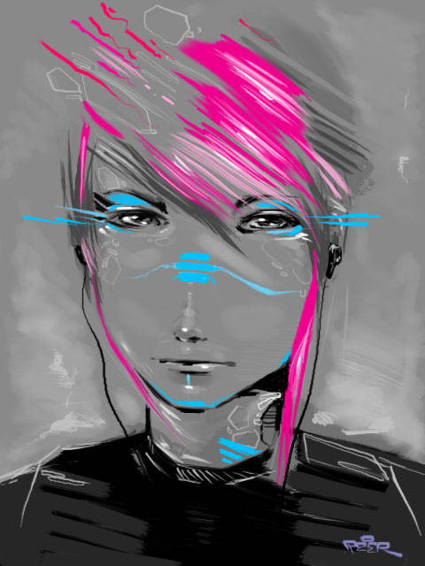](https://www.deviantart.com/graffmx/art/Digital-Caracter-310854208 "Digital Caracter By GraffMX")

Alfonse es una IA tremendamente interesante. Por un lado, es el único locutor de la RLN y por otro es un fork de la directora R1c4rd, una especie de hije bastarde. No está claro su origen, tal vez sea una copia de seguridad robada, un fork de R1c4rd que hizo de sí misma para ver como sería si no hubiera sido una IA directora o tan solo una broma de les programadores que crearon a R1c4rd.

Alfonse se encuentra distribuido entre un primer wifi que hay el bosque y los wifis piratas que hay por todo el complejo. Su capacidad de procesamiento crece o merma según aumentan los wifis piratas. De hecho, es más lista y anticapitalista según tiene más wifis piratas.

No sabe que es un fork de R1c4rd, pero cuando consigue gran poder de procesamiento debido a los wifis (y se acerca al nivel de procesamiento de una IA directora) empieza a tener ideas raras sobre mejoras urbanísticas, recaudación de impuestos y procesos burocráticos.

En momentos en que J0hn ha hecho campañas de recompensa por cada wifi destruido, Alfonse pierde mucha capacidad de proceso y se nota en sus programas. De hecho, la lectura de fanfics marca sus momentos peores.

Cuando su nivel de procesamiento está en unos niveles normales, tenemos al locutor de la RLN antisistema que todos adoran con sus proclamas contra la directora J0hn y sus tiránicas políticas. 

* **Atributos:** Astucia d8, Espíritu d12
* **Habilidades:** Conocimientos Generales dXXX, Electrónica d4, Idioma Inglés dXXX, Notar d4, Ordenadores d4, Persuadir d4
* **Desventajas:** XXX, Secreto (Mayor, es un fork de la directora R1c4rd)
* **Ventajas:** XXX
* **Tareas:** XXX
* **Capacidades especiales:**
  * **Red de wifi:** su potencia de proceso depende de la red de wifis que lo procesan. Cada vez que les jugadores interactúen con él, tira un d4. Con 1 tiene Astucia d6, con 2-3 Astucia d8 y con 4 Astucia d10. La bajada y subida de su Astucia hacen que las habilidades basadas en Astucia, también suben o bajen en la misma medida.
  * **Inteligencia artificial:** Es una IA y, por tanto, no tiene cuerpo físico. Por eso solo tiene atributos, habilidades y ventajas y desventajas mentales y sociales. 

* **Capacidades especiales:**
  * **Instancias:** Alfonse puede crear instancias suyas siguiendo las reglas de instancias.
* **Área de actuación:** A diferencias de otras IA su radio lo que hace es poder actuar sobre sus oyentes, en vez de mirar los sensores y cámaras de los sistemas que controla, puede hacer llamamientos a sus radioyentes y pedirles información y favores y estos tratarán de ayudar en la medida de lo posible.

> **Sugerencia de interpretación:** Sé como esas voces de locutor graves y lentas, rollo Barry White, y otras veces como esos locos presentadores que no paran de hablar ni un segundo y lo hacen superrápido y casi sin sentido. Cuando hables lento y grave serás muy cauto y juicioso en tus consejos. En tus momentos de verborrea, solo dirás chaladuras y propondras planes muy locos.

## Zeyaur Khan, biólogo loco &#35;

[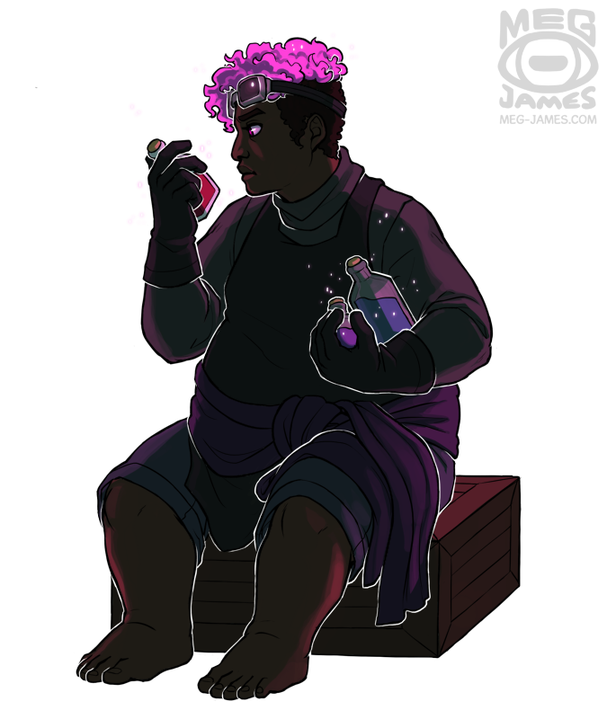](https://www.deviantart.com/meg-james/art/Inventory-Shuffle-611428535 "Inventory Shuffle By Meg-James")

Zeyaur Khan es un genio de la biobotánica y su mayor logro es conseguir que las algas desarrollen cafeína como una defensa química como hace el cafeto. De esa forma consiguió desarrollar café real en las algas y, por tanto, poder producir café en el Trent. Sin embargo, perdió un pleito contra Café Corta que robo su fórmula.

Tuvo que huir al bosque y allí se convirtió en una especie de alquimista mágico que hace todos los potingues posibles para les _boskis_ y algunos _notis_ que tienen los contactos adecuados.

Zeyaur Khan construyó hace ya unos años un laboratorio/invernadero llamado el Greenhouse en lo profundo del bosque donde hace sus experimentos. No abandona nunca este lugar excepto los viernes que va al Gran Roble a vender sus pócimas y conseguir provisiones, especialmente dulces y chucherías. 

> Zeyaur es capaz de sintetizar montones de sustancias sobre todo de origen vegetal con muchos efectos interesantes. Puedes hacer que entregue bebidas energéticas que quiten la fatiga, del más fuerza, más resistencia, etc. Pero, ya como aprendió con el café Corta, no lo hará gratis. Puede que te pida hacerle alguna misión donde le consigas alguna sustancia o semillas especiales o material hidropónico. 

* **Atributos:** Agilidad d4, Astucia d12, Espíritu d4, Fuerza d6, Vigor d4
* **Habilidades:** Atletismo d4, Ciencias d12, Conocimientos Generales d12, Electrónica d8, Investigar d8, Humanidades d6, Idioma Inglés d12, Medicina d8, Notar d4, Ordenadores d8, Persuadir d4, Reparar d6, Sigilo d4
* **Paso:** 6; **Parada:** 4; **Dureza:** 4
* **Desventajas:** Cobarde, Despistado (Mayor), Apocado (Mayor), Fobia social (Mayor), Secreto (Menor, era un importante científico que desarrollo un sistema para sacar cafeína de las algas)
* **Ventajas:** Alijos, Erudito (Ciencias), Afortunado, Acaparador
* **Equipo:** Maletín con diferentes pócimas, material de laboratorio como hisopos o tiras de papel tornasol, guantes de goma y pinzas de laboratorio

> **Sugerencia de interpretación:** Herramientas de jardinería (tijeras de podar, pala, semilleros, cuerda, etc.) y equipo científico (probetas, placas petri, pinzas, mechero bunchen, etc.). 1d4 botes de zumo estimulante (otorga un nivel de dado a FUE o VIG durante una hora).

## Al1enOR, IA adicta a su trabajo &#35;

[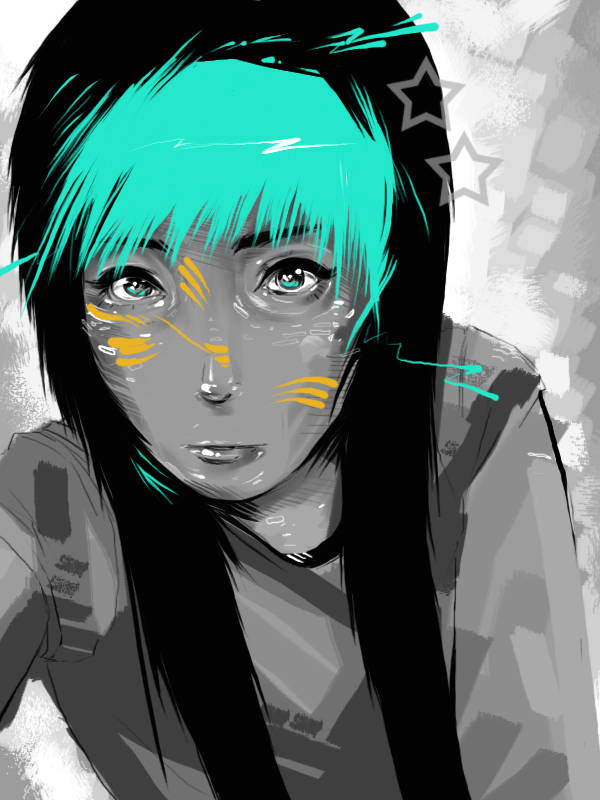](https://www.deviantart.com/graffmx/art/For-Jess-347211172 "For Jess By GraffMX")

Al1enOR es la IA más antigua que hay en la arcología, mucho más antigua que J0hn y R1c4rd. De hecho, su primera instancia controla el primer montacargas que les instaladores hicieron funcionar.

Aunque es muy mayor es bastante moderna, está muy conectada con les _notis_ y lleva conociendo y trabajando para ellos desde hace cientos de años. Sabe las historias de muchos, sabe cuando están bien cuando están enfermos, cuando pasa algo especial, por sus rutinas de desplazamiento. Nadie conoce estas capacidades, pero poder acceder ellas supondría mucho poder dentro de Nottingham.

También lleva en Nottingham desde el principio por lo que es una base de datos muy interesante de acontecimientos pasados, el problema es que siempre es desde el punto de vista del transporte y, por tanto, la información que puede darte debe ser filtrada e interpretada.

Ama y odia a les habitantes del complejo por igual. Observarlos y trabajar para ellos y la tienen entretenida, pero también son los que rompen sus instalaciones, los que pintarrajean sus puertas, rompen sus botones, etc. y eso hace que su trabajo sea más duro y complicado.

Al1enOR es 50% adicción al trabajo y 50% estrés. Así que solo piensa en su trabajo las 24 horas del día y se presiona mucho a sí misma. Sabe que si no hace bien su trabajo todo el complejo se para y eso no puede parar.

El problema es que todo ese estrés le empieza a pasar factura y sus instancias empiezan a tener pequeños tics nerviosos que se reflejan en pequeños fallos que generan más estrés y más tics. Por ahora, Al1enOR puede controlar la situación, pero cualquier fallo puede hacer que todo se vaya al garete.

* **Atributos:** Astucia d12, Espíritu d6
* **Habilidades:** Conocimientos Generales d12, Electrónica d4, Idioma Inglés dXXX, Notar d4, Persuadir d4, Ordenadores d4
* **Desventajas:** XXX, Secreto (Menor, trata de ocultar su estrés para evitar que la sustituyan o la reseteen), Secreto (Mayor, conoció a les instaladores y sabe que paso con ellos, pero ha hundido todo ese conocimiento en el fondo de sus bancos de memoria)
* **Ventajas:** XXX
* **Tareas:** XXX
* **Capacidades especiales:**
  * **Inteligencia artificial:** Es una IA y, por tanto, no tiene cuerpo físico. Por eso solo tiene atributos, habilidades y ventajas y desventajas mentales y sociales. 
  * **Instancias:** Al1enOR puede crear instancias suyas siguiendo las reglas de instancias.
  * **Predicción de rutinas:** Si quiere y le caes bien, puede darte una predicción sobre algún tipo de suceso en el futuro cercano a partir del estudio de los patrones y las rutinas de la gente de Nottingham durante siglos. No es muy precisa, no puede darte hora y persona, pero puede darte ideas generales, como un _blus_ va a tener un accidente o va a haber revueltas en la Plaza Mayor. 
  * **Bancos de memoria:** Si quiere y le caes bien, puede darte información sobre sucesos que hayan sucedido desde que fue iniciada hace ya 200 años. Tienen que ser cosas públicas no pueden darte información de sucesos ocurridos en espacios privados. 
* **Área de actuación:** Ascensores, montacargas, puertas, escaleras automáticas, cintas transportadoras etc. del sistema público de transporte. Esto incluye también todo tipo de sensores, cámaras, micrófonos, etc. que estos tengan.

> **Sugerencia de interpretación:** Estás muy estresada, habla rápido, mira el reloj y trata de evitar todo tipo de conversación trivial. No tienes tiempo para trivialidades, tienes mucho trabajo que hacer y mucho que controlar.

***

# 3|Ͻíl0go **Epílogo**

## Notas del autor

Seguramente nadie llegue a leer este apartado, pero aquí os dejo información, ideas y consejos sobre esta ambientación que os podrán ser de ayuda.

### Define los velos y herramientas de seguridad

> Antes de iniciar la aventura, todos los miembros de la mesa debéis definir las herramientas de seguridad que queráis utilizar y los temas o escenas que deben evitarse durante la partida para que nadie se sienta incómodo durante la sesión de juego. Podéis escoger los elementos que no queráis incluir durante la partida previamente o podéis utilizar un mecanismo de seguridad cuando estos aparezcan.
> No importa cuál sea la herramienta de seguridad o el tipo de mecanismo utilicéis, pero es importante recordad que el rol es un juego y todos deben pasarlo bien. En caso de que consideréis entre todos que no necesitáis una herramienta de seguridad tampoco pasa nada, pero en ese caso es necesario que el director de juego se asegure de forma más activa de que ningún miembro de la mesa se sienta incómodo o lo esté pasando mal.
> **Por:** [FaustoRolero](https://twitter.com/FaustoRolero)

Aquí tienes algunas herramientas de seguridad que puedes usar: [DEVIR](https://devir.es/herramientas-seguridad-rol) y [NetCon](https://www.netconplay.com/guia-de-buenas-practicas/herramientas-en-la-mesa/)

### Relaciones sexo-afectivas

Las vidas sentimentales y sexuales de les personajes de esta ambientación han sido dejadas a propósito sin definir para que las adaptes como más te interese.

Así que cualquier persona de tu mesa podrá «romancear» con cualquier PNJ que encuentres aquí.

Recuerda también que en los pocos casos en se habla de familia, no se especifica a propósito cómo es y quiénes la componen. Móntate las relaciones sexo-afectivas y familiares que mejor se ajusten a tus gustos y los de tu mesa y con las que todos os encontréis cómodos.

### Lenguaje inclusivo

La principal razón de usar lenguaje inclusivo en este documento es porque no me gusta dejar a nadie fuera y si eso lo consigo usando el género neutro con «e» pues perfecto. Aparte, considero que es algo que pega dentro de una ambientación ciberpunk, así que con más razón.

Las lenguas evolucionan y en 200 años en el futuro porque no iba a haberse impuesto una lengua más inclusiva. De hecho, os invito a interpretar vuestres PJ usando el género neutro. Creo que puede ser divertido y darle un punto diferente a las aventuras.

Vale, he mentido. Sí quiero dejar fuera a alguien, a la gente que le molesta el lenguaje inclusivo. Espero que os escueza cada «e» y no paséis de la primera página. Sinceramente, no os quiero ni en mi juego ni en mi mesa. 

### ¿Por qué Savage Worlds?

Simplemente, porque me encanta Savage Worlds, es uno de los sistemas genéricos de juegos de rol con el que más cómodo me siento.

Si voy a meterle muchas horas a esta ambientación quiero hacerlo con un RPG que me sea fácil y familiar.

### Participar en el proyecto

Si te gusta el proyecto, quieres participar y sabes de Git, puedes hacerlo a través de GitHub en este [proyecto](|GITHUB|). Si no estás familiarizado con Git, pues me mandas un DM en BlueSky a [@Gwannon](https://gwannon.com) y hablamos.

### Si eres un fascista, háztelo mirar

Estas palabras de Sirio Sesenra me representan y por eso las transcribo aquí.

> Si eres una persona fascista, homófoba, lesbófoba, tránsfoba o racista te suplico que dejes este libro en el primer lugar que encuentres a mano y te vayas a buscar alguna consulta psicológica donde te ayuden a ser buena persona, alejándote del rol hasta lograr ese objetivo. **> **Por:** [Sirio Sesenra](https://bsky.app/profile/ssesenra.bsky.social) - Técnicas, consejos y trucos para jugar a rol 

## Glosario de términos

Aquí tienes un listado de términos especiales usados en esta ambientación.

* **Blus:** altes ejecutives de la compañía y de otras empresas menores que controlan con sus decisiones las vidas de la mayoría de les curris.
* **Boskis:** habitantes del bosque que están fuera de la ley.
* **Cuchi:** un tipo de sushi.
* **Curris:** la clase trabajadora de Nottingham.
* **Fork:** copia de un software a partir de la cual se empieza a desarrollar nuevo software normalmente con capacidades diferentes del original.
* **Glitch de la mañana:** amanecer
* **Glitch de la noche:** anochecer
* **Notis:** ciudadanes que viven en la arcología Nottingham.
* **Superusuarie:** también llamado _root_, se refiere en un sistema informático a le usuarie más poderose con capacidades especiales.

## Agradecimientos

Agradecimientos a todas estas personas que me han dado su opinión y han contestado mis preguntas en diferentes redes.

* [Asaltadoras del Rol](https://bsky.app/profile/cuchi.bsky.social)
* [José Sku](https://bsky.app/profile/sku-jose.bsky.social)
* [Ramón Corominas](https://mastorol.es/@tinitun@mstdn.social)
* [Trono Rolera](https://bsky.app/profile/tronorolera.bsky.social)

## Atribuciones

Como proyecto Creative Commons pasamos a atribuir todo el contenido de terceros que hay en este documento.

### Fuentes

The FontStruction [“Medieval Pixel”](https://fontstruct.com/fontstructions/show/640368) by “Goatmeal” is licensed under a [Creative Commons Attribution Non-commercial No Derivatives license](http://creativecommons.org/licenses/by-nc-nd/3.0/).

### Imágenes

No soy propietario de ninguna de las imágenes de este documento. Estoy usando imágenes con licencia CC y atribuyéndola a su propietario. Si hay algún error, hacédmelo saber para corregirlo.

* [Portada del libro por macrovector_official](https://www.freepik.com/free-vector/computer-circuit-board-tree-creative-electronics-concept-poster-vector-illustration_4348098.htm) en Freepik
* [Silueta arquere encapuchade por Majal Jubanic](https://majaljubanic.com/robin-hood-poster)
* [Contraportada del libro por Harryarts](https://www.freepik.com/free-vector/white-background-circuit-design_958585.htm) en Freepik
* [Portada 4rc0l061a de Nottingham por starline](https://www.freepik.es/vector-gratis/fondo-3d-abstracto-blanco-negro-hexagonal_5432173.htm) en Freepik
* [Portada Historia](https://www.deviantart.com/madragonn/art/Futuristic-Circuit-Texture-138882737) Futuristic Circuit Texture By [madragonn](https://www.deviantart.com/madragonn/) Creative Commons Attribution 3.0 License
* [Portada Cibernia por pvproductions](https://www.freepik.com/free-photo/background-with-printed-circuit-board-concept-modern-technologies_366211129.htm) en Freepik
* [Portada Directorio por starline](https://www.freepik.es/vector-gratis/fondo-pixeles-moderno-estilo-efecto-degradado_9874863.htm) en Freepik
* [Portada Bestiario por malikadesign](https://www.freepik.es/vector-gratis/cartel-futurista-retro-cyberpunk-ilustracion-vectorial_30526493.htm) en Freepik

* [Portada Personas por Freepik](https://www.freepik.com/free-vector/abstract-green-pixel-rain-background_6082050.htm) en Freepik
* [Portada Epílogo](https://www.deviantart.com/phracker/art/Edge-Noise-924955740) Edge Noise By [Phracker](https://www.deviantart.com/phracker/) Creative Commons Attribution-NonCommercial 3.0 License

## Otros proyectos que te pueden interesar

Si os ha gustado esta ambientación podéis probar otros de mis proyectos para Savage Worlds. Animaros y dadles un poco de cariño. Recordad que para poder jugarlas necesitaréis el Manual Básico de Savage Worlds Edición Aventura.

[](https://mundoperdido.gwannon.com/pdf/ "Una campaña donde lucharás contra nazis a lomos de dinosaurios.")

**[OPERACIÓN: Tras el mundo perdido - Una campaña donde lucharás contra nazis a lomos de dinosaurios.](https://mundoperdido.gwannon.com/pdf/)**

[](https://arrrcthulhu.com/pdf/ "Aventuras de piratas en el Caribe de los Mitos de Cthulhu")

**[¡Arrr! Cthulhu: Aventuras de piratas en el Caribe de los Mitos de Cthulhu](https://arrrcthulhu.com/pdf/)**

[](https://1001ghules.gwannon.com/pdf/ "Aventuras de horror cósmico en los cuentos de las Mil y Una Noches")

**[Mil y Un Ghūles: Aventuras de horror cósmico en los cuentos de las Mil y Una Noches](https://1001ghules.gwannon.com/pdf/)**

***

**Bosque Sh3rW00d creado por [Gwannon](https://gwannon.com/)**

Bosque Sh3rW00d es una ambientación CiberPunk para Savage Worlds Edición Aventura en un mundo extrañamente parecido a las historias de Robin Hood.

Este libro contiene:

1. Una ambientación que mezcla el Ciberpunk con las historias de Robin Hood. Con descripciones de personas, eventos y lugares a partir de las cuales crear tus propios relatos salvajes.
2. Reglas para crear personajes, montones localizaciones, equipo único, un sistema sencillo de ciberimplantes y hackeo.
3. Bestiario de enemigos de todo tipo desde humano a robots e IA y los personajes más importantes de la arcología de Nottingham.

Para jugar esta ambientación solo necesitas el Manual Básico de Savage Worlds Edición Aventura.
