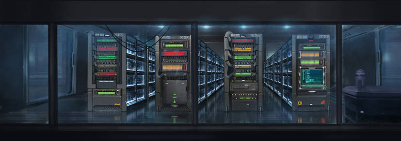

# 4rc0l061a de Nottingham **La arcología de Nottingham**

\sincolumna

Bosque Sh3rW00d es una ambientación CiberPunk para Savage Worlds en un mundo extrañamente parecido a las historias de Robin Hood o Ivanhoe.

Formarás parte de un grupo de descastades que sobreviven ocultos en el megacomplejo Nottingham. Lucharás por tu supervivencia y tu libertad contra la directora J0hn, una malvada IA que está a cargo del complejo.

J0hn rige Nottingham siguiendo unos protocolos que buscan maximizar los beneficios para la compañía sin importar lo que les pase a los habitantes del complejo. Todos recuerdan a la antigua, legítima y benevolente directora R1c4rd y esperan su regreso del proyecto del departamento de armamentística a la que fue asignada por la compañía. 

Arrambla con equipo y materiales, libera a cautives, haz pintadas contra la directora J0hn, haz duelos sobre el Trent, escapa de los sheriffs de Nottingham, bátete en duelo contra pintoresques personajes, ... 

Pero recuerda, lo más importante es **robar a los ricos para repartirlo entre los más pobres**.

## El mundo actual

\concolumna

```
xxx
```

xxx

### Nottingham

Nottingham es una gigantesca arcología donde viven cientos de miles de personas, creada hace más de 2 siglos por la compañía para sus empleades. xxx

xxx

### El bosque de Sh3rW00d

El bosque, cuyo primer sector tiene el código Sh3rW00d, es la parte de la arcología que no se llegó a terminar. Se le llama el bosque porque la zona está compuesta con salas y salas llenas de miles y miles de columnas sin nada más. Las columnas de color marrón parecen los troncos de árboles y nanitos de construcción han ido creando sobre ellos extrañas estructuras de material orgánico que le dan aún más aspecto vegetal.

xxx

### Las directoras

Las directoras son potentes IA que controlan Nottingham y tratan de que todo sea lo más beneficioso económicamente hablando para la compañía. xxx

xxx

\saltopagina

#### Directora J0hn y sus sheriffs

xxx

#### Directora R1c4rd

La directora R1c4rd es la anterior IA de Nottingham que fue trasladada al departamento de armamentística de la compañía. Se dice que era, a diferencia de la directora J0hn, justa y magnánima con les notis. Se recuerda con cariño los años de dirección de R1c4rd y se sueña con su regreso cuando ya no sea necesaria en el departamento bélico de la compañía.

xxx

\saltocolumna

\saltopagina

\sincolumna

## Orden social

\concolumna

```
Las gentes que viven en Nottingham son conocidas como notis. xxx
```

xxx

### Blus (Nobleza)

xxx

### Influencers (Iglesia)

Dentro del sistema neofeudal que rige la arcología, hay un grupo de Influencers adictos a la directora J0hn que marcan la vida de los _notis_. Ellos establecen las modas, lo que es _cool_ y lo que no, lo que se debe hacer y lo que no y, al final, lo que está bien y lo que está mal.

Además, señalan a los disidentes y los del excluyen socialmente, de forma que sus acciones y proclamas contra el sistema son muchas veces rechazadas, desacreditadas y olvidadas.

También son usados como una forma de ocultar los fallos y errores de la compañía, desviando la opinión pública hacia temas intrascendentes y vacuos.

xxx

### Curris (Plebe)

xxx

\saltocolumna

### Boskis (Fuera de la ley)

xxx

\saltopagina

\sincolumna

## Comercio e industria

\concolumna

```
xxx
```

xxx

### Formas de pago

No existe moneda física, todo son transacciones electrónicas a través del sistema monetario de la empresa. Así que se ha impuesto el trueque tanto de productos como de servicios cuando se quieren hacer actividades por debajo del radar del la Directora J0hn.

Los truques van desde cosas muy simples y del día a día como "tú arreglas el grifo de mi cubículo, yo te doy dos botes de mi salsa barbacoa casera" a trueques más complejos que incluso incluyen pagarés en papel (para no quedar registrados electrónicamente). Es curioso porque esos pagarés se han convertido en una especie de papel moneda que no se cobran si no que se intercambian una y otra vez y varían de valor según las circunstancias y lo que ofrezca el pagaré.

#### Trueque

El hecho de que la directora R1c4rd controle toda la economía de Nottingham ha hecho que florezca una economía sumergida y circular basada en el trueque de productos y el intercambio de trabajo. xxx

### Granjas y piscifactorías

xxx

### Teletrabajo

xxx

En vez de oficinas físicas, existen oficinas virtuales que simulan el ambiente de una oficina, xxx

A todos estos teletrabajadores se les llama en argot pijameres, por la broma de que están todo el día en pijama, aunque en sus versiones virtuales salgan con el apropiado uniforme de la empresa.

En el ciberpunk clásico era muy común las escenas de alienantes oficinas en las que miles de personas trabajaban en cubículos frente a ordenadores. En esta ambientación hemos introducido el concepto de teletrabajo de forma que ya no existen megaedificios en los que entran y salen miles de personas al día para trabajar en la megacorporación. Aquí cada trabajadore está en su casa aislado físicamente, pero hiperconectade vía redes. xxx

Muchos de estes teletrabajadores desarrollan fobias sociales y problemas de intimidad al solo conocer lo que es contacto virtual con otros seres humanos.

### Publicidad y cartelería

A diferencia de otras ambientaciones ciberpunk, en Bosque Sh3rW00d no existe casi publicidad. No hay grandes pantallas mostrando anuncios 24 horas y neones parpadeantes en las entradas de los locales.

\saltopagina

Para empezar la compañía vende casi el 90% de los bienes de consumo y no tiene competencia, por lo que la directora R1c4rd, decidió quitar ese gasto e invertirlo en guarderías gratuitas.

Por otro lado no hay grandes espacios abiertos con miles de personas de paso donde colocar esas macro pantallas publicitarias.

De hecho, solo existe una pantalla gigante en la plaza mayor donde se publican los edictos de la compañía y donde la directora J0hn hace sus apariciones públicas.

Los pequeños negocios funcionan con el boca a boca y se suelen identificar con complejos emojis hechos con algas bioluminescences en sus entradas.

Es normal ver soportes publicitarios humanos o robots portando carteles digitales por las inmediaciones del local del anunciante. Esto es debido a que la directora J0hn prohibió el uso de las paredes y otros elementos de la arcología como soporte artístico y publicitario en su lucha contra les grafiteres que ponían consignas contra ella y la compañía.

\saltocolumna

\saltopagina

\sincolumna

## Vida diaria

\concolumna

```
xxx
```

xxx

### Vida de interior y clima

El clima, si se le puede llamar así, es siempre igual durante todo el año. La temperatura de la arcología es de entre 23 y 25 grados con una humedad relativa de entre 45% y 60%. La nieve, la lluvia o el viento son conceptos que conocen, pero que muy pocos han experimentado y normalmente de forma muy tangencial. Alguno sabrá como puede ser la lluvia, por ejemplo, al saltar los aspersores anti-incendios, o la nieve y el frío al estropearse los sistemas de climatización y generar demasiado frío e incluso hielo.

xxx

#### Sin cielo y sin horizonte

Les habitantes de Nottingham no conocen lo que son los espacios abiertos, no saben lo que es mirar al cielo o ver el horizonte. Solo están acostumbrados a espacios cerrados de no más de 30 o 40 m². El mayor espacio abierto de Nottingham es la plaza Mayor, tan abierto que hay notis que tienen agorafobia.

### Cultura y contracultura

xxx

\saltocolumna

### Ocio y entretenimiento

xxx

### Gastronomía

xxx

### Religiones y sectas

xxx

### Fiestas, celebraciones y otros eventos

xxx


### Deporte

El deporte se ha adaptado a la vida en la arcología gracias a las últimas tecnologías, hablamos de bicicletas estáticas o cintas de correr con realidad virtual o el hockey de pasillo, una versión mini del hockey sobre hierba. También son famosos los concursos de baile acrobáticos y las competiciones de tiro con tirachinas. 

#### Hockey de pasillo

El hockey de pasillo es el rey de los deportes en Nottingham. Es un hockey sobre hierba adaptado a 3 jugadores al interior del complejo. Se juega en recintos cerrados como pasillos y galerías en equipos de 4 (parabol, pasabol, lanzabol y un suplente). Cada encuentro dura 5 rondas de 7 minutos.

\saltopagina

Gana el equipo que más goles meta o el que consigue marcar en 3 rondas seguidas sin que su oponente le marque (llamado en el argot deportivo "baño").

Uno de los elementos más interesantes del hockey de pasillo es el campo de juego. Según el reglamento oficial puede ser cualquier pasillo de la arcología que tenga un mínimo de 40 m² usando dos puertas del pasillo como porterías. 

Las puertas que no tienen que ser del mismo tamaño ni tener unos mínimos o máximos, así que es importante ganar el sorteo inicial para elegir la portería más ventajosa. Aunque se cambie cada ronda, al ser 5 estarías 3 en la buena y 2 en la mala.

En los partidos oficiales de liga se elige al azar el campo de entre todos los corredores, galerías, pasillos y pasajes que cumplan las indicaciones. 5 minutos antes de empezar se desaloja el pasillo y entran les jugadores a calentar.

Los partidos son retransmitidos a través de las cámaras de vigilancia del pasillo. Se cierran todos los accesos al pasillo, excepto para personal sanitario y los suplentes.

Debido al poco espacio del campo, los partidos son arbitrados desde fuera usando las imágenes de las cámaras de seguridad y hablando por los altavoces. Por la misma razón, los entrenadores, si se tienen, siguen el partido por las cámaras de seguridad y dan las órdenes también por la megafonía.

El juego es más de habilidad para moverse entre espacios pequeños, de saber mover la bola y aprovechar los rebotes que de fuerza física, ya que no hay espacio para golpear a tu contrincante con el stick o para coger carrerilla.

\saltocolumna

Reglamento general:

* Solo se puede tocar la pelota con el stick.
* No se puede golpear a otro jugador con el stick.
* La pelota puede rebotar contra cualquier cosa del terreno de juego.
* Si cometes una falta, debes soltar tu stick y no moverte los segundos de castigo. Tus compañeres y tus adversaries puede usarte como protección, obstáculo, etc. mientras estás en la falta.

Hay gran cantidad de equipos amateurs en la arcología, pero solos 12 profesionales en la Liga de Hockey de pasillo. Estos equipos tienen patrocinadores, remuneraciones, buen equipamiento, entrenadores, gimnasios, etc. Los más famosos suelen acabar de influencers de la directora J0hn, haciendo reels y directos para les fans de este deporte.

El hockey de pasillo atrae muchas apuestas ilegales controladas por las mafias y la sombra de los amaños siempre ha sobrevolado el hockey de pasillo profesional.

**Semilla de aventura:** Un pequeño equipo de hockey de pasillo ha dado el campanazo este año, pueden hasta ganar la liga. Pero necesitan guardaespaldas que les protejan, ya que hay gente que quiere impedir que lleguen a la final.

### Sexo y género

xxx

\saltopagina

\sincolumna

## Leyes y justicia

\concolumna

```
La compañía tiene el control de la justicia y del sistema penal de Nottingham, pero tuvo que firmar ciertos contratos con garantías de que será justa e imparcial. 
```

La compañía tuvo que establecer una serie de leyes que regirían el funcionamiento de Nottingham cuando adquirió la concesión de construcción y explotación de esta arcología. xxx

### Los juicios

Las directoras tienen el privilegio de juzgar a todos los habitantes de Nottingham y su decisión no es recurrible. Pero eso genera mucho consumo de ciclos y solo juzgan casos importantes. El resto de crímenes son juzgadas por "las 3 sabIAs".

Las 3 sabIAs son 3 IA de cualquier tipo (siempre que cumplan unos mínimos de inteligencia y razonamiento) que son seleccionadas una por la defensa, otra por la acusación y una tercera al azar entre todas las IA de Nottingham.

Las IA escuchan a las partes, estudian las pruebas y dan un veredicto. El veredicto debe ser unánime. Los 3 votos deben ser iguales, lo cual es curioso, ya que una de las IA es de la defensa y otra de la acusación y no deberían coincidir nunca, pero discuten a miles de megaherzios y terminan llegando a un acuerdo. Como no tienen muchos de los sesgos humanos suelen llegar a veredictos bastante justos y equitativos.

\saltocolumna

Les mejores abogades van detectando las IA que más posibilidades tienen de llevarse al resto a su campo.

Durante el juicio que dura entre 12 y 24 horas las IA solo pueden trabajar en el juicio. No es la primera vez que los ascensores de una sección dejan de funcionar porque su IA tiene un juicio.

**Semilla de aventura:** Tu banda recibe el soplo que la IA de seguridad de un importante centro de datos tiene que participar en un juicio. Puede ser una oportunidad buena para conseguir nuevos códigos de acceso, mapas de instalaciones, etc. un buen botín de datos.

### Penas

xxx

#### Trabajos forzados

xxx

\saltopagina

\sincolumna

## Bajos fondos y crimen organizado

\concolumna

```
xxx
```

xxx

\saltocolumna

\saltopagina

\sincolumna

## Les instaladores

\concolumna

```
Les instaladores son les constructores primigenies de Nottingham que abandonaron la arcología antes de terminarla, como demuestra la existencia del bosque. La compañía se los llevó de Nottingham hace ya 80 años y no se sabe por qué, pero no es raro encontrar su tecnología, que, aun teniendo muchos años de antigüedad, es todavía muy superior y es muy apreciada y codiciada.
```

xxx

### Tecnología de les instaladores

La tecnología de les instaladores se basa principalmente en los nanobots. Miles de microrobots conectados que construyen los diseños de les instaladores. No solo construyen nuevos pisos de la arcología, sino que también reparan, restauran y mantienen los pisos viejos.

xxx

### Los nanitos después de la marcha de les instaladores

Cuando les instaladores se fueron por orden de la compañía, se llevaron los nanobots, pero no todos. Muchos de los nanitos de zonas en construcción quedaron huérfanos y sus firmwares desactualizado empezaron a fallar o a funcionar por su cuenta y siguieron construyendo ahora con materiales reciclados de origen biológico. Así es como el bosque obtuvo su nombre, al crearse estructuras orgánicas a las columnas techos, suelos y paredes del bosque.

\saltocolumna

xxx

### La búsqueda de la contraseña de SU

Les buscadores de la contraseña de SU, abreviando les buscadores, son un grupo de personas que creen que les instaladores dejaron en alguna parte un password de "superuser" que al usarlo activará en la arcología una serie de sistemas escondidos que acabarán con el mal y las injusticias del mundo actual.

xxx

\saltopagina

\sincolumna

## El mundo exterior

\concolumna

```
xxx
```

xxx

\saltocolumna

***

# |-|15t0r14 **Historia**


\sincolumna

## La creación de Nottingham

\concolumna

```
xxx
```

xxx

\saltocolumna

\saltopagina

\sincolumna

## El éxodo de les instaladores

\concolumna

```
xxx
```

xxx

\saltocolumna

\saltopagina

\sincolumna

## La dirección de R1c4rd

\concolumna

```
xxx
```

xxx

\saltocolumna

\saltopagina

\sincolumna

## La dirección de J0hn

\concolumna

```
xxx
```

xxx

\saltocolumna

\saltopagina

\sincolumna

## El bosque de Sh3rW00d

\concolumna

```
xxx
```

xxx

\saltocolumna

***

# Я36|45 **Reglas**

\sincolumna

## Creación de personajes

\concolumna

```
En Bosque Sh3rW00d hay una serie de reglas que modifican las reglas generales de creación de PJ que se establecen en el libro básico de savage Worlds Ed. Aventura.
```

Recuerda que todos les PJ son de raza humana con lo que tienes una ventaja adicional a la hora de crearlo.

### Hijes de la tecnología

Vives rodeado de tecnología las 24 horas del día. Quieras o no, sabes usar todo tipo de aparatos eléctricos y ordenadores.

> Todes les personajes **empiezan con Electrónica d4 y Ordenadores d4**.


### La ciencia mató la magia

A no ser que quieras darle un toque paranormal, **Ocultismo desaparece** de las habilidades elegibles. También **desaparecen las habilidades como Hechicería, Ciencia Extraña, Fe, etc. y las ventajas de poder** que tienen un carácter mágico.

Aun así recuerda que por ejemplo en la trilogía de Sprawl de William Gibson, el vudú estaba integrado dentro de las creencias de los ciberjinetes. Puede que en lo más profundo de la red haya espíritus y otros seres que la informática no pueda explicar. 

\saltocolumna

[](https://www.deviantart.com/fernand0fc/art/HeadShots-743989425 "HeadShots By Fernand0FC")

### Espacios cerrados

Se recomienda **no ponerse ventajas de pistolero**, como Disparo Rápido, ya que son bastante inútiles en esta ambientación. Todas las aventuras, de normal, transcurren en espacios muy muy cerrados, donde las habilidades de tirador son menos útiles.

**Tampoco son útiles habilidades como Cabalgar**, ya que no hay animales que montar, ni Pilotar, ya que no hay aeronaves ni barcos que usar. El pilotaje de drones y similares se haría con Electrónica. **Supervivencia es sustituida por Pasillear**, su versión urbana para la arcología.

**Mal nadador desaparece como desventaja**, debido a que no hay casi grandes masas de agua donde nadar sea importante. Como ya hemos dicho, no hay animales, **Vinculo Animal y Señor de las bestias tampoco se pueden escoger**.

\saltopagina

### Idiomas

El inglés es el idioma predominante en Nottimgham, asi que es no hay problemas de comunicación entre personas y máquinas. Puede encontrarse libros u objetos con textos en otros idiomas, pero no debería ser difícil conseguir traducciones más o menos buenas.

> Empiezas con la habilidad **Idioma Inglés a nivel de tu Astucia y un d4 en Idioma Leet**.

### Secretos

Los secretos es algo muy común entre les personajes de las historias de Robin Hood. Robin es un noble, Scarlet es un hermanastro de Robin o Marian se disfraza de hombre para ayudar a los pobres. He querido trasmitir esa esencia con esta regla de creación de personajes. 

> Tode personaje debe **tener un Secreto (mayor o menor)** entre sus desventajas.

### Ciberimplantes

Los ciberimplantes son algo común entre les _notis_, sobre todo desde que la compañía ofrece implantes gratis para mejorar tu productividad. La compañia solo financia implantes legales y que estén relacionados con la profesión de su empleade.

\saltocolumna

> Opcionalmente, puedes tener un **implante cualquier tipo, pero solo de valor 1 y tiene ser legal**.

### Hackeos de les instaladores

Si no has caído bajo el influjo de la compañía y sus tretas, seguramente hayas aprendido algún hackeo de les instaladores.

> Elige un hackeo que tenga como requisito Novate de la lista de hackeos de les instaladores, si no has elegido ninguno de los ciberimplantes que te ofrece la compañía.

Los grupos underground de Nottingham usan un lenguaje escrito llamado Leet que busca complicar a las maquinas el reconocimiento de textos. Se intercambian caracteres por otros de forma similar como "A" por "4" o "S" por "$", de forma que las maquinas tengan problemas al leerlo, pero tú puedes interpretarlo fácilmente.

\saltopagina

\sincolumna

## Arquetipos

\concolumna

```
A la hora de crear tu PJ te presentamos algunos arquetipos que te ayuden a construirlo. es importante tener en cuenta que las aventuras de robin Hood siempre hablan de personajes parias y fuera de la ley y he seguido esa idea al diseñar estos arquetipos.
```

También puedes crear los tuyos propios, pero recuerda que el espíritu del juego es que estén al otro lado de la ley o muy cerca.

### Biker

Estes mensajeres recorren todo el complejo de Nottingham llevando todo tipo de sobres, paquetes, etc. a todo tipo de personas. No hacen preguntas y sus bocas están selladas sobre qué, de quién y para quién han hecho un encargo.

Te mueves rápide y nunca estás mucho tiempo quiete en un mismo sitio. Por así decirlo, si estas parade, es que eres un cadáver. 

* **Habilidades recomendadas:** Conducir (e-bike), Pasillear y Reparar
* **Ventajas recomendadas:** As, Mr. Arreglalotodo y Manos firmes
* **Desventajas recomendadas:** Impulsive, Leal y Pobreza


### Buscadore

Les buscadores son un grupo de personas que creen en un mundo mejor y han jurado conseguirlo.

\saltocolumna

Según sus creencias, les instaladores dejaron en alguna parte un password de _superusuario_ que al usarlo activará en la arcología una serie de sistemas escondidos que acabarán con el mal y las injusticias del mundo actual.

No tienes por qué creerte todo ese rollo, pero igual estás segure de que hay algo escondido en la arcología que vuelva a poner las cosas a como estaban con la directora R1c4rd. 

* **Habilidades recomendadas:** Investigar, Intimidar y Notar
* **Ventajas recomendadas:** Ardor, Campeone y Investigadore
* **Desventajas recomendadas:** Heróique, Juramento y Obsesión

### Erudite

Les erudites engloban a toda persona que se centra su forma de vida en el estudio y el descubrimiento científico. Todas las ramas de las ciencias y de las letras pueden ser su objeto de estudio. 

Mientras que algunos de tus compañeres se han vendido a la compañía, tú sabes que el conocimiento puro debe ser libre de interferencias de cosas como el capitalismo. Tus descubrimientos deben ayudar a la humanidad, no a hacer dinero. 

* **Habilidades recomendadas:** Ciencias, Humanidades y Medicina
* **Ventajas recomendadas:** Curandere, Erudite e Investigadore
* **Desventajas recomendadas:** Caute, Curiose y Despistade

\saltopagina

### Grafitere

Este arquetipo refleja todo tipo de personajes que llevan la confrontación contra la compañía a las calles, no solo en forma de grafitis. También con actos de vandalismo callejero, pequeños sabotajes y sentadas.

Tu principal problema es que tus actos, sin una figura carismática que te dirija, muchas veces no son más que simples gamberradas.

* **Habilidades recomendadas:** Atletismo, Pasillear y Sigilo
* **Ventajas recomendadas:** Acróbate, Alerta y Parkour
* **Desventajas recomendadas:** Exceso de confianza, Heróique y Suspicaz

### Influencer en desgracia

[](https://www.deviantart.com/sokoistrying/art/Mire-989919510 "Mire By sokoistrying")

Fuiste parte del selecto grupo de influencers que rodean a la directora J0hn. Estabas en la cima de la pirámide social, hasta que un día cometiste un error y caíste en desgracia.

\saltocolumna

Puede que criticases a la directora J0hn, fueras parte de algún tipo de trampa ilegal o simplemente te posicionaste de les débiles y oprimides.

Ahora malvives de favores y por la nostalgia de tus seguidores más fieles y a veces bastante obsesivos.

* **Habilidades recomendadas:** Interpretar, Intimidar y Persuadir
* **Ventajas recomendadas:** Carismatique, Famoso y Rique
* **Desventajas recomendadas:** Bocazas, Exceso de confianza y Habito (alcohol, drogas, etc.)

### Nacide libre

Estás a otro lado de la ley y de la sociedad desde tu nacimiento. Naciste en el bosque y por tanto careces de tu HUB de conexión.

Eso supone que no puedes moverte normalmente por la arcología como cualquier _noti_ y tienes que buscarte la vida para moverte por ella para conseguir recursos.

Por otro lado no existes para empresa y eso es un gran valor.

* **Habilidades recomendadas:** Electrónica, Pasillear y Reparar
* **Ventajas recomendadas:** Persona de recursos, Osade y Sentir el peligro
* **Desventajas recomendadas:** Joven, Marginade y Nacide Libre (obligatorio)

\saltopagina

### Paramedic

Este arquetipo refleja un amplio grupo de profesionales de la medicina capaces de curar y remendar todo tipo de golpes y heridas.

Te debes a tu juramento hipocrático, que está por encima de cualquier otra cosa. Nada hará que no lo cumplas, ni la propia directora J0hn en persona podría.

* **Habilidades recomendadas:** Ciencias, Medicina y Notar
* **Ventajas recomendadas:** Curandero, McGyver y Osado
* **Desventajas recomendadas:** Bocazas, Juramento y Exceso de confianza

### Periodiste

Dentro de este arquetipo se incluye a todo tipo de buscavidas que saben moverse por los bajos fondos y eludir a la ley para llegar al corazón de la noticia.

Tu medio siempre será _underground_, fuera de los canales oficiales que están pagados por la directora J0hn. Escribes en su blog, hablas en un podcast o lanzas a la red todo tipo de videos.

Sabes que el escándalo y el morbo vende y es la única manera de que tu contenido se viralice. Por eso siempre rodeas a tus denuncias de una capa de periodismo amarillo.

* **Habilidades recomendadas:** Investigar, Latrocinio y Notar
* **Ventajas recomendadas:** Conexiones, Investigador/a y Electrónica
* **Desventajas recomendadas:** Curioso, Impulsivo y Obsesión

### Sindicade

Este arquetipo reúne a todo tipo de trabajadores durante alienados que ha descubierto como la compañía oprime a los _notis_ y busca luchar contra esta injusta situación.

Puedes ser cualquier tipo de trabajador, siempre que busques la caída de la compañía y de la directora J0hn como su máxima representación.

* **Habilidades recomendadas:** Electrónica, Intimidar y Reparar
* **Ventajas recomendadas:** McGyver, Mr. Arreglalotodo y Sindicade
* **Desventajas recomendadas:** Bocazas, Leal y Tozude

&nbsp;

[](https://www.deviantart.com/kernspalt/art/Cyberpunk-reporter-856952409 "Cyberpunk reporter By Kernspalt")

\saltopagina

\sincolumna

## Nuevas habilidades

\concolumna

```
Bosque Sh3rW00d es una ambientación ciberpunk tremendamente urbana lo cual implica cambios en las habilidades básicas de savage Worlds.
```

Como ya se ha dicho en la creación de personajes, **desaparecen Ciencia Extraña, Fe, Hechicería, Ocultismo y Psiónica**.

### Pasillear (Astucia)

Pasillear viene a sustituir a Supervivencia. Esta habilidad permite al personaje encontrar elementos como cables de red o electricidad o tuberías de agua, gas o climatización, paneles de control, centros de datos o puntos de conexión. Puede emplearse también para orientarse en los pasillos y cubículos de la arcología, leer mapas y buscar rutas de escape seguras.

A diferencia de Supervivencia, no se puede usar para seguir rastros, ya que en tornos urbanos no se dejan muchas huellas. Pero se puede usar para perseguir gente, buscando rutas alternativas, caminos más o menos usados, trochas y atajos, etc. A la hora de seguir a una persona se puede usar Pasillear en vez de Sigilo.

En persecuciones, en cada ronda puedes gastar tu acción para buscar la mejor ruta tirando Pasillear. Un éxito en la tirada supone un +1 a las tiradas de maniobras de tu conductor. Solo une pasajere puede realizar esta acción por ronda. 

\saltocolumna

### Idiomas

En la arcología de Nottingham se habla principalmente inglés, pero hay pequeños grupos que mantienen sus propios idiomas.

#### Leet

Los grupos underground de Nottingham usan un lenguaje escrito llamado Leet que busca complicar a las máquinas el reconocimiento de textos. Se intercambian caracteres por otros de forma similar como "A" por "4" o "S" por "$", de forma que las IA y los constructos tengan problemas al leerlo, pero tú puedes interpretarlo fácilmente.

 Hello World")

Cuando necesites dejar un mensaje escrito o escribir un grafiti y que las IA no lo reconozcan e interpreten, puedes tirar Leet. Tu tirada será la dificultad para las máquinas (con la capacidad especial IA o Constructo) para entender tu mensaje. Deberán hacer una tirada de Astucia o Leet (en caso de saberlo) para entender el texto.

\saltopagina

\sincolumna

## Nuevas ventajas

\concolumna

```
Esta ambientación es un mundo difícil, pero hay una serie de ventajas propias que pueden serte de gran ayuda. Estas ventajas se centran más en temas sociales y legales que en tecnología, combate o cibernética, que son tan típicas de las ambientaciones ciberpunk.
```

Como ya hemos dicho, no hay animales, con lo que **Vinculo Animal y Señor de las bestias no se pueden escoger**.

### Alijos

**Requisitos:** Novate

Mientras que la ventaja Rique/Extremadamente Rique te ofrecen riquezas, tienen el problema de que están controladas por la compañía. Son rastreables y no se pueden usar en los bajos fondos y en situaciones ilegales.

Alijos te ofrece esa riqueza al otro lado de la ley. Tienes grandes cantidades de dinero en forma de alijos pueden ser objetos de valor, cupones de trueques, etc. Lo más importante es que es dinero que no está controlado por la empresa y se puede usar en actividades que no controla la compañía y/o de carácter ilegal.

> **Alijos funciona como Rique** salvo que solo se puede usar en temas ilegales o cuando no se quiera que las transacciones comerciales sean rastreables.

\saltocolumna

[](https://www.deviantart.com/mindofjen/art/ERROR-622951034 "ERROR By mindofjen")

### Identidad glitcheada

**Requisitos:** Novate, no puede tenerse Nacide Libre

Por alguna extraña razón, tu identidad a veces falla. Alguna vez tienes problemas al hacer pagos o cobrar tu sueldo. Lo interesante es que muchas veces los sistemas de reconocimiento y vigilancia no logran detectarte o te toman por otra persona. 

Si un sistema informático o intenta hacer un simple control de tu identidad funciona perfectamente o igual falla y a la segunda vez funciona perfectamente.

\saltopagina

El problema lo tienen los sistemas de seguridad y vigilancia, hacen tantos chequeos por microsegundo de tu identidad que terminan fallando y ralentizándose y terminan tomándote por otra persona o simplemente te ignoran.

> Todos los **sistemas de seguridad e IA de vigilancia tienen un -2 a la hora de detectarte e identificarte** (Notar, Investigar o incluso Disparar). Si fallan suelen considerarte inexistente o te asignan otra identidad.  

### Necesarie para la compañía

**Requisitos:** Novate

Por alguna razón eres necesario para la compañía y no puede permitirse que desaparezcas. Quizás tus habilidades son muy valoradas o únicas, estás protegido por alguien importante o hay algo en tí que la compañía busca. Sea lo que sea, todas las IA y les secuaces de la compañía tienen ordenes de no dañarte, pueden intentar noquearte o inmovilizarte, pero deben evitar hacerle daño.

De normal **esta ventaja debería tener un Secreto** que explique por qué eres necesarie para la compañía.

> Todos los agentes de la compañía (humanos, constructos e IA) **deben pasar una tirada de Espíritu para tratar de dañarte**. Si fallan tendrán que cambiar su acción y intercambiarla por otra no dañina.

\saltocolumna

### Sindicade

**Requisitos:** Reparar d6

El sindicalismo está prohibido por la compañía. Mientras que la directora R1c4rd lo permitía de forma no oficial, J0hn la ha perseguido con todos sus recursos y aplicando las penas máximas.

Aun así, el movimiento está más fuerte que nunca sobre todo en las clases sociales más bajas. Todo esto es gracias a sus interacciones con otros grupos fuera de la ley como _boskis_.

Ser un cargo importante del sindicato debería venir con un Secreto, mayor o menor según el cargo.

Los sindicades siempre se apoyan (en temas laborales y de derechos), se ayudan y se cubren. No tienen por qué dar la vida por ti, pero arriesgarán lo mismo que arriesgues tú.

> A parte de las ventajas de pertenecer a un grupo fuerte y unido, puedes **acceder a productos ilegales no controlados por las mafias** (drogas, estimulantes o implantes letales) como ciberimplantes ilegales que no sean de combate o materiales de hackeo.

\saltopagina

\sincolumna

## Nuevas desventajas

\concolumna

```
Esta ambientación es un mundo muy especial que claramente va a tener sus desventajas propias. Estas desventajas reflejan esa extraña mezcla que representa Bosque Sh3rW00d.
```
Para empezar hay una serie de modificaciones en las desventajas de Savage Worlds:

* **Manazas se convierte en una desventaja mayor.** En un mundo hipertecnificado ser manazas con la tecnología es una desventaja mayor.
* **Desaparece Mal nadador** por falta de grandes superficies de líquido.

Estas desventajas permiten darle un toque ciberpunk a tus personajes.

### Ciberalergia (mayor)

La capacidad de tu cuerpo aceptar ciberimplantes es mucho menor que el del resto de las personas.

> A todos **los costes de puntos de ciberimplantes debes sumarle 1 punto extra** por tu alergia. Si una persona normal gasta 2 puntos de ciberimplantes en ponerse un implante que le otorga Reflejos de combate, tu gastas 3 puntos. Lo bueno es que tu cuerpo combate la tecnología y tienes +1 a las tiradas de Vigor contra cosas como nanitos que se metan en tu organismo.

### Ciberparanoia (mayor/menor)

Tienes la insana convicción de que las IA te vigilan, te siguen y, lo peor de todo, crees que están contra ti. Siempre estás vigilando todo tipo de aparato y sistema electrónico a tu alrededor, esperando detectar algún elemento que delate que las IA te están escuchando y conspirando a tus espaldas.

> Como **desventaja menor, tienes un -1 en todas las tiradas de habilidad que exijan concentración** (como abrir cerraduras, jugar a las cartas, descifrar un código, …) cuando haya elementos de vigilancia a tu alrededor que es casi siempre. Si se toma **como mayor, además, el -1 se aplicará a todas las tiradas de percepción (Notar e Investigar)**, ya que estarás más preocupado en que no te vigilen y espíen las IA que en vigilar o buscar a tus objetivos. Por otro lado, conoces a tu enemigo, así que obtienes un bono (+1 menor, +2 mayor) a Electrónica al tratar con sistemas electrónicos de vigilancia, rastreo y seguridad.   

### Fobia social (mayor/menor)

La fobia social, conocido también como trastorno de ansiedad social (TAS), es un trastorno de ansiedad caracterizado por un miedo persistente a una o más situaciones sociales por temor a que resulten embarazosas.

\saltopagina

Dar discursos en público, participar en concursos, desfilar por una pasarela, etc. se vuelven tareas muy complicadas, aunque tampoco llevas bien las reuniones sociales en las que tendrá que relacionarse (fiestas, eventos, etc.) o los encuentros inesperados con conocidos, familiares, amigos, etc.

Nottingham tiene una altísima densidad de población, lo cual hace que las situaciones de fobia social sean muy normales. También gracias a la tecnología se puede estar en todas partes sin estar realmente.

> **No puedes gastar benis cuando estás rodeade de demasiada gente** observando y juzgando lo que haces.

### Imán de lo extraño (menor)

Todo lo extraño se siente atraído hacia ti para bien y para mal. No es algo que busques, simplemente es algo que pasa. A veces es una bendición y otras una maldición, pero la mayoría de las veces es un fastidio.

Seguro que caerás por la esclusa que lleva a la madriguera del cocodrilo albino que nadie creía que existís, abres el armario donde le influencer guarda sus útiles fetichistas o se te cae una probeta llena de nanitos que te tiñen la cara de azul.

> Cuando haya que hacer **tiradas al azar** para ver a quién le pasa algo raro, se debería **elegir directamente al imán de lo extraño**.

\saltocolumna

### Nacide libre (mayor)

Tus progenitores te concibieron fuera del sistema, bien porque también estaban fuera del sistema o porque así lo decidieron antes de nacer tú. Sea como sea, no tienes HUB de conexión. 

Esta desventaja deberías reservarla para boskis nacidos en el bosque, el resto de personas es muy difícil que no hayan sido registrados en el sistema de la compañía y se les haya implantado el HUB.

Si eres detenido, es fácil saber que no estas en el sistema, porque el sistema no tiene fallos. Si dice que no existes es que eres un _boski_ infiltrado en el complejo.

Si en algún momento **te implantan un HUB de conexión se pierde esta ventaja**.

> No tienes **ninguna de las ventajas de tener HUB de conexión** al sistema, pero lo compensas no teniendo **ninguna de las desventajas**. A priori no existes para la directora J0hn y sus tentáculos cibernéticos. No hay registros, ni huellas, ni ningún dato sobre tí y **eres invisible para la gran mayoría cámaras y sensores de la arcología**.

\saltopagina

\sincolumna

## Equipo

\concolumna

```
xxx
```

xxx

### Equipo normal

xxx

### Armas

xxx

#### Slingshot (Tirachinas)

xxx

##### Proyectiles para tirachinas

xxx

### Protecciones

xxx

### Transporte y comunicación

xxx

#### Monturas: Roller skates, skateboards y e-bikes

xxx

\saltocolumna

Los **skateboards y rollers** (y todas sus variantes) no tienen habilidad de Conducir, **se usa Atletismo**.

\saltopagina

\sincolumna

### Listado de armamento

|ARMA|DAÑO|DISTANCIA|PESO|COSTE|CDF|FUE MIN.|PA|NOTAS|COSTE|
|---|---|---|---|---|---|---|---|
|Slingshot|Str+d4-1|5/10/20|0,5|1|1|d4|-|Contundente, ¹ Recarga gratuita, 2 manos|30|

¹ Cargar un proyectil en un tirachinas es una acción gratuita que solo pueden realizarse una vez por acción.

### Listado de protecciones

|PROTECCIÓN|LOCALIZACIONES|ARMADURA|FUE MÍN.|PESO|COSTE|
|---|---|---|---|---|---|

### Listado de vehículos

|VEHÍCULO|TAMAÑO|MANIOBRA.|VEL. MÁX.|DUREZA|TRIPULACIÓN|
|--------|------|----|--|------|-----|
|Roller skates|-4|+2|32 km/h|4|1|
|Skateboard|-3|+1|30 km/h|4|1|
|E-bike|-1|+1|35 km/h|5|1+1|

\concolumna

\saltopagina

\sincolumna

## Hackeos de les instaladores

\concolumna

```
Les instaladores tenían pequeños hackeos que usaban en su día a día y que les permitían usar los elementos de la arcología y el equipo de formas para los que no estaban preparados, como acelerar la velocidad de los montacargas o hacer que las puertas de los ascensores se abrieran solas sin que hubiera ascensor.
```

Estos hackeos han ido siendo descubiertos con los años, normalmente de forma casual. Son combinaciones de botones, cambios de polaridad, puentes rápidos y cosas parecidas. Están tan integradas en el código de los sistemas que todos los intentos de extirparlos ha supuesto fallos generalizados del sistema. Así que se han terminado por aceptar como algo inevitable.

Estos hackeos son una especie de mezcla de ventaja y poder que **pueden aprenderse gastando un avance** y cumpliendo los requisitos. Por un avance puedes comprar un hackeo de tu rango o dos hackeos de rangos inferiores.

A priori, puede parecer que gastar un avance para controlar un ascensor es muy caro, pero pensad que muchas veces los refuerzos podrán llegar antes o después si tienes control del montacargas que da acceso a tu sección de la arcología.   

Salvo que el hackeo diga lo contrario, **todos necesitan una tirada de Electrónica**. Si se pasa se consigue uno de los posibles efectos del hackeo. No se pueden ejecutar varios hackeos a la vez sobre el mismo sistema, solo un efecto estará activo, aquel con la tirada de Electronica más alta.

\saltocolumna

Los hackeos son muy rápidos de realizar, por ello **solo necesitan una acción**. Salvo que el hackeo diga otra cosa, la **duración es de 4 turnos**. Puedes gastar avances para conseguir otros 4 turnos extras.

Una persona que conozca el mismo hackeo podrá **desactivarlo haciendo una tirada de Electrónica**. La dificultad es la tirada de Electrónica del que ejecutó el hackeo.

Gastar avances en más tiempo u otras modificaciones hace que resten 4 puntos a su dificultad. De forma que si sacas 10 en tu tirada de Electrónica y gastas un avance en alargar la duración del hackeo, aquella persona que quiera desactivar tu hackeo tira contra 6 (10 - 4).

### Controlar iluminación

**Requisitos:** Novate

Mediante una mezcla de movimientos captados por los sensores de la iluminación y clics en los mandos de la luz, hacen que la iluminación actúe de las siguientes formas. Debes recordar que no hay fuentes naturales de la luz así que las estancias se quedan completamente a oscuras si se apaga la luz (a falta de otras formas de luz como leds de dispositivos o linternas). No se puede conseguir oscuridad total porque hay luces independientes de emergencia.

* Puedes inutilizar la iluminación haciendo que se quede **encendida o apagada durante la duración del hackeo**.

\saltopagina

* Poner las luces en **modo estroboscópico**, lo que supone **-1 a todas las tiradas de habilidad que exijan la vista** como disparar o buscar algo.
* Poner las luces en **modo random** de forma que se **enciendan o apaguen al azar** cada turno (par se apagan, impar se encienden).

### Controlar pantallas

**Requisitos:** Novate

xxx

* Encender y apagar pantallas. xxx
* Puedes poner mensajes simples y estáticos de fuentes externas.
* xxx

### Llamar ascensor

**Requisitos:** Novate

Pulsando una combinación de botones de ascensores, montacargas y escaleras mecánicas puedes conseguir ciertos efectos sobre ellos.

* Puedes hacer que un **ascensor/montacargas venga a tí**, saltándote cualquier otra llamada previa.
* Puedes hacer que un **ascensor/montacargas vaya a un extremo u otro de su ruta**. Este hackeo dura hasta que llega al punto final de su ruta elegido.
* Puedes **cambiar la dirección de unas escaleras mecánicas**. Moverse en dirección contraria a las escaleras se considera terreno difícil.

### Controlar puertas

**Requisitos:** Experimentade

xxx

* xxx
* xxx
* xxx

### Controlar ascensor

**Requisitos:** Experimentade, Llamar ascensor

xxx

* xxx
* xxx
* xxx

### Dominar iluminación

**Requisitos:** Experimentade, Controlar iluminación

xxx

Usando este hackeo se pueden hacer las cosas que en Controlar Iluminación pero controlando las luces de emergencia y similar.

* Hacer que las luces sigan un objetivo, **iluminando u oscureciendo la zona donde está el objetivo**. Esto afecta a la visibilidad del objetivo tanto en combate como en sigilo.
* xxx
* xxx

**Avances:** 1 avance por cada más objetivo extra.

\saltopagina

### Controlar climatización

**Requisitos:** Experimentade

xxx

* xxx
* xxx
* xxx

### Controlar vigilancia

**Requisitos:** Veterane, Controlar pantallas

xxx

* xxx
* xxx
* xxx

### Dominar climatización

**Requisitos:** Veterane, Controlar climatización

xxx

* xxx
* xxx
* xxx

### Dominar puertas

**Requisitos:** Veterane, Controlar puertas

xxx

* xxx
* xxx
* xxx

\saltocolumna

### Dominar vigilancia

**Requisitos:** Heróique, Controlar vigilancia

xxx

* xxx
* xxx
* xxx

### Código Konami

Requisitos: Legendario


xxx

\saltocolumna

\sincolumna

### Listado de hackeos

|Hackeo|Requisitos|Descripción|
|---|---|---|
|Controlar pantallas|Novate|Encender y apagar pantallas y poner mensajes simples|
|Controlar iluminación|Novate|Encender y apagar luces y otros efectos simples|
|Llamar ascensor|Novate|Robar el ascensor a otras personas o mandarlo a un extremo de su ruta|
|Controlar puertas|Experimentade|xxx|
|Controlar ascensor|Experimentade, Llamar ascensor|xxx|
|Dominar iluminación|Experimentade, Control de la iluminación|xxx|
|Controlar climatización|Experimentade|Modificar la climatización dentro de sus parámetros de seguridad|
|Dominar climatización|Veterane, Controlar climatización|Modificar la climatización fuera de sus parámetros de seguridad consiguiendo por ejemplo hielo|
|Controlar vigilancia|Veterane, Controlar pantallas|xxx|
|Dominar puertas|Veterane, Controlar puertas|xxx|
|Dominar vigilancia|Heróique, Controlar vigilancia|xxx|
|Código Konami|Legendario|xxx|

\concolumna

\saltopagina

\sincolumna

## Otros sistemas

\concolumna

```
Aquí encontrarás reglas para sistemas nuevos propios de esta ambientación.
```

### Cómo jugar al hockey de pasillo

Antes de empezar, les jugadores (incluide le suplente) definen su posición en el campo (parabol, pasabol o lanzabol) en la que suelen jugar, entrenarse y tienen el equipo puesto. Por ejemplo, los Picaportes del Trent tienen 1 lanzabol, 2 pasabol (titular y suplente) y 1 parabol.

A continuación hay que sortear el campo como quieras. Como ya hemos dicho, casi siempre hay un campo mejor que otro que y el ganador podrá tenerlo 3 de las 5 rondas de juego. Saca una carta y según su palo el campo bueno tiene una ventaja u otra.

* **Corazones:** Portería pequeña. El parabol tiene un +2 a su tirada de Atletismo.
* **Diamantes:** En forma de L. La parte corta de la L es donde está tu portería y permite que le pasabol juegue con ello al defenderse. Le pasabol tiene un +2 a Atletismo.
* **Picas:** Portería grande. El lanzabol tiene un +2 a su tirada de Atletismo.
* **Tréboles:** Tdo el campo está sucio y lleno de trastos. El sitio está lleno de trastos que molestan al jugar y el suelo está sucio y resbaladizo. Todes les jugadores tienen -2 a atletismo.

Un partido de hockey de pasillo consta de 5 rondas de combate. Cada ronda tiene una fase de estrategia y otra de juego.

En la fase de estrategia se podrán escoger les 3 jugadores (parabol, pasabol, lanzabol) que van a participar en las jugadas de cada ronda siguiendo estas reglas de participación: le parabol no puede jugar en la posición de lanzabol y viceversa y nadie puede participar en las jugadas más de 3 rondas seguidas debiendo descansar una ronda como mínimo. También puede entrar a descansar une jugadore y salir une suplente, cumpliendo las normas anteriores.

En la fase de juego les **lanzaboles tiran Atletismo** para jugar la bola, les **paraboles podrá tirar Provocar para distraer al contrario o tirar Atletismo** y les **pasaboles podrá tirar Tácticas para manejar a su equipo o Atletismo**. Provocar y Tácticas solo se pueden usar en dos rondas por partido.

Saca una carta de acción para cada jugador para marcar el orden como si fuera iniciativa. Cuando le toque, declara su tirada a cada jugador decide si actua, normal, agresivamente o defensivamente. Agresivamente le da un +1 a su tirada de Atletismo, pero también un +1 a al contrincante que tenga enfrente en el campo contrario (parabol-lanzabol, pasabol-pasabol y lanzabol-parabol) Cuando tire atletismo. Defensivamente le da un -2 a la tirada y también un -2 al contrario. Las tiradas de Tácticas y Provocar no se ven afectadas por jugar agresiva o defensivamente.

Tras declarar las tiradas, se tiran los dados aplicando los bonus y malus. Debes sumar los avances de cada equipo y el que más avances saque gana un punto, si empatan ganan los dos.

\saltopagina

Si alguna de las tiradas de Atletismo falla, pasa algo y el equipo automáticamente falla la ronda y el contrario gana el punto. Si los dos equipos fallan, ambos ganan un punto.

Jugar fuera de tu puesto habitual fijado al principio del partido, por ejemplo parabol por pasabol o pasabol por lanzabol supone un -2.

Al final de cada ronda, saca una carta de acción. Si sale un trébol en la carta de acción, ocurre un evento en el partido (tira en la tabla de eventos).

**Uso de benis:** convertir un fallo de Atletismo en un éxito directo, pero sin avances; poder participar en una ronda sin cumplir las reglas de participación.

Al final de las 5 rondas gana el que más puntos tenga. También se puede ganar marcando en 3 rondas seguidas sin que tu oponente te marque. En caso de empate, se jugarán rondas extras a muerte súbita. En el momento que uno de los equipos marque un punto y el otro no, gana el encuentro.

\sincolumna

|Carta|Evento|
|---|---|
|2|El partido es suspendido por le arbitre. Se va la luz, explota una tubería, etc.|
|3|Salta la climatización y hace mucho calor. Al final de cada siguiente ronda todes les jugadores tiran Vigor para evitar un nivel de fatiga. Descansar un turno quita un nivel de fatiga.|
|4|Un robot de servicio sale de la nada y se mueve por el campo. El arbitro anula la ronda y nadie gana puntos.|
|5|Las cámaras de vídeo fallan y le arbitre no puede intervenir el resto del partido. Cualquier evento donde intervenga le arbitro no tiene efecto.|
|6|Le arbitre amonesta a une jugadore al azar del equipo con menos puntos y no le quita ojo. Le jugadore tiene un -1 en su siguiente ronda.|
|7/8/9|Sin efecto|
|J|Le arbitre amonesta a une jugadore al azar del equipo con más puntos y no le quita ojo. Le jugadore tiene un -1 en su siguiente ronda.|
|Q|Les seguidores del equipo con más puntos empiezan a apoyar a su equipo con golpes y cánticos a través de las paredes. El equipo gana un beni grupal.|
|K|Les seguidores del equipo con menos puntos empiezan a apoyar a su equipo con golpes y cánticos a través de las paredes. El equipo gana un beni grupal.|
|A|Une influencer empieza a retransmitir el partido. Les fans ven el partido enfervorecidos. El equipo ganador acabará en una fiesta salvaje con sus fans.|

\saltopagina

### Concursos de puntería

Siendo el tirachinas una de las pocas armas permitidas, los concursos de puntería para probar la habilidad con el slingshot son bastante comunes. Hay muchas variaciones, desde disparos o a todo tipo de dianas en diferentes modalidades, hasta disparos a objetivos en movimiento. Quizás la más arriesgada sea disparar a un objetivo en la cabeza de le contrincante. Si aciertas ganas puntos y si se mueve tu objetivo también ganas puntos.

Esta última modalidad de tiro se juega de la siguiente manera. Primero se decide la distancia entre les participantes (corta y media, larga es muy rara por temas de espacio) y se decide al azar quién empieza a disparar.

Le atacante hace una tirada de disparar para lanzar el proyectil al objetivo en la cabeza o el pecho de su contrincante (-2 por disparar a un objetivo pequeño). Si acierta en el objetivo o le golpea en el cuerpo (falla por 2 o menos), el defensor deberá pasar una tirada de Espíritu para mantenerse quieto en su sitio. 

Si la distancia es corta no tiene negativo, si es media tiene -2 y si es larga un -4. La cuestión es que cuando más lejos, más fácilmente se falla hiriendo al defensor y este tiene más tiempo para ver venir la flecha, arrepentirse y moverse. Cuando termina el atacante dispara el defensor y así sucesivamente. 

Cada vez que te golpeen añades un -1 a tu tirada de Espíritu porque sabes lo que te espera si te impacta el proyectil.

Si aciertas el disparo, ganas un punto. Si además se mueve ganas 1 punto extra. Cuando alguno de los dos consigue sacar una ventaja de 3 puntos, gana el concurso.

\saltocolumna

Si alguien tiene una pifia en disparar hiere a su objetivo (tirada de daño real) y es descalificade si hace herida. Si pifias la tirada de Espíritu no pasa nada, pero el DJ puede describir algo vergonzoso que haces presa del miedo.

***

# c1I3ern1a **Cibernia**

\sincolumna

xxx

## HUB de conexión

\concolumna

```
Todas las personas nacidas en una maternidad de la arcología, son implantados nada más nacer con un HUB de conexión que le permitirá conectarse a las redes informáticas de su alrededor. Por otro lado permite tener a todo la gente rastreada y controlada.
```

El HUB de conexión permite entre otras muchas cosas.

* Conectarse en realidad aumentada a la red de la arcología.
* Controlar la domótica del hogar.
* xxx

El HUB de conexión es obligatorio y solo personal autorizado puede retirarlo, repararlo o modificarlo. Solo les hijes de boskis pueden haber nacido sin HUB de conexión, ya que nacieron fuera de las maternidades de la arcología.

xxx

\saltocolumna

\saltopagina

\sincolumna

## Ciberimplantes

\concolumna

```
Los ciberimplantes (CI) son elementos cibernéticos que sustituyen o mejoran partes del cuerpo. Pueden hacerte más fuerte, más rápido, más listo, ver en la oscuridad, respirar bajo el agua, etc.
```

En estas reglas existen 4 tipos de CI.

1. Los que mejoran atributos como Fuerza o Vigor.
2. Los que mejoran habilidades como Notar o Pelear.
3. Los que permiten ventajas como Mandíbula de Hierro o Esquiva.
4. Los que dan Rasgo de bestia como Garras o Infravisión.

Los CI permiten hacer proezas que une personaje normal no puede hacer, pero tienes un gran coste en lo que te convierte en un comodín, es decir, que afecta directamente a tus benis y a tu dado salvaje. **Los implantes tienen un valor en puntos y cada 3 puntos en CI se pierde un beni o si lo prefieres tu dado salvaje.**

Puedes seguir metiendo cables y cromo en tu cuerpo hasta que te quedes sin benis y sin dado salvaje, pero no más. Si te quedarás sin benis y sin dado salvaje, dejas de ser un comodín para convertirte en un secuaz. Esto quiere decir que no puedes ponerte más de 12 puntos en CI.

En otros juegos los ciberimplantes tienen una gran cantidad de reglas sobre qué puedes ponerte, qué no, qué bonus te dan, cuánto cuesta instalarlos en tu cuerpo, cuántos días pasas en el hospital. En Bosque Sh3rW00d todo esto está simplificado, los CI son una forma de gastar avances con sus propias reglas.

### Reglas específicas para cada tipo de implantes

Cada uno de los tipos de ciberimplantes tiene sus propias reglas.

#### CI que mejoran atributos

Estas mejoras permiten aumentar un nivel el dado del atributo.

*   Puedes gastar un avance en este tipo de CI tantas veces por rango como quieras.
*   Puedes gastar varios avances en mejorar el mismo atributo sin límite, pero a partir d12 los implantes no son camuflables (ver "CI camuflables").
*   Si alguno de tus implantes no es camuflable todos los del mismo atributo se vuelven no camuflables, pero no recuperas los puntos de CI que gastaste en hacerlos camuflables (ver "CI camuflables").


#### CI que mejoran habilidades

Estas mejoras permiten aumentar un nivel el dado de la habilidad.

*   El dado de habilidad aumenta un nivel independiente del nivel de su atributo.

\saltopagina

*   Puedes gastar avances en CI para conseguir subir una habilidad por encima de d12, pero a partir d12 los implantes no son camuflables.
*   Si alguno de tus implantes no es camuflable todos los de la misma habilidad se vuelven no camuflables, pero no recuperas los puntos de CI que gastaste en hacerlos camuflables (ver "CI camuflables").

#### CI que otorgan ventajas

Al gastar avances en estos CI puedes ponerte una serie de ventajas sin necesidad de cumplir los requisitos. Solo se pueden comprar ciertas ventajas (consultar la lista a continuación). No todas las ventajas están disponibles.

Las ventajas mejoradas como Esquiva y Esquiva Mejorada no se apilan de ninguna forma. Si compraste Esquiva y avances más tarde Esquiva Mejorada pierdes el avance de Esquiva. Podrás quitártelo para recuperar los puntos de Implantes que gastaste.

#### CI que otorgan rasgos de bestia

Al gastar avances en estos CI puedes ponerte una serie de rasgos de bestia. Solo se pueden comprar ciertos rasgos de bestia (consultar la lista a continuación), no todos los rasgos están disponibles.

Los rasgos de bestia acumulables como Armadura no son camuflables a partir de la primera acumulación. Es decir, ponerse armadura +1 puede ser camuflado, pero cuando te pones +2 o más las placas dermales son obvias y visibles a simple vista.

### Quitarse implantes

Por cada rango puedes quitarte un implante y recuperar los puntos de CI que gastaste en su momento, pero perderás el avance que invertiste.

### CI camuflables

Los implantes en condiciones normales son visibles. Se ven partes metálicas y cromadas, cables, leds, etc. pero por un punto extra se pueden hacer camuflables. De esa forma no son detectables a simple vista. Hay que tener en cuenta que tener garras es camuflable hasta el momento en que se sacan y se empieza a desgarrar gargantas. En ese momento por muy camuflables que sean la gente podrá verlas.

### Reparación

Los implantes se compran con avances y son como las ventajas o las habilidades, por lo que no se estropean, ni dejan de funcionar, ni se pierden. Sin embargo, si para tu historia tienen que dejar de funcionar o hay que repararlos, cualquier persona con Medicina y Ciencias d8 o más podrá arreglarles.

### Implantes legales e ilegales

Los implantes pueden ser considerados legales o ilegales. Los legales puedes llevarlos por la calle sin ser perseguido por la autoridad, los ilegales deberás llevarlos ocultos o tener algún tipo de licencia que te permita llevarlos.

\saltopagina

En muchas ambientaciones los implantes de Armadura serían ilegales, pero une policíe podría tenerlos como forma de defensa cuando patrulla y estarle permitido por la ley.

Con cada lista de ciberimplantes planteamos si es legal, tómalo como una guía más que como una regla. En un ambiente civilizado las armas naturales serían ilegales, mientras que en un mundo post-apocalíptico realmente no importaría si son legales o no.

\sincolumna

### Listas de CI que mejoran atributos

|Ciberimplantes|Puntos|Legal|Descripción|
|---|---|---|---|
|Mejora FUE|1|Sí|Reemplazos musculares, Inyector de adrenalina|
|Mejora VIG|1|Sí|Placas dermales|

\concolumna

\saltopagina

\sincolumna

### Listas de CI que mejoran habilidades

|Ciberimplantes|Puntos|Legal|Descripción|
|---|---|---|---|
|Apostar|1|Sí|Calculadora de probabilidades cerebral|
|Ciencias|1|Sí|Base de datos científica|
|Conducir|1|Sí|Ciberconexión a vehículo|
|Disparar|1|No|HUB de puntería|
|Electrónica|1|Sí|Base de datos de electrónica|
|Humanidades|1|Sí|Base de datos de historia y arte|
|Interpretar|1|Sí|Cibercuerdas vocales, base de datos musical/teatral|
|Intimidar|1|Sí|Modulador de voz|
|Investigar|1|Sí|HUB de información|
|Latrocinio|1|No|Implante de ganzúa eléctrica en un dedo|
|Medicina|1|Sí|Sensores médicos avanzados|
|Notar|1|Sí|Telemetría ocular|
|Ordenadores|1|Sí|Entrada I/O intracerebral|
|Pelear|1|No|Ordenador de combate|
|Persuadir|1|Sí|Modificaciones estéticas|
|Provocar|1|Sí|Modulador de voz|
|Reparar|1|Sí|Sensores de diagnóstico|
|Sigilo|1|Sí|Generador de ruido blanco|
|Supervivencia|1|Sí|Estación meteorológica|
|Tácticas|1|Sí|IA de tácticas|

\concolumna

\saltopagina

\sincolumna

### Listas de CI que permiten ventajas

|Ciberimplantes|Puntos|Legal|Descripción|
|---|---|---|---|
|Ambidextre|2|Sí|Implante intercortex|
|Atractive|1|Sí|Cirugía estética, ojos felinos, nanitos capilares|
|Calculadore|2|Sí|Ordenador táctico|
|Curación rápida|2|Sí|Implante médico cervical|
|Esquiva|2|Sí|Predictor de ataques|
|Esquiva mejorada|4|Sí|Predictor de ataques mejorado|
|Gorila|2|No|Nudillos metálicos|
|Hueso duro de roer|4|No|Bionanitos cirujanos|
|Hueso muy duro de roer|4|No|Bionanitos cirujanos mejorados|
|Lingüista|2|Sí|Base de datos lingüística|
|Mandíbula de hierro|2|Sí|Refuerzos óseos|
|Pies ligeros|1|Sí|Servo-rodillas|
|Puntería|2|Sí|Conexión a arma|
|Reflejos de combate|2|Sí|Sistema anti-aturdimiento cervical|
|Temple|2|Sí|Ciberreflejos|
|Temple mejorado|4|Sí|Ciberreflejos mejorados|
|Rápide|2|Sí|Bomba cardíaca|

\concolumna

\saltopagina

\sincolumna

### Listas de CI que otorgan rasgos de bestia

|Ciberimplantes|Puntos|Legal|Descripción|
|---|---|---|---|
|¹ Acuático|1|Sí|Agallas artificiales, membranas interdigitales|
|Armadura +1|2|Sí|Estructuras intradermales, esqueleto reforzado|
|² Armas naturales (Colmillos)|2|No|Colmillos retráctiles.|
|² Armas naturales (Cuernos)|2|No|Cuernos retráctiles, placas craneales metálicas.|
|² Armas naturales (Garras)|2|No|Garras retráctiles, cuchillas inter-digitales.|
|Infravisión|2|Sí|Implantes oculares|
|Regeneración (lenta)|1|Sí|Ciberplaquetas en la sangre|
|Regeneración (rápida)|2|Sí|Nanitos en la corriente sanguínea|
|Resistente|2|Sí|Implante de neo-adrenalina, amortiguador cerebral|
|Visión nocturna|2|Sí|Implantes oculares|

¹ Paso acuático 6

² Cada tipo de arma natural tiene sus propias reglas (Manual básico pág. 142). Las armas naturales tienen un daño de FUE+d4, pero se puede acumular el daño haciéndolas FUE+d6, FUE+d8, etc.

\concolumna

\saltopagina

\sincolumna

[](https://www.deviantart.com/brandon-ellis/art/Gameclaw-Caleb-893831373) 

## IA

\concolumna

```
xxx
```

xxx

En general podemos decir que existen tres tipos de IA, las dedicadas, las dedicadas avanzadas y las polivalentes. Cada tipo tiene sus características y sus capacidades.

### IA dedicadas

xxx

### IA dedicadas avanzadas

xxx

### IA polivalentes

xxx


\saltocolumna

\saltopagina

\sincolumna

## Nanotecnología

\concolumna

```
xxx
```

xxx

\saltocolumna

\saltopagina

\sincolumna

[](https://www.deviantart.com/redheadsoldier/art/Nature-Neon-601893009 "Nature Neon By redheadsoldier")

## Realidad aumentada y virtual

\concolumna

```
xxx
```

xxx

\saltocolumna

\saltopagina

\sincolumna

## Mensajería

\concolumna

```
En un mundo hipertecnificado, la forma más fácil de que no te hackeen información es que esta sea física. Los planos de un nuevo ingenio es mejor tenerlos en papel y que los lleve une mensajere en bici que mandarlos por mensajes digitales.
```

xxx

\saltocolumna

\saltopagina

\sincolumna

## Otras tecnologías

\concolumna

```
En Bosque Sh3rW00d hay otras tecnologías no tan relacionadas con la cibernia que pueden dar sabor a tus partidas.
```

xxx

### Clonación y ingeniería genética

xxx

### Transhumanidad

xxx

### Tecnología láser

xxx

\saltocolumna

***

# I3es71ari0 **Bestiario**

xxx

\sincolumna

## Secuaces

\concolumna

```
xxx
```

xxx

### Sheriffs

xxx

* **Atributos:** Agilidad dX, Astucia dX, Espíritu dX, Fuerza dX, Vigor dX
* **Habilidades:** xxx
* **Paso:** X; **Parada:** X; **Dureza:** X
* **Desventajas:** xxx
* **Ventajas:** xxx
* **Ciberimplantes:** xxx
* **Equipo:** xxx

### Ayudante de sheriffs

xxx

* **Atributos:** Agilidad dX, Astucia dX, Espíritu dX, Fuerza dX, Vigor dX
* **Habilidades:** xxx
* **Paso:** X; **Parada:** X; **Dureza:** X
* **Desventajas:** xxx
* **Ventajas:** xxx
* **Ciberimplantes:** xxx
* **Equipo:** xxx

\saltocolumna

### Alto influencer

xxx

* **Atributos:** Agilidad dX, Astucia dX, Espíritu dX, Fuerza dX, Vigor dX
* **Habilidades:** xxx
* **Paso:** X; **Parada:** X; **Dureza:** X
* **Desventajas:** xxx
* **Ventajas:** xxx
* **Ciberimplantes:** xxx
* **Equipo:** xxx

### Bajo influencer

xxx

* **Atributos:** Agilidad dX, Astucia dX, Espíritu dX, Fuerza dX, Vigor dX
* **Habilidades:** xxx
* **Paso:** X; **Parada:** X; **Dureza:** X
* **Desventajas:** xxx
* **Ventajas:** xxx
* **Ciberimplantes:** xxx
* **Equipo:** xxx

\saltopagina

\sincolumna

## Robots

\concolumna

```
Los pasillos, habitaciones, conductos y habitáculos de Nottingham están llenos de robots autónomos que la directora J0hn puede controlar y lanzarte.  
```

xxx

### Animal animatrónico

xxx

* **Atributos:** Agilidad dX, Astucia dX, Espíritu dX, Fuerza dX, Vigor dX
* **Habilidades:** xxx
* **Paso:** X; **Parada:** X; **Dureza:** X
* **Desventajas:** xxx
* **Ventajas:** xxx
* **Capacidades especiales:**
    * **Constructo:** +2 a recuperarse del aturdimiento. Ignora 1 punto de penalización por heridas. No respira y es inmune a enfermedades y venenos. Curación con habilidad Reparar.
    * **Impávido:** Es inmune al miedo e Intimidar.
* **Equipo:** xxx

### Limpiador

xxx

* **Atributos:** Agilidad dX, Astucia dX, Espíritu dX, Fuerza dX, Vigor dX
* **Habilidades:** xxx
* **Paso:** X; **Parada:** X; **Dureza:** X
* **Desventajas:** xxx
* **Ventajas:** xxx
* **Capacidades especiales:**
    * **Constructo:** +2 a recuperarse del aturdimiento. Ignora 1 punto de penalización por heridas. No respira y es inmune a enfermedades y venenos. Curación con habilidad Reparar.
    * **Impávido:** Es inmune al miedo e Intimidar.
    * **Tamaño (-2):** Modificar al atacarlo -2. Son pequeños robots que se dedican a limpiar suelos, paredes y techos.
    * **Trepamuros:** Se mueven a paso 6 por paredes y techos y pueden incluso correr.
* **Equipo:** xxx

### Cargador

xxx

* **Atributos:** Agilidad dX, Astucia dX, Espíritu dX, Fuerza dX, Vigor dX
* **Habilidades:** xxx
* **Paso:** X; **Parada:** X; **Dureza:** X
* **Desventajas:** xxx
* **Ventajas:** xxx
* **Capacidades especiales:**
    * **Constructo:** +2 a recuperarse del aturdimiento. Ignora 1 punto de penalización por heridas. No respira y es inmune a enfermedades y venenos. Curación con habilidad Reparar.
    * **Impávido:** Es inmune al miedo e Intimidar.
* **Equipo:** xxx

\saltopagina

### Comadrejas

xxx

* **Atributos:** Agilidad dX, Astucia dX, Espíritu dX, Fuerza dX, Vigor dX
* **Habilidades:** xxx
* **Paso:** X; **Parada:** X; **Dureza:** X
* **Desventajas:** xxx
* **Ventajas:** xxx
* **Capacidades especiales:**
    * **Constructo:** +2 a recuperarse del aturdimiento. Ignora 1 punto de penalización por heridas. No respira y es inmune a enfermedades y venenos. Curación con habilidad Reparar.
    * **Impávido:** Es inmune al miedo e Intimidar.
    * **Tamaño (-1):** Puede moverse sin problemas por tubos de ventilación y otros conductos grandes.
* **Equipo:** xxx

\saltocolumna

\saltopagina

\sincolumna

## Gentes de Nottingham

\concolumna

```
xxx
```

xxx

### Artiste

Bailarines y bailarinas, actores y actrices, intérpretes musicales de cualquier tipo, comediantes, ...

* **Atributos:** Agilidad d6, Astucia d6, Espíritu d8, Fuerza d6, Vigor d6
* **Habilidades:** Atletismo d6, Conocimientos Generales d6, Electrónica d4, Humanidades d6, Idioma Inglés d8, Interpretación d8, Notar d6, Ordenadores d4, Persuadir d6, Sigilo d4, Sigilo d4
* **Paso:** 6; **Parada:** 4; **Dureza:** 5
* **Desventajas:** Elegir 1: Hábito (menor alcohol, marihuana, etc.), Curioso, Cojo, Patoso
* **Ventajas:** Elegir 1: Carismático, Famoso, Atractivo
* **Equipo:** Ropas vistosas, instrumento musical, herramientas relacionadas con su arte

### Delincuente de los bajos fondos

Los oscuros callejones de Nottingham están llenas de este tipo de personajes. Tenemos matones, descuideras, cortabolsas, timadores, ladronas, etc.

* **Atributos:** Agilidad d6, Astucia d4, Espíritu d6, Fuerza d6, Vigor d6
* **Habilidades:** Atletismo d6, Conocimientos Generales d6, Disparar d6, Electrónica d6, Idioma Inglés d6, Intimidar d6, Latrocinio d6, Notar d6, Pelear d6, Ordenadores d4, Sigilo d6
* **Paso:** 6; **Parada:** 5; **Dureza:** 5
* **Desventajas:** Buscado (Mayor, por robos), Elige 1 o más: Avaricioso (Mayor), Canalla (Menor), Cojo (Mayor), Feo (Menor), Habito (Mayor, Cocaína), Manco (Mayor), Mudo (Mayor)
* **Equipo:** Cuchillo (FUE+d4)

### Funcionarie

Estamos hablando de o chupatintas que están detrás de un mostrador gestionando algún tipo de asunto para la empresa, desde permisos de obra a cobro de multas e impuestos.

* **Atributos:** Agilidad d4, Astucia d6, Espíritu d6, Fuerza d4, Vigor d4
* **Habilidades:** Atletismo d4, Conocimientos Generales d6, Electrónica d4, Idioma Inglés d6, Notar d6, Ordenadores d6, Persuadir d6, Sigilo d4
* **Paso:** 6; **Parada:** 4; **Dureza:** 4
* **Desventajas:** Elige 1 o más: Avaricioso (Mayor), Bocazas (Menor), Habito (Menor)
* **Ventajas:** Elige 1 o más: Alcurnia, Callejear, Responsable, Rico
* **Equipo:** Objetos de burócrata como tarjetas de acceso, claves electrónicas, sellos electrónicos

***

# I)iЯe(tori0 de Nottingham **Directorio de Nottingham**


\sincolumna

La arcología de Nottingham están llenas de lugares interesantes donde tu banda pueden correr grandes aventuras. 

La mayoría de las veces serán lugares normales donde ambientar tus aventuras, pero algunas veces son sitios increíbles llenos de tesoros y recompensas, y también trampas mortales de las que solo les más avispades y valientes pueden escapar.

La arcología se divide en 4 zonas, xxx

## Zona baja

\concolumna

```
xxx
```

xxx

### El río Trent

El río Trent es una inmensa algafactoría donde se produce xxx. Es lo más parecido a un río o un mar que han visto les notis. xxx

### Modulo prisión "xxx"

xxx

\saltocolumna

\saltopagina

\sincolumna

## Zona media

\concolumna

```
xxx
```

xxx

### El estadio

xxx

### Plaza Mayor

La Plaza Mayor es la estancia más grande de la arcología y aun así no será mayor que un estadio de fútbol actual. xxx

Tiene una simulación de cielo que muestra un día soleado y totalmente despejado y una noche demasiado estrellada. No hay ni puesta ni salida de sol. Simplemente glitchea unos segundos y pasa de noche a día o viceversa. De hecho, les notis, tienen dos expresiones "glitch de la mañana" y "glitch de la noche" para hablar del alba o del ocaso.

xxx

\saltocolumna

\saltopagina

\sincolumna

## Zona alta

\concolumna

```
xxx
```

xxx

### El zoo de la directora J0hn

Como parte de una campaña mejora de la opinión pública la directora J0hn creo este zoo de animales clonados y animatrónicas. xxx

xxx

\saltocolumna

\saltopagina

\sincolumna

## El bosque

\concolumna

```
xxx
```

xxx

### El Gran Roble (GR)

El Gran Roble (GR) es como se conoce a la zona del bosque, donde viven la mayoría de les boskis. xxx

\saltocolumna

\saltopagina

\sincolumna

## Transporte público

\concolumna

```
xxx
```

xxx

\saltocolumna

\saltopagina

\sincolumna

## Creación de espacios para tus aventuras

\concolumna

```
xxx
```

xxx

### Espacios pregenerados

```
xxx
```

xxx

\saltocolumna

\saltopagina

\sincolumna

## Moverse entre zonas

\concolumna

```
xxx
```

xxx

\saltocolumna

***

# 4ven7ur4s **Aventuras**

\sincolumna

## Aventuras en Bosque Sh3rW00d

> Esta campaña consta **3 partes bien diferenciadas**. En una primera fase tu banda de parias realizarán **pequeñas misiones de robo, rescate y sabotaje** que les granjearán fama y el aprecio de sus conciudadanes. 
> En una segunda parte comenzarán **la mítica búsqueda de la contraseña de SU**, que les llevará a lugares de la arcología de Nottingham a donde nunca habían llegado. Con la contraseña de SU podrán rescatar a la vieja y querida IA directora R1c4rd.
> En la última fase, con la ayuda de sus aliades y la misteriosa contraseña de SU, deberán **derrocar a la IA directora J0hn** y devolverle el control a R1c4rd.

\concolumna

xxx

\saltopagina

\sincolumna

## Otros relatos salvajes

\concolumna

```
xxx
```

xxx

### Todos los jueves

> Todos los jueves en el glitch de la noche aparece por una décima de segundo una imagen. Solo un viejo recolector de algas se ha da cuenta y todos los jueves va a Plaza Mayor a intentar averiguar qué es esa imagen. 

xxx

### Videobombing

>La directora J0hn ha pedido a un grupo de influencers que hagan unos reels (vídeos cortos) en directo de la nueva puesta de sol de la simulación de cielo de la plaza Mayor. Quizás sea una buena ocasión para hacer un videobombing con la Directora J0hn.

xxx

\saltocolumna

### Nowhere fast

> La cantante e influencer Helen Aim ha sido secuestrada en pleno directo y los sheriffs no consiguen dar con ella. Su rastro se pierde en el bosque, así que alguien deberá buscarla, encontrarla y rescatarla.

xxx

### Noche de poker

> xxx suele organizar noches de poker y esta vez ha invitado a tus PJ. Lo que no saben ningune es que xxx se ha enterado y se va a autoinvitar.  

xxx

\saltopagina

\sincolumna

## Semillas de aventuras

\concolumna

```
xxx
```

xxx

\saltocolumna

***

# |oers0nas **Personas**

\sincolumna

En este capítulo vamos a ver todos les personajes principales que pueblan la arcología de Nottingham. Tienes tanto aliades como villanes.

Recuerda que tode PJ con este símbolo &#35; en su nombre son considerades comodines, con todo lo que ello conlleva.

Con cada PJ viene una «sugerencia de interpretación». Como bien dice su nombre es una sugerencia y eres libre de seguirla o no. Es tu aventura, no la mia.

> Todos los retratos de personajes son de [VÍCTOR JIMÉNEZ MERINO](https://ashen-victor.itch.io/sci-fi-character-portraits-poject) que permite usarlo con [Licencia Attribution-NonCommercial 4.0 International](https://creativecommons.org/licenses/by-nc/4.0/)

## Lady Marian, lideresa del bosque &#35;

\concolumna

[](https://ashen-victor.itch.io/sci-fi-character-portraits-poject)

xxx

* **Atributos:** Agilidad dX, Astucia dX, Espíritu dX, Fuerza dX, Vigor dX
* **Habilidades:** Atletismo d4, Conocimientos Generales dX, Idioma Inglés dX, Notar d4, Persuadir d4, Sigilo d4
* **Paso:** X; **Parada:** X; **Dureza:** X
* **Desventajas:** xxx
* **Ventajas:** xxx
* **Equipo:** xxx

> **Sugerencia de interpretación:** xxx

\saltopagina

\sincolumna

## Fraile Tuck &#35;

\concolumna

[](https://ashen-victor.itch.io/sci-fi-character-portraits-poject)

xxx

* **Atributos:** Agilidad dX, Astucia dX, Espíritu dX, Fuerza dX, Vigor dX
* **Habilidades:** Atletismo d4, Conocimientos Generales dX, Idioma Inglés dX, Notar d4, Persuadir d4, Sigilo d4
* **Paso:** X; **Parada:** X; **Dureza:** X
* **Desventajas:** xxx
* **Ventajas:** xxx
* **Equipo:** xxx

> **Sugerencia de interpretación:** xxx

\saltopagina

\sincolumna

## Little John &#35;

\concolumna

[](https://ashen-victor.itch.io/sci-fi-character-portraits-poject)

xxx

* **Atributos:** Agilidad dX, Astucia dX, Espíritu dX, Fuerza dX, Vigor dX
* **Habilidades:** Atletismo d4, Conocimientos Generales dX, Idioma Inglés dX, Notar d4, Persuadir d4, Sigilo d4
* **Paso:** X; **Parada:** X; **Dureza:** X
* **Desventajas:** xxx
* **Ventajas:** xxx
* **Equipo:** xxx

> **Sugerencia de interpretación:** xxx

\saltopagina

\sincolumna

## Scarlet, famose grafitere &#35;

\concolumna

[](https://ashen-victor.itch.io/sci-fi-character-portraits-poject)

xxx

* **Atributos:** Agilidad dX, Astucia dX, Espíritu dX, Fuerza dX, Vigor dX
* **Habilidades:** Atletismo d4, Conocimientos Generales dX, Idioma Inglés dX, Notar d4, Persuadir d4, Sigilo d4
* **Paso:** X; **Parada:** X; **Dureza:** X
* **Desventajas:** xxx
* **Ventajas:** xxx
* **Equipo:** xxx

> **Sugerencia de interpretación:** xxx

\saltopagina

\sincolumna

## Guy de Gisbourne &#35;

\concolumna

[](https://ashen-victor.itch.io/sci-fi-character-portraits-poject)

xxx

* **Atributos:** Agilidad dX, Astucia dX, Espíritu dX, Fuerza dX, Vigor dX
* **Habilidades:** Atletismo d4, Conocimientos Generales dX, Idioma Inglés dX, Notar d4, Persuadir d4, Sigilo d4
* **Paso:** X; **Parada:** X; **Dureza:** X
* **Desventajas:** xxx
* **Ventajas:** xxx
* **Equipo:** xxx

> **Sugerencia de interpretación:** xxx

\saltopagina

\sincolumna

## Much, hijo del molinero &#35;

\concolumna

[](https://ashen-victor.itch.io/sci-fi-character-portraits-poject)

xxx

* **Atributos:** Agilidad dX, Astucia dX, Espíritu dX, Fuerza dX, Vigor dX
* **Habilidades:** Atletismo d4, Conocimientos Generales dX, Idioma Inglés dX, Notar d4, Persuadir d4, Sigilo d4
* **Paso:** X; **Parada:** X; **Dureza:** X
* **Desventajas:** xxx
* **Ventajas:** xxx
* **Equipo:** xxx

> **Sugerencia de interpretación:** xxx

\saltopagina

\sincolumna

## Helen Aim, cantante e influencer &#35;

\concolumna

[](https://ashen-victor.itch.io/sci-fi-character-portraits-poject)

xxx

* **Atributos:** Agilidad dX, Astucia dX, Espíritu dX, Fuerza dX, Vigor dX
* **Habilidades:** Atletismo d4, Conocimientos Generales dX, Idioma Inglés dX, Notar d4, Persuadir d4, Sigilo d4
* **Paso:** X; **Parada:** X; **Dureza:** X
* **Desventajas:** xxx
* **Ventajas:** xxx
* **Equipo:** xxx

> **Sugerencia de interpretación:** xxx

***

# 3|oíl0go **Epílogo**

\sincolumna

Seguramente nadie llegue a leer este apartado, pero aquí os dejo información, ideas y consejos sobre esta ambientación que os podrán ser de ayuda.

## Notas del autor

\concolumna

### Relaciones sexo-afectivas

Las vidas sentimentales y sexuales de les personajes de esta ambientación han sido dejadas a propósito sin definir para que las adaptes como más te interese. Así que cualquier persona de tu mesa podrá «romancear» con cualquier PNJ que encuentres aquí. Recuerda también que en los pocos casos en se habla de familia, no se especifica a propósito cómo es y quiénes la componen. Móntate las relaciones sexo-afectivas y familiares que mejor se ajusten a tus gustos y los de tu mesa y con las que todos os encontréis cómodos.

### Participar en el proyecto
Si te gusta el proyecto, quieres participar y sabes de Git, puedes hacerlo a través de GitHub en este [proyecto](|GITHUB|). Si no estás familiarizado con Git, pues me mandas un DM en Twitter a [@Gwannon](https://twitter.com/gwannon) y hablamos.

### Lenguaje inclusivo

xxx

\saltocolumna

### Define los velos y herramientas de seguridad
> Antes de iniciar la aventura, todos los miembros de la mesa debéis definir las herramientas de seguridad que queráis utilizar y los temas o escenas que deben evitarse durante la partida para que nadie se sienta incómodo durante la sesión de juego. Podéis escoger los elementos que no queráis incluir durante la partida previamente o podéis utilizar un mecanismo de seguridad cuando estos aparezcan.
> No importa cuál sea la herramienta de seguridad o el tipo de mecanismo utilicéis, pero es importante recordad que el rol es un juego y todos deben pasarlo bien. En caso de que consideréis entre todos que no necesitáis una herramienta de seguridad tampoco pasa nada, pero en ese caso es necesario que el director de juego se asegure de forma más activa de que ningún miembro de la mesa se sienta incómodo o lo esté pasando mal.
> **Por:** [FaustoRolero](https://twitter.com/FaustoRolero)

Aquí tienes algunas herramientas de seguridad que puedes usar:

* [DEVIR](https://devir.es/herramientas-seguridad-rol)
* [NetCon](https://www.netconplay.com/guia-de-buenas-practicas/herramientas-en-la-mesa/)

\saltopagina

\sincolumna

## Glosario de términos

xxx

\concolumna

* **blus:** xxx
* **boskis:** habitantes del bosque.
* **curris:** xxx
* **glitch de la mañana:** amanecer
* **glitch de la noche:** anochecer
* **notis:** ciudadanes que viven en la arcología Nottingham.

\saltocolumna

\saltopagina

\sincolumna

## Suplementos que puedes usar

\concolumna

xxx

\saltopagina

\sincolumna

## Atribuciones

Como proyecto Creative Commons pasamos a atribuir todo el contenido de terceros que hay en este documento.

\concolumna

### Imágenes

No soy propietario de ninguna de las imágenes de este documento. Estoy usando imágenes con licencia CC y atribuyéndola a su propietario. Si hay algún error, hacédmelo saber para corregirlo.

* [Portada PDF por Harryarts](https://www.freepik.com/free-vector/white-background-circuit-design_958585.htm) en Freepik

* [Portada 4rc0l061a de Nottingham por starline](https://www.freepik.es/vector-gratis/fondo-3d-abstracto-blanco-negro-hexagonal_5432173.htm) en Freepik

* [Portada Historia](https://www.deviantart.com/madragonn/art/Futuristic-Circuit-Texture-138882737) Futuristic Circuit Texture By [madragonn](https://www.deviantart.com/madragonn/) Creative Commons Attribution 3.0 License

* [Portada Cibernia por pvproductions](https://www.freepik.com/free-photo/background-with-printed-circuit-board-concept-modern-technologies_366211129.htm) en Freepik

* [Portada Directorio por srtarline](https://www.freepik.es/vector-gratis/fondo-pixeles-moderno-estilo-efecto-degradado_9874863.htm) en Freepik

* [Retratos de personajes](https://ashen-victor.itch.io/sci-fi-character-portraits-poject) por VÍCTOR JIMÉNEZ MERINO [(Licencia Attribution-NonCommercial 4.0 International)](https://creativecommons.org/licenses/by-nc/4.0/)

\saltocolumna

\saltopagina

\sincolumna

## Otros proyectos que te pueden interesar

Si os ha gustado esta campaña podéis probar otros de mis proyectos para Savage Worlds. Animaros y dadles un poco de cariño. Recordad que para poder jugarlas necesitaréis el Manual Básico de Savage Worlds Edición Aventura.

[](https://mundoperdido.gwannon.com/pdf/ "Una campaña donde lucharás contra nazis a lomos de dinosaurios.")

**[OPERACIÓN: Tras el mundo perdido - Una campaña donde lucharás contra nazis a lomos de dinosaurios.](https://mundoperdido.gwannon.com/pdf/)**

\concolumna

[](https://arrrcthulhu.com/pdf/ "Aventuras de piratas en el Caribe de los Mitos de Cthulhu")

**[¡Arrr! Cthulhu: Aventuras de piratas en el Caribe de los Mitos de Cthulhu](https://arrrcthulhu.com/pdf/)**

[](https://1001ghules.gwannon.com/pdf/ "Aventuras de horror cósmico en los cuentos de las Mil y Una Noches")

**[Mil y Un Ghūles: Aventuras de horror cósmico en los cuentos de las Mil y Una Noches](https://1001ghules.gwannon.com/pdf/)**

***

\saltopagina

\sincolumna

#### Bosque Sh3rW00d

Creado por [Gwannon](https://gwannon.itch.io/)

Bosque Sh3rW00d es una ambientación CiberPunk para Savage Worlds Edición Aventura en un mundo extrañamente parecido a las historias de Robin Hood o Ivanhoe.

Este libro contiene:

1. Una ambientación que mezcla el Ciberpunk con las historias de Robin Hood. Con descripciones de personas, eventos y lugares a partir de las cuales crear tus propios relatos salvajes.
2. Reglas para crear personajes, montones localizaciones, equipo único, un sistema sencillo de ciberimplantes, enemigos de todo tipo y personajes importantes de la arcología de Nottingham.
3. X aventuras largas en formato Plot Points para disfrutar plenamente de esta ambientación más X aventuras cortas de 1 o 2 sesiones.

Para jugar esta ambientación solo necesitas el Manual Básico de Savage Worlds Edición Aventura.

\concolumna