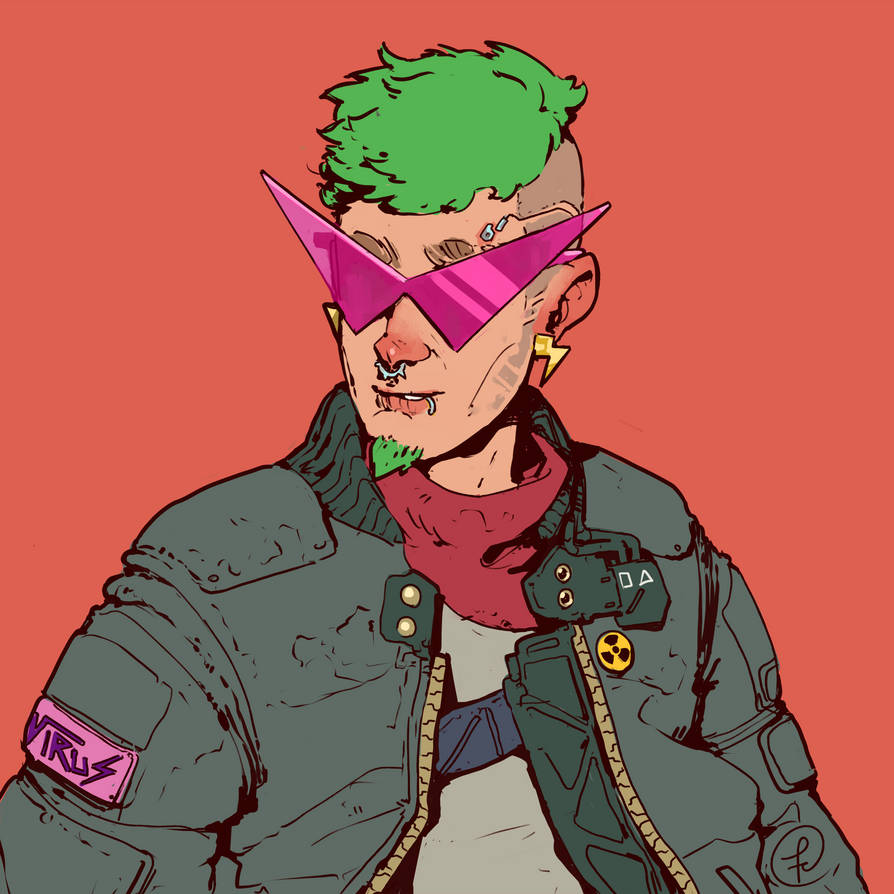

# 4rc0l061a de Nottingham **La arcología de Nottingham**

\sincolumna

Bosque Sh3rW00d es una ambientación CiberPunk para Savage Worlds en un mundo extrañamente parecido a las historias de Robin Hood o Ivanhoe.

Formarás parte de un grupo de descastades que sobreviven ocultos en el megacomplejo Nottingham. Lucharás por tu supervivencia y tu libertad contra la directora J0hn, una malvada IA que está a cargo del complejo.

J0hn rige Nottingham siguiendo unos protocolos que buscan maximizar los beneficios para la compañía sin importar lo que les pase a los habitantes del complejo. Todos recuerdan a la antigua, legítima y benevolente directora R1c4rd y esperan su regreso del proyecto del departamento de armamentística a la que fue asignada por la compañía. 

Arrambla con equipo y materiales, libera a cautives, haz pintadas contra la directora J0hn, haz duelos sobre el Trent, escapa de los sheriffs de Nottingham, bátete en duelo contra pintoresques personajes, ... 

Pero recuerda, lo más importante es **robar a los ricos para repartirlo entre los más pobres**.

## El mundo actual

\concolumna

```
xxx
```

xxx

### Nottingham

Nottingham es una gigantesca arcología donde viven cientos de miles de personas, creada hace más de 2 siglos por la compañía para sus empleades. xxx

xxx

### El bosque de Sh3rW00d

El bosque, cuyo primer sector tiene el código Sh3rW00d, es la parte de la arcología que no se llegó a terminar. Se le llama el bosque porque la zona está compuesta con salas y salas llenas de miles y miles de columnas sin nada más. Las columnas de color marrón parecen los troncos de árboles y nanitos de construcción han ido creando sobre ellos extrañas estructuras de material orgánico que le dan aún más aspecto vegetal.

xxx

### Las directoras

Las directoras son potentes IA que controlan Nottingham y tratan de que todo sea lo más beneficioso económicamente hablando para la compañía. xxx

xxx

\saltopagina

#### Directora J0hn y sus sheriffs

xxx

#### Directora R1c4rd

La directora R1c4rd es la anterior IA de Nottingham que fue trasladada al departamento de armamentística de la compañía. Se dice que era, a diferencia de la directora J0hn, justa y magnánima con les notis. Se recuerda con cariño los años de dirección de R1c4rd y se sueña con su regreso cuando ya no sea necesaria en el departamento bélico de la compañía.

xxx

\saltocolumna

\saltopagina

\sincolumna

## Orden social

\concolumna

```
Las gentes que viven en Nottingham son conocidas como notis. xxx
```

xxx

### Blus (Nobleza)

xxx

### Influencers (Iglesia)

Dentro del sistema neofeudal que rige la arcología, hay un grupo de Influencers adictos a la directora J0hn que marcan la vida de los _notis_. Ellos establecen las modas, lo que es _cool_ y lo que no, lo que se debe hacer y lo que no y, al final, lo que está bien y lo que está mal.

Además, señalan a los disidentes y los excluyen socialmente, de forma que sus acciones y proclamas contra el sistema son muchas veces rechazadas, desacreditadas y olvidadas.

También son usados como una forma de ocultar los fallos y errores de la compañía, desviando la opinión pública hacia temas intrascendentes y vacuos.

xxx

### Curris (Plebe)

xxx

\saltocolumna

### Boskis (Fuera de la ley)

xxx

\saltopagina

\sincolumna

## Comercio e industria

\concolumna

```
xxx
```

xxx

### Formas de pago

No existe moneda física, todo son transacciones electrónicas a través del sistema monetario de la empresa. Así que se ha impuesto el trueque tanto de productos como de servicios cuando se quieren hacer actividades por debajo del radar del la Directora J0hn.

#### Trueque

El hecho de que la directora R1c4rd controle toda la economía de Nottingham ha hecho que florezca una economía sumergida y circular basada en el trueque de productos y el intercambio de trabajo.

Los truques van desde cosas muy simples y del día a día como "tú arreglas el grifo de mi cubículo, yo te doy dos botes de mi salsa barbacoa casera" a trueques más complejos que incluso incluyen pagarés en papel (para no quedar registrados electrónicamente). Es curioso porque esos pagarés se han convertido en una especie de papel moneda que no se cobran si no que se intercambian una y otra vez y varían de valor según las circunstancias y lo que ofrezca el pagaré.

### Granjas y piscifactorías

xxx

### Teletrabajo

xxx

En vez de oficinas físicas, existen oficinas virtuales que simulan el ambiente de una oficina, xxx

A todos estos teletrabajadores se les llama en argot pijameres, por la broma de que están todo el día en pijama, aunque en sus versiones virtuales salgan con el apropiado uniforme de la empresa.

En el ciberpunk clásico era muy común las escenas de alienantes oficinas en las que miles de personas trabajaban en cubículos frente a ordenadores. En esta ambientación hemos introducido el concepto de teletrabajo de forma que ya no existen megaedificios en los que entran y salen miles de personas al día para trabajar en la megacorporación. Aquí cada trabajadore está en su casa aislado físicamente, pero hiperconectade vía redes. xxx

Muchos de estes teletrabajadores desarrollan fobias sociales y problemas de intimidad al solo conocer lo que es contacto virtual con otros seres humanos.

### Publicidad y cartelería

A diferencia de otras ambientaciones ciberpunk, en Bosque Sh3rW00d no existe casi publicidad. No hay grandes pantallas mostrando anuncios 24 horas y neones parpadeantes en las entradas de los locales.

\saltopagina

Para empezar la compañía vende casi el 90% de los bienes de consumo y no tiene competencia, por lo que la directora R1c4rd, decidió quitar ese gasto e invertirlo en guarderías gratuitas.

Por otro lado no hay grandes espacios abiertos con miles de personas de paso donde colocar esas macro pantallas publicitarias.

De hecho, solo existe una pantalla gigante en la plaza mayor donde se publican los edictos de la compañía y donde la directora J0hn hace sus apariciones públicas.

Los pequeños negocios funcionan con el boca a boca y se suelen identificar con complejos emojis hechos con algas bioluminescences en sus entradas.

Es normal ver soportes publicitarios humanos o robots portando carteles digitales por las inmediaciones del local del anunciante. Esto es debido a que la directora J0hn prohibió el uso de las paredes y otros elementos de la arcología como soporte artístico y publicitario en su lucha contra les grafiteres que ponían consignas contra ella y la compañía.

\saltocolumna

\saltopagina

\sincolumna

## Vida diaria

\concolumna

```
xxx
```

xxx

### Vida de interior y clima

El clima, si se le puede llamar así, es siempre igual durante todo el año. La temperatura de la arcología es de entre 23 y 25 grados con una humedad relativa de entre 45% y 60%. La nieve, la lluvia o el viento son conceptos que conocen, pero que muy pocos han experimentado y normalmente de forma muy tangencial. Alguno sabrá como puede ser la lluvia, por ejemplo, al saltar los aspersores anti-incendios, o la nieve y el frío al estropearse los sistemas de climatización y generar demasiado frío e incluso hielo.

#### Sin cielo y sin horizonte

Les habitantes de Nottingham no conocen lo que son los espacios abiertos, no saben lo que es mirar al cielo o ver el horizonte. Solo están acostumbrados a espacios cerrados de no más de 30 o 40 m². El mayor espacio abierto de Nottingham es la plaza Mayor, tan abierto que hay notis que tienen agorafobia.

Claramente, no hay ni puesta ni salida de sol. Muchos sistemas simplemente pasan de modo diurno a modo nocturno para seguir los ciclos de sueños de les residentes del complejo. Para paliar esa falta de luz solar, la compañía instala focos ultravioletas que se encienden en modo diurno. Esto junto a buenos suplementos de vitamina D en todos los alimentos evitan el raquitismo y otras enfermedades óseas.

#### Incendios

Los incendios son lo más peligroso que pudiera pasar en Nottingham y es por ello que hay sistemas anti-incendios en todas partes. La directora J0hn es muy escrupulosa en el cumplimiento de la normativa anti-incendios y tiene a gente testando los sistemas anti-inciendo en todas partes.

Hace décadas que un incendio no ha afectado a más de un espacio. Y eso deja claro la efectividad de los sistemas y sus encargades de mantenimiento.

Por desgracia, puede tocarte un simulacro de incendios en cualquier parte y acabar mojado por la fétida agua de los aspersores. En realidad sería como esos días que sales a la calle y te pilla un chaparrón.

### Cultura y contracultura

xxx

### Ocio y entretenimiento

xxx

### Gastronomía

La base de la gastronomía se basa en las algas producidas y procesadas en la algafactoria del Trent. A partir de estas algas se crean todo tipo de productos alimenticios como formas y sabores muy variados.

\saltopagina

El precio de estos productos de alga es relativamente bajo y accesible a todos los bolsillos. En teoría tienen todo lo necesario para una dieta saludable, pero hay estudios que dicen lo contrario.

Mientras que la gente mayor prefiere la comida con forma y sabor a carnes y verduras de toda la vida, para cocinarlas según las recetas de toda la vida, las nuevas generaciones están adoptando una cocina basada en las algas sin procesar o simplemente triturarlas y convertirlas en batidos de proteínas. Esta moda es uno de los planes de la directora J0hn para mejorar los beneficios de la compañía; menos procesamiento, que convirtieron en casi dogma de fe para muchos _notis_.

En respuesta a todo esto, bastantes grupos alternativos han empezado a dar gran importancia a los cultivos hidropónicos para cultivar tu propia comida en casa y se ha hecho muy popular, tener varias plantas de frutas y hortalizas. Todos estos productos frescos se han convertido en parte de la economía de trueque y las semillas se han convertido en objetos muy valiosos.

Cómo ya hemos dicho otras veces, en el bosque es todo al revés, los productos frescos hidropónicos son la base de la alimentación al no tener un acceso directo a las algas. xxx

De hecho los sheriffs vigilan muy mucho los almacenes y las fábricas de productos y suministros hidropónicos porque saben que los _boskis_ suelen atacarlos.

Los restaurantes xxx

La comida callejera, como el espacio es un lujo, se ha convertido en gente con armazones metálicos en los que tienen fuegos y donde te preparan la comida. Estos cocineros ambulantes llenan de olores todo el complejo, sobre todo los barrios más pobres y las zonas industriales y de talleres.

Quizás lo más interesante gastronómicamente hablando de toda la arcología es la llamada **Olla de Gumbo de la Mamá Claire en la zona Baja**. Es una olla de comida comunal gestiona por Mamá Claire. Lleva sin apagarse y dando de comer a les hambrientes desde hace 15 años, cuando una hambruna hizo que Mamá Claire sacara una olla de gumbo a la calle y empezará a cocinar para sus vecines. La gente traía los pocos alimentos que tenían para echarlo a la olla y así Claire seguía cocinando. Y así ya lleva 15 años removiendo su gumbo, que es considerado una auténtica exquisitez de la comida popular.
 
### Religiones y sectas

xxx

### Fiestas, celebraciones y otros eventos

xxx

Todos los años, en el día en que se puso la primera piedra del complejo, se organiza un festival con concurso de disparo con tirachinas con un suculento premio. xxx

### Deporte

El deporte se ha adaptado a la vida en la arcología gracias a las últimas tecnologías, hablamos de bicicletas estáticas o cintas de correr con realidad virtual o el hockey de pasillo, una versión mini del hockey sobre hierba. También son famosos los concursos de baile acrobáticos y las competiciones de tiro con tirachinas. 

\saltopagina

#### Hockey de pasillo

El hockey de pasillo es el rey de los deportes en Nottingham. Es un hockey sobre hierba adaptado a 3 jugadores al interior del complejo. Se juega en recintos cerrados como pasillos y galerías en equipos de 4 (parabol, pasabol, lanzabol y un suplente). Cada encuentro dura 5 rondas de 7 minutos.

Gana el equipo que más goles meta o el que consigue marcar en 3 rondas seguidas sin que su oponente le marque (llamado en el argot deportivo "baño").

Uno de los elementos más interesantes del hockey de pasillo es el campo de juego. Según el reglamento oficial puede ser cualquier pasillo de la arcología que tenga un mínimo de 40 m² usando dos puertas del pasillo como porterías. 

Las puertas que no tienen que ser del mismo tamaño ni tener unos mínimos o máximos, así que es importante ganar el sorteo inicial para elegir la portería más ventajosa. Aunque se cambie cada ronda, al ser 5 estarías 3 en la buena y 2 en la mala.

En los partidos oficiales de liga se elige al azar el campo de entre todos los corredores, galerías, pasillos y pasajes que cumplan las indicaciones. 5 minutos antes de empezar se desaloja el pasillo y entran les jugadores a calentar.

Los partidos son retransmitidos a través de las cámaras de vigilancia del pasillo. Se cierran todos los accesos al pasillo, excepto para personal sanitario y los suplentes.

Debido al poco espacio del campo, los partidos son arbitrados desde fuera usando las imágenes de las cámaras de seguridad y hablando por los altavoces. Por la misma razón, los entrenadores, si se tienen, siguen el partido por las cámaras de seguridad y dan las órdenes también por la megafonía.

El juego es más de habilidad para moverse entre espacios pequeños, de saber mover la bola y aprovechar los rebotes que de fuerza física, ya que no hay espacio para golpear a tu contrincante con el stick o para coger carrerilla.

Reglamento general:

* Solo se puede tocar la pelota con el stick.
* No se puede golpear a otro jugador con el stick.
* La pelota puede rebotar contra cualquier cosa del terreno de juego.
* Si cometes una falta, debes soltar tu stick y no moverte los segundos de castigo. Tus compañeres y tus adversaries puede usarte como protección, obstáculo, etc. mientras estás en la falta.

Hay gran cantidad de equipos amateurs en la arcología, pero solos 12 profesionales en la Liga de Hockey de pasillo. Estos equipos tienen patrocinadores, remuneraciones, buen equipamiento, entrenadores, gimnasios, etc. Los más famosos suelen acabar de influencers de la directora J0hn, haciendo reels y directos para les fans de este deporte.

El hockey de pasillo atrae muchas apuestas ilegales controladas por las mafias y la sombra de los amaños siempre ha sobrevolado el hockey de pasillo profesional.

\saltopagina

**Semilla de aventura:** Un pequeño equipo de hockey de pasillo ha dado el campanazo este año, pueden hasta ganar la liga. Pero necesitan guardaespaldas que les protejan, ya que hay gente que quiere impedir que lleguen a la final.

### Sexo y género

xxx

### Títulos nobiliarios

xxx

\saltocolumna

\saltopagina

\sincolumna

## Leyes y justicia

\concolumna

```
La compañía tiene el control de la justicia y del sistema penal de Nottingham, pero tuvo que firmar ciertos contratos con garantías de que será justa e imparcial. 
```

La compañía tuvo que establecer una serie de leyes que regirían el funcionamiento de Nottingham cuando adquirió la concesión de construcción y explotación de esta arcología. xxx

### Los juicios

Las directoras tienen el privilegio de juzgar a todos los habitantes de Nottingham y su decisión no es recurrible. Pero eso genera mucho consumo de ciclos y solo juzgan casos importantes. El resto de crímenes son juzgadas por "las 3 sabIAs".

Las 3 sabIAs son 3 IA de cualquier tipo (siempre que cumplan unos mínimos de inteligencia y razonamiento) que son seleccionadas una por la defensa, otra por la acusación y una tercera al azar entre todas las IA de Nottingham.

Las IA escuchan a las partes, estudian las pruebas y dan un veredicto. El veredicto debe ser unánime. Los 3 votos deben ser iguales, lo cual es curioso, ya que una de las IA es de la defensa y otra de la acusación y no deberían coincidir nunca, pero discuten a miles de megaherzios y terminan llegando a un acuerdo. Como no tienen muchos de los sesgos humanos suelen llegar a veredictos bastante justos y equitativos.

\saltocolumna

Les mejores abogades van detectando las IA que más posibilidades tienen de llevarse al resto a su campo.

Durante el juicio que dura entre 12 y 24 horas las IA solo pueden trabajar en el juicio. No es la primera vez que los ascensores de una sección dejan de funcionar porque su IA tiene un juicio.

**Semilla de aventura:** Tu banda recibe el soplo que la IA de seguridad de un importante centro de datos tiene que participar en un juicio. Puede ser una oportunidad buena para conseguir nuevos códigos de acceso, mapas de instalaciones, etc. un buen botín de datos.

### Penas

xxx

#### Trabajos forzados

xxx

\saltopagina

\sincolumna

## Bajos fondos y crimen organizado

\concolumna

```
xxx
```

[](https://www.deviantart.com/fernand0fc/art/Pandillero-743621901 "Pandillero By Fernand0FC")

xxx

\saltocolumna

\saltopagina

\sincolumna

## Les instaladores

\concolumna

```
Les instaladores son les constructores primigenies de Nottingham que abandonaron la arcología antes de terminarla, como demuestra la existencia del bosque. La compañía se los llevó de Nottingham hace ya 80 años y no se sabe por qué, pero no es raro encontrar su tecnología, que, aun teniendo muchos años de antigüedad, es todavía muy superior y es muy apreciada y codiciada.
```

xxx

### Tecnología de les instaladores

La tecnología de les instaladores se basa principalmente en los nanobots. Miles de microrobots conectados que construyen los diseños de les instaladores. No solo construyen nuevos pisos de la arcología, sino que también reparan, restauran y mantienen los pisos viejos.

xxx

### Los nanitos después de la marcha de les instaladores

Cuando les instaladores se fueron por orden de la compañía, se llevaron los nanobots, pero no todos. Muchos de los nanitos de zonas en construcción quedaron huérfanos y sus firmwares desactualizado empezaron a fallar o a funcionar por su cuenta y siguieron construyendo ahora con materiales reciclados de origen biológico. Así es como el bosque obtuvo su nombre, al crearse estructuras orgánicas a las columnas techos, suelos y paredes del bosque.

\saltocolumna

xxx

### La búsqueda de la contraseña de SU

Les buscadores de la contraseña de SU, abreviando les buscadores, son un grupo de personas que creen que les instaladores dejaron en alguna parte un password de "superuser" que al usarlo activará en la arcología una serie de sistemas escondidos que acabarán con el mal y las injusticias del mundo actual.

xxx

\saltopagina

\sincolumna

## El mundo exterior

\concolumna

```
Una regla fundamental de esta ambientación es que es imposible salir al exterior de la arcología. El exterior es algo de lo que se habla, pero que la gente no ha visto nunca.
```

xxx

\saltocolumna

***

# |-|15t0r14 **Historia**


\sincolumna

## La creación de Nottingham

\concolumna

```
La "primera piedra" de la arcología conocida como Nottingham se colocço hace ya unos 200 años.
```

En realidad nunca se puso una primera piedra, sino que todo empezó con un gigantesco pozo perforado en la roca en el que se vertieron toneladas y toneladas de nanitos constructores. Les instaladores lanzaron sus programas de construcción y los nanitos empezarón a construir el complejo usando los materiales que se les suministraban y xxx

xxx

\saltocolumna

\saltopagina

\sincolumna

## El éxodo de les instaladores

\concolumna

```
xxx
```

xxx

\saltocolumna

\saltopagina

\sincolumna

## La dirección de R1c4rd

\concolumna

```
xxx
```

xxx

\saltocolumna

\saltopagina

\sincolumna

## La dirección de J0hn

\concolumna

```
xxx
```

xxx

\saltocolumna

\saltopagina

\sincolumna

## El bosque de Sh3rW00d

\concolumna

```
xxx
```

xxx

\saltocolumna

***

# Я36|45 **Reglas**

\sincolumna

## Creación de personajes

\concolumna

```
En Bosque Sh3rW00d hay una serie de reglas que modifican las reglas generales de creación de PJ que se establecen en el libro básico de savage Worlds Ed. Aventura.
```

Recuerda que todos les PJ son de raza humana con lo que tienes una ventaja adicional a la hora de crearlo.

### Hijes de la tecnología

Vives rodeado de tecnología las 24 horas del día. Quieras o no, sabes usar todo tipo de aparatos eléctricos y ordenadores.

> Todes les personajes **empiezan con Electrónica d4 y Ordenadores d4**.

### La ciencia mató la magia

A no ser que quieras darle un toque paranormal, **Ocultismo desaparece** de las habilidades elegibles. También **desaparecen las habilidades como Hechicería, Ciencia Extraña, Fe, etc. y las ventajas de poder** que tienen un carácter mágico.

Aun así recuerda que por ejemplo en la trilogía de Sprawl de William Gibson, el vudú estaba integrado dentro de las creencias de los ciberjinetes. Puede que en lo más profundo de la red haya espíritus y otros seres que la informática no pueda explicar. 

\saltocolumna

[](https://www.deviantart.com/fernand0fc/art/HeadShots-743989425 "HeadShots By Fernand0FC")

### Espacios cerrados

Se recomienda **no ponerse ventajas de pistolero**, ya que el acceso a las armas de fuego es muy limitado. Además todas las aventuras, de normal, transcurren en espacios muy muy cerrados, donde es bastante fácil que entres en combate cuerpo a cuerpo con lo que tu arma de fuego es una desventaja.

**Tampoco son útiles habilidades como Cabalgar**, ya que no hay animales que montar, ni Pilotar, ya que no hay aeronaves ni barcos que usar. El pilotaje de drones y similares se haría con Electrónica. **Supervivencia es sustituida por Pasillear**, su versión urbana para la arcología.

**Mal nadador desaparece como desventaja**, debido a que no hay casi grandes masas de agua donde nadar sea importante. 

\saltopagina

Como ya hemos dicho, no hay animales, **Vinculo Animal y Señor de las bestias tampoco se pueden escoger**.

### Idiomas

El inglés es el idioma predominante en Nottingham, asi que es no hay problemas de comunicación entre personas y máquinas. Puede encontrarse libros u objetos con textos en otros idiomas, pero no debería ser difícil conseguir traducciones más o menos buenas.

> Empiezas con la habilidad **Idioma Inglés a nivel de tu Astucia y un d4 en Idioma Leet**.

### Secretos

Los secretos es algo muy común entre les personajes de las historias de Robin Hood. Robin es un noble, Scarlet es un hermanastro de Robín o Marian se disfraza de hombre para ayudar a los pobres. He querido trasmitir esa esencia con esta regla de creación de personajes. 

> Tode personaje debe **tener un Secreto (mayor o menor)** entre sus desventajas.

\saltocolumna

### Ciberimplantes

Los ciberimplantes son algo común entre les _notis_, sobre todo desde que la compañía ofrece implantes gratis para mejorar tu productividad. La compañía solo financia implantes legales y que estén relacionados con la profesión de su empleade.

> Opcionalmente, puedes tener un **implante cualquier tipo, pero solo de valor 1 y legal**.

### Hackeos de les instaladores

Si no has caído bajo el influjo de la compañía y sus tretas, seguramente hayas aprendido algún hackeo de les instaladores.

> Elige un hackeo que tenga como requisito Novate de la lista de hackeos de les instaladores, si no has elegido ninguno de los ciberimplantes que te ofrece la compañía.

Los grupos underground de Nottingham usan un lenguaje escrito llamado Leet que busca complicar a las máquinas el reconocimiento de textos. Se intercambian caracteres por otros de forma similar como "A" por "4" o "S" por "$", de forma que las máquinas tengan problemas al leerlo, pero tú puedes interpretarlo fácilmente.

\saltopagina

\sincolumna

## Arquetipos

\concolumna

```
A la hora de crear tu PJ te presentamos algunos arquetipos que te ayuden a construirlo. es importante tener en cuenta que las aventuras de robin Hood siempre hablan de personajes parias y fuera de la ley y he seguido esa idea al diseñar estos arquetipos.
```

También puedes crear los tuyos propios, pero recuerda que el espíritu del juego es que estén al otro lado de la ley o muy cerca.

### Biker

Estes mensajeres recorren todo el complejo de Nottingham llevando todo tipo de sobres, paquetes, etc. a todo tipo de personas. No hacen preguntas y sus bocas están selladas sobre qué, de quién y para quién han hecho un encargo.

Te mueves rápide y nunca estás mucho tiempo quiete en un mismo sitio. Por así decirlo, si estas parade, es que eres un cadáver. 

* **Habilidades recomendadas:** Conducir (e-bike), Pasillear y Reparar
* **Ventajas recomendadas:** As, Mr. Arreglalotodo y Manos firmes
* **Desventajas recomendadas:** Impulsive, Leal y Pobreza


### Buscadore

Les buscadores son un grupo de personas que creen en un mundo mejor y han jurado conseguirlo.

\saltocolumna

Según sus creencias, les instaladores dejaron en alguna parte un password de _superusuario_ que al usarlo activará en la arcología una serie de sistemas escondidos que acabarán con el mal y las injusticias del mundo actual.

No tienes por qué creerte todo ese rollo, pero igual estás segure de que hay algo escondido en la arcología que vuelva a poner las cosas a como estaban con la directora R1c4rd. 

* **Habilidades recomendadas:** Investigar, Intimidar y Notar
* **Ventajas recomendadas:** Ardor, Campeone e Investigadore
* **Desventajas recomendadas:** Heróique, Juramento y Obsesión

### Erudite

Les erudites engloban a toda persona que se centra su forma de vida en el estudio y el descubrimiento científico. Todas las ramas de las ciencias y de las letras pueden ser su objeto de estudio. 

Mientras que algunos de tus compañeres se han vendido a la compañía, tú sabes que el conocimiento puro debe ser libre de interferencias de cosas como el capitalismo. Tus descubrimientos deben ayudar a la humanidad, no a hacer dinero. 

* **Habilidades recomendadas:** Ciencias, Humanidades y Medicina
* **Ventajas recomendadas:** Curandere, Erudite e Investigadore
* **Desventajas recomendadas:** Caute, Curiose y Despistade

\saltopagina

### Grafitere

Este arquetipo refleja todo tipo de personajes que llevan la confrontación contra la compañía a las calles, no solo en forma de grafitis. También con actos de vandalismo callejero, pequeños sabotajes y sentadas.

Tu principal problema es que tus actos, sin una figura carismática que te dirija, muchas veces no son más que simples gamberradas.

* **Habilidades recomendadas:** Atletismo, Pasillear y Sigilo
* **Ventajas recomendadas:** Acróbate, Alerta y Parkour
* **Desventajas recomendadas:** Exceso de confianza, Heróique y Suspicaz

### Influencer en desgracia

[](https://www.deviantart.com/sokoistrying/art/Mire-989919510 "Mire By sokoistrying")

Fuiste parte del selecto grupo de influencers que rodean a la directora J0hn. Estabas en la cima de la pirámide social, hasta que un día cometiste un error y caíste en desgracia.

\saltocolumna

Puede que criticases a la directora J0hn, fueras parte de algún tipo de trampa ilegal o simplemente te posicionaste de les débiles y oprimides.

Ahora malvives de favores y por la nostalgia de tus seguidores más fieles y a veces bastante obsesivos.

* **Habilidades recomendadas:** Interpretar, Intimidar y Persuadir
* **Ventajas recomendadas:** Carismatique, Famoso y Rique
* **Desventajas recomendadas:** Bocazas, Exceso de confianza y Habito (alcohol, drogas, etc.)

### Nacide libre

Estás a otro lado de la ley y de la sociedad desde tu nacimiento. Naciste en el bosque y por tanto careces de tu HUB de conexión.

Eso supone que no puedes moverte normalmente por la arcología como cualquier _noti_ y tienes que buscarte la vida para moverte por ella para conseguir recursos.

Por otro lado no existes para empresa y eso es un gran valor.

* **Habilidades recomendadas:** Electrónica, Pasillear y Reparar
* **Ventajas recomendadas:** Persona de recursos, Osade y Sentir el peligro
* **Desventajas recomendadas:** Joven, Marginade y Nacide Libre (obligatorio)

\saltopagina

### Paramedic

Este arquetipo refleja un amplio grupo de profesionales de la medicina capaces de curar y remendar todo tipo de golpes y heridas.

Te debes a tu juramento hipocrático, que está por encima de cualquier otra cosa. Nada hará que no lo cumplas, ni la propia directora J0hn en persona podría.

* **Habilidades recomendadas:** Ciencias, Medicina y Notar
* **Ventajas recomendadas:** Curandero, McGyver y Osado
* **Desventajas recomendadas:** Bocazas, Juramento y Exceso de confianza

### Periodiste

Dentro de este arquetipo se incluye a todo tipo de buscavidas que saben moverse por los bajos fondos y eludir a la ley para llegar al corazón de la noticia.

Tu medio siempre será _underground_, fuera de los canales oficiales que están pagados por la directora J0hn. Escribes en su blog, hablas en un podcast o lanzas a la red todo tipo de videos.

Sabes que el escándalo y el morbo vende y es la única manera de que tu contenido se viralice. Por eso siempre rodeas a tus denuncias de una capa de periodismo amarillo.

* **Habilidades recomendadas:** Investigar, Latrocinio y Notar
* **Ventajas recomendadas:** Conexiones, Investigador/a y Electrónica
* **Desventajas recomendadas:** Curioso, Impulsivo y Obsesión

### Sindicade

Este arquetipo reúne a todo tipo de trabajadores durante alienados que ha descubierto como la compañía oprime a los _notis_ y busca luchar contra esta injusta situación.

Puedes ser cualquier tipo de trabajador, siempre que busques la caída de la compañía y de la directora J0hn como su máxima representación.

* **Habilidades recomendadas:** Electrónica, Intimidar y Reparar
* **Ventajas recomendadas:** McGyver, Mr. Arreglalotodo y Sindicade
* **Desventajas recomendadas:** Bocazas, Leal y Tozude

&nbsp;

[](https://www.deviantart.com/kernspalt/art/Cyberpunk-reporter-856952409 "Cyberpunk reporter By Kernspalt")

\saltopagina

\sincolumna

## Nuevas habilidades

\concolumna

```
Bosque Sh3rW00d es una ambientación ciberpunk tremendamente urbana lo cual implica cambios en las habilidades básicas de savage Worlds.
```

Como ya se ha dicho en la creación de personajes, **desaparecen Ciencia Extraña, Fe, Hechicería, Ocultismo y Psiónica**.

### Pasillear (Astucia)

Pasillear viene a sustituir a Supervivencia. Esta habilidad permite al personaje encontrar elementos como cables de red o electricidad o tuberías de agua, gas o climatización, paneles de control, centros de datos o puntos de conexión. Puede emplearse también para orientarse en los pasillos y cubículos de la arcología, leer mapas y buscar rutas de escape seguras.

A diferencia de Supervivencia, no se puede usar para seguir rastros, ya que en tornos urbanos no se dejan muchas huellas. Pero se puede usar para perseguir gente, buscando rutas alternativas, caminos más o menos usados, trochas y atajos, etc. A la hora de seguir a una persona se puede usar Pasillear en vez de Sigilo.

En persecuciones, en cada ronda puedes gastar tu acción para buscar la mejor ruta tirando Pasillear. Un éxito en la tirada supone un +1 a las tiradas de maniobras de tu conductor. Solo une pasajere puede realizar esta acción por ronda. 

\saltocolumna

### Idiomas

En la arcología de Nottingham se habla principalmente inglés, pero hay pequeños grupos que mantienen sus propios idiomas.

#### Leet

Los grupos underground de Nottingham usan un lenguaje escrito llamado Leet que busca complicar a las máquinas el reconocimiento de textos. Se intercambian caracteres por otros de forma similar como "A" por "4" o "S" por "$", de forma que las IA y los constructos tengan problemas al leerlo, pero tú puedes interpretarlo fácilmente.

 Hello World")

Cuando necesites dejar un mensaje escrito o escribir un grafiti y que las IA no lo reconozcan e interpreten, puedes tirar Leet. Tu tirada será la dificultad para las máquinas (con la capacidad especial IA o Constructo) para entender tu mensaje. Deberán hacer una tirada de Astucia o Leet (en caso de saberlo) para entender el texto.

\saltopagina

\sincolumna

## Nuevas ventajas

\concolumna

```
Esta ambientación es un mundo difícil, pero hay una serie de ventajas propias que pueden serte de gran ayuda. Estas ventajas se centran más en temas sociales y legales que en tecnología, combate o cibernética, que son tan típicas de las ambientaciones ciberpunk.
```

Como ya hemos dicho, no hay animales, con lo que **Vinculo Animal y Señor de las bestias no se pueden escoger**.

### Alijos

**Requisitos:** Novate

Mientras que la ventaja Rique/Extremadamente Rique te ofrecen riquezas, tienen el problema de que están controladas por la compañía. Son rastreables y no se pueden usar en los bajos fondos y en situaciones ilegales.

Alijos te ofrece esa riqueza al otro lado de la ley. Tienes grandes cantidades de dinero en forma de alijos pueden ser objetos de valor, cupones de trueques, etc. Lo más importante es que es dinero que no está controlado por la empresa y se puede usar en actividades que no controla la compañía y/o de carácter ilegal.

> **Alijos funciona como Rique** salvo que solo se puede usar en temas ilegales o cuando no se quiera que las transacciones comerciales sean rastreables.

\saltocolumna

[](https://www.deviantart.com/mindofjen/art/ERROR-622951034 "ERROR By mindofjen")

### Identidad glitcheada

**Requisitos:** Novate, no puede tenerse Nacide Libre

Por alguna extraña razón, tu identidad a veces falla. Alguna vez tienes problemas al hacer pagos o cobrar tu sueldo. Lo interesante es que muchas veces los sistemas de reconocimiento y vigilancia no logran detectarte o te toman por otra persona. 

Si un sistema informático o intenta hacer un simple control de tu identidad funciona perfectamente o igual falla y a la segunda vez funciona perfectamente.

\saltopagina

El problema lo tienen los sistemas de seguridad y vigilancia, hacen tantos chequeos por microsegundo de tu identidad que terminan fallando y ralentizándose y terminan tomándote por otra persona o simplemente te ignoran.

> Todos los **sistemas de seguridad e IA de vigilancia tienen un -2 a la hora de detectarte e identificarte** (Notar, Investigar o incluso Disparar). Si fallan suelen considerarte inexistente o te asignan otra identidad.  

### Necesarie para la compañía

**Requisitos:** Novate

Por alguna razón eres necesario para la compañía y no puede permitirse que desaparezcas. Quizás tus habilidades son muy valoradas o únicas, estás protegido por alguien importante o hay algo en ti que la compañía busca. Sea lo que sea, todas las IA y les secuaces de la compañía tienen órdenes de no dañarte, pueden intentar noquearte o inmovilizarte, pero deben evitar hacerle daño.

De normal **esta ventaja debería tener un Secreto** que explique por qué eres necesarie para la compañía.

> Todos los agentes de la compañía (humanos, constructos e IA) **deben pasar una tirada de Espíritu para tratar de dañarte**. Si fallan tendrán que cambiar su acción e intercambiarla por otra no dañina.

\saltocolumna

### Sindicade

**Requisitos:** Reparar d6

El sindicalismo está prohibido por la compañía. Mientras que la directora R1c4rd lo permitía de forma no oficial, J0hn la ha perseguido con todos sus recursos y aplicando las penas máximas.

Aun así, el movimiento está más fuerte que nunca sobre todo en las clases sociales más bajas. Todo esto es gracias a sus interacciones con otros grupos fuera de la ley como _boskis_.

Ser un cargo importante del sindicato debería venir con un Secreto, mayor o menor según el cargo.

Los sindicades siempre se apoyan (en temas laborales y de derechos), se ayudan y se cubren. No tienen por qué dar la vida por ti, pero arriesgarán lo mismo que arriesgues tú.

> A parte de las ventajas de pertenecer a un grupo fuerte y unido, puedes **acceder a productos ilegales no controlados por las mafias** (drogas, estimulantes o implantes letales) como ciberimplantes ilegales que no sean de combate o materiales de hackeo.

\saltopagina

\sincolumna

## Nuevas desventajas

\concolumna

```
Esta ambientación es un mundo muy especial que claramente va a tener sus desventajas propias. Estas desventajas reflejan esa extraña mezcla que representa Bosque Sh3rW00d.
```
Para empezar hay una serie de modificaciones en las desventajas de Savage Worlds:

* **Manazas se convierte en una desventaja mayor.** En un mundo hipertecnificado ser manazas con la tecnología es una desventaja mayor.
* **Desaparece Mal nadador** por falta de grandes superficies de líquido.

Estas desventajas permiten darle un toque ciberpunk a tus personajes.

### Ciberalergia (mayor)

La capacidad de tu cuerpo aceptar ciberimplantes es mucho menor que el del resto de las personas.

> A todos **los costes de puntos de ciberimplantes debes sumarle 1 punto extra** por tu alergia. Si una persona normal gasta 2 puntos de ciberimplantes en ponerse un implante que le otorga Reflejos de combate, tú gastas 3 puntos. Lo bueno es que tu cuerpo combate la tecnología y tienes +1 a las tiradas de Vigor contra cosas como nanitos que se metan en tu organismo.

### Ciberparanoia (mayor/menor)

Tienes la insana convicción de que las IA te vigilan, te siguen y, lo peor de todo, crees que están contra ti. Siempre estás vigilando todo tipo de aparato y sistema electrónico a tu alrededor, esperando detectar algún elemento que delate que las IA te están escuchando y conspirando a tus espaldas.

> Como **desventaja menor, tienes un -1 en todas las tiradas de habilidad que exijan concentración** (como abrir cerraduras, jugar a las cartas, descifrar un código, …) cuando haya elementos de vigilancia a tu alrededor que es casi siempre. Si se toma **como mayor, además, el -1 se aplicará a todas las tiradas de percepción (Notar e Investigar)**, ya que estarás más preocupado en que no te vigilen y espíen las IA que en vigilar o buscar a tus objetivos. Por otro lado, conoces a tu enemigo, así que obtienes un bono (+1 menor, +2 mayor) a Electrónica al tratar con sistemas electrónicos de vigilancia, rastreo y seguridad.   

### Fobia social (mayor/menor)

La fobia social, conocido también como trastorno de ansiedad social (TAS), es un trastorno de ansiedad caracterizado por un miedo persistente a una o más situaciones sociales por temor a que resulten embarazosas.

\saltopagina

Dar discursos en público, participar en concursos, desfilar por una pasarela, etc. se vuelven tareas muy complicadas, aunque tampoco llevas bien las reuniones sociales en las que tendrá que relacionarse (fiestas, eventos, etc.) o los encuentros inesperados con conocidos, familiares, amigos, etc.

Nottingham tiene una altísima densidad de población, lo cual hace que las situaciones de fobia social sean muy normales. También gracias a la tecnología se puede estar en todas partes sin estar realmente.

> **No puedes gastar benis cuando estás rodeade de demasiada gente** observando y juzgando lo que haces.

### Imán de lo extraño (menor)

Todo lo extraño se siente atraído hacia ti para bien y para mal. No es algo que busques, simplemente es algo que pasa. A veces es una bendición y otras una maldición, pero la mayoría de las veces es un fastidio.

Seguro que caerás por la esclusa que lleva a la madriguera del cocodrilo albino que nadie creía que existís, abres el armario donde le influencer guarda sus útiles fetichistas o se te cae una probeta llena de nanitos que te tiñen la cara de azul.

> Cuando haya que hacer **tiradas al azar** para ver a quién le pasa algo raro, se debería **elegir directamente al imán de lo extraño**.

\saltocolumna

### Nacide libre (mayor)

Tus progenitores te concibieron fuera del sistema, bien porque también estaban fuera del sistema o porque así lo decidieron antes de nacer tú. Sea como sea, no tienes HUB de conexión. 

Esta desventaja deberías reservarla para boskis nacidos en el bosque, el resto de personas es muy difícil que no hayan sido registrados en el sistema de la compañía y se les haya implantado el HUB.

Si eres detenido, es fácil saber que no estas en el sistema, porque el sistema no tiene fallos. Si dice que no existes es que eres un _boski_ infiltrado en el complejo.

Si en algún momento **te implantan un HUB de conexión se pierde esta ventaja**.

> No tienes **ninguna de las ventajas de tener HUB de conexión** al sistema, pero lo compensas no teniendo **ninguna de las desventajas**. A priori no existes para la directora J0hn y sus tentáculos cibernéticos. No hay registros, ni huellas, ni ningún dato sobre tí y **eres invisible para la gran mayoría cámaras y sensores de la arcología**.

\saltopagina

\sincolumna

## Equipo

\concolumna

```
xxx
```

xxx

### Equipo normal

xxx

### Armas

Las armas de fuego no están permitidas en el complejo y, de hecho, su tenencia y/o construcción tienen las mayores penas de los delitos no violentos. En principio solo los sheriffs y sus ayudantes tienen acceso a este tipo de armas. 

xxx

Puedes usar armas normales de la época actual del manual básico de SWEA para que las porten tus PNJ cuando se enfrente a tu mesa. Si derrotan a su enemigo y este está armado podrán quedarse con las armas, pero deberán racionar las balas porque son extremadamente escasas. También deben saber que les autoridades de Nottingham pondrán directamente en la lista de más buscados a personas que porten armas de fuego.

Culturalmente también tienes que tener en cuenta que el pueblo quiere a ladrones carismáticos que reparten su botín con les pobres, no a asesinos violentos armados hasta los dientes que van dejando un reguero de sangre por donde pasan.

#### Arcos

xxx

#### Slingshot (Tirachinas)

xxx

El tirachinas se considera una arma distancia pequeña con lo que no tiene penalizadores al usarlo en cuerpo a cuerpo.

##### Rebotes

xxx

##### Proyectiles para tirachinas

Una de las ventajas de los tirachinas es que **su munición puede ser cualquier cosa**, pelotas de goma, rodamientos de acero, canicas de cristal, etc. Eso tam bién quire decir que se pueden hacer **todo tipo de municiones especiales con diferentes funciones**. 

* **Afiladas:** El proyectil acaba en una punta afilada que hace más daño. +1 al daño.
* **Con plumas:** Tienen unas pequeñas aletas roscadas que los estabilizan al hacerlas girar. +1 a Disparar.
* **Incendiarias:** Son bolas rellenas de material inflamable. Al impactar solo el daño de la FUE, pero añaden 1d6 de daño de fuego. xxx

\saltopagina

* **Rellenas de pintura:** Son bolas rellenas de una sustancia espesa parecida a pintura negar (o de otros colores) que cuesta mucho desprender. Se usan para marcar objetivos, normalmente con colores chillones, o para cegar sensores de vigilancia, tapando las lentes con esta brea pegajosa. Al impactar solo hacen el daño de la FUE.

#### Aire comprimido

xxx

##### Cerbatanas

xxx

##### Pistolas de clavos

xxx

#### Cóctel molotov

Este clásico finlandés no pierde fuerza por mucho que avancen los siglos y la tecnología. Su bajo precio y su gran eficacia no tienen competencia y siempre habrá combustible, tela y recipientes que se rompen al golpear superficies duras.

Se pueden preparar, si tienes los componentes, 10 cócteles por horas con una tirada de Reparar exitosa.

Se usa **Atletismo para lanzar el cóctel**. Si se pasa por una casilla donde se ha tirado un cóctel molotov, se recibe 1d10 de daño y con un 5 o 6 en un d6 prenden fuego tus ropas.

\saltocolumna

Hay **tirachinas especiales para el lanzamiento de cócteles que duplican su alcance**, pero en este caso **se usaría Disparar** en vez de Atletismo

### Protecciones

xxx

### Transporte y comunicación

xxx


#### Monturas: Roller skates, skateboards y e-bikes

xxx

Los **skateboards y rollers** (y todas sus variantes) no tienen habilidad de Conducir propia, **se usa en su lugar Atletismo**.

\saltopagina

\sincolumna

### Listado de armamento

|ARMA|DAÑO|DISTANCIA|PESO|COSTE|CDF|FUE MIN.|PA|NOTAS|
|---|---|---|---|---|---|---|---|
|Slingshot|FUE+d4-1|5/10/20|30|1|1|d4|-|Contundente, ¹ Recarga gratuita, 2 manos|
|Arco compuesto|xxx|xxx|xxx|xxx|xxx|xxx|xxx|xxx|
|Cerbatana de aire comprimido|xxx|xxx|xxx|xxx|xxx|xxx|xxx|xxx|
|Pistola de clavos|xxx|xxx|xxx|xxx|xxx|xxx|xxx|xxx|

¹ Cargar un proyectil en un tirachinas es una acción gratuita que solo pueden realizarse una vez por acción.

|ARMA|DAÑO|DISTANCIA|PESO|COSTE|ÁREA|NOTAS|
|---|---|---|---|---|---|---|
|Cóctel molotov|1d10|5/10/20|0.5|1|1 casilla|² Daño de fuego|

² Si sale un 5 o 6 en un d6 prende la ropa del objetivo.

|ARMA|DAÑO|PESO|COSTE|FUE MIN.|PA|NOTAS|
|---|---|---|---|---|---|---|
|Stick de hockey de pasillo|FUE+d4|1|10|d6|-|Contundente|
|Palanca de hierro|FUE+d6|1|15|d6|-|Contundente|

\concolumna

\saltopagina

\sincolumna

### Listado de protecciones

|PROTECCIÓN|LOCALIZACIONES|ARMADURA|FUE MÍN.|PESO|COSTE|
|---|---|---|---|---|---|
|Equipamiento de hockey de pasillo|xxx|xxx|xxx|xxx|xxx|

### Listado de vehículos

|VEHÍCULO|TAMAÑO|MANIOBRA.|VEL. MÁX.|DUREZA|TRIPULACIÓN|
|--------|------|----|--|------|-----|
|Roller skates|-4|+2|32 km/h|4|1|
|Skateboard|-3|+1|30 km/h|4|1|
|E-bike|-1|+1|35 km/h|5|1+1|

\concolumna

\saltopagina

\sincolumna

## Hackeos de les instaladores

\concolumna

```
Les instaladores tenían pequeños hackeos que usaban en su día a día y que les permitían usar los elementos de la arcología y el equipo de formas para los que no estaban preparados, como acelerar la velocidad de los montacargas o hacer que las puertas de los ascensores se abrieran solas sin que hubiera ascensor.
```

Estos hackeos han ido siendo descubiertos con los años, normalmente de forma casual. Son combinaciones de botones, cambios de polaridad, puentes rápidos y cosas parecidas. Están tan integradas en el código de los sistemas que todos los intentos de extirparlos ha supuesto fallos generalizados del sistema. Así que se han terminado por aceptar como algo inevitable.

Estos hackeos son una especie de mezcla de ventaja y poder que **pueden aprenderse gastando un avance** y cumpliendo los requisitos. Por un avance puedes comprar un hackeo de tu rango o dos hackeos de rangos inferiores.

A priori, puede parecer que gastar un avance para controlar un ascensor es muy caro, pero pensad que muchas veces los refuerzos podrán llegar antes o después si tienes control del montacargas que da acceso a tu sección de la arcología.   

Salvo que el hackeo diga lo contrario, **todos necesitan una tirada de Electrónica**. Si se pasa se consigue uno de los posibles efectos del hackeo. No se pueden ejecutar varios hackeos a la vez sobre el mismo sistema, solo un efecto estará activo, aquel con la tirada de Electronica más alta.

\saltocolumna

Los hackeos son muy rápidos de realizar, por ello **solo necesitan una acción**. Salvo que el hackeo diga otra cosa, la **duración es de 4 turnos**. Puedes gastar avances para conseguir otros 4 turnos extras.

Una persona que conozca el mismo hackeo podrá **desactivarlo haciendo una tirada de Electrónica**. La dificultad es la tirada de Electrónica del que ejecutó el hackeo.

Gastar avances en más tiempo u otras modificaciones hace que resten 4 puntos a su dificultad. De forma que si sacas 10 en tu tirada de Electrónica y gastas un avance en alargar la duración del hackeo, aquella persona que quiera desactivar tu hackeo tira contra 6 (10 - 4).

### Controlar iluminación

**Requisitos:** Novate

**Jerga:** xxx

Mediante una mezcla de movimientos captados por los sensores de la iluminación y clics en los mandos de la luz, hacen que la iluminación actúe de las siguientes formas. Debes recordar que no hay fuentes naturales de la luz así que las estancias se quedan completamente a oscuras si se apaga la luz (a falta de otras formas de luz como leds de dispositivos o linternas). No se puede conseguir oscuridad total porque hay luces independientes de emergencia.

* Puedes inutilizar la iluminación haciendo que se quede **encendida o apagada durante la duración del hackeo**.

\saltopagina

* Poner las luces en **modo estroboscópico**, lo que supone **-1 a todas las tiradas de habilidad que exijan la vista** como disparar o buscar algo.
* Poner las luces en **modo random** de forma que se **enciendan o apaguen al azar** cada turno (par se apagan, impar se encienden).

### Controlar pantallas

**Requisitos:** Novate

**Jerga:** Se acabó la programación, He pagado Netflix, Ven a la Luz Caroline, Saltar píxeles. 

Les instaladores escondían sus propios modos de funcionamiento en menús secretos de las pantallas. Además de encenderlas, podían dejarse mensajes y lo más divertido, sobrecargarlas y conseguir unos bonitos mini-fuegos artificiales.

* Puedes **encender y apagar pantallas** y también **programar** su encendido y apagado.
* Puedes **poner mensajes simples y estáticos** en las pantallas.
* Puedes programar la sobrecarga de una pantalla de forma que salten chispas y se queme. El tiempo máximo de programación es de 4 turnos a no ser que gastes avances. Funcionaría como Truco, donde tu adversarie deberá tirar Astucia contra tu tirada de Electrónica. 

**Avances:** 1 avance por cada pantalla adicional.

### Llamar ascensor

**Requisitos:** Novate

**Jerga:** Quiero un subidón, Me está dando un bajón, Llama a Otis (por la placa del fabricante que hay en los ascensores más antiguos) 

Pulsando una combinación de botones de ascensores, montacargas y escaleras mecánicas puedes conseguir ciertos efectos sobre ellos.

* Puedes hacer que un **ascensor/montacargas venga a ti**, saltándote cualquier otra llamada previa.
* Puedes hacer que un **ascensor/montacargas vaya a un extremo u otro de su ruta**. Este hackeo dura hasta que llega al punto final de su ruta elegido.
* Puedes **cambiar la dirección de unas escaleras mecánicas**. Moverse en dirección contraria a las escaleras se considera terreno difícil.

### Controlar realidad aumentada

**Requisitos:** Novate

**Jerga:** xxx

Cada espacio del complejo tiene un generador de realidad aumentada que otorga a los dispositivos de realidad aumentada de las personas que están en el de información interesante sobre los espacios. Hablamos de datos públicos de otras personas en ese espacio a la ruta hacia diferentes lugares (literalmente se genera una línea amarilla en el suelo que te indica el camino como si de un videojuego se tratara). Mediante una combinación de pasos, el generador de realidad los detecta y te abre un _modo instalador_ que te ofrece las siguientes ventajas.

* **Presencia cercana de otro instaladore,** lo cual no es útil porque se fueron todes.

\saltopagina

* **Genera datos aleatorios de tí** de forma que según los dispositivos de realidad aumentada eres otra persona. El resto de usuarios no veran tus datos reales. Los sistemas de seguridad no funcionan con los de realidad aumentada y siguen reconociendote.
* xxx

### Controlar puertas

**Requisitos:** Experimentade

**Jerga:** xxx

xxx

* xxx
* xxx
* xxx

### Controlar ascensor

**Requisitos:** Experimentade, Llamar ascensor

**Jerga:** xxx

xxx

* xxx
* xxx
* xxx

### Dominar iluminación

**Requisitos:** Experimentade, Controlar iluminación

**Jerga:** xxx

xxx

Usando este hackeo se pueden hacer las cosas que en Controlar Iluminación pero controlando las luces de emergencia y similar.

* Hacer que las luces sigan un objetivo, **iluminando u oscureciendo la zona donde está el objetivo**. Esto afecta a la visibilidad del objetivo tanto en combate como en sigilo.
* xxx
* xxx

**Avances:** 1 avance por cada más objetivo extra.

### Controlar climatización

**Requisitos:** Experimentade

**Jerga:** xxx

xxx

* xxx
* xxx
* xxx

### Controlar vigilancia

**Requisitos:** Veterane, Controlar pantallas, Controlar realidad aumentada

**Jerga:** xxx

xxx

* xxx
* xxx
* xxx


### Dominar ascensor

**Requisitos:** Veterane, Controlar ascensor

**Jerga:** xxx

\saltopagina

xxx

* Puedes desactivar los frenos de seguridad de un ascensor y dejarlo caer. xxx
* xxx
* xxx

### Dominar climatización

**Requisitos:** Veterane, Controlar climatización

**Jerga:** ¡Dale caña a la ventilación!

xxx

* Puedes poner los ventiladores a tal velocidad, más allá de lo seguro, de forma que el viento que se genere afecte a la precisión de los disparos. Todas las personas dentro de la zona de climatización tendrán que pasar una tirada de FUE o tendrán un -2 al disparar.
* xxx
* xxx

### Dominar puertas

**Requisitos:** Veterane, Controlar puertas

**Jerga:** xxx

xxx

* xxx
* xxx
* xxx

### Dominar vigilancia

**Requisitos:** Heróique, Controlar vigilancia

**Jerga:** xxx

\saltocolumna

xxx

* xxx
* xxx
* xxx

### Código Konami

**Requisitos:** Legendario

**Jerga:** xxx


xxx

\saltopagina

\sincolumna

### Listado de hackeos

|Hackeo|Requisitos|Descripción|
|---|---|---|
|Controlar pantallas|Novate|Encender y apagar pantallas y poner mensajes simples|
|Controlar iluminación|Novate|Encender y apagar luces y otros efectos simples|
|Llamar ascensor|Novate|Robar el ascensor a otras personas o mandarlo a un extremo de su ruta|
|Controlar realidad aumentada|Novate|xxx|
|Controlar puertas|Experimentade|xxx|
|Controlar ascensor|Experimentade, Llamar ascensor|xxx|
|Dominar iluminación|Experimentade, Controlar iluminación|xxx|
|Controlar climatización|Experimentade|Modificar la climatización dentro de sus parámetros de seguridad|
|Dominar ascensor|Veterane, Controlar ascensor|xxx|
|Dominar climatización|Veterane, Controlar climatización|Modificar la climatización fuera de sus parámetros de seguridad consiguiendo por ejemplo hielo|
|Controlar vigilancia|Veterane, Controlar pantallas, Controlar realidad aumentada|xxx|
|Dominar puertas|Veterane, Controlar puertas|xxx|
|Dominar vigilancia|Heróique, Controlar vigilancia|xxx|
|Código Konami|Legendario|xxx|

\concolumna

\saltopagina

\sincolumna

## Otros sistemas

\concolumna

```
Aquí encontrarás reglas para sistemas nuevos propios de esta ambientación.
```

### Cómo jugar al hockey de pasillo

Antes de empezar, les jugadores (incluide le suplente) definen su posición en el campo (parabol, pasabol o lanzabol) en la que suelen jugar, entrenarse y tienen el equipo puesto. Por ejemplo, los Picaportes del Trent tienen 1 lanzabol, 2 pasabol (titular y suplente) y 1 parabol.

A continuación hay que sortear el campo como quieras. Como ya hemos dicho, casi siempre hay un campo mejor que otro que y el ganador podrá tenerlo 3 de las 5 rondas de juego. Saca una carta y según su palo el campo bueno tiene una ventaja u otra.

* **Corazones:** Portería pequeña. El parabol tiene un +2 a su tirada de Atletismo.
* **Diamantes:** En forma de L. La parte corta de la L es donde está tu portería y permite que le pasabol juegue con ello al defenderse. Le pasabol tiene un +2 a Atletismo.
* **Picas:** Portería grande. El lanzabol tiene un +2 a su tirada de Atletismo.
* **Tréboles:** Todo el campo está sucio y lleno de trastos. El sitio está lleno de trastos que molestan al jugar y el suelo está sucio y resbaladizo. Todes les jugadores tienen -2 a Atletismo.

Un partido de hockey de pasillo consta de 5 rondas de combate. Cada ronda tiene una fase de estrategia y otra de juego.

En la fase de estrategia se podrán escoger les 3 jugadores (parabol, pasabol, lanzabol) que van a participar en las jugadas de cada ronda siguiendo estas reglas de participación: le parabol no puede jugar en la posición de lanzabol y viceversa y nadie puede participar en las jugadas más de 3 rondas seguidas debiendo descansar una ronda como mínimo. También puede entrar a descansar une jugadore y salir une suplente, cumpliendo las normas anteriores.

En la fase de juego les **lanzaboles tiran Atletismo** para jugar la bola, les **paraboles podrá tirar Provocar para distraer al contrario o tirar Atletismo** y les **pasaboles podrá tirar Tácticas para manejar a su equipo o Atletismo**. Provocar y Tácticas solo se pueden usar en dos rondas por partido.

Saca una carta de acción para cada jugador para marcar el orden como si fuera iniciativa. Cuando le toque, declara su tirada a cada jugador decide si actúa, normal, agresivamente o defensivamente. Agresivamente le da un +1 a su tirada de Atletismo, pero también un +1 a al contrincante que tenga enfrente en el campo contrario (parabol-lanzabol, pasabol-pasabol y lanzabol-parabol) Cuando tire atletismo. Defensivamente le da un -2 a la tirada y también un -2 al contrario. Las tiradas de Tácticas y Provocar no se ven afectadas por jugar agresiva o defensivamente.

Tras declarar las tiradas, se tiran los dados aplicando los bonus y malus. Debes sumar los avances de cada equipo y el que más avances saque gana un punto, si empatan ganan los dos.

\saltopagina

Si alguna de las tiradas de Atletismo falla, pasa algo y el equipo automáticamente falla la ronda y el contrario gana el punto. Si los dos equipos fallan, ambos ganan un punto.

Jugar fuera de tu puesto habitual fijado al principio del partido, por ejemplo parabol por pasabol o pasabol por lanzabol supone un -2.

Al final de cada ronda, saca una carta de acción. Si sale un trébol en la carta de acción, ocurre un evento en el partido (tira en la tabla de eventos).

**Uso de benis:** convertir un fallo de Atletismo en un éxito directo, pero sin avances; poder participar en una ronda sin cumplir las reglas de participación.

Al final de las 5 rondas gana el que más puntos tenga. También se puede ganar marcando en 3 rondas seguidas sin que tu oponente te marque. En caso de empate, se jugarán rondas extras a muerte súbita. En el momento que uno de los equipos marque un punto y el otro no, gana el encuentro.

\sincolumna

|Carta|Evento|
|---|---|
|2|El partido es suspendido por le arbitre. Se va la luz, explota una tubería, etc.|
|3|Salta la climatización y hace mucho calor. Al final de cada siguiente ronda todes les jugadores tiran Vigor para evitar un nivel de fatiga. Descansar un turno quita un nivel de fatiga.|
|4|Un robot de servicio sale de la nada y se mueve por el campo. Le arbitre anula la ronda y nadie gana puntos.|
|5|Las cámaras de vídeo fallan y le arbitre no puede intervenir el resto del partido. Cualquier evento donde intervenga le arbitro no tiene efecto.|
|6|Le arbitre amonesta a une jugadore al azar del equipo con menos puntos y no le quita ojo. Le jugadore tiene un -1 en su siguiente ronda.|
|7/8/9|Sin efecto|
|J|Le arbitre amonesta a une jugadore al azar del equipo con más puntos y no le quita ojo. Le jugadore tiene un -1 en su siguiente ronda.|
|Q|Les seguidores del equipo con más puntos empiezan a apoyar a su equipo con golpes y cánticos a través de las paredes. El equipo gana un beni grupal.|
|K|Les seguidores del equipo con menos puntos empiezan a apoyar a su equipo con golpes y cánticos a través de las paredes. El equipo gana un beni grupal.|
|A|Une influencer empieza a retransmitir el partido. Les fans ven el partido enfervorecides. El equipo ganador acabará en una fiesta salvaje con sus fans. Puedes usar esto como semilla de aventura tipo "Colega, ¿dónde está mi coche?"|

\saltopagina

### Concursos de puntería

Siendo el tirachinas una de las pocas armas permitidas, los concursos de puntería para probar la habilidad con el arco o tirachainas son bastante comunes. Hay muchas variaciones, desde disparos o a todo tipo de dianas en diferentes modalidades, hasta disparos a objetivos en movimiento. Quizás la más arriesgada sea disparar a un objetivo en la cabeza de le contrincante. Si aciertas ganas puntos y si se mueve tu objetivo también ganas puntos.

Esta última modalidad de tiro se juega de la siguiente manera. Primero se decide la distancia entre les participantes (corta y media, larga es muy rara por temas de espacio) y se decide al azar quién empieza a disparar.

Le atacante hace **una tirada de Disparar para lanzar el proyectil al objetivo en la cabeza o el pecho de su contrincante** (-2 por disparar a un objetivo pequeño). Si acierta en el objetivo o le golpea en el cuerpo (falla por 2 o menos), **el defensor deberá pasar una tirada de Espíritu** para mantenerse quieto en su sitio. 

Si la distancia es corta no tiene negativo, si es media tiene -2 y si es larga un -4. La cuestión es que cuando más lejos, más fácilmente se falla hiriendo al defensor y este tiene más tiempo para ver venir el proyectil, arrepentirse y moverse. Cuando termina el atacante dispara el defensor y así sucesivamente. 

Cada vez que te golpeen añades un -1 a tu tirada de Espíritu porque sabes lo que te espera si te impacta el proyectil. Las ventajas que modifiquen la tirada de Miedo como osado se pueden usar.

\saltocolumna

Si aciertas el disparo, ganas un punto. Si, además, el objetivo se mueve ganas 1 punto extra. Cuando alguno de los dos consigue sacar una ventaja de 3 puntos, gana el concurso.

Si alguien tiene una pifia en disparar hiere a su objetivo (tirada de daño real) y es descalificade si hace herida. Si pifias la tirada de Espíritu no pasa nada, pero el DJ puede describir algo vergonzoso que haces presa del miedo.

***

# c1I3ern1a **Cibernia**

\sincolumna

xxx

## HUB de conexión

\concolumna

```
Todas las personas nacidas en una maternidad de la arcología, son implantados nada más nacer con un HUB de conexión que le permitirá conectarse a las redes informáticas de su alrededor. Por otro lado permite tener a todo la gente rastreada y controlada.
```

El HUB de conexión permite entre otras muchas cosas.

* Conectarse en realidad aumentada a la red de la arcología.
* Controlar la domótica del hogar y/o del lugar de trabajo.
* Pagos en establecimientos.
* Pedir ayuda en caso de emergencia. Además te geolocaliza (solo cuando tienes una emergencia) para que vayan a buscarte.
* Mensajes de la directora J0hn. 
* Y todo lo que quieras tú como DJ. La idea es que tenga un carácter informativo tanto del exterior a la persona y de la persona al exterior.

El HUB de conexión es obligatorio y solo personal autorizado puede retirarlo, repararlo o modificarlo. Solo les hijes de boskis pueden haber nacido sin HUB de conexión, ya que nacieron fuera de las maternidades de la arcología.

xxx

\saltocolumna

\saltopagina

\sincolumna

## Ciberimplantes

\concolumna

```
Los ciberimplantes (CI) son elementos cibernéticos que sustituyen o mejoran partes del cuerpo. Pueden hacerte más fuerte, más rápido, más listo, ver en la oscuridad, respirar bajo el agua, etc.
```

En estas reglas existen 4 tipos de CI.

1. Los que mejoran atributos como Fuerza o Vigor.
2. Los que mejoran habilidades como Notar o Pelear.
3. Los que permiten ventajas como Mandíbula de Hierro o Esquiva.
4. Los que dan Rasgo de bestia como Garras o Infravisión.

Los CI permiten hacer proezas que une personaje normal no puede hacer, pero tienes un gran coste en lo que te convierte en un comodín, es decir, que afecta directamente a tus benis y a tu dado salvaje. **Los implantes tienen un valor en puntos y cada 3 puntos en CI se pierde un beni o si lo prefieres tu dado salvaje.**

Puedes seguir metiendo cables y cromo en tu cuerpo hasta que te quedes sin benis y sin dado salvaje, pero no más. Si te quedarás sin benis y sin dado salvaje, dejas de ser un comodín para convertirte en un secuaz. Esto quiere decir que no puedes ponerte más de 12 puntos en CI.

En otros juegos los ciberimplantes tienen una gran cantidad de reglas sobre qué puedes ponerte, qué no, qué bonus te dan, cuánto cuesta instalarlos en tu cuerpo, cuántos días pasas en el hospital. En Bosque Sh3rW00d todo esto está simplificado, los CI son una forma de gastar avances con sus propias reglas.

### Reglas específicas para cada tipo de implantes

Cada uno de los tipos de ciberimplantes tiene sus propias reglas.

#### CI que mejoran atributos

Estas mejoras permiten aumentar un nivel el dado del atributo.

* Puedes gastar un avance en este tipo de CI tantas veces por rango como quieras.
* Puedes gastar varios avances en mejorar el mismo atributo sin límite, pero a partir d12 los implantes no son camuflables (ver "CI camuflables").
* Si alguno de tus implantes no es camuflable todos los del mismo atributo se vuelven no camuflables, pero no recuperas los puntos de CI que gastaste en hacerlos camuflables (ver "CI camuflables").

#### CI que mejoran habilidades

Estas mejoras permiten aumentar un nivel el dado de la habilidad.

* El dado de habilidad aumenta un nivel independiente del nivel de su atributo.

\saltopagina

* Puedes gastar avances en CI para conseguir subir una habilidad por encima de d12, pero a partir d12 los implantes no son camuflables.
* Si alguno de tus implantes no es camuflable todos los de la misma habilidad se vuelven no camuflables, pero no recuperas los puntos de CI que gastaste en hacerlos camuflables (ver "CI camuflables").

#### CI que otorgan ventajas

Al gastar avances en estos CI puedes ponerte una serie de ventajas sin necesidad de cumplir los requisitos. Solo se pueden comprar ciertas ventajas (consultar la lista a continuación). No todas las ventajas están disponibles.

Las ventajas mejoradas como Esquiva y Esquiva Mejorada no se apilan de ninguna forma. Si compraste Esquiva y avances más tarde Esquiva Mejorada pierdes el avance de Esquiva. Podrás quitártelo para recuperar los puntos de Implantes que gastaste.

#### CI que otorgan rasgos de bestia

Al gastar avances en estos CI puedes ponerte una serie de rasgos de bestia. Solo se pueden comprar ciertos rasgos de bestia (consultar la lista a continuación), no todos los rasgos están disponibles.

Los rasgos de bestia acumulables como Armadura no son camuflables a partir de la primera acumulación. Es decir, ponerse armadura +1 puede ser camuflado, pero cuando te pones +2 o más las placas dermales son obvias y visibles a simple vista.

### Quitarse implantes

Por cada rango puedes quitarte un implante y recuperar los puntos de CI que gastaste en su momento, pero perderás el avance que invertiste.

### CI camuflables

Los implantes en condiciones normales son visibles. Se ven partes metálicas y cromadas, cables, leds, etc. pero por un punto extra se pueden hacer camuflables. De esa forma no son detectables a simple vista. Hay que tener en cuenta que tener garras es camuflable hasta el momento en que se sacan y se empieza a desgarrar gargantas. En ese momento por muy camuflables que sean la gente podrá verlas.

### Reparación

Los implantes se compran con avances y son como las ventajas o las habilidades, por lo que no se estropean, ni dejan de funcionar, ni se pierden. Sin embargo, si para tu historia tienen que dejar de funcionar o hay que repararlos, cualquier persona con Medicina y Ciencias d8 o más podrá arreglarles.

### Implantes legales e ilegales

Los implantes pueden ser considerados legales o ilegales. Los legales puedes llevarlos por la calle sin ser perseguido por la autoridad, los ilegales deberás llevarlos ocultos o tener algún tipo de licencia que te permita llevarlos.

\saltopagina

En muchas ambientaciones los implantes de Armadura serían ilegales, pero une policíe podría tenerlos como forma de defensa cuando patrulla y estarle permitido por la ley.

Con cada lista de ciberimplantes planteamos si es legal, tómalo como una guía más que como una regla. En un ambiente civilizado las armas naturales serían ilegales, mientras que en un mundo post-apocalíptico realmente no importaría si son legales o no.

\sincolumna

### Listas de CI que mejoran atributos

|Ciberimplantes|Puntos|Legal|Descripción|
|---|---|---|---|
|Mejora FUE|1|Sí|Reemplazos musculares, Inyector de adrenalina|
|Mejora VIG|1|Sí|Placas dermales|

&nbsp;

### Listas de CI que mejoran habilidades

|Ciberimplantes|Puntos|Legal|Descripción|
|---|---|---|---|
|Apostar|1|Sí|Calculadora cerebral de probabilidades|
|Ciencias|1|Sí|Base de datos científica|
|Conducir|1|Sí|Ciberconexión a vehículo|
|Disparar|1|No|HUB de puntería|
|Electrónica|1|Sí|Base de datos de electrónica|
|Humanidades|1|Sí|Base de datos de historia y arte|
|Interpretar|1|Sí|Cibercuerdas vocales, base de datos musical/teatral|
|Intimidar|1|Sí|Modulador de voz|
|Investigar|1|Sí|HUB de información|
|Latrocinio|1|No|Implante de ganzúa eléctrica en un dedo|
|Medicina|1|Sí|Sensores médicos avanzados|
|Notar|1|Sí|Telemetría ocular|

\concolumna

\saltopagina

\sincolumna

|Ciberimplantes|Puntos|Legal|Descripción|
|---|---|---|---|
|Ordenadores|1|Sí|Entrada I/O intracerebral|
|Pelear|1|No|Ordenador de combate|
|Persuadir|1|Sí|Modificaciones estéticas|
|Provocar|1|Sí|Modulador de voz|
|Reparar|1|Sí|Sensores de diagnóstico|
|Sigilo|1|Sí|Generador de ruido blanco|
|Supervivencia|1|Sí|Estación meteorológica|
|Tácticas|1|Sí|IA de tácticas|

&nbsp;

### Listas de CI que permiten ventajas

|Ciberimplantes|Puntos|Legal|Descripción|
|---|---|---|---|
|Ambidextre|2|Sí|Implante intercortex|
|Atractive|1|Sí|Cirugía estética, ojos felinos, nanitos capilares|
|Calculadore|2|Sí|Ordenador táctico|
|Curación rápida|2|Sí|Implante médico cervical|
|Esquiva|2|Sí|Predictor de ataques|
|Esquiva mejorada|4|Sí|Predictor de ataques mejorado|
|Gorila|2|No|Nudillos metálicos|
|Hueso duro de roer|4|No|Bionanitos cirujanos|
|Hueso muy duro de roer|4|No|Bionanitos cirujanos mejorados|
|Lingüista|2|Sí|Base de datos lingüística|
|Mandíbula de hierro|2|Sí|Refuerzos óseos|
|Pies ligeros|1|Sí|Servo-rodillas|

\concolumna

\saltopagina

\sincolumna

|Ciberimplantes|Puntos|Legal|Descripción|
|---|---|---|---|
|Puntería|2|Sí|Conexión a arma|
|Reflejos de combate|2|Sí|Sistema anti-aturdimiento cervical|
|Temple|2|Sí|Ciberreflejos|
|Temple mejorado|4|Sí|Ciberreflejos mejorados|
|Rápide|2|Sí|Bomba cardíaca|

&nbsp;

### Listas de CI que otorgan rasgos de bestia

|Ciberimplantes|Puntos|Legal|Descripción|
|---|---|---|---|
|¹ Acuático|1|Sí|Agallas artificiales, membranas interdigitales|
|Armadura +1|2|Sí|Estructuras intradermales, esqueleto reforzado|
|² Armas naturales (Colmillos)|2|No|Colmillos retráctiles.|
|² Armas naturales (Cuernos)|2|No|Cuernos retráctiles, placas craneales metálicas.|
|² Armas naturales (Garras)|2|No|Garras retráctiles, cuchillas inter-digitales.|
|Infravisión|2|Sí|Implantes oculares|
|Regeneración (lenta)|1|Sí|Ciberplaquetas en la sangre|
|Regeneración (rápida)|2|Sí|Nanitos en la corriente sanguínea|
|Resistente|2|Sí|Implante de neo-adrenalina, amortiguador cerebral|
|Visión nocturna|2|Sí|Implantes oculares|

¹ Paso acuático 6

² Cada tipo de arma natural tiene sus propias reglas (Manual básico pág. 142). Las armas naturales tienen un daño de FUE+d4, pero se puede acumular el daño haciéndolas FUE+d6, FUE+d8, etc.

\concolumna

\saltopagina

\sincolumna

[](https://www.deviantart.com/brandon-ellis/art/Gameclaw-Caleb-893831373) 

## IA

\concolumna

```
xxx
```

xxx

En general podemos decir que existen tres tipos de IA, las dedicadas, las dedicadas avanzadas y las polivalentes. Cada tipo tiene sus características y sus capacidades.

### IA dedicadas

xxx

### IA dedicadas avanzadas

xxx

### IA polivalentes

xxx

\saltocolumna

### Las directoras

xxx

\saltopagina

\sincolumna

## Nanotecnología

\concolumna

```
xxx
```

xxx

### Nanotecnología y seres vivos

Un hecho importante a tener en cuenta es que los nanitos no entienden a los seres vivos y por eso su uso en medicina y biología es muy complicado. NO tienen problemas al crear complejas estructuras metálicas o plásticas, pero la biología y sus constantes cambios se les hacen muy difícil. Es por ello que no entienden el dolor ni los sentimientos y estados de ánimo. Por ejemplo, no pueden ser programados para que funcionen en un ente biológico sin provocar dolor, ya que para ellos el dolor es otra señal más del cuerpo del sistema nervioso.

Por decirlo de forma sencilla, cuando construyen una casa, la casa no se queja, ni está todo el rato moviéndose y cambiando de tamaño y forma y si lo hace es dentro de un entorno controlable. 

Así pues el uso de nanitos en entidades biológicas está reservado a la experimentación en laboratorios y todavía no habido grandes avances en esta tecnología. Salvo cosas muy puntuales como reparación de huesos o estimular de ciertas glándulas. En ambos casos los nanorobots solo tienen una única tarea y es muy simple, con lo que no les genera gran problema.   

\saltocolumna

\saltopagina

\sincolumna

[](https://www.deviantart.com/redheadsoldier/art/Nature-Neon-601893009 "Nature Neon By redheadsoldier")

## Realidad aumentada y virtual

\concolumna

```
xxx
```

xxx

\saltocolumna

\saltopagina

\sincolumna

## Mensajería

\concolumna

```
En un mundo hipertecnificado, la forma más fácil de que no te hackeen información es que esta sea física. Los planos de un nuevo ingenio es mejor tenerlos en papel y que los lleve une mensajere en bici que mandarlos por mensajes digitales.
```

[](https://www.deviantart.com/fernand0fc/art/Delivery-802145258 "Delivery By Fernand0FC")

xxx

\saltocolumna

\saltopagina

\sincolumna

## Otras tecnologías

\concolumna

```
En Bosque Sh3rW00d hay otras tecnologías no tan relacionadas con la cibernia que pueden dar sabor a tus partidas.
```

xxx

### Clonación y ingeniería genética

xxx

### Transhumanidad

xxx

### Tecnología láser

xxx


### Hologramas

xxx

\saltocolumna

***

# I3es71ari0 **Bestiario**

xxx

\sincolumna

## Secuaces

\concolumna

```
xxx
```

xxx

### Sheriffs

xxx

* **Atributos:** Agilidad dX, Astucia dX, Espíritu dX, Fuerza dX, Vigor dX
* **Habilidades:** xxx
* **Paso:** X; **Parada:** X; **Dureza:** X
* **Desventajas:** xxx
* **Ventajas:** xxx
* **Ciberimplantes:** xxx
* **Equipo:** xxx

### Ayudante de sheriffs

xxx

* **Atributos:** Agilidad dX, Astucia dX, Espíritu dX, Fuerza dX, Vigor dX
* **Habilidades:** xxx
* **Paso:** X; **Parada:** X; **Dureza:** X
* **Desventajas:** xxx
* **Ventajas:** xxx
* **Ciberimplantes:** xxx
* **Equipo:** xxx

\saltocolumna

### Alto influencer

xxx

* **Atributos:** Agilidad dX, Astucia dX, Espíritu dX, Fuerza dX, Vigor dX
* **Habilidades:** xxx
* **Paso:** X; **Parada:** X; **Dureza:** X
* **Desventajas:** xxx
* **Ventajas:** xxx
* **Ciberimplantes:** xxx
* **Equipo:** xxx

### Bajo influencer

xxx

* **Atributos:** Agilidad dX, Astucia dX, Espíritu dX, Fuerza dX, Vigor dX
* **Habilidades:** xxx
* **Paso:** X; **Parada:** X; **Dureza:** X
* **Desventajas:** xxx
* **Ventajas:** xxx
* **Ciberimplantes:** xxx
* **Equipo:** xxx

\saltopagina

\sincolumna

## Robots

\concolumna

```
Los pasillos, habitaciones, conductos y habitáculos de Nottingham están llenos de robots autónomos que la directora J0hn puede controlar y lanzarte.  
```

xxx

### Animal animatrónico

xxx

* **Atributos:** Agilidad dX, Astucia dX, Espíritu dX, Fuerza dX, Vigor dX
* **Habilidades:** xxx
* **Paso:** X; **Parada:** X; **Dureza:** X
* **Desventajas:** xxx
* **Ventajas:** xxx
* **Capacidades especiales:**
    * **Constructo:** +2 a recuperarse del aturdimiento. Ignora 1 punto de penalización por heridas. No respira y es inmune a enfermedades y venenos. Curación con habilidad Reparar.
    * **Impávido:** Es inmune al miedo e Intimidar.
* **Equipo:** xxx

### Limpiador

xxx

* **Atributos:** Agilidad dX, Astucia dX, Espíritu dX, Fuerza dX, Vigor dX
* **Habilidades:** xxx
* **Paso:** X; **Parada:** X; **Dureza:** X
* **Desventajas:** xxx
* **Ventajas:** xxx
* **Capacidades especiales:**
  * **Constructo:** +2 a recuperarse del aturdimiento. Ignora 1 punto de penalización por heridas. No respira y es inmune a enfermedades y venenos. Curación con habilidad Reparar.
  * **Impávido:** Es inmune al miedo e Intimidar.
  * **Tamaño (-2):** Modificar al atacarlo -2. Son pequeños robots que se dedican a limpiar suelos, paredes y techos.
  * **Trepamuros:** Se mueven a paso 6 por paredes y techos y pueden incluso correr.
* **Equipo:** xxx

### Cargador

xxx

* **Atributos:** Agilidad dX, Astucia dX, Espíritu dX, Fuerza dX, Vigor dX
* **Habilidades:** xxx
* **Paso:** X; **Parada:** X; **Dureza:** X
* **Desventajas:** xxx
* **Ventajas:** xxx
* **Capacidades especiales:**
  * **Constructo:** +2 a recuperarse del aturdimiento. Ignora 1 punto de penalización por heridas. No respira y es inmune a enfermedades y venenos. Curación con habilidad Reparar.
  * **Impávido:** Es inmune al miedo e Intimidar.
* **Equipo:** xxx

\saltopagina

### Comadrejas

Esto pequeños robots son alargados como comadrejas, aunque más grandes, se encargan de moverse por tuberías y conductos para limpiarlos y retirar todo tipo de restos que pudieran atascar el conducto. No es un enemigo problemático a no ser que tengas que enfrentarte a ella mientras te arrastras por un conducto.

* **Atributos:** Agilidad dX, Astucia dX, Espíritu dX, Fuerza dX, Vigor dX
* **Habilidades:** xxx
* **Paso:** X; **Parada:** X; **Dureza:** X
* **Desventajas:** xxx
* **Ventajas:** xxx
* **Capacidades especiales:**
  * **Constructo:** +2 a recuperarse del aturdimiento. Ignora 1 punto de penalización por heridas. No respira y es inmune a enfermedades y venenos. Curación con habilidad Reparar.
  * **Impávido:** Es inmune al miedo e Intimidar.
  * **Tamaño (-1):** Puede moverse sin problemas por tubos de ventilación y otros conductos grandes.
* **Equipo:** xxx

\saltocolumna

\saltopagina

\sincolumna

## Gentes de Nottingham

\concolumna

```
Vas a necesitar llenar tus tabernas de turbios personajes de miradas perdidas y tus tiendas y mercados de extraños vendedores. En esta sección tienes todo lo necesario para que rellenes todos esos huecos en tus historias con toda una galería de PNJ genériques.
```
También los puedes usar como base para tus PNJ. Si el gerente del jardín hidropónico va a ser importante, coge la plantilla de mercadere y adórnalo con tus propios detalles.

En algunos casos te encontrarás algunas opciones de personalización muy simples de le PNJ para que tu mesa no termine por aprenderse los PNJ. Por ejemplo, les mercaderes pueden ser avariciosos, borrachos o bocazas y les artistes pueden ser Porretas, Curiose, Coje o Patose.

### Artesane

Estamos hablando desde electricistes o albañiles hasta profesiones muy especializadas como impresores 3d o técniques de climatización. Son gente que sabe mucho de su trabajo, pero poco más. Hacen un buen trabajo, cobran por ello y tratan de sobrevivir. Puedes gastar un par de puntos de habilidad en especializarles.

* **Atributos:** Agilidad d6, Astucia d6, Espíritu d4, Fuerza d6, Vigor d6
* **Habilidades:** Atletismo d4, Ciencias d4, Conocimientos Generales d6, Electrónica d4, Idioma Inglés d6, Latrocinio d4, Notar d4, Ordenadores d6, Pelear d4, Reparar d8
* **Paso:** 6; **Parada:** 4; **Dureza:** 5
* **Ventajas:** Elige 1 o más: Mr. Arreglalotodo, Persona de recursos
* **Desventajas:** Elige 1 o más: Avariciose (Mayor), Habito (Mayor, Alcoholismo), Pobreza (Menor)
* **Equipo:** Herramienta afilada (FUE+d4), herramientas de su oficio, ropa de trabajo

### Artiste

Bailarines y bailarinas, actores y actrices, intérpretes musicales de cualquier tipo, comediantes, ...

* **Atributos:** Agilidad d6, Astucia d6, Espíritu d8, Fuerza d6, Vigor d6
* **Habilidades:** Atletismo d6, Conocimientos Generales d6, Electrónica d4, Humanidades d6, Idioma Inglés d8, Interpretación d8, Notar d6, Ordenadores d4, Persuadir d6, Sigilo d4, Sigilo d4
* **Paso:** 6; **Parada:** 4; **Dureza:** 5
* **Desventajas:** Elegir 1: Hábito (menor alcohol, marihuana, etc.), Curiose, Coje, Patose
* **Ventajas:** Elegir 1: Carismátique, Famose, Atractive
* **Equipo:** Ropas vistosas, instrumento musical, herramientas relacionadas con su arte

### Cientifique

Hablamos de todo tipo de especialista en cualquier campo de la ciencia, desde físiques, químiques, bióloggues, etc. Siempre con batas blancas en impolutos laboratorios llenos material de investigación. 

\saltopagina

* **Atributos:** Agilidad d6, Astucia d8, Espíritu d6, Fuerza d6, Vigor d6
* **Habilidades:** Atletismo d4, Ciencias d8, Conocimientos Generales d8, Electrónica d6, Idioma inglés d8, Notar d8, Odenadores d6, Persuadir d4, Sigilo d4
* **Paso:** 6; **Parada:** 4; **Dureza:** 5
* **Ventajas:** Elige 1 (Persona de recursos, Mr. Arreglalotodo, Investigador, McGyver)
* **Desventajas:** Elige 1 (Avergonzado, Despistado, Fobia, Patoso)
* **Equipo:** Equipo científico adecuado a su especialidad y ordenador portátil o pad

### Delincuente de los bajos fondos

Los oscuros callejones de Nottingham están llenas de este tipo de personajes. Tenemos matones, descuideras, cortabolsas, timadores, ladronas, etc.

* **Atributos:** Agilidad d6, Astucia d4, Espíritu d6, Fuerza d6, Vigor d6
* **Habilidades:** Atletismo d6, Conocimientos Generales d6, Disparar d6, Electrónica d6, Idioma Inglés d6, Intimidar d6, Latrocinio d6, Notar d6, Pasillear d6, Pelear d6, Ordenadores d4, Sigilo d6
* **Paso:** 6; **Parada:** 5; **Dureza:** 5
* **Ventajas:** Elige 1 o más: Intimidadore, Callejear, Alijos
* **Desventajas:** Buscado (Mayor, por robos), Elige 1 o más: Avaricioso (Mayor), Canalla (Menor), Cojo (Mayor), Feo (Menor), Habito (Mayor, Cocaína), Manco (Mayor), Mudo (Mayor)
* **Equipo:** Stick de hockey (FUE+d4), Tirachinas

### Funcionarie

Estamos hablando de chupatintas que están detrás de un mostrador gestionando algún tipo de asunto para la empresa, desde permisos de obra a cobro de multas e impuestos.

* **Atributos:** Agilidad d4, Astucia d6, Espíritu d6, Fuerza d4, Vigor d4
* **Habilidades:** Atletismo d4, Conocimientos Generales d6, Electrónica d4, Idioma Inglés d6, Notar d6, Ordenadores d6, Persuadir d6, Sigilo d4
* **Paso:** 6; **Parada:** 4; **Dureza:** 4
* **Desventajas:** Elige 1 o más: Avariciose (Mayor), Bocazas (Menor), Habito (Menor)
* **Ventajas:** Elige 1 o más: Alcurnia, Callejear, Responsable, Rique
* **Equipo:** Objetos de burócrata como tarjetas de acceso, claves electrónicas, sellos electrónicos

### Mercadere

Vamos desde dependientes de tienda hasta taberneres o vendedores de comida callejera y toda la estructura de gente que trabaja en las grandes empresas comerciales, desde almaceneres hasta transportistas. Puedes gastar un par de puntos de habilidad en especializarles.

* **Atributos:** Agilidad d6, Astucia d8, Espíritu d6, Fuerza d6, Vigor d4
* **Habilidades:** Atletismo d4, Ciencias d4, Conocimientos Generales d6, Electrónica d4, Idioma Inglés d6, Notar d8, Pelear d4, Pasillear d6, Ordenadores d4, Persuadir d6, Sigilo d4
* **Paso:** 6; **Parada:** 4; **Dureza:** 4
* **Desventajas:** Elige 1 o más: Avariciose (Mayor), Bocazas (Menor), Caute (Menor), Habito (Mayor, Alcoholismo)
* **Ventajas:** Elige 1 o más: Intimidadore, Callejear, Alcurnia, Rique
* **Equipo:** Herramienta afilada (FUE+d4), herramientas de su oficio, ropa de trabajo

***

# I)iЯe(tori0 de Nottingham **Directorio de Nottingham**

\sincolumna

La arcología de Nottingham están llenas de lugares interesantes donde tu banda pueden correr grandes aventuras. 

La mayoría de las veces serán lugares normales donde ambientar tus aventuras, pero algunas veces son sitios increíbles llenos de tesoros y recompensas, y también trampas mortales de las que solo les más avispades y valientes pueden escapar.

La arcología se divide en 4 zonas, xxx

## Zona baja

\concolumna

```
xxx
```

**Nivel de seguridad:** xxx

xxx

### El río Trent

El río Trent es como se conoce una inmensa algafactoría donde se produce la gran mayoría de comida de la arcología. Es una de las industrias más importantes de la arcología y es muy importante para la compañía no solo porque su buen funcionamiento supone el buen funcionamiento del complejo, sino porque también da tremendos beneficios a la empresa.

Con su cientos de piscinas de agua dulce llenas de algas, es para muches _notis_ lo más parecido a un río o un mar que hayan visto en su vida. Es tan grande que han tenido que aprovechar habitáculos alrededor del Trent para expandir las piscinas de crecimiento de algas de forma que les peatones pueden pasear entre sus piscinas mientras se mueven por la zona.

\saltocolumna

> La mayoria de la comida del complejo sale del Trent, con lo que si algo le pasa a la algafactoria puede suponer una gran hambruna sobre todo entre los _curris_.

### The premises

Robert Guthrie es un buhonero/empeñista que se conoce por tener tratos con delicuentes y _boskis_ y comprar todo el material que le traigan sin hacer preguntas. Cosas que han rechazado en otras tiendas de empeño por ser muy peligrosos Guthrie los compra llevándose una buena comisión del 60% (20% o 30% es lo normal) pero nunca hace preguntas. 

Aunque tiene una tienda fija ,esta abre y cierra cuando le da la gana. Además puede aparecer comprando o vendiendo sus cosas en cualquier sitio del complejo a cualquier hora.

\saltopagina

También es un buen lugar donde buscar materiales y productos peligrosos e ilegales. En su almacén (o en su mochila si esta fuera de la tienda) tiene de todo lo que han vendido y Guthrie puede vendértelo por un buen precio. Como siempre si es ilegal compra y paga con trueques.

### El pozo

[ 3 - James St. JohnSeguir")](https://www.flickr.com/photos/jsjgeology/32454817667 "Vertical shaft (Bottomless Pit, Black Snake Avenue, Mammoth Cave, Kentucky, USA) 3 - James St. JohnSeguir")

Este gigantesco agujero sin fondo en la base del complejo es la primera estructura Nottingham. Este pozo sin fondo lo excavó la compañía en las tierras de Nottingham y lo lleno de miles y miles de toneladas de nanitos. Les instaladores usaron esos nanitos para construir los cimientos y luego la estructura del complejo. Según crecía el complejo, el pozo se iba secando hasta quedar vacío. 

Se dice que todavía quedan nanitos en su fondo esperando órdenes de trabajo de sus dueños, les instaladores. Sin embargo nadie ha intentado bajar e investigar lo que haya en el fondo, de hecho se considera un lugar maldito que todo el mundo trata de evitar.

El pozo mide unos 20m de diámetro y se desconoce su profundidad, pero todo lo que se lanza dentro desaparece. No sería de extrañar que alguien se deshiciera de cadáveres y/o productos peligrosos en su oscuridad.

**Semilla de aventura:** Les buscadores buscan a un grupo de osades que bajen al pozo y consigan muestras de los nanitos que se creen que hay allí abajo. Estudiar esos nanitos sería como conocer a les propies instaladores y quizás puedan obtener pistas para su búsqueda. El problema es que casi 150 años son muchos años y lo que hayan hecho los nanitos del fondo del pozo con los restos que se lanzan desde arriba puede ser muy peligroso. 

### Campo de tiro de Gus

En este taller desocupado puedes encontrar todo tipo de dianas y obstáculos y variopintes personajes muy centrados intentando tiros y rebotes imposibles 

Para algunas de las personas que asisten a este pequeño campo de tiro el tirachinas (y algunos el arco) es casi una filosofía de vida y como si de monjes shaolin se tratará entrenan día y noche para hacer los más increíbles tiros. El tiro con tiragomas es, además, para muches de elles una forma de meditación e iluminación.

Gus, el primer tirador de la escuela, es un maestro _zen_ del disparo de tirachinas. Con los años ha desarrollado un código ético y moral que ha fusionado con la destreza con el tirachinas y no enseñará su estilo de combate a personajes de dudosa reputación.

\saltopagina

> Por unos **500 dólares en alijos** (que serán usados en mejorar el campo de tiro) y dos semanas de entrenamiento intensivo, mejorarás el valor de Disparar de le PJ en **un nivel de dado cuando combatas con tirachinas o arco** (puedes entrenar varias veces, pero con diferente arma). Tu valor de habilidad no sufre cambios, por ejemplo, al gastar avance.

### La Taberna de Albión

La Taberna de Albión es uno de los locales mejores y con más ambiente de Nottingham y el mejor de la Zona Baja. Bebida y comida abundante a precios asequibles. De hecho sus cócteles de vodka casero tienen mucha fama por ser muy fuertes y es que son puro alcohol.

> Si haces un **cóctel molotov con el vodka del Albión** descubrirás que es realmente efectivo, haciendo **1d12 de daño** en vez de un 1d10. Pero el **coste se eleva de 1 a 5** dólares por cóctel.

Cada viernes hay timbas de cartas sin límite que empiezan con el glitch de noche y acaban con el glitch del día. Se mueve mucho dinero (sobre todo en alijos) y vienen jugadores de todo el complejo.

La clientela es muy variada, desde trabajadores de la algafactoría, hasta influencers atraídos por las emociones de participar en timbas de poker ilegales y de quizás ver algún criminal e incluso hacerse un reel con alguno de ellos. 

Estas historias son difundidas por Esther, dueña del bar. Es cierto que alguna ocasión algún forajide famoso ha pasado la mona en el suelo del bar, pero no es algo muy común.

Las visitas de los sheriffs son frecuentes con lo que es un lugar a evitar, si eres un profugue de la ley.

> Las partidas son legales dentro de la ilegalidad del juego, así que en principio une jugadore no tendrá positivos ni negativos por jugar en el Albión.

### El gumbo eterno

Hace 15 años, durante una gran escasez de algas, Mamá Claire, de ascendencia jamaicana, sacó su olla de gumbo a una plazoleta cerca de su casa y empezó a repartir platos de comida a sus vecinos. Cada uno trajo lo que pudo y Mamá siguió cocinando gumbo. El fuego de su cocina lleva sin apagarse desde entonces y nunca le ha negado un plato de comida a nadie. La gente trae lo poco que les sobra para echarlo en la olla de Mamá Claire y ella lo reparte entre los más desfavorecidos del complejo.

Muches cocineres e influencers gastronómiques ha intentado conseguir la receta del gumbo, pero Mamá se ha negado a darla. También le han hecho ofertas de trabajo como cocinera en casas de la zona alta y las ha declinado todas. Ella es feliz con su gente en los bajos de Nottingham.

\saltopagina

El **secreto del gumbo** de Claire son los **productos frescos ecológicos que los _boskis_** suelen proporcionarle en sus incursiones al complejo.

**Semilla de aventura:** Une sibarite _blus_ quiere descubrir la receta del gumbo de Mamá Claire, pero no consigue que nadie le traiga un plato y se niega a ir hasta la Zona Baja. Tu banda puede cobrarle una buena pasta por el trabajo o hacer que el _blus_ les deba un favor. Sea lo que sea, no debería ser muy complicado conseguir un cuenco de gumbo, mamá Claire lo regala.

Si necesitas contactar con la gente del bosque Mamá Claire puede ser una buena vía sobre todo si echas buen material en su olla.

> Recompensa con un par de benis a cualquiera que deje comestibles o done sus alijos para el gumbo eterno.

### La rayuela fantasma

Un día vas a tu trabajo y de repente a la entrada de tu turboascensor hay grabada en el suelo una rayuela con motivos de peces payasos, estrellas de mar y corales.

Durante una semana está en ese sitio y de vez en cuando algun niñe se pone a jugar hasta que un día desaparece tal como apareció. Al cabo de unas semanas encuentras otra rayuela de unicornios en un pasillo de servicio que vuelve a desaparecer al de unos días, así en un ciclo infinito.

\saltocolumna

Esta rayuela es conocida por les pillueles de la calle como la rayuela fantasma y corren todo tipo de leyendas. Sin embargo ninguna acierta con la realidad, **la rayuela la crea y la destruye un grupo de nanitos.** Lo lleva haciendo así desde la desaparición de les instaladores. Su última tarea era crear una rayuela en un parque infantil y no le dieron la orden de parar, con lo que lleva siglo y medio creando rayuelas con motivos infantiles y borrándolas al no recibir el "ok" de sus amos. Con el tiempo su programación les ha dicho que se movieran por todo el complejo, que igual no conseguían el visto bueno porque se habían equivocado de lugar.

La zona de trabajo de este grupo de nanitos es la Zona Baja, pero han empezado a aparecer en la Zona Media y a empezar a llamar la atención. Como son cosas de niñes a nadie le preocupan, por ahora.

> Este grupo de nanitos está activo y plenamente funcional. Alguien suficientemente **hábil en Electrónica y Ordenadores podría reprogramar a los nanitos** y ponerlos a su servicio. El principal escollo será convencerles de que han terminado la tarea, por ejemplo, haciendo que algunes niñes de la zona jueguen y se diviertan en la rayuela.

### Mercadillo nocturno

El mercadillo nocturno, también conocido como mercadillo de Halloween, se celebra cada 5 días durante el modo nocturno del complejo. Es un mercadillo en el que la gente coloca en las puertas de sus habitáculos, pantallas con fotos y vídeos de las cosas que vende y también de las cosas que necesita. 

\saltopagina

Si ves algo que necesitas y tienes algo de lo quieres deshacerte, llamas a la puerta y negocias un trato.

Son muy raras las transacciones en dinero, todo el mundo prefiere que la compañía no meta mano en estás actividades de subsistencia. Son muy pocos los que venden productos ilegales y normalmente son ilegales por temas de seguridad alimentaria o porque son productos sobre los que la compañía tiene la venta en exclusiva.

Según se cuenta, está tradición viene de otra más antigua llamada Halloween (de ahí su nombre) donde les niñes iban de noche de puerta en puerta de sus vecines haciendo tratos para conseguir dulces.

Con los años ha habido gente que ha pasado de montar el mercadillo para deshacerse del excedente de lo que producía en casa, a montar auténticas tiendas abiertas todos los días.

Como en casi todos estos eventos de carácter social han empezado a venir _influencers_ a hacer reels de esta costumbre de la gente humilde de la Zona Baja. El problema es que están afectando al orden natural del mercado al pagar mucho dinero por cosas que no lo valen o acaparando toda la producción de un producto, subiendo su precio y haciendo que no sean accesibles a los bolsillos más pobres. Hace años las _fantarinas_ se compraban por otras frutas pieza por pieza. Desde que se pusieron de moda en cócteles de lujo, su precio ronda 1 a 7.

\saltocolumna

> Durante las noches de mercadillo se puede tirar Pasillear para encontrar cualquier tipo de producto a un 40/50% de su precio real. Como DJ puedes añadir negativos a la tirada para encontrar artículos más difíciles de localizar o escasos.

**Semilla de aventura:** Une estúpide influencer ha montado un concurso en el mercadillo. Ganará aquella persona que consiga, intercambiando cosas en el mercadillo, el objeto más valioso y raro. Tienen que grabar todas las transacciones y entregárselas al influencer. El premio son 10.000$ y esto ha hecho que la Zona Baja esté llena de gente participando y armando jaleo. Quizás una banda de tunantes podría escarmentar al influencer. Lo que nadie sabe es que todos los videos irán a manos de la directora J0hn que quiere escanear los interiores de las casas de la gente de la Zona Baja. Usando esas grabaciones, podría detectar pisos francos de rebeldes, simpatizantes y otros delincuentes.

### El correccional

xxx

### Taller de e-bikes de Noc

xxx

\saltopagina

### Salón de juegos y pachinko "La olla de oro"

xxx

> Es tal el ruido que hay en el local que todas las tiradas de Notar que impliquen el oído tienen un -4. 

xxx

> Las bolas de pachinko puede ser usadas como abrojos. Tirando un puñado de bolas al suelo, conviertes una casilla en terreno difícil y es imposible correr por esa casilla. Si se tira un cubo lleno de bolas (de los que usan les jugadores para recoger sus premios gordos), se pueden cubrir hasta 5 casillas. También pueden usarse como proyectiles de tirachinas sin ningún tipo de penalización a Disparar o al daño.

\saltocolumna

\saltopagina

\sincolumna

## Zona media

\concolumna

```
xxx
```

**Nivel de seguridad:** xxx

xxx

\sincolumna

### Plaza Mayor

[](https://www.deviantart.com/mackingster/art/Mike-Grauer-1980s-shopping-mall-water-fountain-p-924653019 "Mike Grauer 1980s shopping mall. water fountain. p By Mackingster")

\concolumna

La Plaza Mayor es **la estancia abierta más grande de la arcología** aun así no será mayor que un **campo de fútbol** actual. Es el centro de la vida en la arcología de Nottingham y en general todos los eventos importantes toman lugar aquí.

Tiene una simulación de cielo que muestra un día soleado y totalmente despejado y una noche demasiado estrellada. No hay ni puesta ni salida de sol. Simplemente glitchea unos segundos y pasa de noche a día o viceversa. De hecho, les notis, tienen dos expresiones "glitch de la mañana" y "glitch de la noche" para hablar del alba o del ocaso.

\saltocolumna

Hay _notis_, sobre todo de la parte baja del complejo donde los espacios son más pequeños, que sufren agorafobia y son incapaces de atravesarla.

La Plaza Mayor es el km cero de la mayoría de las rutas de turbo ascensores que permiten llegar a todas las esquinas del complejo. Eso hace que tenga siempre un montón de tráfico de peatones.

Alrededor de la plaza hay todo tipo de tiendas, puestos de comida, tabernas, etc. en general de nivel medio/alto. Suelen estar bastante abarrotadas, ya que siempre hay algún tipo de oferta o rebajas activas.

\saltopagina

Como siempre fuera de las tiendas hay portacarteles publicitando los productos de determinadas tiendas haciendo todo tipo de malabares, acrobacias, canciones, repartiendo muestras gratuitas, etc.

#### El espacio de descanso

En el centro hay una especie de espacio de descanso y relax con bancos de cementos y unos canales de agua y de fuentes que discurren entre los bancos. En tiempos de la directora R1c4rd podías encontrar grupos de gente haciendo un pícnic o parejas haciendo manitas.

Hoy en día están siempre vacías, ya que en cuanto alguien se sienta aparece algún sheriff de los que patrullan la plaza para echarte de allí.

> Debajo del parque hay un bunker con un centro de datos que la directora R1c4rd usaba para dejar copias de seguridad de todos sus datos (que no su programación). Cuanto esta se fue, dejo su última copia en este lugar. J0hn no se atreve a borrar esa copia, digamoslo por una mezcla de respeto y superstición, y tampoco quiere usarla por si al abrirla activa algo que haga volver a R1c4rd. Tampoco quiere que la gente la encuentre así que hace que los sheriffs no permitan a nadie colocarse allí.

#### Los dólmenes

En un lateral de la plaza puedes encontrar una zona empedrada con 2 dólmenes de tiempos prehistóricos que se descubrieron durante la construcción de la arcología y que la directora R1c4rd decidió restaurar y proteger.

\saltocolumna

Los dólmenes hoy en día están totalmente vandalizados con grafitis, textos grabados, trozos de piedra arrancados, etc. y los equipos de mantenimiento hace años que dejaron de preocuparse de limpiarlos y restaurarlos.

> Los **dolmenes son una protección perfecta** en caso de combate en la Plaza Mayor, ya que **las piedras son resistentes (Consistencia 20)** y tienen paredes y una pequeñas entrada.

#### La gran pantalla

En un uno de los laterales de la plaza hay una gran pantalla de unos 30x10m donde la directora J0hn hace sus apariciones y publica sus edictos. Esta pantalla es vandalizada continuamente con pintadas, pegatinas, globos de pintura. De hecho hay varios bandas cuyo rito de entrada es estropear alguna manera esa gran pantalla.

La directora J0hn, cuando hace sus apariciones públicas en eta pantalla, lo hace como una especie de ser de energía de silueta femenina sobre un fondo negro con patrones geométricos luminosos.

Esto contrapone con la directora R1c4rd que solía salir como una mujer mayor, elegante y profesional en el vestir y normalmente en algún tipo de despacho corporativo.

\saltopagina

El resto del tiempo hay diferentes marquesinas deslizantes que muestran titulares de diferentes edictos del complejo, avisos de cortes de agua o luz, cambios en leyes. Si pagas a la compañía, previa censura, puedes poner tu propio mensaje, que va desde felicitaciones de cumpleaños a proposiciones de boda. Solo se permiten cosas personales. Los anuncios y promociones están prohibidos y no suelen pasar la censura.

### El terreno

El terreno es un estadio deportivo donde se celebran los mas importantes eventos deportivos de Nottingham. Hablamos de las finales del campeonato de hockey de pasillo profesional y el concurso de tiro anual el Día de la Primera Piedra.

Este espacio no es mucho más de una cancha de tenis con unos vestuarios y una sala para ruedas de prensa. No hay espacio para el público, que solo asiste de forma virtual.

El estadio cumple la función de circo en la famosa locución latina "Pan y circo". Entretiene a los _curris_ y evita que se subleven contra la compañía.

Como ya hemos dicho, no hay ni gradas ni asientos, sino miles de cámaras que retransmiten los eventos deportivos a su propietario/socio. De forma que lo ves en tu dispositivo de realidad aumentada como si estuvieras allí. El sistema simula a tus compañeres de grada y puedes hablar con elles o cantar los himnos de tu equipo, incluso abrazarte a elles y celebrar las victorias y llorar las derrotas.

Claramente hay cámaras en mejores puestos que otros y por tanto son más caras y normalmente están destinadas a _blus_ e _influencers_.

Puedes comprar entradas para eventos específicos a la compañía o pagar un abono de temporada. También puedes alquilar de forma alegal la cámara a una persona con un abono de temporada.

> La IA que controla todo el sistema de cámara ha desarrollado con los años ciertos gustos deportivos y tiende a tratar mejor a sus compañeros hinchas que al resto. Si vas con los colores de su equipo, al interactuar con ella recibes un +2 a todas las tiradas en las que interactúes con ella.

### Escuela de danza de Lady Myrna

Lady Myrna es una de las mejores bailarinas de Nottingham y ha bailado para las clases más altas del complejo. En la cima de carrera decidió montar una escuela donde enseñar su arte a las personas que lo aman tanto como ella.

Su escuela, a pesar de lo que podría creerse, está en un gimnasio de la Zona Media que es también su casa. La realidad es que, aunque cobra bien por sus clases, no puede permitirse un local en la Zona Alta con lo que gana como profesora.

En la sala de baile tiene todo tipo de ropajes de sus tiempos como bailarina que sus alumnes usan en sus prácticas. Ha montado un equipo de escenografía (sonido y luces) de gran calidad para las clases.

\saltopagina

Myrna es muy selectiva, por no decir elitista, sobre a quien enseña todo su arte. Normalmente, no acepta a cualquiera, solo enseña su arte a quien ella cree que lo merece y que tenga según ella "verdadero talento".

A pesar de los avances de la robótica, no ha sido capaz de igualar el arte de las personas que han dedicado su vida a la danza. Es por ello que hay padres y madres con el deseo y el dinero de pagar los precios de Lady Myrna para que sus hijes aprendan danza clásica. 

> **Clases de danza:** Por unos 2500 dólares y dos semanas de entrenamiento intensivo, mejorará tu valor de Interpretación en un nivel de dado cuando bailes. Su valor de habilidad no sufre cambios, por ejemplo, al gastar avances. Para que te acepte en su escuela deberás demostrar que o tienes mucho dinero o eres muy famose o un mínimo de d6 en Interpretación.

### El huerto urbano

La directora J0hn además del zoo, mandó construir un huerto urbano de 20x20m, donde hay plantadas hortalizas y frutas y algunas plantas exóticas. Una vez a la semana la producción es sorteada entre los habitantes del complejo.

Pero el huerto no solo sirve para limpiar la imagen de la directora, también sirve como laboratorio final de diferentes departamentos científicos de la compañía. De hecho, no es llevado por personal normal de mantenimiento del complejo, sino por botánicos especializados en hidropónica.

> Por unos 200$ (como soborno) puedes conseguir que alguien del personal del huerto te consiga de extranjis cualquier ingrediente de tipo vegetal por extraño que sea (a discreción de DJ). También puedes por 100$ conseguir frutas u hortalizas por raras que sean y estén o no de temporada.

**Semilla de aventura:** La última persona que gano las verduras del huerto ha estado unos días comportándose muy raro, con fallos de memoria y ahora presenta ronchas y prurito por todo el cuerpo. Quizás habría que investigar el huerto y ver que trama la directora.

### Pastelería Badreddin

En un anexo de la Plaza Mayor tiene Hassan Badreddin su pastelería, la mejor pastelería del complejo. Los Badreddin llevan haciendo las mismas recetas familiares para preparar sus dulces y pasteles desde la creación de Nottingham. Pese a su fama y a la cola que hay todos los días frente a su puerta y que llega hasta la plaza mayor son muy asequibles y hasta les más pobres pueden disfrutar de sus muffins.

Los pasteles de Hassan puede ser un regalo perfecto para congraciarte con las madres de tu futura pareja o para conseguir el favor de une blus con el que vas a firmar un contrato. Quizás no sea tan mala idea echar un par de horas en la cola para comprar unos pasteles a Hassan y regalárselos a tu _amore_.

\saltopagina

> Regalar a una persona una caja de dulces de Hassan y conseguir que los pruebe hará que automáticamente la reacción del agasajado sea un nivel menos hostil. En caso de tirarse en la tabla de Reacciones, podrá pedir tirar de nuevo y quedarse con la que más le interese.

### LEDland

LEDland es uno de los pasillos de acceso a la Plaza Mayor. Recibe el nombre de los miles de leds que cubren sus paredes y techos. Despide tanta luz que tienes que usar gafas con cristales tintados para pasar (-2 a Disparar y Notar si no llevas gafas de sol).

Antiguamente, este acceso estaba cubierto por una sustancia gomosa creada por les instaladores, de la que se desconocía su utilidad. Un día una mujer llamada Anette, del equipo de mantenimiento, mientras cambiaba las luces del pasillo, clavó unos leds en la goma para tenerlos más a mano y se encendieron. Según se cuenta, en cuanto se encendió el primer led recibió un aviso de que iba a ser ascendida.

Esta historia corrió como la pólvora y LEDland se convirtió en un pozo de los deseos. La gente va allí con miniLEDs, busca un espacio libre donde clavar su lucecita y pide un deseo. Si se enciende se cumplirá y si falla (cosas que ocurre muy pocas veces) no se hará realidad.

Corre otra historia, en la que Anette murió en accidente de trabajo a los pocos días de empezar en su nuevo puesto. Hay gente que cree que los deseos de LEDland son peligrosos y pueden volverse contra ti.

\saltocolumna

> Lo interesante es que LEDland fascina a la directora J0hn. El tema de los deseos intriga a la mente de esta IA y pierde muchos ciclos de proceso y memoria estudiando a la gente que pide deseos y si se cumplen o no. Podemos decir que J0hn cree en cierta medida en lo sobrenatural y la magia, lo cual es raro para su mente analítica y científica. Si lo de su extraña afición se llegara a conocer, un estafador hábil podría montar un buen golpe contra la directora J0hn usando ese conocimiento.

\saltopagina

\sincolumna

### Bolrum


\concolumna

La premisa es que en un lugar como Nottingham donde el espacio vacío es un desperdicio, la soledad una utopía y el silencio algo imposible, Bolrum es el lujo absoluto.

El Bolrum es donde debes ir, si eres alguien en Nottingham. **Es el mayor espacio de ocio del complejo** y el segundo espacio de mayor tamaño después de la Plaza Mayor.

Lo interesante es que no hay nada, absolutamente nada, en sus 60x60x4 metros. Sus paredes de un blanco inmaculado se funden mediante un efecto óptico con los también inmaculadamente blancos techos y suelo, de forma que no sabes dónde empieza o acaba la sala.

A esto se le une que no entra ni sale de esta gran sala ni sonido ni señales electromagnéticas y cuando cierran su puerta está desaparece completamente. Tampoco hay ningún tipo de cámara que registre que pasa dentro. Además, el aire es ionizado de forma que se eliminan todos los olores.

Su suelo inteligente se mueve ligeramente cuando caminas, de forma que te hace ir en círculos y por más que andes no llegas nunca a encontrarte con la pared.

**Se alquila por horas con un máximo de 4 personas por 1.000$ la hora.** Además, ofrece extras como catering, DJ profesional, etc. 

Cuenta también con un modo oscuridad que elimina toda luz, consiguiendo una privación sensorial total.

La sala se contrata en un cajero que hay al lado de su entrada en la Plaza Mayor. Al pagar se abre la puerta y puedes entrar. No se reserva con lo que hay que hacer cola fuera y cuando se acaba el tiempo, se abre la puerta para que salgas. Si permaneces dentro generas una deuda de 50$ el minuto hasta que desalojas el lugar.

\saltopagina

**Semilla de aventura:** Al abrirse la puerta para entrar al Bolrum, se puede ver perfectamente un cadáver ensangrentado. Tiene la garganta cortada y no se ve ninguna hoja.

### ᶜUᶜHI BAR

El ᶜUᶜHI BAR es el mejor lugar de sushi y sake de algas de Nottingham. Recibe su nombre de su neón estropeado. Las dos eses mayúsculas perdieron su parte inferior en unos disturbios y se quedaron como dos ces minúsculas.

A Dupont, su dueño y cocinero, le resultó gracioso y no reparó el neón. De hecho, la gente distingue entre el sushi y el _cuchi_, usando este segundo para el referirse al sushi del ᶜUᶜHI BAR.

El establecimiento está decorado como un izakaya japones y siempre está lleno debido a sus buenos precios, excelente calidad e increíble ambiente.
Es el lugar preferido para las celebraciones de todo tipo, deportivas, comerciales, exámenes aprobados, ascensos, etc. Las 5 mesas del local siempre están llenas de gente de toda condición celebrando, riendo, cantando y brindando con sake.

Los platos son servidos por un antiquísimo robot camarero que se equivoca la mitad de las veces al entregar los platos, pero es parte del encanto del local y la gente se come lo que le pone. Al final todo está buenísimo y no te importa.

\saltocolumna

El pescado está hecho a base de algas, como toda la comida en la arcología, pero Dupont sabe marinarla de tal forma que pierde su sabor artificial y parece más natural.

> Dupont no solo es un experto en preparar sushi, es un maestro en el afilado de cuchillos. Si consigues que afiles tus armas de filo, el afilado es tan fino que otorga un +1 al daño hasta que en una tirada de daño con esa arma saques un 1.

\saltopagina

\sincolumna

## Zona alta

\concolumna

```
xxx
```

**Nivel de seguridad:** xxx

xxx

### El zoo de la directora J0hn

Como parte de una campaña mejora de la opinión pública, la directora J0hn creó este zoo de animales clonados y animatrónicas. xxx

xxx

### El balneario de Bath

El balneario de Bath es el centro de ocio y entretenimiento más importante de toda la arcología.

Empezó siendo un pequeño balneario donde los ricos e influyentes de Nottingham "tomaban las aguas" y recibían sesiones de rehabilitación. Con los años ha ido creciendo hasta convertirse en casi un resort vacacional.

Hay varios ambientes que simulan desde un onsen japonés o una terma romana o, incluso con proyecciones de video, una paradisíaca playa de arena fina. Les trajadores de esas zonas visten adecuados a la ambientación y los tratamientos también van en función de la ambientación. Digamos que el rigor histórico no ha sido importante a la hora de diseñar espacios, útiles, uniformes y demás.

El spa está formado por dos zonas, la de hotel con cientos de habitaciones más o menos lujosas. La comida es siempre servida en la habitación ya que no disponen de un gran comedor. De hecho, lo normal es que los huéspedes hagan vida en sus habitaciones y solo salgan a los tratamientos, momento en que se limpian sus habitaciones.

Se pueden reservar habitáculos para reuniones donde hacer actividades comerciales o con otros huéspedes, como jugar a las cartas, jugar a videojuegos, discutir de negocios, proyecciones varias, etc.

Solo a un grupo muy exclusivo de clientes fijes se les ofrece salas especiales como mazmorras sexuales o salas para ceremonias religiosas.

La otra parte es el SPA que son una gran cantidad de habitáculos donde el personal da los tratamientos. Hablamos de saunas, salas de bañeras calientes y frías, salas con chorros de agua a diferentes potencias, cabinas de masajes, etc.

> Los precios de las habitaciones rondan entre los 200$ y los 10.000$ por una noche e incluyen una comida

Si lo tuyo es robar a los ricos para dárselo a los pobres, este balneario es el lugar donde dar tu gran golpe. Aquí pasan buenas temporadas la gente importante con sus séquitos y sus objetos de valor. Y lo ultimo que les preocupa es que les vayan a robar.

\saltopagina

A priori todo el spa está aislado de la arcología y solo se puede entrar por la puerta principal y la de servicio, pasando en ambos casos varios controles de seguridad. Pero hay otras entradas, desde ventilación hasta   desagües y siempre se puede montar un butrón hacia una zona de servicio poco transitada.

**Semilla de aventura:** Tras la reunión anual de accionistes de la compañía, se suele hacer un día de spa para les blus asistentes con baños termales, comidas gourmets, masajes, etc. Un grupo que sepa y pueda infiltrarse en el balneario podría sacar una buena tajada.

### Feria de Nottingham

Cada mes, el último jueves, la directora J0hn organiza una feria medieval en las calles comerciales de la Zona Alta. Un grupo de influencers y blus, eligen a una obra de caridad y todo lo que se recaude es donado a esa causa. El problema está en que normalmente el dinero es gastado de la forma más inútil posible y nunca ayuda a los desfavorecidos.

La feria tiene todos los clásicos, duelos caballeros a espada, juglares y bardos ambulantes, marionetas, mucha comida a la brasa, gente que echa las cartas del tarot, etc. Hay gran cantidad de tenderetes con diferentes juegos de habilidad, desde el guaca-mole, hasta lanzar los aros o sacar la espada de la piedra.

El acto central de la feria es una subasta de objetos que los mecenas de la feria donan a la causa de ese mes y que normalmente vuelven a recuperar pujando le propietarie por su propio producto. Una vez ganada la puja, el objeto queda en consigna a la espera de que le ganadore pague por él el precio de su puja ganadora.

Lo que se recauda en los diferentes puestos de la feria, en la subasta y en el baile se dedica a una causa benéfica y normalmente se gasta de la peor parte posible, llegando a veces al ridículo máximo. Esto se debe a que les organizadores están tan separados de la realidad de las clases de bajas de Nottingham que no entienden muchos los problemas sociales sobre los que han recaudado dinero. Todavía se recuerda a cuando gastaron todo el dinero de una feria en comprar cascos de seguridad para ayudar a las victimas del derrumbamiento de una sección de la Zona Baja de la arcología.

La gente rica que asiste suele ir disfrazada, el problema es que el rigor histórico no es lo suyo y podemos ver mosqueteros, faraones de Egipto, trogloditas, etc. La mayoría de las veces, la elección del disfraz es un tema estético, pero claro, nadie se queja de las inexactitudes históricas. 

Al anochecer, tras un cambio de vestuario de rigor, se monta un baile privado para los mecenas. Es en este baile donde lucen sus mejores joyas, ropas y aparatos tecnológicos, mientras hacen los bailes de moda esa temporada.

> Una banda de forajides y ladrones podría aprovechar la feria para dar un golpe maestro a les más riques de Nottingham y además, y quizás lo más importante, reírse en la cara de la directora J0hn y sus sheriffs.

\saltopagina

**Semilla de aventura:** La troupe de artistes que suele participar en la feria medieval de esta noche está totalmente borracha en el Albión. Tuvieron suerte a las cartas y acabaron borraches perdides con el famoso vodka del local. Alguien podría robarles sus disfraces y colarse en la feria de esta tarde noche.

\saltocolumna

\saltopagina

\sincolumna

## El bosque

\concolumna

```
xxx
```

**Nivel de seguridad:** xxx

xxx

### El Gran Roble (GR)

El Gran Roble (GR) es como se conoce a la zona del bosque, donde viven la mayoría de les boskis. xxx

### El refugio de la bruja

En los más profundo de Bosque Sh3rW00d hay una choza de planchas irregulares de diferentes polímeros y cristal, que le dan un aspecto fantasmagórico.  Les _boskis_ lo llaman el refugio de la bruja y no suelen acercarse salvo que necesiten los servicios tecnológicos de la bruja. 

Hay colgando de diferentes partes de la choza carillones de viento hechos de materiales reciclados que emiten extraños sonidos acentuando el ambiente terrorífico del lugar. Lo curioso es que no se mueven porque no hay nunca viento.

Todes en el bosque saben que **Harriette la bruja** es la persona con la que hablar cuando tienes que **reparar algún objeto electrónico, reprogramar un robot, hackear algún aparato u obtener _oscuros_ conocimientos informáticos**.  

El contacto con la bruja es mínimo, dejas tu ofrenda (materiales electrónicos, comida, bebida, vídeos recreativos, etc.) y lo que quieres que haga y el equipo necesario y vuelves en un par de días. Si la ofrenda no está, es que acepta tu trato y ha realizado la tarea. Donde dejaste la ofrenda tendrás el código del programa que le pediste, la unidad de almacenamiento con los datos hackeados, etc. Si no ha tocado nada es que lo ha rechazado y puedes mejorar tu ofrenda o recogerlo todo y volver por donde has venido.

Solo cuando tiene que enseñar sus conocimientos a otras personas se muestra dejando unos videotutoriales enseñando lo que le has pedido. Aunque la persona que sale en el vídeo está generada por ordenador, la voz siempre es la misma. Siempre amenaza con todo tipo de desgracias a los que rebelen sus secretos a terceros.

**La bruja Harriette es la última de les instalador que quedan en el complejo.** Solo era una aprendiz cuando les instaladores se fueron de Nottingham y la dejaron al cuidado de todo lo que no pudieron llevarse. 

Es por eso que se estableció en la zona actual que era la zona en la trabajaban cuando tuvieron que irse. El problema es que solo era una neófita y había muchos secretos de les instaladores que desconocía y sigue desconociendo. Con los años los problemas de mantenimiento superaron sus conocimientos y los nanitos empezaron a trabajar por su cuenta creando lo que conocemos como Bosque Sh3rW00d.

\saltopagina

Aun siendo una simple aprendiz, **sus conocimientos tecnológicos son muy superiores al de resto habitantes de Nottingham**. Además dispone todavía de una masa importante de nanitos que aceptan su programación.

> Harriette esta muy muy mayor y sabe que le quedan pocos años de vida es por ellos que busca alguien que reciba sus conocimientos y se quede cuidando de sus artilugios instaladores y sus nanitos. Cualquier persona con Electrónica d6 y Ordenadores d6 y que conozca algún hackeo de les instaladores podría ser la elegida.

Alrededor de la casa de la bruja puedes encontrar robots en _modo encantado_ que se dedican a dar vueltas alrededor de la casa limpiando el bosque y defendiéndolo en caso de ataque. Da lo mismo que sean simple robots comadreja o pesados robots de carga y trabajo. 

Cualquier robot que se acerque a la casa de la bruja es infectado por lo nanitos de la instaladora y reprogramado pudiendo hacer unas pocas funciones de defensa y limpieza e impidiéndoles comunicarse con sus dueños o abandonar la zona. **Portar armas o actuar de forma violenta** dentro de la zona de seguridad del refugio, supone que **los robots atacarán sin cuartel** a les intruses.

> Basado en una idea de [Trono Rolera](https://bsky.app/profile/tronorolera.bsky.social)

\saltocolumna

### RLN (Radio libre de Nottingham)

xxx

Hay por todo el complejo wifis piratas que repiten la señal de la RLN para que los programas puedan ser descargados o escuchados en directo en todo el complejo. La directora J0hn suele hacer batidas para acabar con esos wifis, de hecho tiene robots comadrejas especializadas en destruir estos aparatos. Sin embargo, en pocos días aparecen nuevos para sustituir a los destruidos, ya que mucha gente tiene descargadas las instrucciones para montar los repetidores de señal a partir de piezas de desguace y software libre y por muy poco dinero.

\saltopagina

\sincolumna

## Transporte público

\concolumna

```
xxx
```

xxx

### Moverse entre zonas

xxx

Las zonas están conectadas como hemos explicado antes, pero siempre es posible hacer una buena tirada de Pasillear que permita acceder de uan a otras saltando los pasos intermedios. 

\saltocolumna

\saltopagina

\sincolumna

## Creación de espacios para tus aventuras

\concolumna

```
xxx
```

xxx

### Espacios pregenerados

```
xxx
```

xxx

\saltocolumna

***

# 4ven7ur4s **Aventuras**

\sincolumna

## Aventuras en Bosque Sh3rW00d

> Esta campaña consta **3 partes bien diferenciadas**. En una primera fase tu banda de parias realizarán **pequeñas misiones de robo, rescate y sabotaje** que les granjearán fama y el aprecio de sus conciudadanes. 
> En una segunda parte comenzarán **la mítica búsqueda de la contraseña de SU**, que les llevará a lugares de la arcología de Nottingham a donde nunca habían llegado. Con la contraseña de SU podrán rescatar a la vieja y querida IA directora R1c4rd.
> En la última fase, con la ayuda de sus aliades y la misteriosa contraseña de SU, deberán **derrocar a la IA directora J0hn** y devolverle el control a R1c4rd.

\concolumna

xxx

\saltopagina

\sincolumna

## Otros relatos salvajes

\concolumna

```
xxx
```

xxx

### Todos los jueves

> Todos los jueves en el glitch de la noche aparece por una décima de segundo una imagen. Solo un viejo recolector de algas se ha da cuenta y todos los jueves va a Plaza Mayor a intentar averiguar qué es esa imagen. 

xxx

### Videobombing

>La directora J0hn ha pedido a un grupo de influencers que hagan unos reels (vídeos cortos) en directo de la nueva puesta de sol de la simulación de cielo de la plaza Mayor. Quizás sea una buena ocasión para hacer un videobombing con la Directora J0hn.

xxx

\saltocolumna

### Nowhere fast

> La cantante e influencer Helen Aim ha sido secuestrada en pleno directo y los sheriffs no consiguen dar con ella. Su rastro se pierde en el bosque, así que alguien deberá buscarla, encontrarla y rescatarla.

xxx

### Noche de poker

> xxx suele organizar noches de poker y esta vez ha invitado a tus PJ. Lo que no saben ningune es que xxx se ha enterado y se va a autoinvitar.  

xxx

\saltopagina

\sincolumna

## Semillas de aventuras

\concolumna

```
xxx
```

xxx

\saltocolumna

***

# |oers0nas **Personas**

\sincolumna

En este capítulo vamos a ver todos les personajes principales que pueblan la arcología de Nottingham. Tienes tanto aliades como villanes.

Recuerda que tode PJ con este símbolo &#35; en su nombre son considerades comodines, con todo lo que ello conlleva.

Con cada PJ viene una «sugerencia de interpretación». Como bien dice su nombre es una sugerencia y eres libre de seguirla o no. Es tu aventura, no la mia.

## Lady Marian, lideresa del bosque &#35;

\concolumna

xxx

* **Atributos:** Agilidad dX, Astucia dX, Espíritu dX, Fuerza dX, Vigor dX
* **Habilidades:** Atletismo d4, Conocimientos Generales dX, Idioma Inglés dX, Notar d4, Persuadir d4, Sigilo d4
* **Paso:** X; **Parada:** X; **Dureza:** X
* **Desventajas:** xxx
* **Ventajas:** xxx
* **Equipo:** xxx

> **Sugerencia de interpretación:** xxx

\saltopagina

\sincolumna

## Fraile Tuck &#35;

\concolumna

xxx

* **Atributos:** Agilidad dX, Astucia dX, Espíritu dX, Fuerza dX, Vigor dX
* **Habilidades:** Atletismo d4, Conocimientos Generales dX, Idioma Inglés dX, Notar d4, Persuadir d4, Sigilo d4
* **Paso:** X; **Parada:** X; **Dureza:** X
* **Desventajas:** xxx
* **Ventajas:** xxx
* **Equipo:** xxx

> **Sugerencia de interpretación:** xxx

\saltopagina

\sincolumna

## Little John &#35;

\concolumna

xxx

* **Atributos:** Agilidad dX, Astucia dX, Espíritu dX, Fuerza dX, Vigor dX
* **Habilidades:** Atletismo d4, Conocimientos Generales dX, Idioma Inglés dX, Notar d4, Persuadir d4, Sigilo d4
* **Paso:** X; **Parada:** X; **Dureza:** X
* **Desventajas:** xxx
* **Ventajas:** xxx
* **Equipo:** xxx

> **Sugerencia de interpretación:** xxx

\saltopagina

\sincolumna

## Scarlet, famose grafitere &#35;

\concolumna

[](https://www.deviantart.com/fernand0fc/art/NETRUNNER-845709826 "Lazer rifle By Fernand0FC")

xxx

* **Atributos:** Agilidad dX, Astucia dX, Espíritu dX, Fuerza dX, Vigor dX
* **Habilidades:** Atletismo d4, Conocimientos Generales dX, Idioma Inglés dX, Notar d4, Persuadir d4, Sigilo d4
* **Paso:** X; **Parada:** X; **Dureza:** X
* **Desventajas:** xxx
* **Ventajas:** xxx
* **Equipo:** xxx

> **Sugerencia de interpretación:** xxx

\saltopagina

\sincolumna

## Guy de Gisbourne &#35;

\concolumna

xxx

* **Atributos:** Agilidad dX, Astucia dX, Espíritu dX, Fuerza dX, Vigor dX
* **Habilidades:** Atletismo d4, Conocimientos Generales dX, Idioma Inglés dX, Notar d4, Persuadir d4, Sigilo d4
* **Paso:** X; **Parada:** X; **Dureza:** X
* **Desventajas:** xxx
* **Ventajas:** xxx
* **Equipo:** xxx

> **Sugerencia de interpretación:** xxx

\saltopagina

\sincolumna

## Much, hije del molinero &#35;

\concolumna

[](https://www.deviantart.com/sokoistrying/art/Incy-1017334920 "Incy By sokoistrying")

xxx

* **Atributos:** Agilidad dX, Astucia dX, Espíritu dX, Fuerza dX, Vigor dX
* **Habilidades:** Atletismo d4, Conocimientos Generales dX, Idioma Inglés dX, Notar d4, Persuadir d4, Sigilo d4
* **Paso:** X; **Parada:** X; **Dureza:** X
* **Desventajas:** xxx
* **Ventajas:** xxx
* **Equipo:** xxx

> **Sugerencia de interpretación:** xxx

\saltopagina

\sincolumna

## Helen Aim, cantante e influencer &#35;

\concolumna

[](https://www.deviantart.com/zandoarts/art/Dapper-Kolkai-938124180 "Dapper Kolkai By ZandoArts")

xxx

* **Atributos:** Agilidad dX, Astucia dX, Espíritu dX, Fuerza dX, Vigor dX
* **Habilidades:** Atletismo d4, Conocimientos Generales dX, Idioma Inglés dX, Notar d4, Persuadir d4, Sigilo d4
* **Paso:** X; **Parada:** X; **Dureza:** X
* **Desventajas:** xxx
* **Ventajas:** xxx
* **Equipo:** xxx

> **Sugerencia de interpretación:** xxx

\saltopagina

\sincolumna

## Mamá Claire, reina del gumbo &#35;

\concolumna

[](https://www.deviantart.com/meg-james/art/Keys-to-the-kingdom-880526408 "Keys to the kingdom By Meg-James")

xxx

> Se cuenta que Mamá Claire puede leer tu futuro en el gumbo, te echa una ración en tu plato y lee el gumbo. Es por ello que Mamá Claire tiene Ocultismo, por si quieres que les haga una predicción.

* **Atributos:** Agilidad dX, Astucia dX, Espíritu dX, Fuerza dX, Vigor dX
* **Habilidades:** Atletismo d4, Conocimientos Generales dX, Idioma Inglés dX, Notar d4, ocultismo d8,Persuadir d4, Sigilo d4
* **Paso:** X; **Parada:** X; **Dureza:** X
* **Desventajas:** xxx
* **Ventajas:** xxx
* **Equipo:** xxx

> **Sugerencia de interpretación:** xxx

\saltopagina

\sincolumna

## Gus, filosofo y guerrero &#35;

\concolumna

xxx

* **Atributos:** Agilidad dX, Astucia dX, Espíritu dX, Fuerza dX, Vigor dX
* **Habilidades:** Atletismo d4, Conocimientos Generales dX, Idioma Inglés dX, Notar d4, Persuadir d4, Sigilo d4
* **Paso:** X; **Parada:** X; **Dureza:** X
* **Desventajas:** xxx
* **Ventajas:** xxx
* **Equipo:** xxx

> **Sugerencia de interpretación:** xxx

\saltopagina

\sincolumna

## Esther, tabernera del Albión &#35;

\concolumna

xxx

* **Atributos:** Agilidad dX, Astucia dX, Espíritu dX, Fuerza dX, Vigor dX
* **Habilidades:** Atletismo d4, Conocimientos Generales dX, Idioma Inglés dX, Notar d4, Persuadir d4, Sigilo d4
* **Paso:** X; **Parada:** X; **Dureza:** X
* **Desventajas:** xxx
* **Ventajas:** xxx
* **Equipo:** xxx

> **Sugerencia de interpretación:** xxx

\saltopagina

\sincolumna

## Robert Guthrie, buhonero ambulante &#35;

\concolumna

xxx

* **Atributos:** Agilidad dX, Astucia dX, Espíritu dX, Fuerza dX, Vigor dX
* **Habilidades:** Atletismo d4, Conocimientos Generales dX, Idioma Inglés dX, Notar d4, Persuadir d4, Sigilo d4
* **Paso:** X; **Parada:** X; **Dureza:** X
* **Desventajas:** xxx
* **Ventajas:** xxx
* **Equipo:** xxx

> **Sugerencia de interpretación:** xxx

\saltopagina

\sincolumna

## Harriette, tecnobruja del bosque &#35;

\concolumna

xxx

* **Atributos:** Agilidad dX, Astucia dX, Espíritu dX, Fuerza dX, Vigor dX
* **Habilidades:** Atletismo d4, Conocimientos Generales dX, Idioma Inglés dX, Notar d4, Persuadir d4, Sigilo d4
* **Paso:** X; **Parada:** X; **Dureza:** X
* **Desventajas:** xxx
* **Ventajas:** xxx
* **Equipo:** xxx

> **Sugerencia de interpretación:** xxx

***

# 3|oíl0go **Epílogo**

\sincolumna

Seguramente nadie llegue a leer este apartado, pero aquí os dejo información, ideas y consejos sobre esta ambientación que os podrán ser de ayuda.

## Notas del autor

\concolumna

### Relaciones sexo-afectivas

Las vidas sentimentales y sexuales de les personajes de esta ambientación han sido dejadas a propósito sin definir para que las adaptes como más te interese. Así que cualquier persona de tu mesa podrá «romancear» con cualquier PNJ que encuentres aquí. Recuerda también que en los pocos casos en se habla de familia, no se especifica a propósito cómo es y quiénes la componen. Móntate las relaciones sexo-afectivas y familiares que mejor se ajusten a tus gustos y los de tu mesa y con las que todos os encontréis cómodos.

### Participar en el proyecto
Si te gusta el proyecto, quieres participar y sabes de Git, puedes hacerlo a través de GitHub en este [proyecto](|GITHUB|). Si no estás familiarizado con Git, pues me mandas un DM en Twitter a [@Gwannon](https://linktr.ee/gwannon) y hablamos.

### Lenguaje inclusivo

xxx

\saltocolumna

### Define los velos y herramientas de seguridad

> Antes de iniciar la aventura, todos los miembros de la mesa debéis definir las herramientas de seguridad que queráis utilizar y los temas o escenas que deben evitarse durante la partida para que nadie se sienta incómodo durante la sesión de juego. Podéis escoger los elementos que no queráis incluir durante la partida previamente o podéis utilizar un mecanismo de seguridad cuando estos aparezcan.
> No importa cuál sea la herramienta de seguridad o el tipo de mecanismo utilicéis, pero es importante recordad que el rol es un juego y todos deben pasarlo bien. En caso de que consideréis entre todos que no necesitáis una herramienta de seguridad tampoco pasa nada, pero en ese caso es necesario que el director de juego se asegure de forma más activa de que ningún miembro de la mesa se sienta incómodo o lo esté pasando mal.
> **Por:** [FaustoRolero](https://twitter.com/FaustoRolero)

Aquí tienes algunas herramientas de seguridad que puedes usar:

* [DEVIR](https://devir.es/herramientas-seguridad-rol)
* [NetCon](https://www.netconplay.com/guia-de-buenas-practicas/herramientas-en-la-mesa/)

\saltopagina

\sincolumna

## Glosario de términos

xxx

\concolumna

* **blus:** xxx
* **boskis:** habitantes del bosque.
* **curris:** xxx
* **glitch de la mañana:** amanecer
* **glitch de la noche:** anochecer
* **notis:** ciudadanes que viven en la arcología Nottingham.

\saltocolumna

\saltopagina

\sincolumna

## Suplementos que puedes usar

\concolumna

xxx

\saltopagina

\sincolumna

## Agradecimientos

\concolumna

Agradecimientos a todas estas personas que me han dado su opinión y han contestado mis preguntas en diferentes redes.

* [Asaltadoras del Rol](https://bsky.app/profile/cuchi.bsky.social)
* [Ramón Corominas](https://mastorol.es/@tinitun@mstdn.social)
* [José Sku](https://bsky.app/profile/sku-jose.bsky.social)

\saltocolumna

\saltopagina

\sincolumna

## Atribuciones

Como proyecto Creative Commons pasamos a atribuir todo el contenido de terceros que hay en este documento.

\concolumna

### Imágenes

No soy propietario de ninguna de las imágenes de este documento. Estoy usando imágenes con licencia CC y atribuyéndola a su propietario. Si hay algún error, hacédmelo saber para corregirlo.

* [Portada PDF por Harryarts](https://www.freepik.com/free-vector/white-background-circuit-design_958585.htm) en Freepik

* [Portada 4rc0l061a de Nottingham por starline](https://www.freepik.es/vector-gratis/fondo-3d-abstracto-blanco-negro-hexagonal_5432173.htm) en Freepik

* [Portada Historia](https://www.deviantart.com/madragonn/art/Futuristic-Circuit-Texture-138882737) Futuristic Circuit Texture By [madragonn](https://www.deviantart.com/madragonn/) Creative Commons Attribution 3.0 License

* [Portada Cibernia por pvproductions](https://www.freepik.com/free-photo/background-with-printed-circuit-board-concept-modern-technologies_366211129.htm) en Freepik

* [Portada Directorio por srtarline](https://www.freepik.es/vector-gratis/fondo-pixeles-moderno-estilo-efecto-degradado_9874863.htm) en Freepik

* [Portada Bestiario por malikadesign](https://www.freepik.es/vector-gratis/cartel-futurista-retro-cyberpunk-ilustracion-vectorial_30526493.htm) en Freepik

* [Retratos de personajes](https://ashen-victor.itch.io/sci-fi-character-portraits-poject) por VÍCTOR JIMÉNEZ MERINO [(Licencia Attribution-NonCommercial 4.0 International)](https://creativecommons.org/licenses/by-nc/4.0/)

\saltocolumna

\saltopagina

\sincolumna

## Otros proyectos que te pueden interesar

Si os ha gustado esta campaña podéis probar otros de mis proyectos para Savage Worlds. Animaros y dadles un poco de cariño. Recordad que para poder jugarlas necesitaréis el Manual Básico de Savage Worlds Edición Aventura.

[](https://mundoperdido.gwannon.com/pdf/ "Una campaña donde lucharás contra nazis a lomos de dinosaurios.")

**[OPERACIÓN: Tras el mundo perdido - Una campaña donde lucharás contra nazis a lomos de dinosaurios.](https://mundoperdido.gwannon.com/pdf/)**

\concolumna

[](https://arrrcthulhu.com/pdf/ "Aventuras de piratas en el Caribe de los Mitos de Cthulhu")

**[¡Arrr! Cthulhu: Aventuras de piratas en el Caribe de los Mitos de Cthulhu](https://arrrcthulhu.com/pdf/)**

[](https://1001ghules.gwannon.com/pdf/ "Aventuras de horror cósmico en los cuentos de las Mil y Una Noches")

**[Mil y Un Ghūles: Aventuras de horror cósmico en los cuentos de las Mil y Una Noches](https://1001ghules.gwannon.com/pdf/)**

***

\saltopagina

\sincolumna

#### Bosque Sh3rW00d

Creado por [Gwannon](https://gwannon.itch.io/)

Bosque Sh3rW00d es una ambientación CiberPunk para Savage Worlds Edición Aventura en un mundo extrañamente parecido a las historias de Robin Hood o Ivanhoe.

Este libro contiene:

1. Una ambientación que mezcla el Ciberpunk con las historias de Robin Hood. Con descripciones de personas, eventos y lugares a partir de las cuales crear tus propios relatos salvajes.
2. Reglas para crear personajes, montones localizaciones, equipo único, un sistema sencillo de ciberimplantes, enemigos de todo tipo y personajes importantes de la arcología de Nottingham.
3. X aventuras largas en formato Plot Points para disfrutar plenamente de esta ambientación más X aventuras cortas de 1 o 2 sesiones.

Para jugar esta ambientación solo necesitas el Manual Básico de Savage Worlds Edición Aventura.

\concolumna